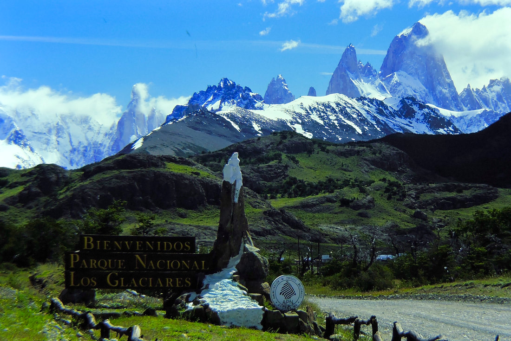

---
tags:
- Trails & Scrambles
- Easy to Difficult
- Backpacking
- Dinning
- Hiking
- Photography
- Rafting
- So Much More
stats:
- label: Event Type
  icon: hiking
  value: Backpacking, dinning, hiking, photography, rafting, and so much more.
- label: Distance
  icon: map-marker-distance
  value: 6,851 miles as the crow flies
- label: Elevation
  icon: terrain
  value: Sea level to 6,000'
- label: Difficulty
  icon: speedometer
  value: easy to difficult
- label: Maps
  icon: map
  value: Patagonia
---

# Patagonia

_Patagonia_

## Description

Because the Patagonia region is so vast, I am going to describe each image in detail underneath the image.
This way, you will be able to learn more about the specific areas. This write-up consists of two South
American nations, Chile and Argentina. My long time friend, Chris Herath, had visited this area a few years
before our trip, for his parents' 50th anniversary. Other members were Shea Herath, and Marsha Jones. I can't
say enough about the small towns, their hostels, and the restaurants. Not only was the service and
accommodations excellent, they make their own real good ice cream. At one dinner, the waitress made me her
favorite ice cream dish. It was vanilla ice cream with Teacher's Scotch poured over it. I stumbled all the
way back to the hostel. Another real cool feature to El Chaltén was that all the trails to the towers are
right out your hostel's door. There was no need to travel to trailheads.

## Directions

Patagonia spans southern Chile and Argentina; this trip flew into the region and traveled by guided auto
tour, raft, and bus between Torres del Paine National Park and El Calafate.

## Hazards

Early spring snows were an issue. A guide friend told us to exit the high country if it started to snow.
That was great advice. The first day up high below the towers, it snowed about 6". After we retreated back
to Camp Pehoe, many feet of snow blew down through the high country onto the valley floor. It snowed 3+ feet
up high where we were camped.

## Restaurants & Pubs

While you are in Calafate, Argentina, be sure to have a quality dinner at The Los Alamos Resort.

## Photo Gallery

_Penguins at the Strait of Magellan_

At the request of Marsha, our first trip was to the Strait of Magellan to see the penguins. They were
birthing or raising their young, so all tourist traffic was strictly restricted.

_Torres del Paine Park in the background_

When Chris was here before, they utilized a guide service. When we went, the same guide drove us around
Torres del Paine park, explaining the area, and advising us on do's and don'ts. Torres del Paine park is in
the background.

_Guanacos with the Paine massif behind_

Along the auto tour, we stopped often for images of wildlife with the Paines behind. The animals are
guanacos.

_Salto Grande Falls along the auto tour_

_Salto Grande Falls, one of so many waterfalls throughout the trip_

_A Cara Cara falcon_

_A gaucho rode by as we were photographing the falcon_

_El Chaltén village_

El Chaltén is a small village at the base of the Torres del Paine park, where we stayed for a few nights. The
restaurants were spectacular.

_Patagonia's ever-present wind_

When I talk about Patagonia, I must tell you about the always-present winds. They average 35+ mph, but often
reach 50+ mph.

_Torres del Paine park headquarters with the horns behind_

_The horns of Torres del Paine park, above camp & Lago Pehoe_

_Shea on the trail heading to Camp Pehoe_

Shea on the trail heading to camp Pehoe. This image only shows two rutted trails; in some areas, the rutted
trails were 6 lanes wide, and two feet deep.

_Our first hike was to Camp Pehoe, then up under the Torres to Camp Italiano_

_The tent camp area at Camp Pehoe_

_Drinking straight from the mountain streams_

One of the coolest things about hiking in Torres del Paine park was that whenever a stream crossed the trail,
we would drink right from the creeks, then fill our water bottles to continue.

_Fresh snow forced an early exit from high camp_

When we did the auto tour, the guide told us, very seriously, that if it snowed while we were up high, we
should exit the high country immediately. We woke up to about 5" of fresh snow on the first morning. Chris
and I went to all camp sites and advised the campers to head down. One British hiker was there with all new
equipment, including a stove, boots, and canned food. He didn't have a can opener, so he was in a bad way. I
went back to my pack and dug out a spare P-38 can opener, to give him. I insisted that he, as well as all
campers, leave before us, so I could tell the rangers no one was left up high. One German couple spent hours,
maybe days, leaning against a down tree smoking cigarette after cigarette. The pile on the ground was easily
50 to 75 butts deep. As I told them they had to head down in front of us, I insisted that they pick up every
cigarette butt. Fortunately, they complied.

_From Camp Italiano, a short hike up to view the towers_

_A pond below the Torres del Paine towers_

_Sunlit clouds as we were leaving_

_The horns of Torres del Paine park_

_Some of the surrounding mountains in the park_

_The horns of Torres del Paine, shot from the raft_

As we were rafting to the ships, I glanced back and saw this view. I turned around and shot this image with
a telephoto lens, hand held. They are the horns of Torres del Paine park.

_Boarding the ships back to Punta Arenas_

After hiking out of Camp Pehoe, we rafted to a waterfall, hiked down around a waterfall, rafted some more,
until we came to these ships. Also here was a place to eat lunch; they brought us trays of BBQ meats, salads
and drinks, before we boarded the ships for a cruise back to Punta Arenas.

_Glacier ice for the local drinks_

We noticed a crew member chipping ice off a nearby glacier. Later on our cruise, he brought us small round
glasses with the glacier ice, and poured us a local alcohol drink. I don't drink, but the rest said it was
very good — so good that Marsha brought back two bottles to the U.S.

_Glaciers reaching down to the lago_

Along the cruise, the ships would slow, so we could take pictures of the glaciers that came all the way down
to the lago.

_The midway station on the bus to Calafate_

Midway through our time in Patagonia, we traveled by bus to Calafate in Argentina. This image is of an old
man at the midway station. Here we had sandwiches, snacks, and a real restroom. It was an oasis in the middle
of nowhere.

_An old horse with a rope bridle_

I couldn't resist walking over to this old horse for a few images. I was drawn to the rope bridle.

_Our hostel in Calafate_

In Calafate, we stayed in this hostel. The service and quality of all but one hostel was exceptional.

_Paving the road to Glacier Moreno_

From Calafate, we took a bus out to Glacier Moreno. They were paving the road to the glacier with a one-yard
hand cement mixer. The road was about 30 miles long.

_Thanksgiving at the Los Alamos Resort_

We were in Calafate in late November, which is their spring, so we asked the hostel owner where the very best
restaurant was. She directed us to the Los Alamos Resort. Here we celebrated Thanksgiving.

_My tenderloin steak with delicious mashed potatoes_

_Chic, Shea, Chris, and Marsha at dinner_

From left to right: Chic, Shea, Chris, and Marsha. The food was beyond belief. All four dinners, lots and
lots of local wine, and two beers, was only $97 U.S.

_Explaining Thanksgiving to our server_

As we were being seated, I told the person that this was a special day in the U.S.: Thanksgiving. She asked
me how we celebrated Thanksgiving, so I explained we stuff ourselves with turkey and all the trimmings, and
lay on the floor and moan and groan while watching football. She said they don't serve turkey, and we can't
lay on the floor, but she would let the cooks know. As an appetizer, they brought us a plate of turkey cooked
several different ways. After lots and lots of wine, they brought out a 13" cheesecake for us to enjoy.

_The entrance to Fitzroy Glacier National Park, with Mount Fitzroy 11,073'_

_A peak next to Mount Fitzroy 11,073' in the clouds_

_Wind-resistant architecture in Calafate_

Chris, being an architect, and I were amazed at the houses in Calafate. Keep in mind, the winds blow here at
high speeds, all the time. All the houses are made of rock, concrete, brick, or stucco. The reason is, wood
houses don't last very long in the winds.

_Walking back to enjoy the architecture_

We got out of the bus we were on, from Glacier Moreno, to walk back to the hostel, so we could enjoy the
architecture.
