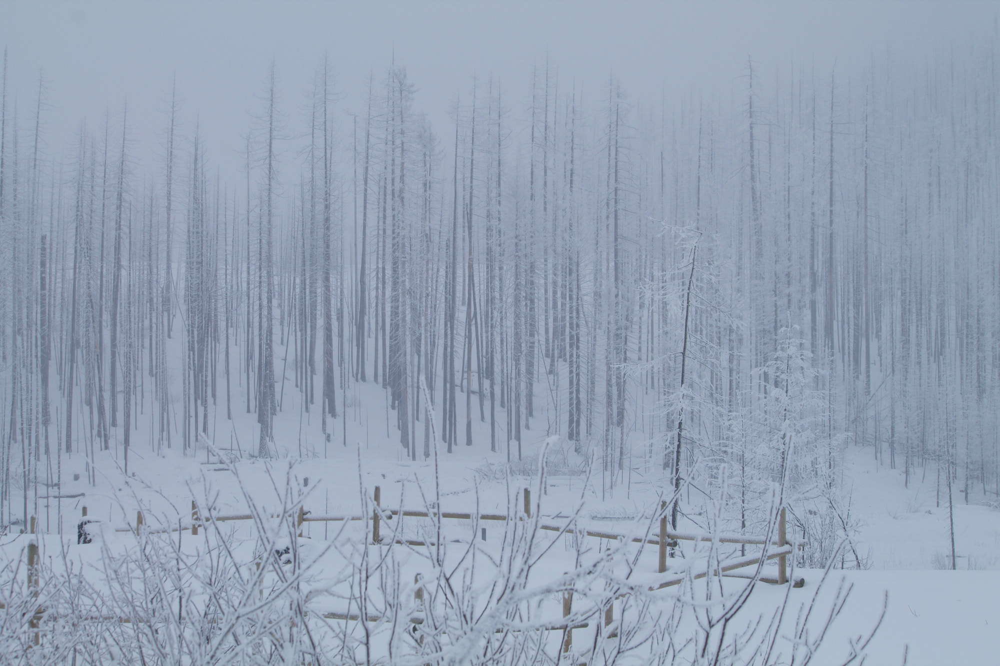

# Colville National Forest

_Colville National Forest_

Colville National ForestThe 1.1 million-acre Colville National Forest was first shaped more than 10,000
years ago by Ice Age glaciers that carved three major valleys of today's Columbia River. The Colville
National Forest has a rich natural and cultural history that started during the last ice age thousands of
years ago, and continues through the time of the Native Americans and fur trappers and up to today. The
major rivers in the national forest follow paths bulldozed by Ice Age glaciers. Mile-high ice sheets surging
south from Canada drowned all but the tallest peaks several times during the last two million years. The ice
ground off sharp edges, leaving the mountains well rounded. Today's landscape emerged from the melting ice
about 10,000 years ago. Animals and plants followed the retreating glaciers northward, and humans were not
far behind. The first Indians probably began hunting, fishing, and gathering in the area about 9,000 years
ago. Archaeologists estimate that Indians caught more than 1,000 salmon a day at
[Kettle Falls](http://www.ghosttownsusa.com/kettlefalls.htm)during peak runs. Salmon congregated below this
wide, low falls on their way upstream to spawn. Fishermen stood on rocks and wooden platforms to spear and
net the fish as they jumped up through the whitewater. People camping near the falls smoked and dried the
fish, preserving it for winter use. Runners would carry the smoked fish back to the elders and young
children who had remained behind in winter villages. By 1826, American fur traders were living in Fort
Colville, built near Kettle Falls. They brought in pigs and cattle, began farming around the fort, and
limited Indian fishing access. By the late 1800's the Indians were confined to reservations. Kettle Falls
and the salmon runs disappeared under the rising waters of Roosevelt Reservoir in the 1930s when Grand
Coulee Dam was built. And around that time, miners and timber harvesters came to the area with varied
success. Today, the Colville National Forest is divided into management areas with different emphases. For
example, the primary objective in one area might be timber management, while wildlife needs or recreational
opportunities might be the prime focus in other areas. An adventure awaits you Visitors can partake in any
number of [recreational opportunities](http://www.fs.fed.us/r6/colville/forest/recreation/)in the forest and
surrounding area. The
[Salmo-Priest Wilderness](http://www.wilderness.net/index.cfm?fuse=NWPS&sec=wildView&wname=Salmo-Priest%20Wilderness)offers
a place where hikers can see all kinds of wildlife and few people. Located on the wet, west slopes of the
Selkirk Mountains, this wilderness contains huge old redcedar, Douglas fir, and western hemlock. Living in
the old growth and in the meadows and crags above are grizzly and black bear, cougar, caribou, elk, deer,
lynx, pine marten, and wolverine. Less primitive recreational opportunities include motorcycle trails,
snowmobile trails, lakes with boat launches, interpretive trails, fishing derbies, scenic drives and
off-highway vehicle trail riding. This requires special attention to
[forest OHV regulations.](http://www.fs.fed.us/r6/colville/forest/recreation/ohv-info.html)
[Thirty-two campgrounds](http://www.fs.fed.us/r6/colville/forest/recreation/camping/camp_sites.html) on the
Colville National Forest provide a wide array of overnight stays, from lakeside-developed camps to wide
spots on logging roads way back in the woods. These campgrounds are a great place to start your
[wildlife watching quest.](http://www.fs.fed.us/r6/colville/forest/aboutus/4thlevel.html) The
[49 Degrees North Ski Area,](http://www.ski49n.com/) near the town of Chewelah, operates privately on
national forest land under a special permit. Billed as a comfortable, family ski area, it offers several
chairlifts and more than twenty ski runs. Cross-country ski and mountain bike trails near here provide
alternatives to downhill skiing. Interpretive trails near Sullivan Lake and Kettle Falls tell the story of
early logging, sawmilling, and mining on the Colville National Forest. Signs at an archaeological dig at
Pioneer Park Campground on the Pend Oreille River describe early Indian life. An interpretive exhibit set
among burned-out snags along Washington Highway 20 near Sherman Pass dramatizes and explains the White
Mountain Fire of 1988. The
[Sherman Pass National Forest Scenic Byway](http://www.byways.org/browse/byways/2232/places/40929/) on
Highway 20 between Republic and Kettle Falls is the most well known of the many scenic drives on the
Colville National Forest. From this twisting mountain highway visitors can see why this area is so special.

History**An overlooked treasure**.......... The Colville National Forest disproves the widely held notion
that Washington State lies flat east of the Cascade Mountains. These million acres in the northeast corner
roll like the high seas. Three waves of mountains run from north to south, separated by troughs of valleys.
These ranges -- the Okanogan, Kettle River, and Selkirk -- are

considered

foothills of the Rocky Mountains.

The troughs between the mountains channel water into the Columbia River system. The Pend Oreille River flows
north into Canada to merge with the Columbia. The major rivers in the national forest are following paths
bulldozed by Ice Age glaciers. Mile-high ice sheets surging south from Canada drowned all but the tallest
peaks several times during the last two million years. The ice ground off sharp edges, leaving the mountains
well rounded. Today's landscape emerged from the melting ice about 10,000 years ago. Animals and plants
followed the retreating glaciers northward, and humans were not far behind. The first Indians probably began
hunting, fishing, and gathering in the area about 9,000 years ago. And what a rich land it was! The new
forests were full of deer, elk, and moose. Salmon swarmed in the rivers. Berries hung thick on the bushes.
Camas bulbs ripen in the valleys. Kalispel tribal legend tells of scouts who once mistook a valley for a
huge lake because it was so thick with blue camas blossoms. Many tribes harvested the bounty, coming from as
far away as Montana and Yakima during salmon runs. Tribes met each year at Kettle Falls on the Columbia
River to fish and trade. Travel routes were worn into the ridge tops by centuries of yearly migration to the
area. Archaeologists estimate that Indians caught more than 1,000 salmon a day at Kettle Falls during peak
runs. Salmon congregated below this wide, low falls on their way upstream to spawn. Fishermen stood on rocks
and wooden platforms to spear and net the fish as they jumped up through the whitewater. People camping near
the falls smoked and dried the fish, preserving it for winter use. Runners would carry the smoked fish back
to the elders and young children who had remained behind in winter villages. Some tribes stayed in the area
year-round. The Kalispel wintered on the east banks of the Pend Oreille River. Kalispel means "camas
people," and the tribe had territorial rights to some of the richest camas fields in the region. Camas bulbs
provided much-needed carbohydrates to the diet of the Indians. Cooked in earth ovens, they tasted like
sweet, smoky figs. Remains of ovens found today at the Pioneer Park archaeological dig along the Pend
Oreille River date back more than 4,000 years. Local tribes allowed other groups to harvest camas in
exchange for goods such as obsidian from Yellowstone or shell necklaces from the Pacific Coast. They also
traded camas for hunting privileges. The Blackfeet might come to the Pend Oreille Valley to dig bulbs,
allowing the Kalispell to hunt buffalo in western Montana, in return. A rich spiritual tradition was
interwoven with resource harvest. Many tribes welcomed the fish back to the river each year with a First
Salmon Ceremony. Young people entering adulthood pursued vision quests in the mountains. The First Salmon
Ceremony is still celebrated at an intertribal pow-wow at Kettle Falls each year, and modern young Indians
spend days alone in the wilds of the mountains seeking to connect with their spiritual roots. Changes to
these seasonal routines came in 1809 with the arrival of the first non-Indian, fur trapper David Thompson,
from Canada. The many trappers who followed were looking for beaver, marten, and other animal pelts to help
satiate the European hunger for fur hats and coats. They traded with the Indians introducing beads, tools,
and alcohol to tribal culture. Within a few decades, up to three-fourths of the Indians had died of
illnesses to which they had no resistance, such as smallpox, tuberculosis, and measles. Missionaries had
come to save Indian souls, and native religions were forced underground. By 1826, American fur traders were
living in Fort Colville, built near Kettle Falls. They brought in pigs and cattle, began farming around the
fort, and limited Indian fishing access. By the late 1800's the Indians were confined to reservations.
Kettle Falls and the salmon runs disappeared under the rising waters of Roosevelt Reservoir in the 1930s
when Grand Coulee Dam was built. Miners and homesteaders came around the turn of the century, each searching
for riches in the mountains and valleys. Neither had much success. Gold and silver were found in the area
around Republic but weren't plentiful elsewhere, and the growing season was short. The miners moved on to
Alaska, and the homesteaders sold out to the government. By 1920, the population in northeast Washington was
half of what it had been in 1910. Today, empty mines pock the hillsides, and rotting cabins stand in
abandoned fields throughout the Colville National Forest. Loggers and ranchers were more fortunate. They
found good supplies of trees and grass on public land. Early land use was unregulated, but when the Colville
National Forest was established in 1906, rangers began overseeing private resource harvest. After a hostile
beginning, a working relationship evolved between the Forest Service and those who used the national forest
lands. The Civilian Conservation Corps (CCCs) changed the face of the Colville National Forest during the
1930s. CCC workers built roads, trails, camps, and buildings, many of which are still in use today. Camp
Growden, known as "Little America" because it housed CCC enrollees from around the country, was built west
of Kettle Falls. It was one of the largest CCC camps in the area. An octagonal concrete fountain and an
earth-filled dam still stand at the site. The Sullivan Lake and Newport ranger stations are CCC buildings,
as are many of the fire lookouts on the national forest. Resource harvest continued on the Colville National
Forest today. Timber harvest remains one of the primary ways these lands meet economic needs. Because most
of the national forest burned in the 1920s due to dry conditions and lightning strikes, a large crop of
trees reached maturity in the 1990s. Thus, the Colville National Forest was able to harvest at high levels
during an era when other national forests were severely reducing the timber cutting. Modern timber
management differs markedly from the simple numbers control, slash burning, and single species reforestation
of the early years of the Forest Service. Today, foresters design timber sales to reduce environmental and
visual impacts. Partial cuts are replacing clearcuts as the preferred harvest method. Live trees are left
standing for natural seeding purposes, and standing snags are left for wildlife. Buffers of trees along
rivers and lakes protect crucial riparian habitat for fish and wildlife. Fire still affects timber
management. The drier portions of the Colville burn naturally every twenty or thirty years. Even modern fire
control methods are of little use when lightning strikes aged lodgepole stands after weeks of dry weather.
The White Mountain Fire of 1988 burned more than 20,000 acres, reminding foresters that fire, as well as
timber harvest, can start a forest over again. Not everyone hunts with modern rifles. Archers and
muzzleloader hunters have special seasons before and after the main hunting season. The archers ease quietly
through the trees, their faces smudged with charcoal and their clothes colored camouflage green. Both they
and the "black powder" muzzleloader hunters must get much closer to their prey than hunters with modern
rifles. The success rate is much lower, but some say rewards are much greater for these hunters, who have
relearned the skills of the pioneer past. Interpretive trails near Sullivan Lake and Kettle Falls tell the
story of early logging, sawmilling, and mining on the Colville National Forest. Signs at an archaeological
dig at Pioneer Park Campground on the Pend Oreille River describe early Indian life. An interpretive exhibit
set among burned-out snags along Washington Highway 20 near Sherman Pass dramatizes and explains the White
Mountain Fire of 1988. Few other cars distract drivers from the views on either side. From Sherman Pass, at
the high point of the drive, a short trail leads to viewpoints. Other short stops include the Log Flume
Interpretive Trail, a half-mile walk among the ruins of a logging operation from the 1920s, and the White
Mountain Fire interpretive signs. For those with more time, Canyon Creek and Sherman Pass campgrounds offer
rustic campsites with water, tables, pit toilets, and small fees. When General Sherman of Civil War fame
crossed the Kettle River Range in the 1860s, he probably never imagined that a paved highway bearing his
name would curve through these mountains to connect northeast Washington with the Idaho Panhandle. Yet it's
easy for visitors to turn their backs to the road, look out over the mountains cresting in all directions,
and feel the wilderness he must have experienced. The Colville National Forest has not been entirely tamed
into an urban playground like some national forests closer to large cities. History**An overlooked
treasure**.......... The Colville National Forest disproves the widely held notion that Washington State
lies flat east of the Cascade Mountains. These million acres in the northeast corner roll like the high
seas. Three waves of mountains run from north to south, separated by troughs of valleys. These ranges -- the
Okanogan, Kettle River, and Selkirk -- are

considered

foothills of the Rocky Mountains.

The troughs between the mountains channel water into the Columbia River system. The Pend Oreille River flows
north into Canada to merge with the Columbia. The major rivers in the national forest are following paths
bulldozed by Ice Age glaciers. Mile-high ice sheets surging south from Canada drowned all but the tallest
peaks several times during the last two million years. The ice ground off sharp edges, leaving the mountains
well rounded. Today's landscape emerged from the melting ice about 10,000 years ago. Animals and plants
followed the retreating glaciers northward, and humans were not far behind. The first Indians probably began
hunting, fishing, and gathering in the area about 9,000 years ago. And what a rich land it was! The new
forests were full of deer, elk, and moose. Salmon swarmed in the rivers. Berries hung thick on the bushes.
Camas bulbs ripen in the valleys. Kalispel tribal legend tells of scouts who once mistook a valley for a
huge lake because it was so thick with blue camas blossoms. Many tribes harvested the bounty, coming from as
far away as Montana and Yakima during salmon runs. Tribes met each year at Kettle Falls on the Columbia
River to fish and trade. Travel routes were worn into the ridge tops by centuries of yearly migration to the
area. Archaeologists estimate that Indians caught more than 1,000 salmon a day at Kettle Falls during peak
runs. Salmon congregated below this wide, low falls on their way upstream to spawn. Fishermen stood on rocks
and wooden platforms to spear and net the fish as they jumped up through the whitewater. People camping near
the falls smoked and dried the fish, preserving it for winter use. Runners would carry the smoked fish back
to the elders and young children who had remained behind in winter villages. Some tribes stayed in the area
year-round. The Kalispel wintered on the east banks of the Pend Oreille River. Kalispel means "camas
people," and the tribe had territorial rights to some of the richest camas fields in the region. Camas bulbs
provided much-needed carbohydrates to the diet of the Indians. Cooked in earth ovens, they tasted like
sweet, smoky figs. Remains of ovens found today at the Pioneer Park archaeological dig along the Pend
Oreille River date back more than 4,000 years. Local tribes allowed other groups to harvest camas in
exchange for goods such as obsidian from Yellowstone or shell necklaces from the Pacific Coast. They also
traded camas for hunting privileges. The Blackfeet might come to the Pend Oreille Valley to dig bulbs,
allowing the Kalispell to hunt buffalo in western Montana, in return. A rich spiritual tradition was
interwoven with resource harvest. Many tribes welcomed the fish back to the river each year with a First
Salmon Ceremony. Young people entering adulthood pursued vision quests in the mountains. The First Salmon
Ceremony is still celebrated at an intertribal pow-wow at Kettle Falls each year, and modern young Indians
spend days alone in the wilds of the mountains seeking to connect with their spiritual roots. Changes to
these seasonal routines came in 1809 with the arrival of the first non-Indian, fur trapper David Thompson,
from Canada. The many trappers who followed were looking for beaver, marten, and other animal pelts to help
satiate the European hunger for fur hats and coats. They traded with the Indians introducing beads, tools,
and alcohol to tribal culture. Within a few decades, up to three-fourths of the Indians had died of
illnesses to which they had no resistance, such as smallpox, tuberculosis, and measles. Missionaries had
come to save Indian souls, and native religions were forced underground. By 1826, American fur traders were
living in Fort Colville, built near Kettle Falls. They brought in pigs and cattle, began farming around the
fort, and limited Indian fishing access. By the late 1800's the Indians were confined to reservations.
Kettle Falls and the salmon runs disappeared under the rising waters of Roosevelt Reservoir in the 1930s
when Grand Coulee Dam was built. Miners and homesteaders came around the turn of the century, each searching
for riches in the mountains and valleys. Neither had much success. Gold and silver were found in the area
around Republic but weren't plentiful elsewhere, and the growing season was short. The miners moved on to
Alaska, and the homesteaders sold out to the government. By 1920, the population in northeast Washington was
half of what it had been in 1910. Today, empty mines pock the hillsides, and rotting cabins stand in
abandoned fields throughout the Colville National Forest. Loggers and ranchers were more fortunate. They
found good supplies of trees and grass on public land. Early land use was unregulated, but when the Colville
National Forest was established in 1906, rangers began overseeing private resource harvest. After a hostile
beginning, a working relationship evolved between the Forest Service and those who used the national forest
lands. The Civilian Conservation Corps (CCCs) changed the face of the Colville National Forest during the
1930s. CCC workers built roads, trails, camps, and buildings, many of which are still in use today. Camp
Growden, known as "Little America" because it housed CCC enrollees from around the country, was built west
of Kettle Falls. It was one of the largest CCC camps in the area. An octagonal concrete fountain and an
earth-filled dam still stand at the site. The Sullivan Lake and Newport ranger stations are CCC buildings,
as are many of the fire lookouts on the national forest. Resource harvest continued on the Colville National
Forest today. Timber harvest remains one of the primary ways these lands meet economic needs. Because most
of the national forest burned in the 1920s due to dry conditions and lightning strikes, a large crop of
trees reached maturity in the 1990s. Thus, the Colville National Forest was able to harvest at high levels
during an era when other national forests were severely reducing the timber cutting. Modern timber
management differs markedly from the simple numbers control, slash burning, and single species reforestation
of the early years of the Forest Service. Today, foresters design timber sales to reduce environmental and
visual impacts. Partial cuts are replacing clearcuts as the preferred harvest method. Live trees are left
standing for natural seeding purposes, and standing snags are left for wildlife. Buffers of trees along
rivers and lakes protect crucial riparian habitat for fish and wildlife. Fire still affects timber
management. The drier portions of the Colville burn naturally every twenty or thirty years. Even modern fire
control methods are of little use when lightning strikes aged lodgepole stands after weeks of dry weather.
The White Mountain Fire of 1988 burned more than 20,000 acres, reminding foresters that fire, as well as
timber harvest, can start a forest over again. Not everyone hunts with modern rifles. Archers and
muzzleloader hunters have special seasons before and after the main hunting season. The archers ease quietly
through the trees, their faces smudged with charcoal and their clothes colored camouflage green. Both they
and the "black powder" muzzleloader hunters must get much closer to their prey than hunters with modern
rifles. The success rate is much lower, but some say rewards are much greater for these hunters, who have
relearned the skills of the pioneer past. Interpretive trails near Sullivan Lake and Kettle Falls tell the
story of early logging, sawmilling, and mining on the Colville National Forest. Signs at an archaeological
dig at Pioneer Park Campground on the Pend Oreille River describe early Indian life. An interpretive exhibit
set among burned-out snags along Washington Highway 20 near Sherman Pass dramatizes and explains the White
Mountain Fire of 1988. Few other cars distract drivers from the views on either side. From Sherman Pass, at
the high point of the drive, a short trail leads to viewpoints. Other short stops include the Log Flume
Interpretive Trail, a half-mile walk among the ruins of a logging operation from the 1920s, and the White
Mountain Fire interpretive signs. For those with more time, Canyon Creek and Sherman Pass campgrounds offer
rustic campsites with water, tables, pit toilets, and small fees. When General Sherman of Civil War fame
crossed the Kettle River Range in the 1860s, he probably never imagined that a paved highway bearing his
name would curve through these mountains to connect northeast Washington with the Idaho Panhandle. Yet it's
easy for visitors to turn their backs to the road, look out over the mountains cresting in all directions,
and feel the wilderness he must have experienced. The Colville National Forest has not been entirely tamed
into an urban playground like some national forests closer to large cities.

## Links to Route Descriptions

Thirteen Mile Canyon Trail 23 Crawford State Park, Gardner Caves Abercrombie Mt. 7308’ Trail #119 & 502

Hooknose Peak 7210’ Crowell Ridge Trail #515

Gypsy Peak Trail 7309’ Sullivan Lake National Recreation Trail, Trail #504

Hall Mt. Trails #588 & 533 6222’

Columbia Mt. Trail #13. 6782’

Fish Lake, Long Lake Loop Grassy Top Mt. National Recreation Trail Trail 503 6253’ Hoodoo Canyon & Emerald
Lake Kettle Crest North Kettle Crest South Swan Lake & Swan Butte 3960’ Salmo Priest Loop Shedroof Divide
Trail #535, 512 6764’

Shedroof Loop Trailm#512. 6560’

Sherlock Peak 6365’ Trail #139

Kalispell Rock 5200’ Trail #370 & 103

Roosevelt Grove of Ancient Cedars 3600’ & Granite Falls

To show the map legend click on the right arrow below. Click on the box to the right to expand the map to a
full page.

## Under construction

Click to set custom HTML
