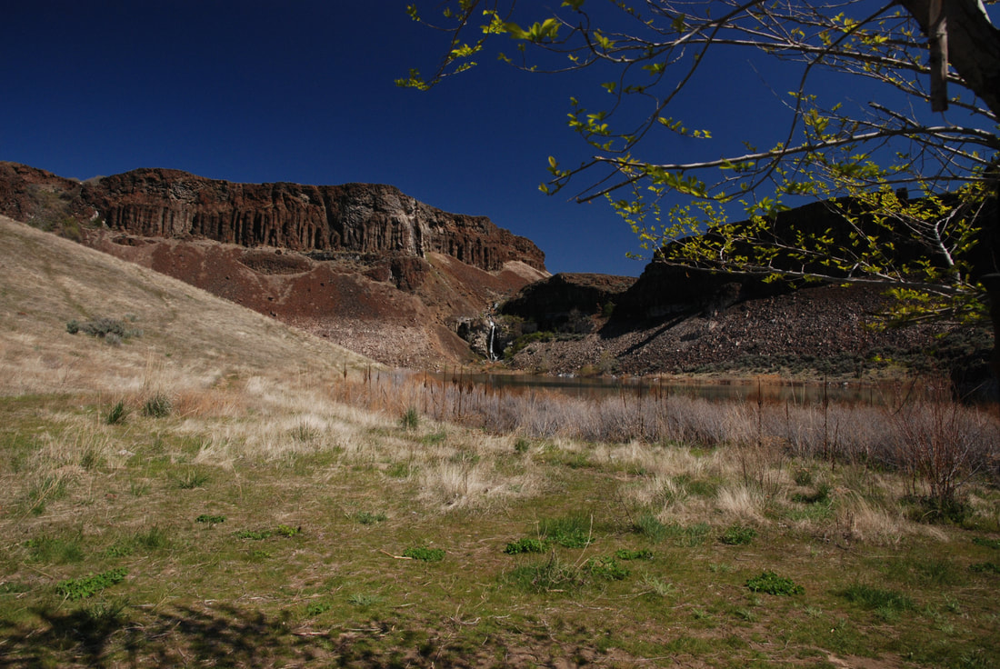

---
tags:
- Trails & Scrambles
- Day Hiking
- Backpacking
- Equestrian
- Mountain Biking
- Climbing
stats:
- label: Event Type
  icon: hiking
  value: Day hiking, backpacking, equestrian, mt biking, climbing
- label: Distance
  icon: map-marker-distance
  value: 4 miles RT
- label: Elevation
  icon: terrain
  value: 100' to the falls; 400-500' to the rim
- label: Difficulty
  icon: speedometer
  value: Easy to the falls; Moderate to the rim
- label: Maps
  icon: map
  value: Washington Dept. Fish & Wildlife, Columbia Basin Wildlife Area, Babcock Ridge
    topo
- label: GPS
  icon: crosshairs-gps
  value: 47°08′38″ N 119°59′52″ W
- label: Managing Agency
  icon: domain
  value: WDFW [509.765.6641](tel:509.765.6641)
- label: Grant County Sheriff
  icon: shield-account
  value: CALL 911 FIRST or [509.754.2011](tel:509.754.2011)
---

# Frenchman's Coulee

_Frenchman's Coulee_

## Description

We have added the area's sheriff's emergency phone numbers for each trip write-up under the ranger district
info. If an emergency occurs, evaluate your circumstances and call only if needed.

From the parking area, the trail heads northeast for about 0.2 miles to a "Y" junction; bear right. After
another 0.2 miles, bear right (east) into the coulee. About 2 miles up the coulee, notice the seasonal
waterfall cascading along the north rim. As you pass beneath the power lines, walk toward the waterfall.
Note that this fall is agricultural runoff; do not drink or filter this water.

In early spring, the canyon floor is carpeted with wildflowers. Hiking in the Washington Scablands during
summer is very hot and dry—carry plenty of extra water and sun protection. Vault toilets are available near
The Feathers climbing area and campground.

## Hiking Options

### Option #1: Coulee Extension & High Rim Traverse

To extend your hike, walk the old road for about 0.4 miles above the falls and out of the coulee. Retrace
your steps back to the cars, or walk west along the high rim back toward Babcock Bench for panoramic views
of the Columbia River.

## Directions

Drive I-90 west to Exit 143 and turn right (north) onto Silica Road. After 0.8 miles, turn left (west) onto
Vantage Road (old Highway 10). Follow Vantage Road for 3.6 miles as it descends into Frenchman Coulee.

## Hazards

- **Do Not Drink Surface Water:** Surface water in this area is agricultural runoff; filtration and
  purification tablets will not remove chemical runoff. Carry all drinking water.
- **Rattlesnakes:** Watch for rattlesnakes basking in sunlit areas around rocks and brush. Snake
  gaiters/shin guards are recommended for off-trail exploration.
- **Navigation:** Scabland terrain can be disorienting. Identify prominent high points and landmarks to
  maintain orientation, carry topographical maps, and keep hiking groups together.

## Cool Things Close By

- Quincy Lakes & Columbia Basin Wildlife Area
- Columbia River & Gorge Amphitheatre
- Babcock Bench & Breezy Hills

## Restaurants & Provisions

- Lenny's (Cheney, WA)

## Photo Gallery

_As you enter Frenchman's Coulee, this waterfall drops from above_

_A waterfall off the coulee rim falls about halfway into the canyon_

_Walk around the lake for a place to have lunch and enjoy the sights and sounds_

_As you leave the pond and waterfall, look for large raptors floating on the thermals_

_The Feathers climbing area near the west entrance to the coulee_
