---
tags:
- Trails & Scrambles
- Hiking
stats:
- label: Event Type
  icon: hiking
  value: Hiking
- label: Distance
  icon: map-marker-distance
  value: 8 miles RT, 856 ft Ascent
- label: Elevation
  icon: terrain
  value: 640’
- label: Difficulty
  icon: speedometer
  value: Moderate with some exposure for a short section
- label: Maps
  icon: map
  value: '[Ginkgo State Park](https://goo.gl/maps/JahA7sFov3WmejDS6). 509.856.2290'
- label: GPS
  icon: crosshairs-gps
  value: 46.95490243707056, -119.98802785567764
- label: Ranger District
  icon: pine-tree
  value: 
---

# Ginkgo Petrified Forest

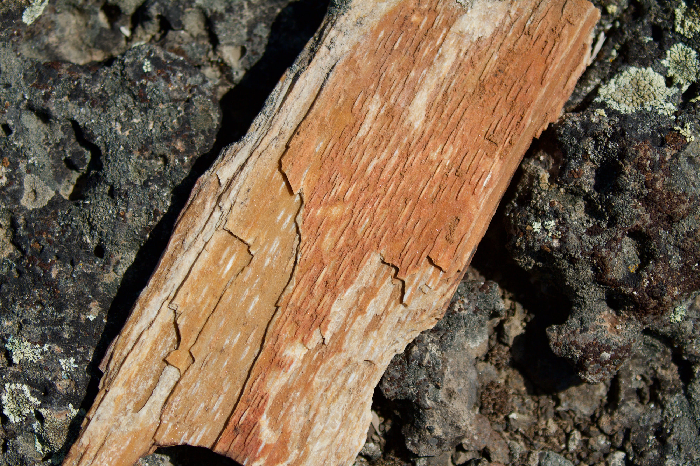
_Ginkgo Petrified Forest_

  '[Washington State Parks Gingko Petrified Forest](https://www.parks.wa.gov/288/Ginkgo-Petrified-Forest)'
- label: Kittitas County Sheriff icon: shield-account

## Value: Call 911 First or 509.962.7525

## Ginkgo Petrified Forest

## Description

We have added the areas sheriff’s emergency phone numbers for each trip write up under the ranger district
info. if an emergency ocurrs, evaluate your circumstances and call only if needed. The best time of year to
come here is in the spring before it gets too hot and the ticks come out. There are numerous natural wonders
including the Great Floods and the Columbia River Basalt Group lava flows.

## Directions

From Spokane take I-90 west about two hours and 15 minutes going past the Wild Horse Monument and across the
Columbia River to the Vantage exit 136. We hiked cross country on the north side of town from the Rocky
Coulee Recreation Area trail head.

## Cool Things Close By

Gorge Amphitheater, Wild Horse Monument, Climbing at Frenchman Coulee

## Hazards

There are sections of the trail where you have to side hill for a mile or so. Short sections have some
exposure. This is a sunny and windy place, so bring lots of water. I hydrate 24 hours prior to any hot dry
long day and I carry two liters of water if there is no water source along the route. Do not filter the
scabs open water. the lakes and streams are full of agriculture runoff.

## R & P

Michael's Market & Bistro in Moses Lake

## Rock Wren

---

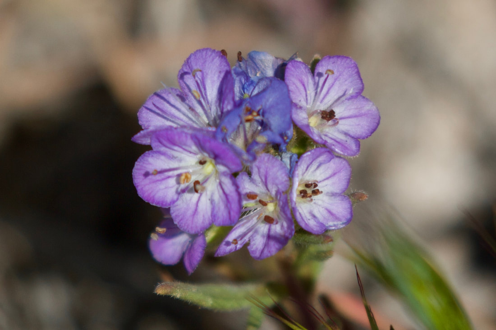

##

---

### Picture (Image missing) Details

##

---

### Picture (Image missing) Details

## Coyote Skeleton?

---

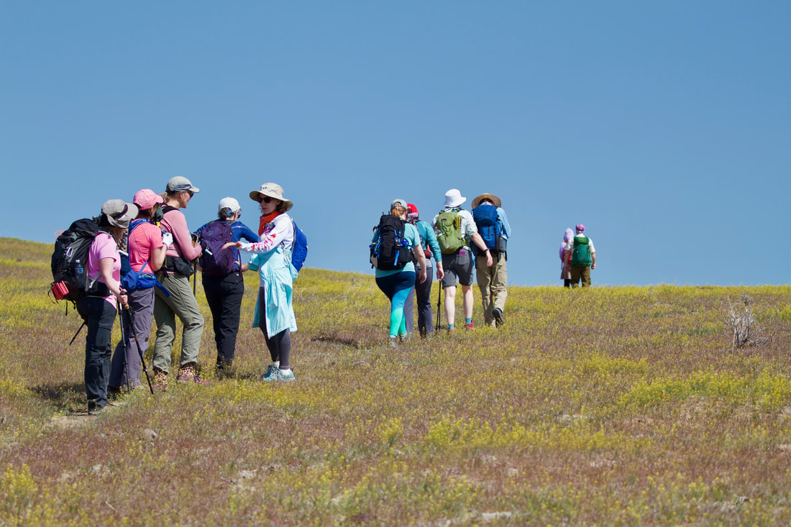

## Spokane Mountaineers Day Hike Led By Tyler Nyman

---

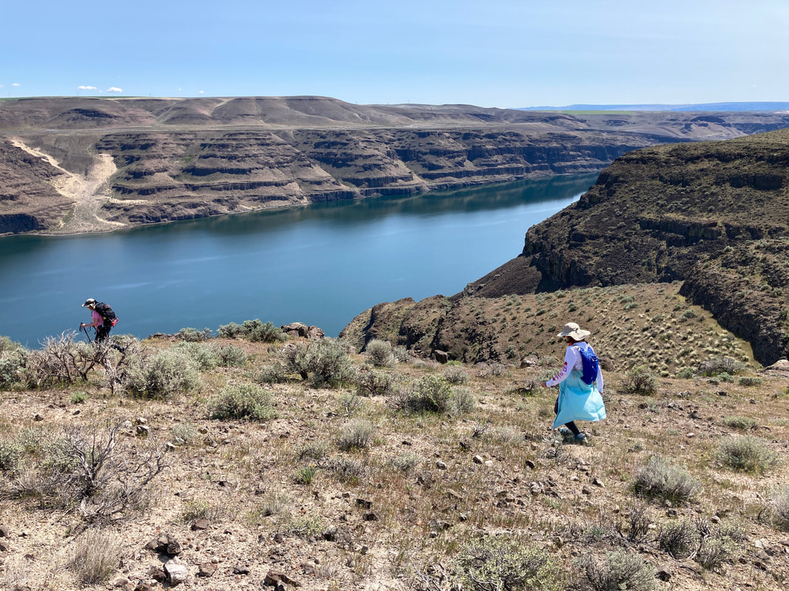

##

---

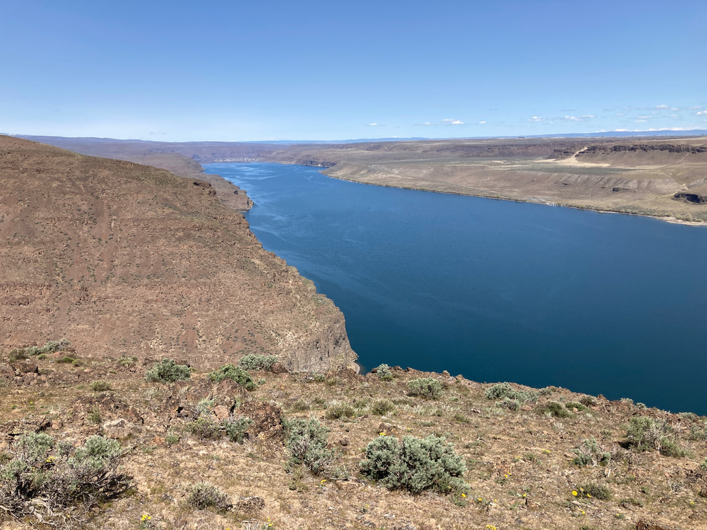

##

---

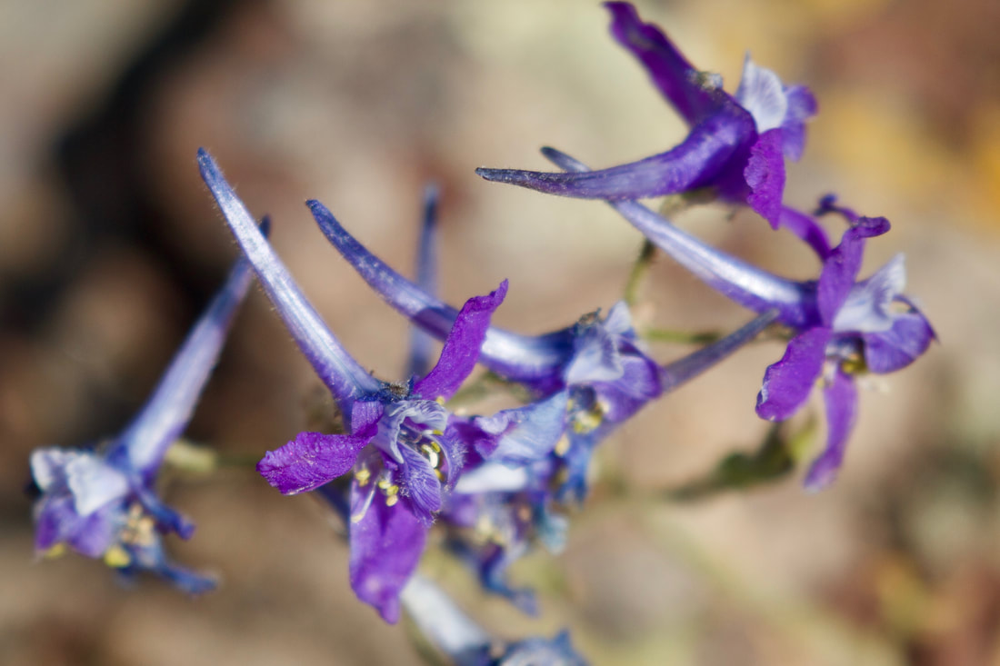

## Larkspur

---

### Picture (Image missing) Details

## Overlooking i-90 Where It Crosses the Columbia River at Vantage

---

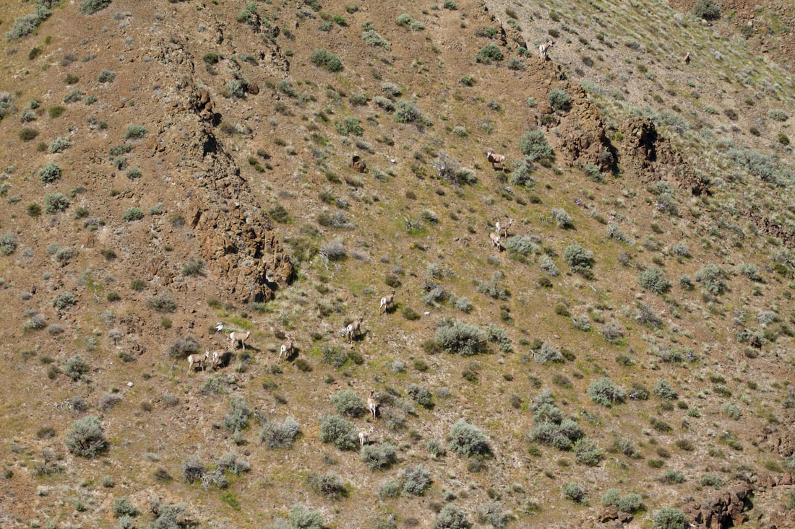

## Bighorn Sheep

---

### Picture (Image missing) Details

## American Kestrel

---

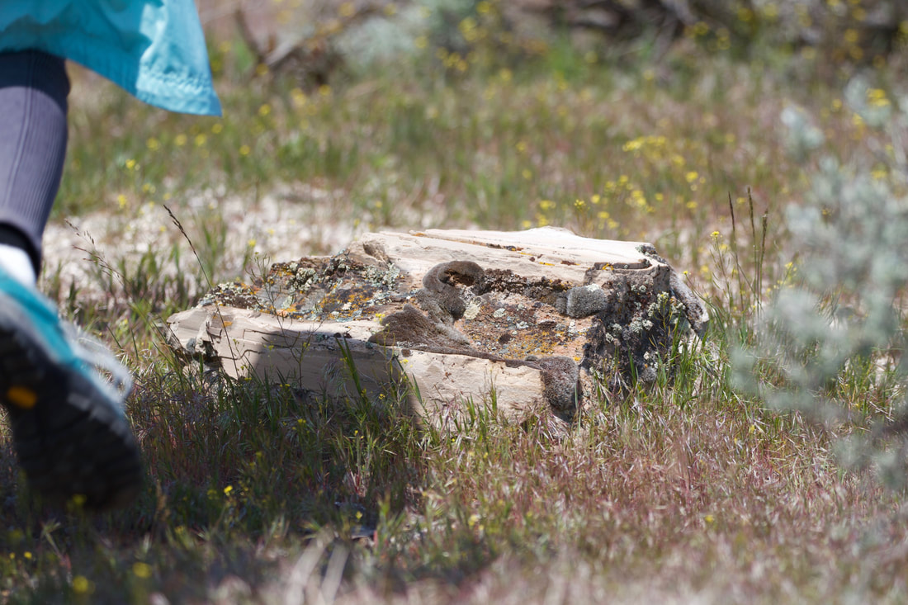

## Petrified Log

---

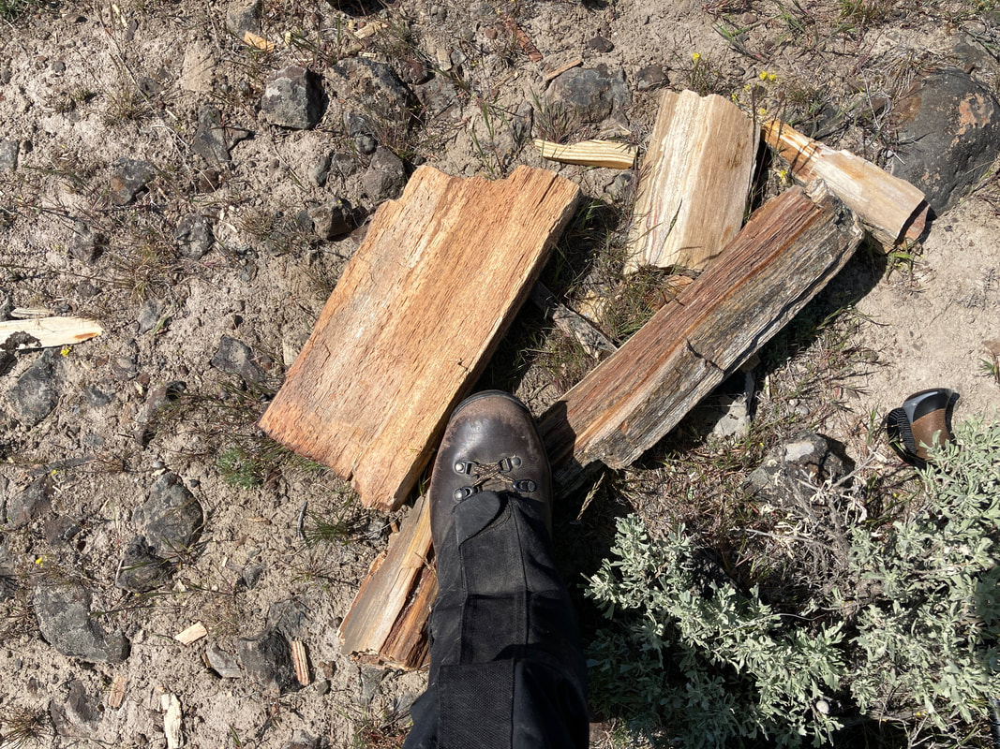

## Petrified Wood

---

### Picture (Image missing) Details

## Death Camas

---

### Picture (Image missing) Details

##

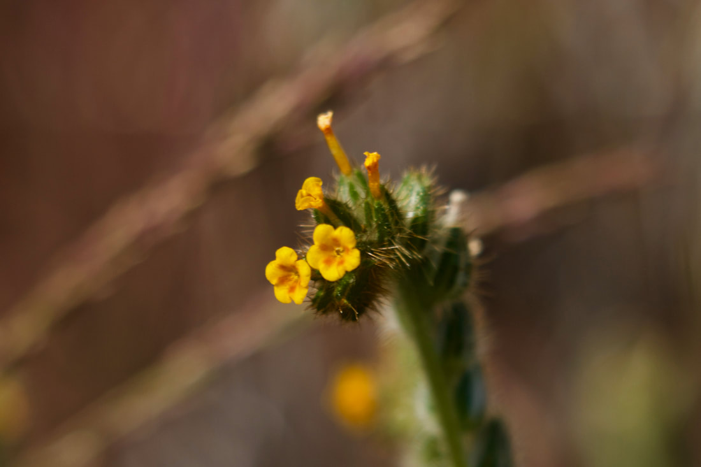

##

---

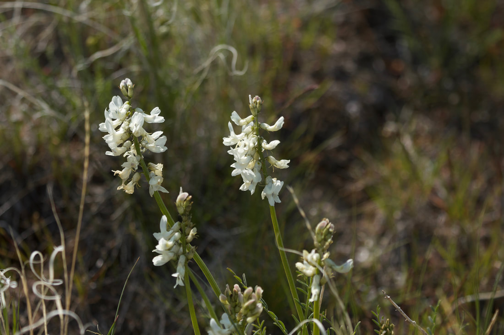

##

---

### Picture (Image missing) Details

##

---

### Picture (Image missing) Details

## Simpson Hedgehog Cactus

---

### Picture (Image missing) Details

##

---

### Picture (Image missing) Details

## Taking the Double Track Back to the Trail Head

## Photo Gallery

---

### Picture (Image missing)
