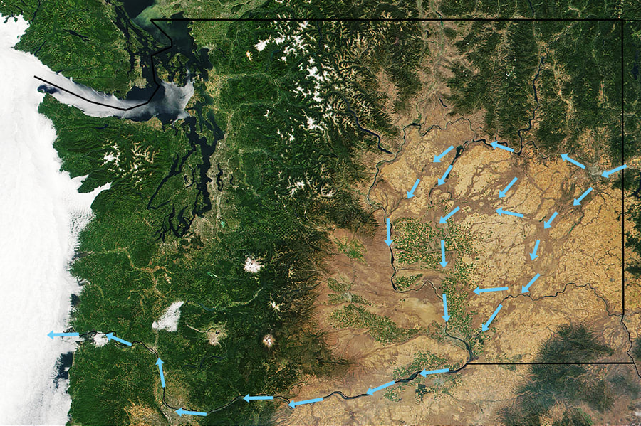

# Washington Scablands

## Washington scablands ice age floods

The Ice Age Floods of western Montana, north Idaho, and east & south Washington states, were one of the
greatest geological events ever to occur on our planet. As far back as 18,000 years ago, our region was
inundated with many floods of unconceivable proportions.

Imagine for a moment, one day you are standing along side a stream in an area that is now the Spokane
Valley. A roar starts to fill the air, and suddenly a wall of water, ice, rock and debris races down the
Purcell trench, around Rathdrum Mountain and right at you. This wall of water was well over 1000 feet tall
and moving at well over 55 miles per hour. This catastrophic event happened many times over a long span of
time.

The Great Flood wiped the earth clean of everything in its path. They say in places in mid Washington, a
thousand feet of basalt and ground cover washed away in a matter of a days.

Now flash forward to today. Washington State’s Channeled Scablands are evidence of these great floods.

The Scablands are the brown area east of the Cascades where the worlds largest lava flow occurred which is
called the Columbia River Basalt Group. The blue arrows indicate where the Great Flood then washed over
these immense basalt columns stripping the surface and leaving behind the Scablands.

Look at a color photo of Washington from space. From the Clark Fork valley, to the Pend Orielle Lake basin,
to the valley that now houses Spokane, to the east central portion of Washington state. These floods scoured
the land and left it barren. But it wasn’t always evident.

A geologist named J Harlan Bretz had been studying the geology around Seattle, but soon became enamored with
east central portions of Washington. He and his students spent summers walking the land, recording their
findings, and creating a theory. At 41 years old in 1923, J (his first name is simply "J" with no period)
presented his first paper at the annual meeting of the Geological Society of America. "Having presented that
great mass of evidence, he interpreted the scablands as a result of glacial erosion and of torrential flows
of water from melting glacial ice."

After his presentation, several emanate geologists congratulated him for his splendid contribution to
knowledge. At other meetings, months later, he gave his second paper, but by then he had drawn radically
different conclusions. In this paper he boldly proposed that an enormous flood eroded the scablands in a
very brief time, perhaps in a few days. But this time, the audience denounced his conclusions and the
thinking that had led to them.

Geologists at this meeting were shocked to hear him explain the idea of a catastrophic explanation for a
geologic event. This second paper made him a pariah among geologists.

"If scientific controversies were settled by a vote, J would have lost immediately, crushed under a land
slide of outraged opinion. But being crushed was not part of his personal style. He would continue to defend
his ideas for almost sixty more years."

His mountains of evidence, and many different kinds of evidence, did not deter his beliefs. The neigh sayers
were quite certain that J was wrong, and did not feel a need to consider the evidence. These people knew the
answers before they heard the question. J was invited to present another paper about the scablands in 1927
to the Geological Society of Washington, D.C. it was described as a lynching. But most of the scientific
audience had never visited, and had no knowledge of the extraordinary landscape. The meeting took on a feel
of a debate in Washington, D.C.

In the mean time, J investigated the limestone caverns in the Ozark Mountains of southern Missouri.

In 1952, J returned to the scablands with several geologists who were sympathetic to his ideas. They found
new evidence that persuaded J to argue that more then one great flood had scoured the region—at least seven
and perhaps as many as nine.

"Satellite imagery in the 1970s provided the final vindication. J had the satisfaction of living long enough
to see his once heretical ideas become the new orthodoxy. In 1979, at age 96, he received the Penrose Medal,
geology's highest honor. He later reportedly told his son: "All my enemies are dead, so I have no one to
gloat over."

Glacier Lake Missoula formed several time over thousands of years, but it was perhaps the last lake that
caused the most catastrophic event. Glacier Lake Missoula was in volume the same size as Lakes Erie and
Ontario combined.

### Picture (Image missing)

At the Town of Clark Fork, Idaho, the ice dam stretched across the valley. Water built up to a point of

flowing over the

ice dam, while it washed under it at the same time. The catastrophe struck. The massive ice dam floated and
then broke apart. Causing a torrent of water up to 2,000 feet high to flow and flood parts of N. Idaho down
the Purcell Trench, across the current Spokane Valley, into Eastern Washington, and northern parts of
Oregon. The flow gouged out the Columbia Gorge, and emptied into the Pacific Ocean.

I read once, but could not verify, that the only place not flooded was the very top of Mount Spokane. If
this is true, could you imagine being on top of Mount Spokane picking huckleberries and watching this all
happen in a few days?

The flood waters ran with the force equal to 60 Amazon Rivers. Glacier Lake Missoula, at its maximum height
and extent, may have contained 500-600 cubic miles of water.

It is said that the flow of water during the flood, was equal to 10 times of all the rivers in the world
today. So I would encourage everyone to stop by the Visitors Center on Hwy 17 at Dry Falls, to see what once
was the largest waterfall in the world. Dry Falls is 3.5 miles, or 5.5 km in width. And you can walk beneath
it.

Most of the above info was from several books I’ve read, including "Glacier Lake Missoula and its Humongous
Floods, by David Alt.

As you are hiking the trails and coulees listed below, stop and think about a man who saw it all 60 years
before the Geological Societies even celebrated his most important discovery in 1979. That man was J. Harlan
Bretz.

A word of caution while hiking in the scabs Because the terrain you will be in while hiking, you must be
aware of your surroundings. Note all high points and landmarks. Even those off in a distance. They can be
used to gain perspective of your current location, as apposed to your entry route.

- Always make sure Each hiker is carrying a map of the area

- Do not allow any hiker in your group to wonder off

- Your group Must stay together

- Watch and listen for rattlesnakes. they come out in the morning to sun. there are leg shields to protect
  from bites.

There are safety shin guards you can buy to protect from snake bites.

---

## The below graph shows the depth of g.l.m. at clark fork, idaho

### Picture (Image missing) Details

## Featured Routes

Fishtrap Lake Turnbull National Wildlife Refuge Hawk Creek Falls Hog Canyon Falls Twin Lakes Banks Lake Sun
Lakes State Park Juniper Dunes Wilderness Northrup Canyon & Lake Steamboat Rock Odessa- Pacific Lakes Area

Breezy Hills Quincy Lakes, Ancient Lake, & Dusty Lake Frenchman’s Coulee Crab Creek Hanford South Hanford
North

To show the map legend click on the right arrow below. Click on the box to the right to expand the map to a
full page.

Click to set custom HTML

##
