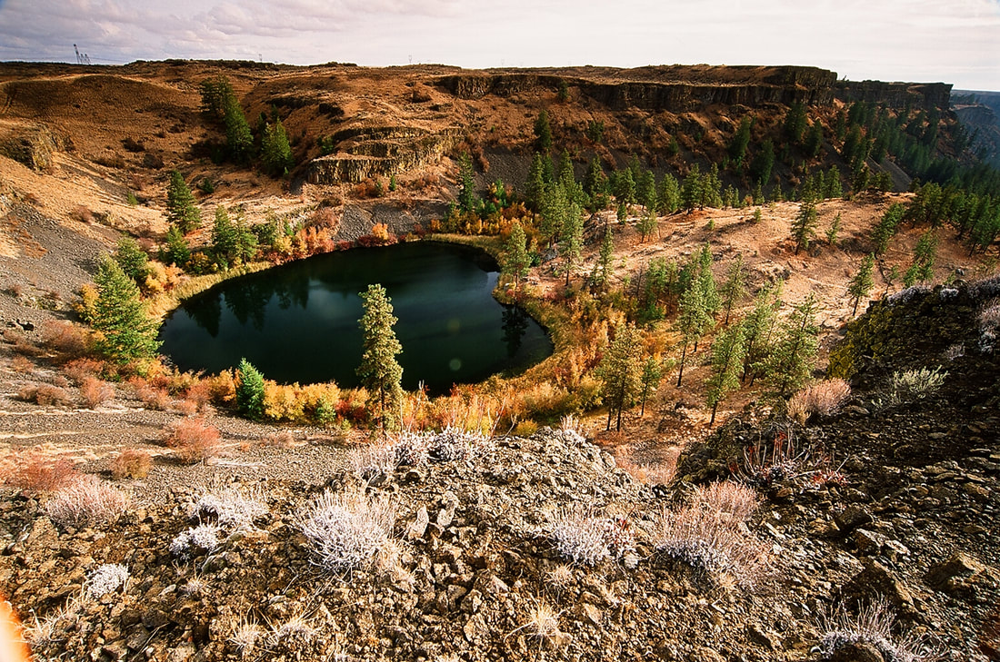
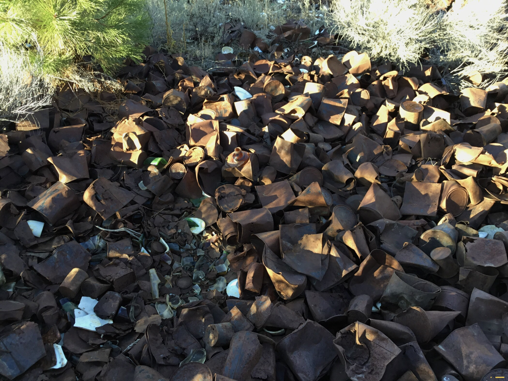
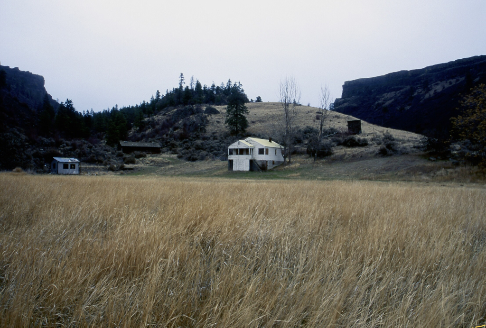
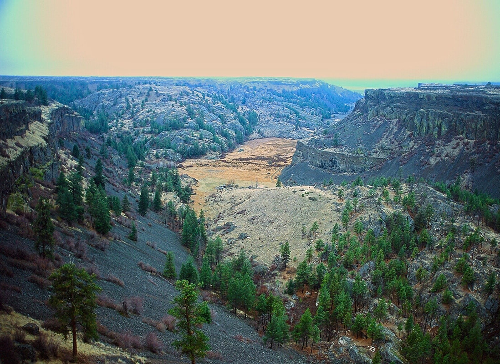
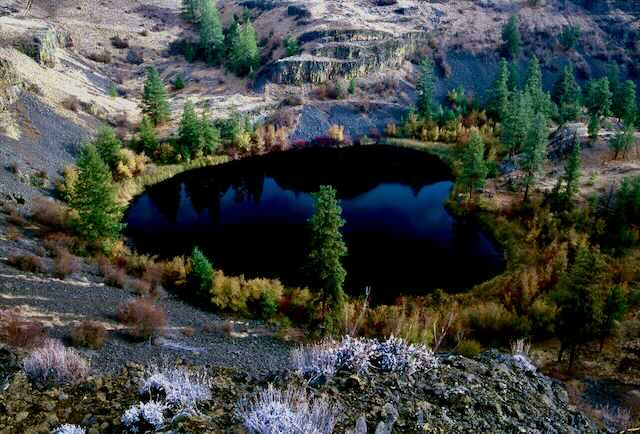

---
tags:
- Trails & Scrambles
- Moderate
- Day Hiking
- Backpacking
- Equestrian
stats:
- label: Event Type
  icon: hiking
  value: Day hiking, backpacking, & equestrian.
- label: Distance
  icon: map-marker-distance
  value: 7 miles RT
- label: Elevation
  icon: terrain
  value: 510'
- label: Acres
  icon: vector-square
  value: '2.5'
- label: Difficulty
  icon: speedometer
  value: Moderate
- label: Maps
  icon: map
  value: Steamboat Rock SE, Electric City topos
- label: GPS
  icon: crosshairs-gps
  value: 47°51'96" N 119°04'95" W
- label: Managing Agency
  icon: domain
  value: WSP&R, 509-636-1304
- label: Grant County Sheriff
  icon: shield-account
  value: CALL 911 FIRST or 509-536-1200
---

# Northrup Canyon

_Northrup Canyon_

## Description

We have added the area's sheriff's emergency phone numbers for each trip write-up under the ranger district
info. If an emergency occurs, evaluate your circumstances and call only if needed. As you drive into the
parking lot, it becomes obvious that this is a special place. On the trail/road in at the start, the towering
cliffs that circle the lower canyon demand your attention. But, as you walk the road, curious items make you
go off road to see a spectacular sight. On your left is a sea of tin cans, so deep you can't see the ground.
In 1934 the Grand Coulee Dam was under construction. Northrup Canyon was the site of a huge encampment of dam
employees. Up hill from the tin can pile, was the kitchen and mess hall. As they used the cans, they would
just throw them out the back door. Hence, a massive pile of old rusty tin cans with a few bottles, cups and
plates here and there. If you are a birder, watch the skies for Golden Eagles.

Back on the trail, the cliffs seem even taller than before. Off to the left (north) are a couple of granite
protrusions to climb on. Further up the canyon, the 600' walls tower above. The forest on the way in is
mostly aspens. All too soon the trail opens up into a wide valley that houses an ancient homestead, and a
30's or 40's house and outbuildings. The BLM used to use this area in front of the house to grow horse
grains. The trail continues up behind the homestead through a sparse forest and many cool rock formations. A
fire went through the area years ago, so the brush is less intrusive. Soon you come to the trail's summit,
and the lake is off in the distance. Remember this spot for Option #1. As the trail drops to the lake, it
goes through another sparse forest.

The lake shore is mostly brushy with some scattered boulders. This is a good spot for lunch. Retrace your
steps to the parking area.

## Option #1

From the trail in, as mentioned above, to extend your hike, veer left and work your way to a shelf above the
back side of the lake. The last 40' are kind of steep but easily doable. When the lake comes into view,
notice its shape — it's a heart-shaped lake. Walk further around the lake up high and look for a good spot
to have lunch. After lunch, continue around the lake and look for a faint old road that takes you down to
the trail in. Fall is the best time to do this route, because the shoreline colors are spectacular. You can
go backwards on this route if you miss the turn off up high.

## Option #2

I once tried to hike the NW high ridge back to the trailhead for views and different terrain, but just past
the homestead, the descent is very steep scree. Be careful.

## Option #3

At about 0.75 miles from the trailhead on the Northrup Lake Trail, look for a faint trail to the south. This
spur trail takes you to an overlook in about 0.3 of a mile. From the overlook, you can continue back to the
trailhead to the west.

## Directions

From Spokane drive west on Highway 2 to the junction with SH #155. Turn right (north) and drive about 14
miles to the state park. Just past Steamboat Rock on your right (east) is the road into Northrup Canyon.
Drive up to the parking area.

## Hazards

Some parts of the trail are rocky and rough, especially above the lake. This is the scablands, so always be
aware of stumbling on a rattlesnake. In my 40 years of hiking the scabs, I've only seen one rattlesnake, and
it was because I set my pack on it as I climbed over a fence.

**A word of caution while hiking in the scabs:** Because of the terrain you will be in while hiking, you must
be aware of your surroundings. Note all high points and landmarks, even those off in the distance. They can
be used to gain perspective of your current location, as opposed to your entry route. Always make sure each
hiker is carrying a map of the area, and do not allow any hiker in your group to wander off -- your group
must stay together. There are safety shin guards you can buy to protect from snake bites.

## Cool Things Close By

Steamboat Rock, Banks Lake, Grand Coulee Dam, Lenore Caves, and Sun Lakes-Dry Falls State Park.

## Restaurants & Pubs

Harvest Restaurant. Lenny's in Cheney.

## Plan Your Trip

Click for Current NOAA Weather Conditions.

## Photo Gallery

_Tin cans left by Grand Coulee Dam workers_

From 1933 to 1941, the workers building the Grand Coulee Dam were housed in canyons all around the area.
Their mess hall created the huge collection of empty tin cans. The pile is about 100x200 feet, and about 5
feet deep.

_The newer of the houses with the very old behind_

_The old homestead from trail above_

_Northrup Lake from above in the fall_
