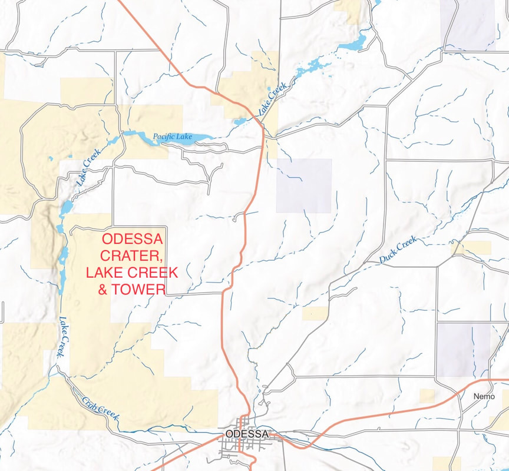

---
tags:
  - Trails & Scrambles
  - Easy
  - Day Hiking
  - Backpacking
  - Fishing
  - Paddling
  - Hunting
  - Mt Biking
stats:
  - label: Event Type
    icon: hiking
    value: Day hiking, backpacking, fishing, paddling, hunting, mt biking, picnicking, and camping.
  - label: Distance
    icon: map-marker-distance
    value: Up to 25 miles, depending on your activity.
  - label: Elevation
    icon: terrain
    value: 600 verts depending on your activity.
  - label: Difficulty
    icon: speedometer
    value: Easy
  - label: Maps
    icon: map
    value: BLM website, Pacific Lake & Sullivan Lake topos.
  - label: GPS
    icon: crosshairs-gps
    value: 47°42’83" n 118°44’47" w
  - label: Managing Agency
    icon: domain
    value: BLM 509.536.1200
  - label: Lincoln County Sheriff
    icon: shield-account
    value: CALL 911 FIRST or 509.725.3501
---

# Odessa Area

## Description

### Odessa Trailhead

From the Odessa trailhead, just west of town, you can hike or pedal up Lake Creek trail to Pacific Lake area. Along the way are the Odessa Towers, Bob Lakes, Waukesha Springs, Delores Falls, Walter Lake, and Pacific Lake. The winds in the scabs can be brutal, so dress appropriately, and stay off the lakes when the wind is up. When the trail gets close to Bob Lakes, you are about 1/2 the way to Pacific Lake. Along the way, there are several craters up near Pacific Lake to visit. They won’t be volcano type of craters, but ones left from the big floods.

### Pacific Lake Area (Dry)

Hiking, horse rentals, fishing, and sight seeing are the main activities on the north end of the area.

## Directions

### Lakeview Ranch

Head west on I-90 to exit 245 near Sprague. On S. R. 23, drive about 13 miles, and turn left onto Mohler Road. Drive about 10 miles to S. R. 28, and turn left for 16 miles to Odessa.

## Hazards

!!! warning "Hazards"

    Rattlesnakes, sunburns, and do not drink or filter any ground water in the scabs.

## Cool Things Close By

Hog Canyon, Fishtrap Lake, Z Lake, Twin Lakes, Palouse Falls S. P., Steamboat Rock, Northrup Canyon & Lake, and Fort Spokane.

## Restaurants & Pubs

- Harvest Restaurant in Spangle
- Lenny’s in Cheney

## Plan Your Trip

Click for Current NOAA Weather Conditions

_Picture_

## Photo Gallery

N/A. If you have images you want to contribute, contact Chic.
