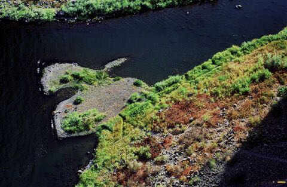
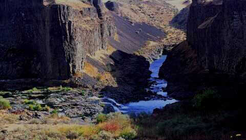
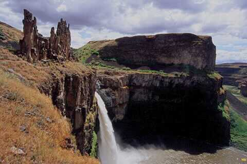
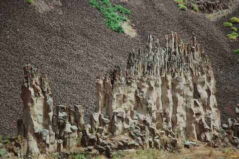
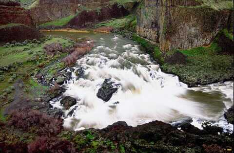

---
tags:
- Waterfalls
- Easy
- Camping
- Day Hiking
- Sightseeing
stats:
- label: Event Type
  icon: waterfall
  value: Camping, hiking, and sightseeing
- label: Distance
  icon: map-marker-distance
  value: varies depending on your desires.
- label: Elevation
  icon: terrain
  value: minimal, unless you hike down to the Snake River level
- label: Difficulty
  icon: speedometer
  value: easy
- label: Maps
  icon: map
  value: Palouse Falls State Park brochure, Palouse Falls & Starbucks W Topos
- label: GPS
  icon: crosshairs-gps
  value: 46°39’50" n 118°13’38" w
- label: Managing Agency
  icon: domain
  value: w.s.p.& r. 509.646.9218
- label: County Sheriff
  icon: shield-account
  value: Franklin CALL 911 FIRST or 509.545.3501, Whitman 911 or 509.297.6266
notes:
- label: Washington s.p. has issued a closure for areas that have cliffs people can
    walk along and the 'castles' near the top of the falls. we can still walk to the
    observation area, but must stay within the fenced area. 2.4.2022
  url: '#'
---

# Palouse Falls State Park Heritage Site

## Description

Recently, Palouse Falls was designated by the Washington Legislature, as the State’s Waterfall. From the
viewing area, look for a trail to the north along the rim that overlooks the Palouse River. Be extra careful
along the rim. deadly falls have happened. Keep heading along the rim as it turns NW to a narrow trail that
leads down to the railroad tracks. Follow them until you find a trail dropping down a scree slope towards
Upper Palouse Falls. From here the trail heads SSE along some basalt cliffs to the Castles. The Castles are
the rock towers to the NW of the main falls. While at the castles, be extremely careful near the falls.
Falls happen! Retrace your steps back to the viewing area.

Heading the opposite direction is the Fryxell Overlook, in a short distance. This overlook offers views of
the falls as well as a fine view of the Palouse River Gorge, down stream. Because the Palouse Falls S.P. is
only 94 acres, parking and camping areas are tight on busy days. A Discovery Pass is required, or a one time
entrance fee is collected.

Search youtube for Palouse Falls kayaker. You will be astounded.

• One sheltered picnic table with two braziers • Seven unsheltered picnic tables • Restrooms nearby the
picnic and camping areas are available.

Palouse Falls is one of few active waterfalls left along this massive glacial flood path. Palouse Falls has
long been a location used by Native American tribes. The falls were first documented in 1841, during a
survey of the region led by Captain Charles Wilkes of the United States Navy (U.S. Exploring Expedition).
Palouse Falls State Park was dedicated on June 3, 1951. The 94 acres that make up the park were donated by
several parties, including The Baker-Boyer National Bank of Walla Walla, J.M. McGregor of the McGregor Land
and Livestock Company, Mrs. Agnes Sells of Washtucna and others. Palouse Falls was designated as the state
waterfall by the Washington State legislature on March 18, 2014. The bill designating the waterfall.

Within the dramatic flood-carved Palouse River Canyon, Palouse Falls is one of the key destinations along
the Ice Age Floods National Geological Trail. Please remember a Discover Pass is required to visit a state
park.

History

Created by the Cordilleran ice age from glacial Lake Missoula more than 13,000 years ago, The designation
was written by 3rd, 4th, 5th and 6th grade students of the nearby Washtucna School.

Palouse Falls is one of few active waterfalls left along this massive glacial flood path. Perched Palouse
Falls has long been a location used by Native American tribes. The falls were first documented in 1841,
during a survey of the region led by Captain Charles Wilkes of the United States Navy (U.S. Exploring
Expedition). Palouse Falls State Park was dedicated on June 3, 1951. The 94 acres that make up the park were
donated by several parties, including The Baker-Boyer National Bank of Walla Walla, J.M. McGregor of the
McGregor Land and Livestock Company, Mrs. Agnes Sells of Washtucna and others. Palouse Falls was designated
as the state waterfall by the Washington State legislature on March 18, 2014. Park boundary within the
dramatic flood-carved Palouse River Canyon, Palouse Falls is one of the key destinations along the Ice Age
Floods National Geological Trail.

## Directions

From Spokane, head west on I-90 past Tokio to Hwy 261, and turn left down 251 to the Palouse Falls Highway
sign. This road only goes to Palouse Falls.

## Hazards

This park requires great caution and care. Except in the viewing area, all other areas you go to, can be
dangerous. Please use extreme caution while at palouse falls.

## Cool things close by

Sun Lakes State Park & Dry Falls, Summer Falls, Escure Ranch, Bonnie Lake, Lions Ferry State Park, and the
Snake River.

## R & P

Lenny’s in Cheney

## Plan your trip

Click for Current NOAA Weather Conditions

## Photo gallery

## The energizer bunny

### Picture (Image missing)

## Palouse falls from north trail

---

## The palouse river between upper and lower palouse falls

---

## Palouse falls and the castles from the lower trail

---

## The castles near the main falls

---

## Middle palouse falls

### Picture (Image missing) Details

## The palouse river canyon down stream from the falls
