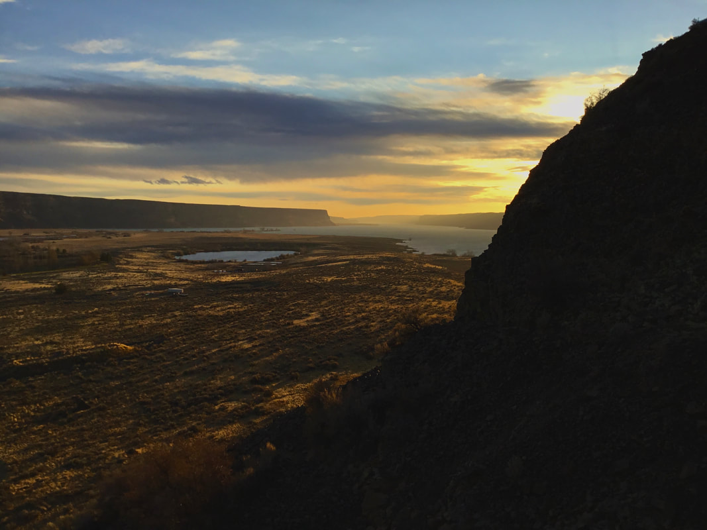

---
tags:
- Paddling & Rivers
- Day Hiking
stats:
- label: Event Type
  icon: kayaking
  value: Day hiking
- label: Distance
  icon: map-marker-distance
  value: 4 miles RT, unless you wander a lot
- label: Elevation
  icon: terrain
  value: 700'
- label: Difficulty
  icon: speedometer
  value: The ascent to the Rock is difficult. Once on top it's easy.
- label: Maps
  icon: map
  value: Barker Canyon, Electric City, Steamboat Rock SE & SW
- label: GPS
  icon: crosshairs-gps
  value: 47°51'83" N 119°07'39" W
- label: Managing Agency
  icon: domain
  value: WSP&R, 509-663-1304
- label: Grant County Sheriff
  icon: shield-account
  value: CALL 911 FIRST or 509-754-2011
---

# Steamboat Rock

_Steamboat Rock_

## Description

When you turn off SH155 and drive about 12 miles, Steamboat Rock sticks up high and fills the horizon. The
Rock has an area of about one square mile, and rises about 700 verts off the water. There is a parking area
near the campgrounds. The hike up onto the Rock goes through a gap in the east wall. Once on top follow the
trail around the perimeter for maximum views. On the very north end, look for a Ponderosa Pine with the top
lightning'd off, below the rock's rim. From spring to late fall, there is an eagle family that lives on it.
Along the west shoreline, observe the waters below you -- a stream comes in below and colors the waters. Make
your way back to the trail out, or continue off trail to the south around the rim, before heading back to
the cars.

## Directions

From Spokane drive west on Highway 2 to the junction with SH #155. Turn right (north) and drive about 14
miles to the state park.

## Hazards

The trail up onto the Rock is rough, as is the loop trail above. The obvious 800' side walls can be
hazardous. Keep a close eye on your kids and pets, near the edge. There are safety shin guards you can buy to
protect from snake bites.

## Cool Things Close By

Northrup Canyon, Summer Falls, Lake Lenore Caves, and the Sun Lakes-Dry Falls State Park, Banks Lake, Banks
Lake Trail NW.

## Restaurants & Pubs

Harvest Restaurant, Lenny's in Cheney.

## Plan Your Trip

Click for Current NOAA Weather Conditions.

## Photo Gallery

_The northeast end of Steamboat Rock_

_Northern Banks Lake and islands_

_Basalt columns along the east face_

_Upper Banks Lake from the north side of Steamboat Rock_

_Below the north rim of Steamboat Rock is an eagle's nest_

_Looking south along the west side of the rock_

_Spokane Mountaineers clowning around on Steamboat Rock, Spring 1989_
