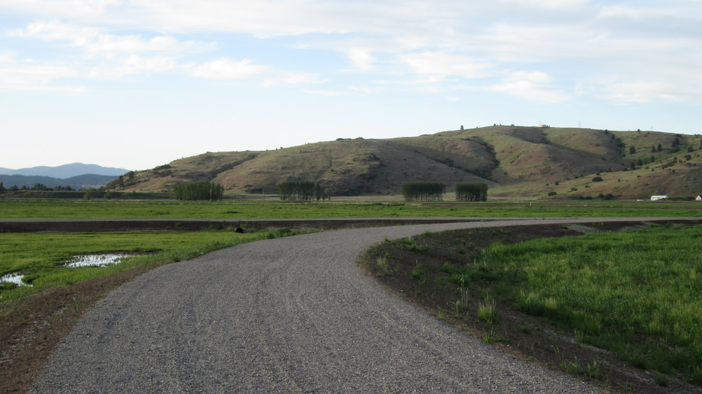

---
tags:
- Trails & Scrambles
- Easy
- Walking
- Birding
- Cross-country Skiing
- Snow-shoeing
stats:
- label: Event Type
  icon: hiking
  value: Walking, Birding, Cross-country skiing and Snow-shoeing
- label: Distance
  icon: map-marker-distance
  value: 1.5 miles
- label: Elevation
  icon: terrain
  value: Minimal gain at 2032' elevation.
- label: Difficulty
  icon: speedometer
  value: Easy
- label: Maps
  icon: map
  value: '[Saltese Flats Open Trails](https://www.spokanecounty.org/DocumentCenter/View/33110/May2020_OpenTrail)'
- label: GPS
  icon: crosshairs-gps
  value: 47°38'26.2" N 117°07'34.3" W
- label: Spokane County Parks
  icon: information-outline
  value: 509-456-4730
- label: Spokane County Sheriff
  icon: shield-account
  value: CALL 911 FIRST or 509-477-2240
---

# Saltese Flats Wetland Trail

_Saltese Flats Wetland Trail_

## Description

Spokane County partially opened the trail in May 2020. It is a raised bed of crushed rock so it is high and
dry. It meanders through the wetlands with remarkable views of Mica Peak and the Saltese Uplands. Many
species of migratory birds stop here to refuel. The trail is dead flat, so it does not get any easier than
that.

## Directions

Access to the trail is from Henry Road at the northeast corner of the site. The best parking is about a half
mile north at the Saltese Upland Conservation Area Trailhead.

## Cool Things Close By

Saltese Uplands, Mica Peak, and Liberty Lake.

## Hazards

None

## Restaurants & Pubs

Snow Eater Brewery, Trailbreaker Cider, Liberty Lake County Park

## Plan Your Trip

Click for Current NOAA Weather Conditions.

## Photo Gallery

_Saltese Creek_

### Birding: Uplands and Wetland (April 16, 2022)

_Bald eagle juvenile (1st year)_

_Canvasback and bufflehead_

_Northern shoveler_

_Killdeer_

_Northern shrike_
