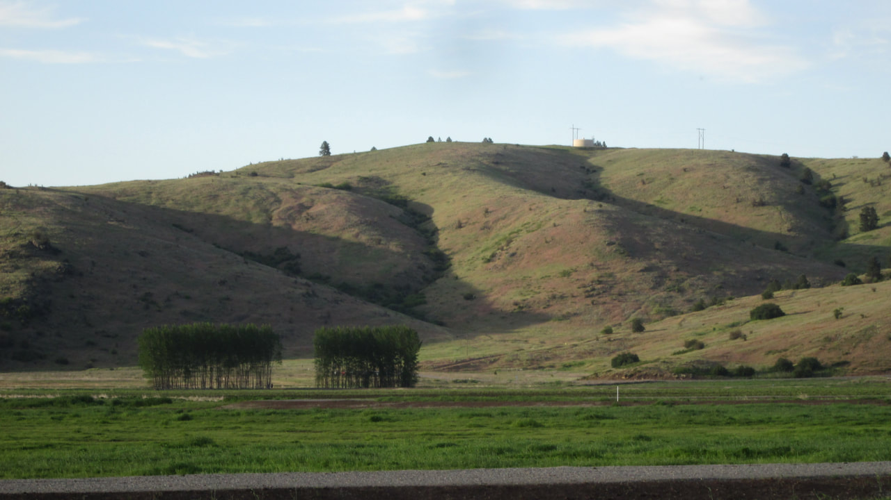

# Spokane County Conservation Futures

_Spokane County Conservation Futures_

Because the spokane county parks has such a great website, We have decided to show their website for the
county conservation parks. click on the area you want to visit for details

## Spokane county conservation futures

Click to set custom HTML

Your browser does not support viewing this document. Click [here]( to download the document.

---

## Links to conservation areas

## <https://www.spokanecounty.org/1592/Conservation-Futures>

- [Antoine peak](https://www.spokanecounty.org/Facilities/Facility/Details/Antoine-Peak-Conservation-Area-58)

- [Cedar grove](https://www.spokanecounty.org/Facilities/Facility/Details/Cedar-Grove-Conservation-Area-59)

- [Dishman hills - glenrose

unit](https://www.spokanecounty.org/Facilities/Facility/Details/Dishman-Hills-Conservation-Area-Glenrose-124)

- [Dishman hills - iller

creek](https://www.spokanecounty.org/Facilities/Facility/Details/Dishman-Hills-Conservation-Area-Iller-Cr-60)

- [Feryn ranch](https://www.spokanecounty.org/Facilities/Facility/Details/Feryn-Ranch-Conservation-Area-61)

- [Gateway](https://www.spokanecounty.org/Facilities/Facility/Details/Gateway-Conservation-Area-62)

- [Haynes estate](https://www.spokanecounty.org/Facilities/Facility/Details/Haynes-Estate-Conservation-Area-63)

- [Holmberg](https://www.spokanecounty.org/Facilities/Facility/Details/Holmberg-Conservation-Area-64)

- [James t. slavin](https://www.spokanecounty.org/Facilities/Facility/Details/James-T-Slavin-Conservation-Area-65)

- [Liberty lake](https://www.spokanecounty.org/Facilities/Facility/Details/Liberty-Lake-Conservation-Area-66)

- [Mckenzie](https://www.spokanecounty.org/Facilities/Facility/Details/McKenzie-Conservation-Area-67)

- [Mclellan](https://www.spokanecounty.org/Facilities/Facility/Details/McLellan-Conservation-Area-68)

- [Mica peak](https://www.spokanecounty.org/Facilities/Facility/Details/Mica-Peak-Conservation-Area-69)

- [Saltese uplands](https://www.spokanecounty.org/Facilities/Facility/Details/Saltese-Uplands-Conservation-Area-70)

- [Trautman ranch](https://www.spokanecounty.org/Facilities/Facility/Details/Trautman-Ranch-Conservation-Area-71)

- [Van horn, edburg & bass](https://www.spokanecounty.org/Facilities/Facility/Details/Van-Horn-Edburg-and-Bass-Conservation-Ar-72)

- [Waikiki springs](https://www.wta.org/go-hiking/hikes/little-spokane-river-natural-area-waikiki-springs)
