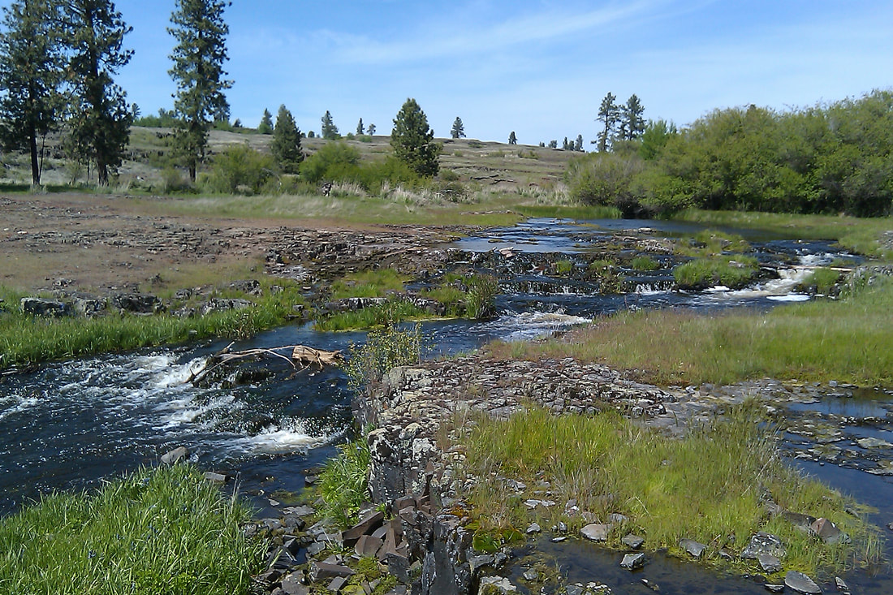
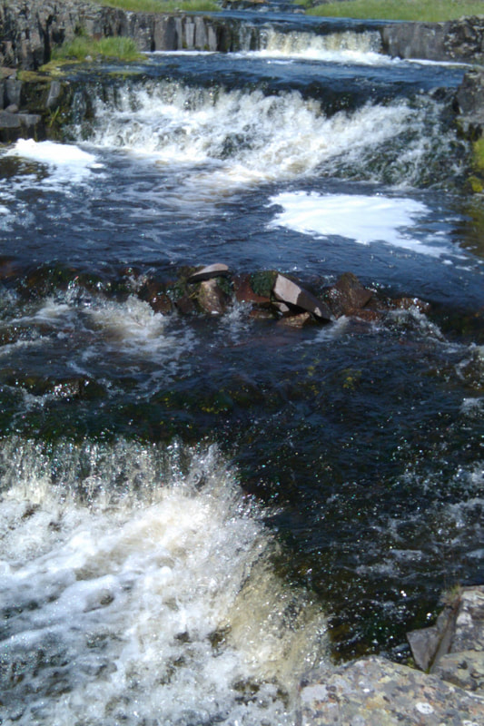
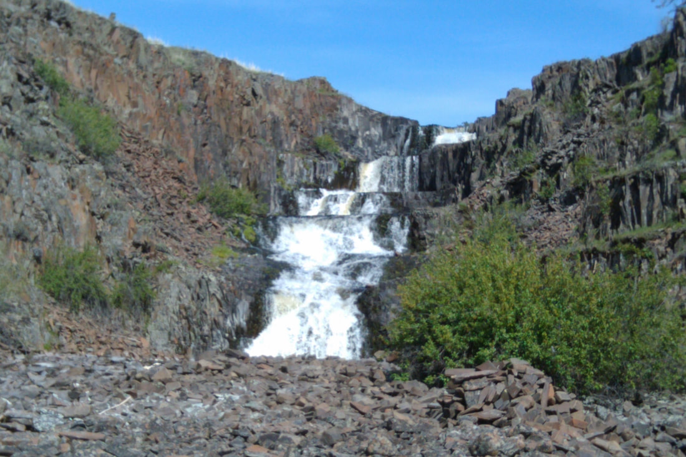
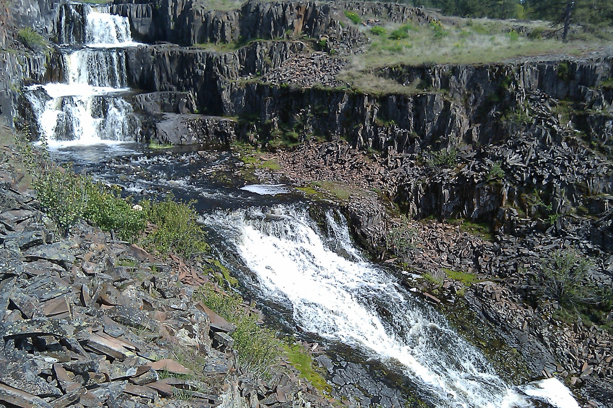
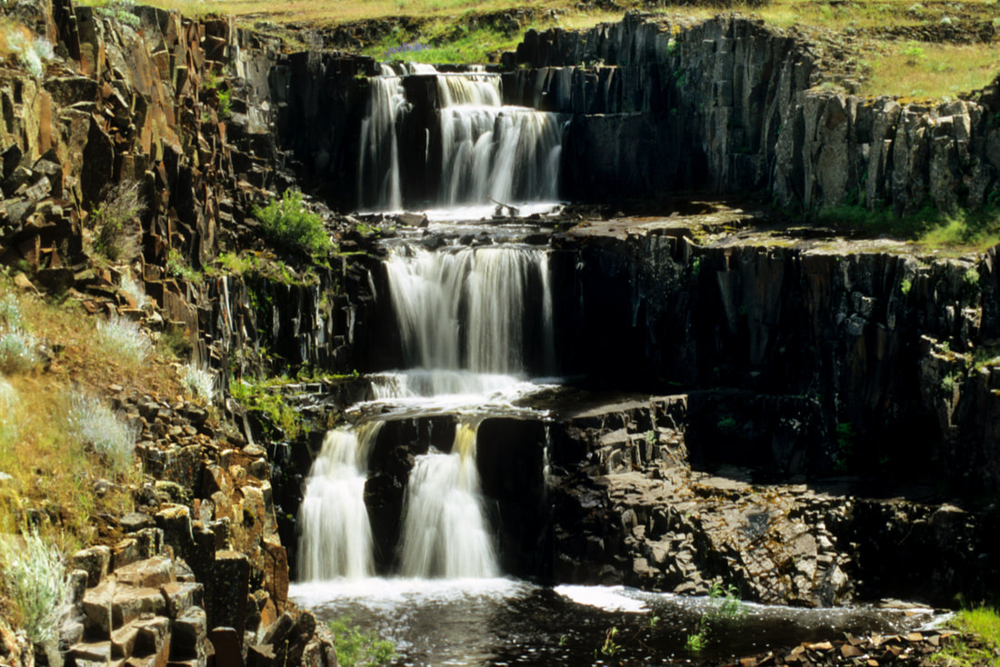

---
tags:
- Waterfalls
- Easy
- Day Hiking
- Photography
stats:
- label: Event Type
  icon: waterfall
  value: Day hiking, and photography
- label: Distance
  icon: map-marker-distance
  value: 3+ miles depending on your route
- label: Elevation
  icon: terrain
  value: 300 to 659 verts
- label: Difficulty
  icon: speedometer
  value: Easy
- label: Maps
  icon: map
  value: BLM Fishtrap Brochure, & Cheney topo
- label: GPS
  icon: crosshairs-gps
  value: 47°21’ 67" n 117°49’72" w
- label: Managing Agency
  icon: domain
  value: blm 509.536.1200
- label: Spokane County Sheriff
  icon: shield-account
  value: CALL 911 FIRST or 509.477.2240
---

# Hog Canyon  Falls

*Hog canyon & waterfalls*

## Description

We have added the areas sheriff’s emergency phone numbers for each trip write up under the ranger district
info. if an
emergency ocurrs, evaluate your circumstances and call only if needed.
Fishtrap Road Trailhead
From the parking area, walk a short distance to the first dirt road and turn left (NE) thru two gates. As
always, please
close any gate you go thru. As the trail descends into a Ponderosa forest, you will come to Hog Canyon and two
benches
with an Aspen Grove. The trail picks up an old road for a short distance until you bear left onto a single
track trail
near the SW end of Hog Lake. There is a boat launch on your right (SW) end of the lake. The trail climbs along
side and
above Hog Lake. Follow the edge, but not too close, and continue NE. As you get closer to the NE end of the
lake, off in
the distance, Hog Canyon Falls comes into view. This high spot is a good place to use a telephoto lens to
shoot the
entire Hog Canyon Falls in one frame. The descent before you is rocky and offers several more photo ops of the
falls.
Wander the area for the best spots to photograph the falls. Please keep in mind that the falls are on private
property,
and always respect private lands. It has been recently posted.

Hog Lake trailhead.
From the boat launch parking area, head NE up a hill on the west side of the lake. This "trail" follows the
west shore
line high above the lake. Take extra care along the edge. It's a serious fall if you are not careful.
Basically, follow
the west shore line until the falls come into view in the distance. Be cautious as you descend to the base of
the lake.
There is a trail off to the west that is on public land.
Please respect private property.

## Directions

Fishtrap trailhead
Drive west on I-90 to exit 254, and head south on the Sprague Highway almost 2.5 miles, and turn left (east)
onto the
Fishtrap Road for a little over a half a mile to the trailhead on your left.

Hog Lake trailhead
Drive west on I-90 to exit 254 and cross over the freeway onto Sprague Highway. In about a mile turn left
(east) onto
the Jack Brown Road for 1.3 miles to the Lake Valley Road and a multi use parking area.

## Hazards

Rocky and rough trail, wood ticks, cow pies, and a serious cliff along Hog Lake.
Please respect prvate property.

## Cool things close by

Fishtrap Lake, Crab Creek, Turnbull National Wildlife Refuge, and Pine Lakes

## R & P

Lenny’s in Cheney

---

## Plan your trip

## Photo gallery

## Above hog canyon falls.   image by chris herath

## The top section of hog cayon falls.   image by chris herath

## 5 of the 7 drops at hog canyon falls.   image by chris herath

## The bottom section of hog canyon falls.   image by chris herath

## Hog canyon falls photo ops are unique in any season
