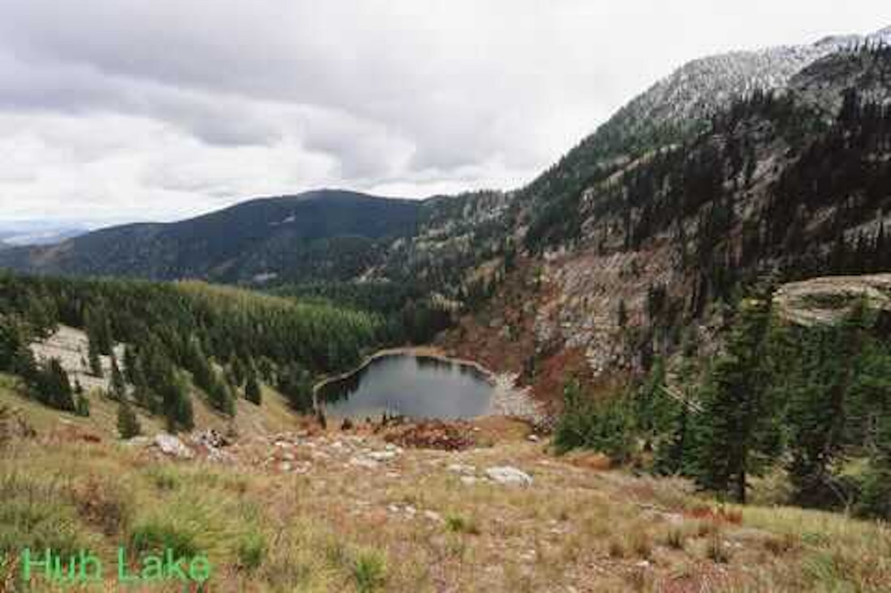

---
tags:
- Lakes
- Moderate
- Day Hiking
- Backpacking
- Mountain Biking
stats:
- label: Event Type
  icon: hiking
  value: Day hiking, backpacking, Mt biking
- label: Distance
  icon: map-marker-distance
  value: About 6.6 miles RT and about 7.8 if you go to Hazel Lake also.
- label: Elevation
  icon: terrain
  value: 1920’
- label: Acres
  icon: vector-square
  value: Hub 5.6, Hazel 7.6, Square 12.4
- label: Difficulty
  icon: speedometer
  value: Moderate
- label: Maps
  icon: map
  value: IPNF, Lolo N.F., DeBorgia South topo
- label: GPS
  icon: crosshairs-gps
  value: 47°16′31″ N 115°22′29″ W
- label: Superior Ranger District
  icon: pine-tree
  value: 406.822.4233
- label: Mineral County Sheriff
  icon: shield-account
  value: CALL 911 FIRST or 406.822.3555
notes:
- label: Lolo National Forest Alerts
  url: https://www.fs.usda.gov/alerts/lolo/alerts-notices
---

# Hub Lake & Dipper Falls

!!! info
    We have added the area's sheriff emergency phone numbers for each trip write-up under the ranger
    district info. If an emergency occurs, evaluate your circumstances and call only if needed.

## Description

Trail #262 starts on Road 889 and wanders up through an old growth cedar forest for a little less than a
mile. Along the trail, you will hear 60' Dipper Falls below the trail on Ward Creek. When the flow is low,
the falls take on the look of its namesake. Each column splashes water off to the next column, looking like
a mass of ladles.

Trail #280 climbs for the last mile to Hub Lake. There is a good place to rest and have lunch at the west
end (upper) of the lake. However, if you go in the fall, the sun goes behind the mountains and shades the NW
shore.

After lunch, there is an old mine shaft (blocked) that you can go into for about 20 feet. If it’s a hot day,
the shaft offers a cool place to chill out. Along the trail to the mine is the trail to the saddle between
Ward and Eagle Peaks.

## Directions

Head east on I-90 into Montana and exit on 26, Ward Creek Road. Head south up the Ward Creek Road #889
for 6.5 miles to a trailhead just before Ward Creek and a left turn.

There is no westbound on-ramp, so you have to drive east on I-90 to St. Regis to regain the westbound lane.

## Cool Things Close By

Ward & Eagle Peaks, Lookout Pass Ski Area, the Route of the Hiawatha, and historic Wallace.

## Hazards

This trail is pretty easy with no hazards to speak of. The trail above Hub Lake is steep.

## R & P

Pizza Factory, 1313 Club, and Muchacho’s Tacos in Wallace.

## Photo Gallery

_Dipper Falls along the trail to Hub Lake. In late summer and fall, the falls cascade off of each other,
looking like dozens of ladles or dippers._

_Hub Lake from Eagle Peak. Image taken on 10.7.2025 by Chris Herath._
