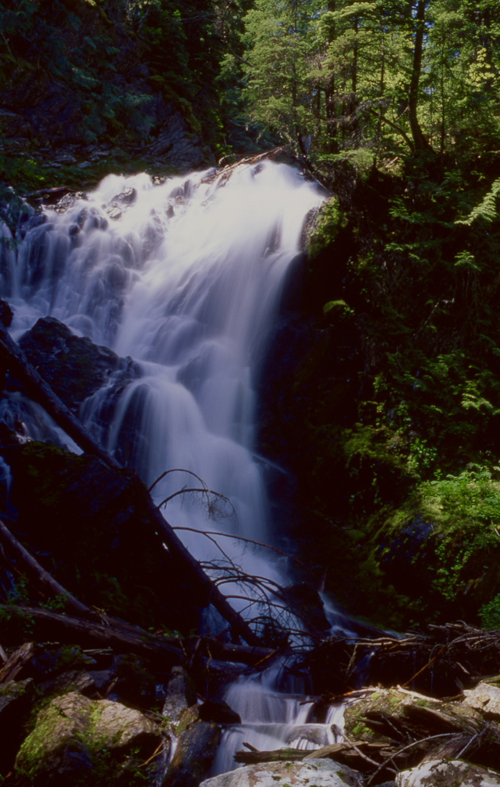
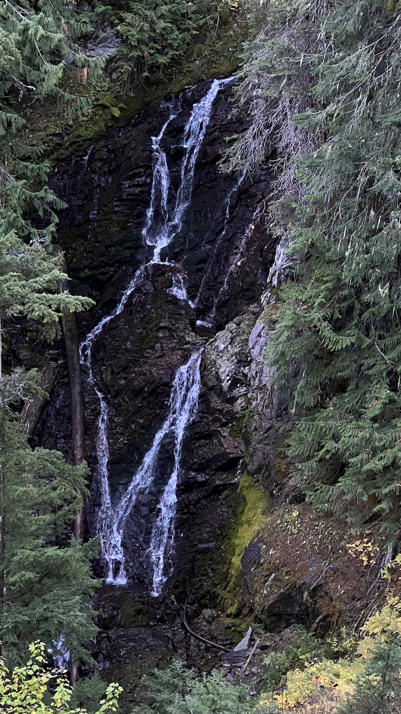
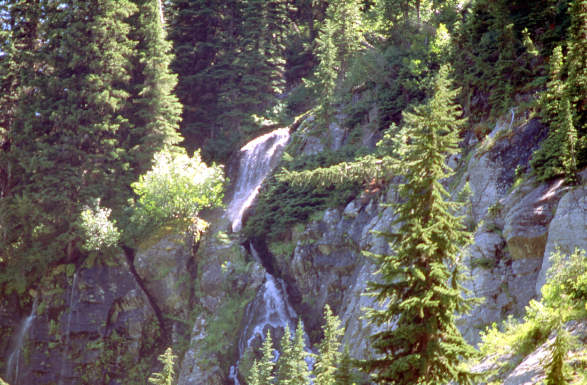
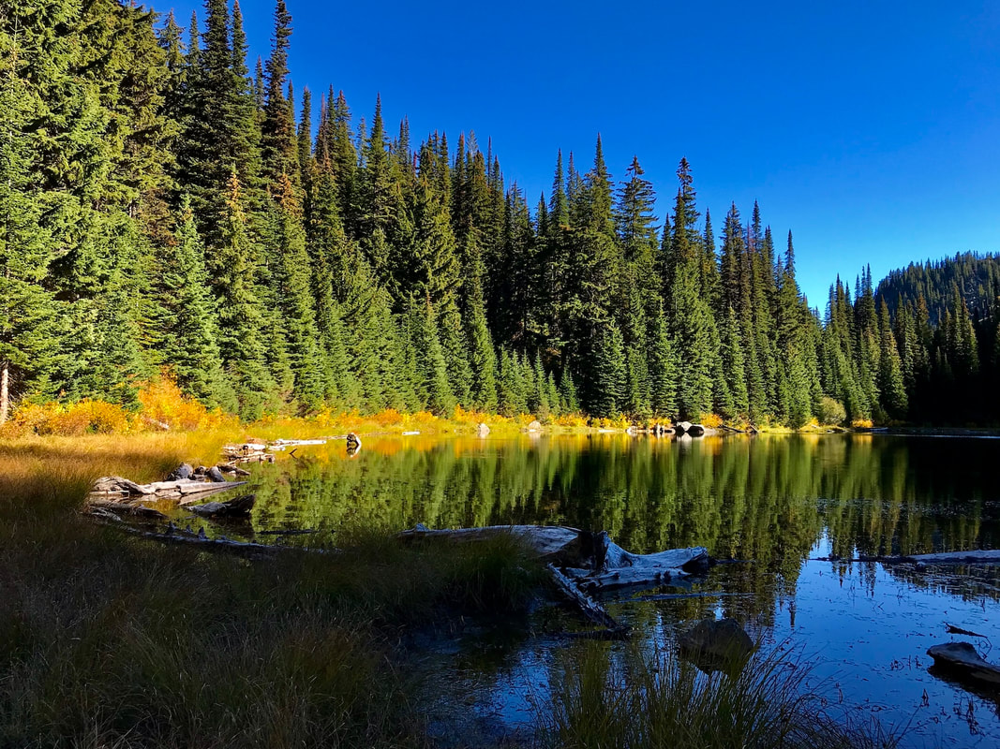
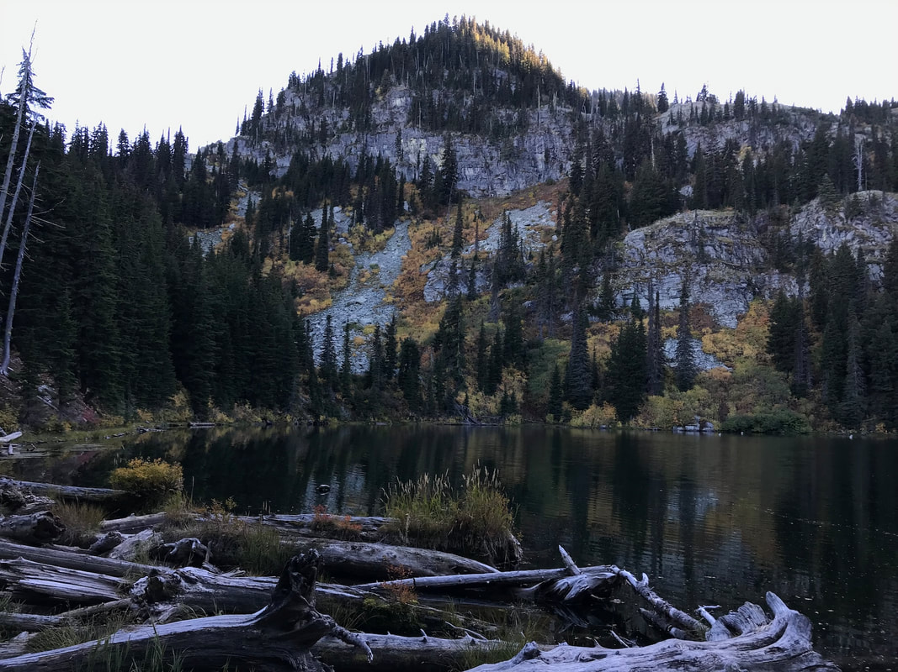
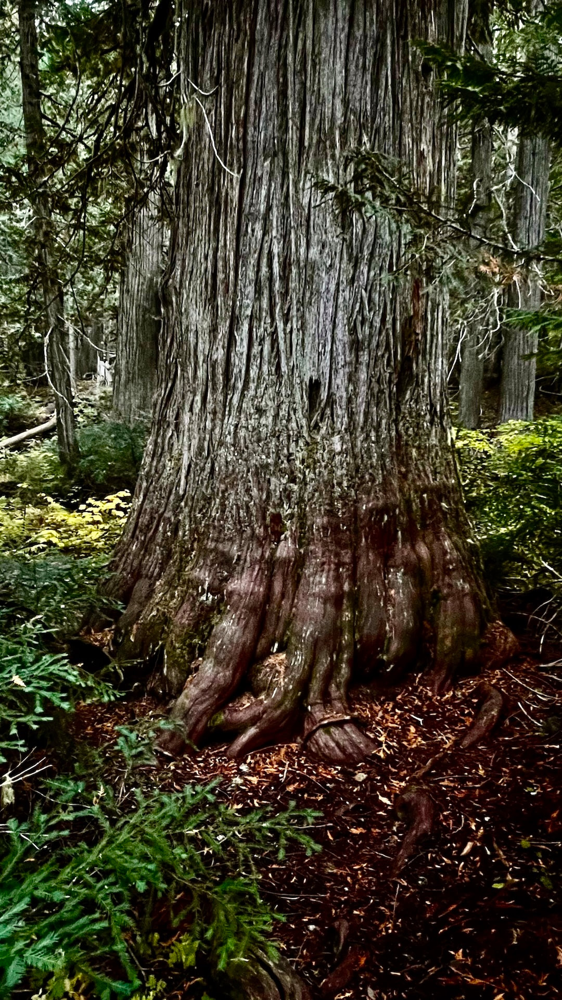

---
tags:
- Lakes
- Moderate
- Day Hiking
- Backpacking
- Mt Biking
stats:
- label: Event Type
  icon: hiking
  value: Day hiking, backpacking, Mt biking
- label: Distance
  icon: map-marker-distance
  value: About 6.6 miles RT and about 7.8 if you go to Hazel Lake also.
- label: Elevation
  icon: terrain
  value: 1920’
- label: Acres
  icon: vector-square
  value: hub 5.6…..hazel 7.6…..square 12.4
- label: Difficulty
  icon: speedometer
  value: Moderate
- label: Maps
  icon: map
  value: IPNR, Lolo N.F., DeBorgia topo
- label: GPS
  icon: crosshairs-gps
  value: 47°16’20" n 115°22’28" w
- label: Ranger District
  icon: pine-tree
  value: CDA River R.D. 208.769.3000
- label: Mineral County Sheriff
  icon: shield-account
  value: 911 or 406.822.3555
---

# Hub Lake

*Hub lake & dipper falls*

## Description

Trail #262 starts on Road 889 and wondered up thru an old growth cedar forest for a little lees then a mile. Along the trail, you will hear 60' Dipper Falls below the trail on Ward Creek. When the flow is low, the falls take on the look of its name sake. Each column splashes off water to the next column, hence looking like a mass of ladles. See our WATERFALL section.

Trail# 280 climbs for the last mile to Hub Lake. There is a good place to rest and have lunch at the west end (upper)of the lake. However, if you go in the Fall, the sun goes behind the mountains, and shades the NW shore.

After lunch there is an old mine shaft (blocked) that you can go into for about 20 feet. If it’s a hot day, the shaft offers a cool place to chillout.
Along the trail to the mine is the trail to the saddle between Ward and Eagle Peaks.

## Option #1

From the west shore line, there is an obvious trail that leads part way up Eagle Peak. Just off the lake, is an abandon mine shaft you can walk back into about 20’. If you continue up, this trail bears left and summits the trail saddle between Eagle and Ward Peaks. Which way you turn, you are sure to be pleased. Eagle Peak is on your right, while Ward Peak is on your left.

## Option #2

As you head back down from Hub Lake, you can bear right to Hazel Lake. There is a short hikes to lakes rarely visited.

## Directions

Head east on I-90 into Montana and exit on 26, Ward Creek Road. Head south up the Ward Creek Road #889 for 6.5 miles to a trailhead just before Ward Creek and a left turn.

There is no west bound on ramp, so you have to drive east on I-90 to St. Regis to regain the west bound lane.

## Hazards

This trail is moderate with few hazards to speak of. Take care walking on the tree roots.
The trail above Hub Lake is steep as it gets close to Hub Lake

## Cool things close by

Ward & Eagle Peaks, Lookout Pass Ski Area, historic Wallace, The Pulaski Tunnel Trail, the Route of the Hiawatha, Glacier N.P. And the Cabinet Mountain Wilderness.

## R & P

Pizza Factory, 1313 Club, and Muchacho’s Tacos in Wallace, and the Radio Brewing Company in Kellogg

## Photo gallery

---

*Picture (Image missing)*

## The hub lake trail near the start

Dipper falls along the trail to hub lake. in late summer and fall, the falls cascade off of each other. hence there are dozens of ladles, or dippers

This image was taken on 10.7.2025. as you can see, the flow is low, But still spectacular to see. Image by chris herath

*Picture (Image missing)*

## Hub lake from eagle peak

## Intermittent falls below mary lake and above hub lake

*Picture (Image missing)*

## From above hub lake looking north up towards eagle peak

*Picture (Image missing)*

## An intermittent waterfall from mary lake above

## This was our view for luncg, looking ne

*Picture (Image missing)*

## From the same spot above, turn around to see eagle peak

*Picture (Image missing)*

We walked up the trail towards the old mine, And this image shows the debris field below eagle peak image by chris herath

## On the way down from hub lake, we did the short walk down to hazel lake

On the way down, the western red cedars are a delight. This is the largest, hence oldest cedar along the trail. This cedar was over 6' wide. image by chris herath
