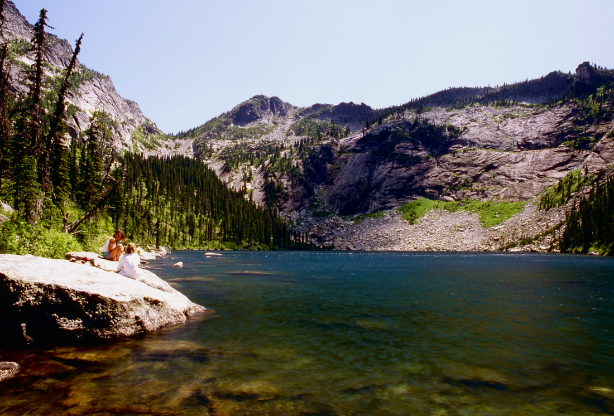
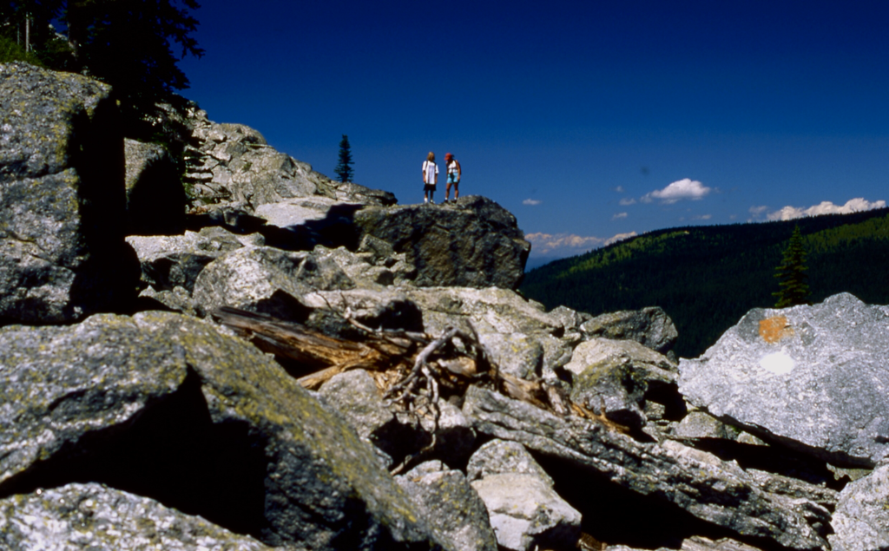
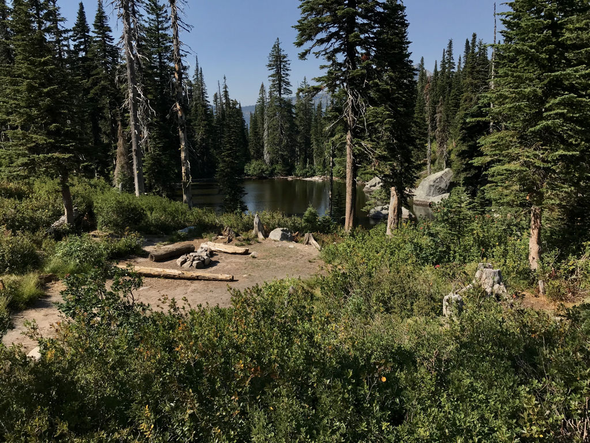
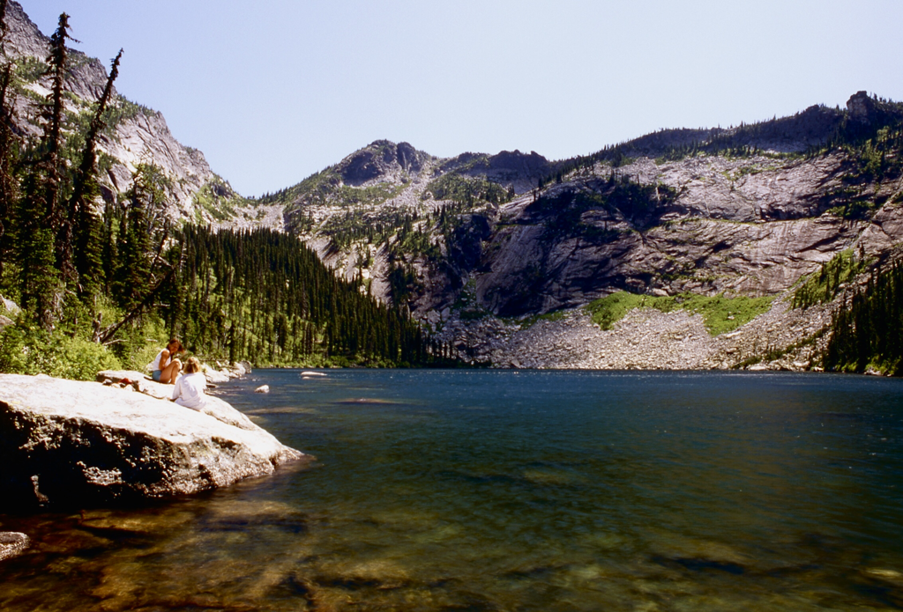
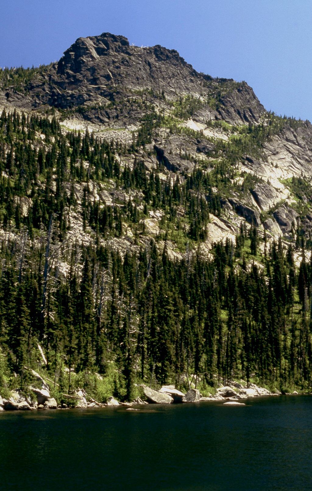
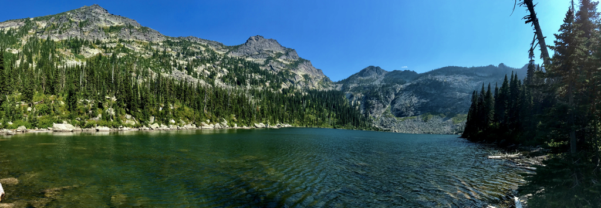
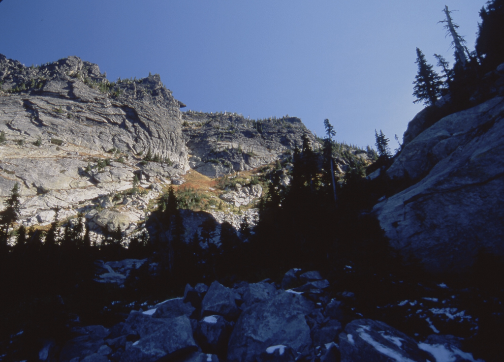
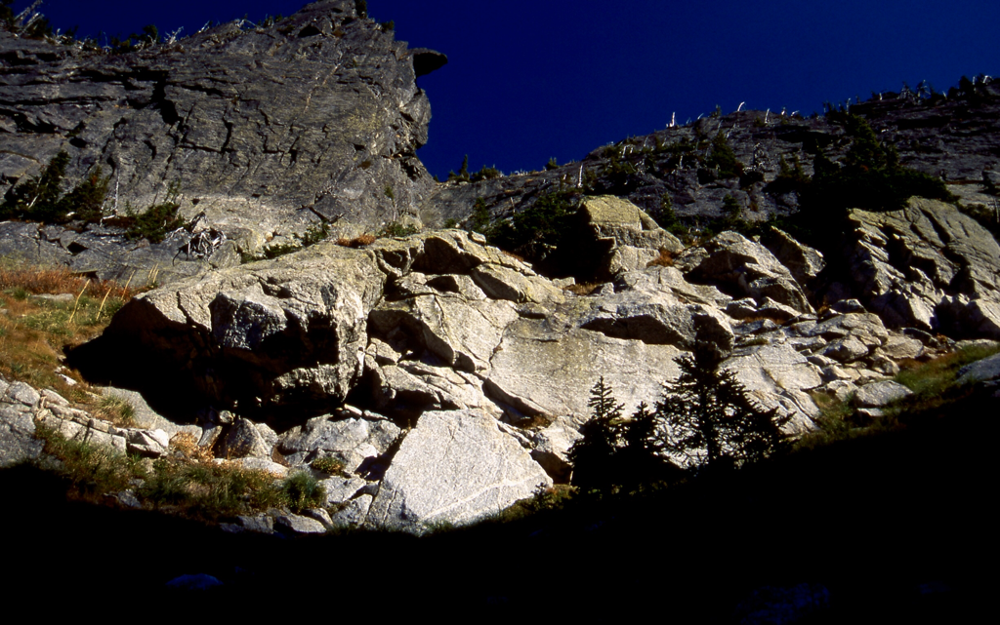
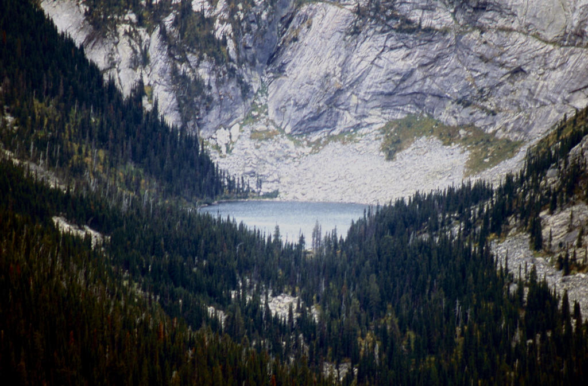

---
tags:
- Lakes
- Hiking
- Backpacking
- Scrambling
- Climbing
stats:
- label: Event Type
  icon: hiking
  value: Hiking, backpacking, scrambling and climbing
- label: Distance
  icon: map-marker-distance
  value: Lake 2 miles RT, Gunsight Peak about 6 miles RT
- label: Elevation Gain
  icon: elevation-rise
  value: Hunt Lake 525', Gunsight Peak 2062'
- label: Acres
  icon: vector-square
  value: '13.9'
- label: Difficulty
  icon: speedometer
  value: Hunt Lake Moderate, Gunsight Peak Difficult, Hunt Lake to Hunt Peak Difficult
- label: Maps
  icon: map
  value: IPNF - Kaniksu N.F., USGS - Mt Roothaan, Idaho
- label: GPS
  icon: crosshairs-gps
  value: 48°35’3.4"n 116°43’4.6"w
- label: Ranger District
  icon: pine-tree
  value: Sandpoint R.D. 208.263.5111
- label: Bonner County Sheriff
  icon: shield-account
  value: CALL 911 FIRST or 208.263.8417
notes:
- "[Idaho Panhandle National Forest Alerts](https://www.fs.usda.gov/alerts/ipnf/alerts-notices)"
---

# Hunt Lake (5,813') & Gunsight Peak (7,352')

_Hunt Lake 5,813' | Peak 6,976' | Gunsight Peak 7,352' | Trail #1_

## Overview & Trail Description

!!! info "Emergency Contact Information"
    In case of emergency, evaluate your circumstances and contact local authorities if needed:

    - **Bonner County Sheriff:** Call **911** first, or `208-263-8417`.

    - **Sandpoint Ranger District:** `208-263-5111`.

Look for a wooden sign post marking the trailhead starting point. The trail quickly drops about 20 vertical feet before ascending into the boulder field that characterizes the main climb.

Historically, route-finding relied on following painted dots on the rocks. Today, heavy foot traffic has established a distinct trail alongside the boulders:

- **Ascent Strategy:** Stay along the tundra on the right side until reaching a path across the scree field on the first shelf.

- **Boulder Crossing:** The path crosses the scree field here and ascends along the left side of the old trail toward the lake. This newer trail offers a faster and less arduous ascent.

- **Trail Markers:** Follow pale green and orange surveyor ribbon along the left side of the giant scree slopes. In places where the trail weaves through the forest away from the scree, you will occasionally scramble back out onto the rocks.

When reaching the first bench on the ascent, turn around to note where the trail exits the scree slopes to the left back toward the trailhead.

---

## Driving Directions

1. From **East Shore Road**, drive **7.3 miles** past Cavanaugh Bay to **Hunt Creek Road #24**.

2. Turn right (east) onto **Hunt Creek Road #24**. Stay on #24, bearing left at the first "Y".
3. Continue to the junction marked with an old #24 / #241 sign ("Y"). Note that a wooden **#243** sign has been bolted over the 241 marker, and a wooden board labeled **HUNT LAKE** leans against the #24 post.

!!! warning "High Clearance Vehicle Required"
    High-clearance trucks or SUVs are **strictly required** for the final 2 miles of the access road due to severe rutting and rocky terrain. Low-clearance passenger cars should not attempt this section.

---

## Route Options & Scrambles

### Option 1: Hunt Lake to Gunsight Peak

Hike around the west side of Hunt Lake to the southeast corner. Look for a low saddle on the east ridge above the lake.

- **Elevation Gain:** 927 feet up to the saddle.

- **Summit Push:** Turn left (north) at the saddle and ascend 612 feet further to the summit of **Gunsight Peak** (7,352').

### Option 2: Hunt Lake to Fault Lake Traverse

From Hunt Lake, scramble to the ridge above as described in Option 1.

- **Ridge Traverse:** Head due south along the high crest for approximately 1 mile to **Peak 6,514'**.

- **Descent to Fault Lake:** Locate a notch along the ridge to descend to **Fault Lake**, then follow **Trail #59** down to the Fault Lake trailhead.

### Option 3: Extension to Hunt Peak

From Peak 6,514' (reached in Option 2), continue south along the ridge for approximately 1/2 mile to reach **Hunt Peak** (7,058').

---

## Safety & Local Information

!!! caution "Hazards & Safety Precautions"
    Off-trail scrambling across high-alpine boulder fields, scree slopes, and sharp granite ridges presents numerous hazards. Exercise extreme caution, monitor changing weather, and bring proper navigation tools.

### Nearby Attractions

- **Glacial Lakes:** Fault Lake, Upper Priest Lake, Priest Lake.

- **Peaks & Scrambles:** Gunsight Peak, Mt. Roothaan, Chimney Rock.

- **Cascades & Parks:** Lions Creek Water Slides.

### Post-Hike Food & Drinks

Refuel in nearby **Sandpoint, ID**:

- **Jalapeños** (Mexican Cuisine)

- **Eichardt's Pub & Grill**

- **Mr. Sub**

- **Burger Express**

### Weather & Planning

- [Current NOAA Weather Forecast for Hunt Lake / Sandpoint Area](http://www.nws.noaa.gov/wtf/udaf/area/?site=otx){:target="_blank"}

---

## Photo Gallery

_Hikers navigating the boulder route toward Hunt Lake._

_A serene alpine pond situated below Hunt Lake._

_Hunt Lake provides a relaxing spot to rest and take in surrounding Selkirk views._

_Hunt Lake nestled beneath the high granite ridge leading to Gunsight Peak._

_Hunt Lake with Gunsight Peak (7,352') towering along the horizon._

_Scrambling to Gunsight Peak offers views of dramatically folded granite rock layers._

_Nearing the 6,740' saddle on the ridge below Gunsight Peak._

_Looking down at Hunt Lake from the high summits near Mt. Roothaan and Chimney Rock._

!!! quote "Backcountry Reflection"
    > *"Wandering is a state of mind, while bushwhackin' is a state of pleasure."*
    > — **Chic** (August 29, 2012)
