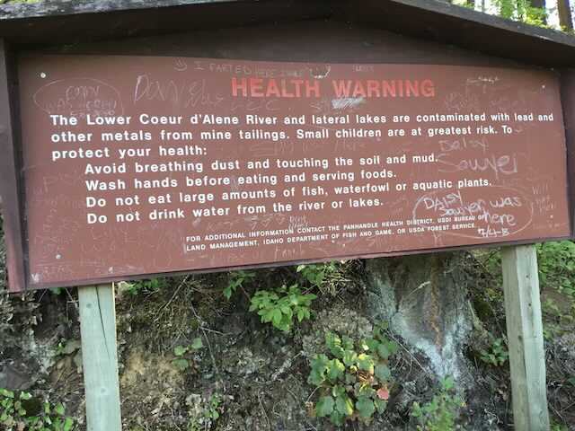
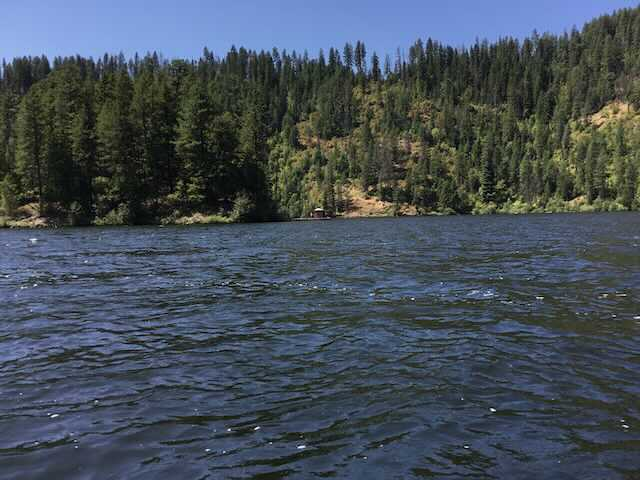

---
tags:
- Lakes
stats:
- label: Paddle Distance
  icon: map-marker-distance
  value: 5.3 mile loop
- label: Elevation
  icon: terrain
  value: 2133’
- label: Length and Acreage
  icon: vector-square
  value: 1.5 miles. & 498 acres
- label: Maps
  icon: map
  value: IPNF, Lane Topo
- label: Launch GPS
  icon: crosshairs-gps
  value: 47°30’54" n 116°33’21" w
- label: Shoshone County Sheriff
  icon: shield-account
  value: 208.556.1114
---

# Killarney Lake Launch

## Description

Killarney Lake is tucked away to the north of State Hwy 3 that starts up north at I-90 and heads down to
Harrison, Idaho and beyond. About 2 miles south on Hwy 3, look for the Killarney LakevRoad off to the right.
One attraction is Popcorn Island. There are a few campsites, and at the summit is a view south of Killarney
Lake. Because the island is isolated from the mainland, there is an outhouse on the dock on the north side
of the island. Due south of the launch is a waterway to the CDA River. You can explore it as far as you’d
like to paddle.

## Attractions

Popcorn Island, usually calm waters, and access to the CDA River.

## Directions

Drive I-90 east of CDA, over the 4th of July Pass, and turn right (south) not Hwy 3 towards Harrison, Idaho.
About two miles past the bridge over the CDA River, is the turn off to Killarney Lake.

## Cool things close by

Cave Lake, Medicine Lake, Rose Lake, Heyburn State Park, and Harrison, Idaho

## R & P

Trails End Brewery, Moon Time, Franklins, and Mexican Food Factory

---

## Plan your trip

[Click for Current NOAA Weather Conditions](https://www.nws.noaa.gov/wtf/udaf/MapClick.php?lel=4000&uel=9000&polygon=49.016%2C-114.180%2C48.994%2C-114.381%2C48.890%2C-114.341%2C48.924%2C-114.151%2C&area=63)

## Photo gallery

## Please everyone... heed this health alert

*Picture (Image missing)*

## A residence north of popcorn island

*Picture (Image missing)*

## A novel way to keep the island clean

## Be aware

*Picture (Image missing)*

## The view from atop popcorn island, looking se

## It really works

*Picture (Image missing)*

## Picnic table on the top

*Picture (Image missing)*

## Popcorn island from the se
