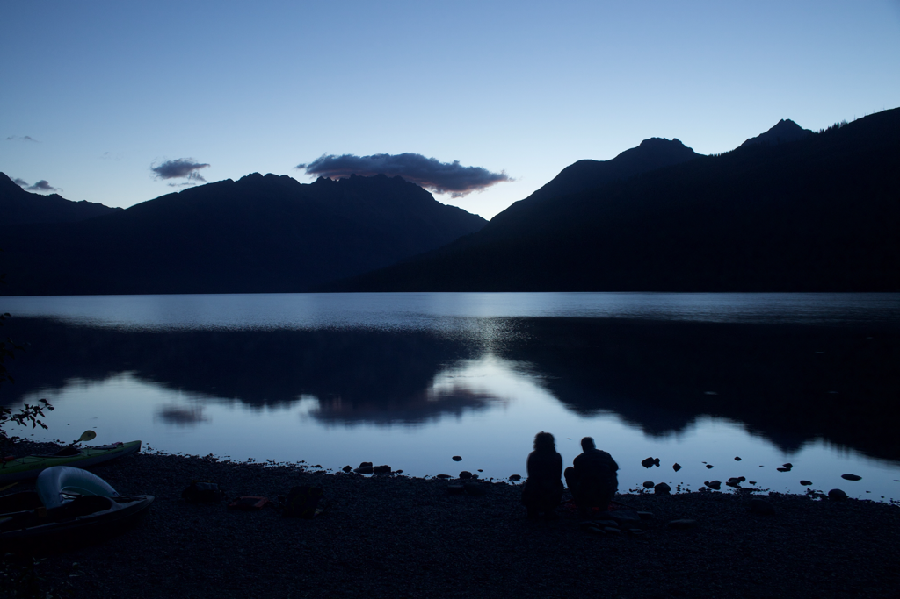
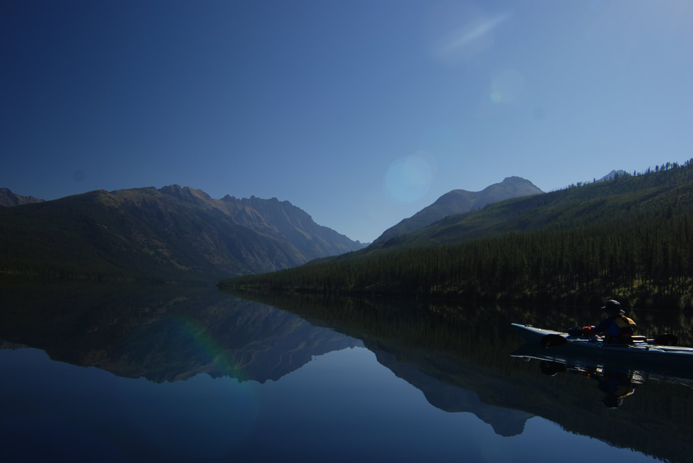
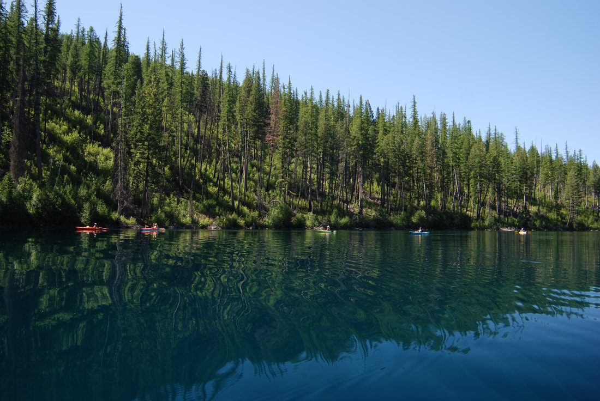

# Kintla Lake

## Kintla lake 4,008’

---

## Description

Flathead county sheriff: 406.758.5610

It takes a bit of effort and planning to get to Kentla but the paddling can be magical. The water was as clear as glass and you could see bottom below you yet at the same time it reflected the sky like a polished mirror. We heard elk bugling each night and morning. The skies were clear and we got a view of the Northern Lights too.

The camp has approximately 12 camp spots. The spots along the outlet offer the sound of running water and the spots on the lake offer a view.

This is a great trail head for backpacking. You could hike 6.4 miles to the camp ground at the head of the lake or do a multi-day through hike to Logan's Pass or Waterton Lakes N. P. for a grand tour of the local backcountry.

This is a great spot for star gazing too. There is very little light pollution so faint objects appear brighter. The day use area was filled with astronomers at midnight.

## Directions

Instead of going in the west entrance we went north out of Columbia Falls and camped at Big Creek camp ground outside of the park. Continue north to Polebridge. It takes approximately one hour from Polebridge to get to the lake.

If you bring a boat you must have it inspected for invasive species at Apgar prior to arriving at Kintla. The boat inspection opens at 7:00 AM and is located across the street from the boat ramp.

Information specific to Kintla CG. can be found here: [<https://www.nps.gov/applications/glac/cgstatus/camping>\_detail.cfm?cg=Kintla%20Lake
](https://www.nps.gov/applications/glac/cgstatus/camping_detail.cfm?cg=Kintla%20Lake)
The [Park CG. status](https://www.nps.gov/applications/glac/cgstatus/cgstatus.cfm) website page tells you by day and hour when the CG. filled up in the past. The Ranger station at the North entrance was able to confirm how many available spots there were at Kintla before we headed up the road.

Here is the new status page for parking lots, camp grounds and weather: <https://www.nps.gov/applications/glac/dashboard/>

---

## Option #1

Car camp, swim, fish, hike, star gaze and paddle from camp.

## Option #2

Paddle 6.4 miles and kayak camp at the Lake Head CG. Day hike to the upper lake from there.

## Option #3

Camp at Kintla the first night so you can get an early start and do a multi day trip to Logan's Pass or hike to the southern end of [Waterton Lake](https://www.nationalgeographic.com/travel/parks/waterton-lakes-canada-park/#/36748.jpg) and catch the ferry and stay in the Hotel for the night.

---

## Cool things close by

Bowman Lake, Flathead River, Waterton Lakes N. P., Bob Marshall Wilderness

## Hazards

Be aware...the road from polebridge to kinyla lake is a car killer. its about 20 miles +-, and takes 30 to 40 minutes.
Do not drive it on iffy tires.

A potential hazard is the current at the outlet stream. The camp ground beach wraps around to the mouth of the outlet stream and depending on the season there could be a considerable amount of flow there that could sweep you down stream. Brown bears and mountain lions could get you or your food. Store your food properly. A cooler is not bear proof. The wind can come up on the lake and produce big waves and rough paddling conditions. Cold water can kill. You are in a remote area and calling for help will be difficult.

## R & P

The Polebridge Mechantile is a favorite for their coffee and pastries. Northern Lights Saloon and Cafe is an option too.

---

## Plan your trip

[Click for Current NOAA Weather Conditions](https://www.nws.noaa.gov/wtf/udaf/MapClick.php?lel=4000&uel=9000&polygon=49.016%2C-114.180%2C48.994%2C-114.381%2C48.890%2C-114.341%2C48.924%2C-114.151%2C&area=63)

## Photo gallery

---

## Kintla lake at sunrise

---

## What a day to be on kintla lake

## A group of spokane mountaineers paddling the south shore

*Picture (Image missing)*

## Ya just can't beat a day like this

*Picture (Image missing)*

## At the back of the lake is a small camp site and the trail to upper kintla lake
