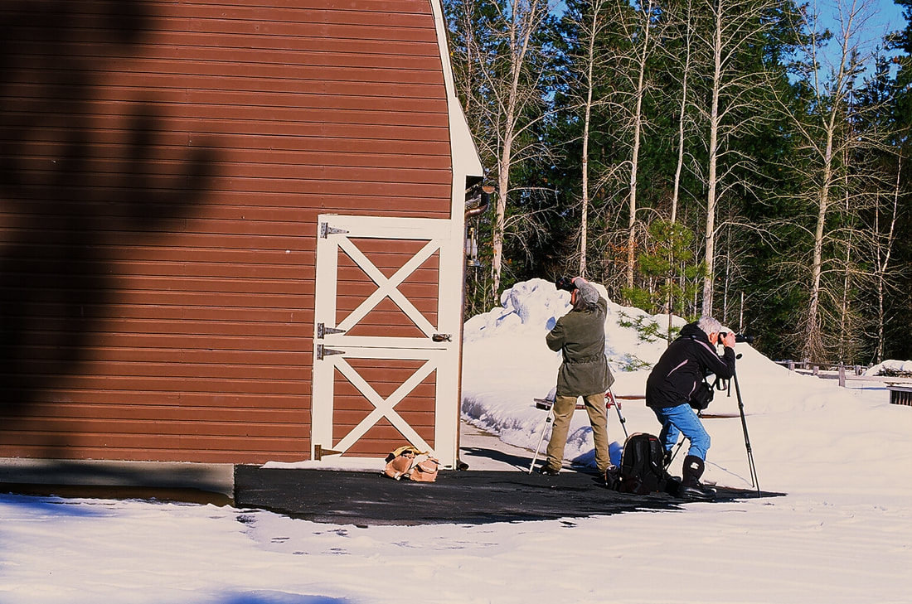
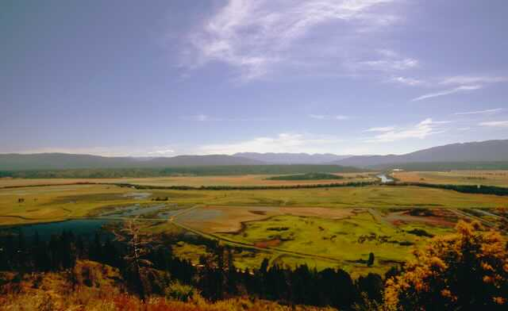
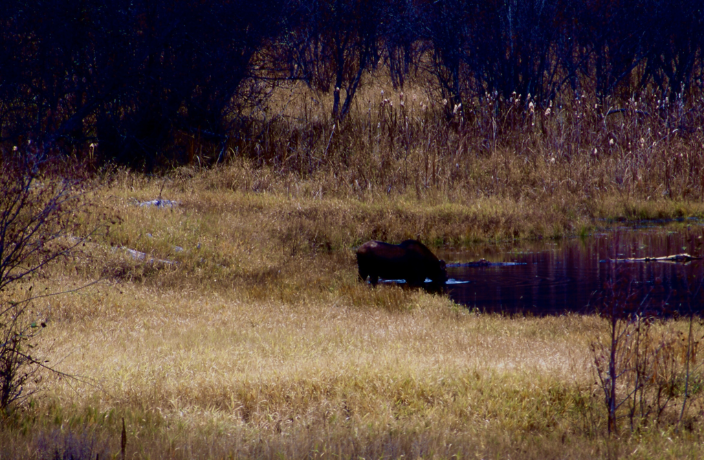
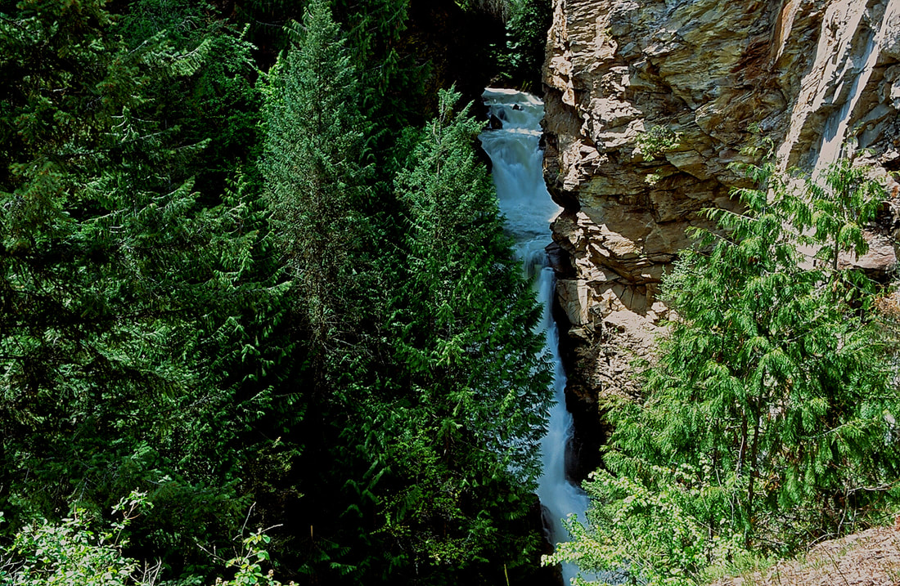

---
tags:
- Trails & Scrambles
- All Routes Are Easy
- Hiking
- Auto Tour
- Bird
- Animal Viewing
stats:
- label: Event Type
  icon: hiking
  value: Hiking, auto tour, bird and animal viewing,
- label: Distance
  icon: map-marker-distance
  value: Longest trail is 2.2 miles. Auto Tour is a 4.5 mile drive with pullouts.
- label: Elevation
  icon: terrain
  value: Level 1787’ base elevation
- label: Difficulty
  icon: speedometer
  value: All routes are easy
- label: Maps
  icon: map
  value: Stop by the refuge headquarters for a brochure, viewing guide and restrooms.
- label: GPS
  icon: crosshairs-gps
  value: 48°42’25"n 116°24’54"w
- label: Ranger District
  icon: pine-tree
  value: Bonners Ferry R.D. 208.267.5561
- label: Boundary County Sheriff
  icon: shield-account
  value: CALL 911 FIRST or 208.267.3151
notes:
- Idaho panhandle national forest/alerts
- url: https://www.fs.usda.gov/alerts/ipnf/alerts-notices
---

# Kootenai Wlr

## Kootenai national wildlife refuge

## Description

We have added the areas sheriff’s emergency phone numbers for each trip write up under the ranger district
info. if an emergency ocurrs, evaluate your circumstances and call only if needed. The Kootenai National
Wildlife Refuge was established in 1964, and contains 2775 acres. There are over 300 species of vertebrate
animals that stop over throughout the year. Stop by the headquarters and pick up a free brochure that
outlines which species are around for the time you are visiting the refuge. There are over 220 species of
migratory birds. Moose, deer, elk, otter, and Bald Eagles are regulars at the refuge. Within the refuge are
5 hiking trails, the longest is 2.2 miles, one of which is a 1/4 mile trail to Myrtle Falls. At the
headquarters are restrooms

## Option #1

The Deep Creek Trail is 2.2 miles and starts on the SW corner along Riverside Road, and skirts Deep Creek,
to Frontage Road 417, and back.

## Option #2

The Island Pond Trail starts on Frontage Road 417, and circles Island Pond for 1.5 miles.

## Option #3

The Myrtle Falls Trail is across from the headquarters to the west. It has its own parking area. The hike to
the Myrtle Falls Overlook is only .9 of a mile along Myrtle Creek. A steel bridge crosses the creek as it
gently ascends to the overlook, via several switchbacks. Along the way, be sure to admire Myrtle Creek. It
can be followed north along Frontage Road 417 to the bridge at the north end of the headquarters, near the
Auto Tour Road. The Myrtle Creek is spectacular in the winter. Don't miss it. There is a hazard here you
must pay attention to. at the falls overlook is an unprotected viewing area. please watch your children very
carefully here.

## Option #4

The Auto Tour starts just north of the refuge headquarters parking area. This car tour is 4.5 miles long and
circles the main body of the refuge. Along the way are viewing points and restrooms. While on the east side
of the tour, near the restroom, look up and west. High above the refuge is Burton Peak. An abandon USFS
lookout cabin sits on the east point of the Cascade Ridge. Please don’t hurry on this tour. The slower you
go, the higher the odds of seeing wildlife, and enjoying the refuge ponds.

## Directions

Drive thru Bonners Ferry to the old section of the city. Just before the Kootenai River Bridge, turn left
onto Riverside Road, and head west for about 4.7 miles to a slow right onto Frontage Road 417. The
headquarters are about .3 of a mile on your right.

## Hazards

As stated above in option#3, be very careful with your children at the falls overlook.

## Cool things close by

Burton Peak, Myrtle Peak & Lake, Pyramid Lakes & Peak, Long Mountain Lake & Peak, Roman Nose Lakes & Peak
with Upper & Lower Snow Creek Falls, ( don’t miss these falls.) They are less then 3/8 of a mile on a great
trail), Trout Lake & Peak, with Big Fisher Lake beyond, 2 Mouth Lakes, and the MIghty Kootenai River.

## R & P

Jalapeños, Eichardt’s, Burger Express, and Mr. Sub in Sandpoint.

---

## Photo gallery

To read more about the purcell trench, the american selkirks, and the cabinet mountain wilderness, double
click on the regions name in the drop down menu

## Two photog friends trying to get a good image next to the meeting room barn

### Picture (Image missing)

## This is an image looking east into the purcell trench

### Picture (Image missing) Details

## Aspens near the "auto tour route"

### Picture (Image missing) Details (2)

## The kootenai national wildlife refuge from road #18, south side

## The kootenai national wildlife refuge from the myrtle lake road

### Picture (Image missing) Details (3)

## The kootenai national wildlife refuge from the burton peak road

## This image shows the "auto tour road" on the outside of channel

### Picture (Image missing) Details (4)

## Early morning fog on the purcell trench

### Picture (Image missing) Details (5)

## The kootenai national wildlife refuge in the summer

## A moose from along the auto tour drive

---

### Picture (Image missing) Details (6)

## A northern section of the kootenai national wildlife refuge

---

## Myrtlre falls

### Picture (Image missing) Details (7)

## Burton peak & old lookout cabin from the k.n.w.r. auto tour route
