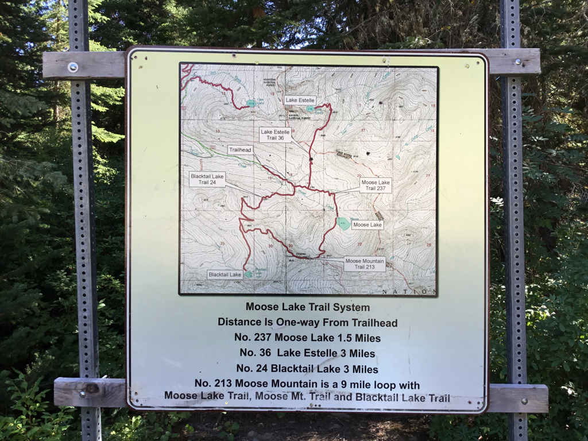
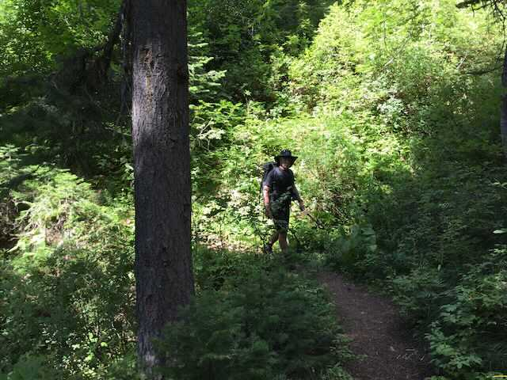
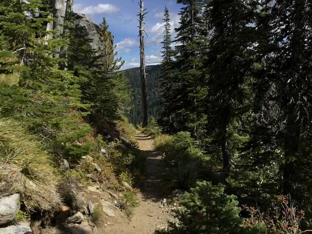
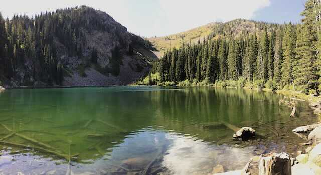

---
tags:
  - Lakes
  - Easy to Moderate
  - Day Hiking
  - Backpacking
  - Camping
stats:
  - label: Event Type
    icon: hiking
    value: Day hiking, backpacking, camping
  - label: Distance
    icon: map-marker-distance
    value: 6.2 miles RT to Lake Estelle (3.0 miles RT to Moose Lake)
  - label: Elevation Gain
    icon: elevation-rise
    value: Lake Estelle 1,013' gain (Moose Lake 557' gain)
  - label: Acres
    icon: vector-square
    value: '3.1'
  - label: Difficulty
    icon: speedometer
    value: Easy to Moderate
  - label: Maps
    icon: map
    value: IPNF - Mount Pend Oreille, Smith Mountain, Benning Mountain, Trestle Peak topos
  - label: GPS
    icon: crosshairs-gps
    value: Moose Lake 48°21’16"N 116°06’33"W (Moose Mountain 48°20’46"N 116°07’23"W)
  - label: Ranger District
    icon: pine-tree
    value: Sandpoint R.D. (208.263.5111)
  - label: Bonner County Sheriff
    icon: shield-account
    value: CALL 911 FIRST, or 208.263.8417
notes:
  - label: Idaho Panhandle National Forests Alerts
    url: https://www.fs.usda.gov/alerts/ipnf/alerts-notices
---

# Lake Estelle & Moose Lake Trail System (Trail #36)

## Description

The Moose Lake Trailhead provides an outhouse, ample parking, and an informative trail system map. For the first 0.5 miles, the trail climbs gently to a junction. Turning left leads to the Lake Estelle Trail #36 spur.

At 1.5 miles lies Moose Lake, nestled in a dramatic cirque with grassy shoreline campsites under rocky peaks. Lake Estelle sits 3.1 miles in, resting in a subalpine cirque below towering ridges. The final 0.5 miles of the Estelle trail skirts open cliffs offering panoramic views across North Idaho and Montana's Cabinet Mountains.

---

## Route Options

### Option 1: Lake Estelle Spur Trail (#36)

Follow the left junction at 0.5 miles for 3.1 miles to Lake Estelle. The trail traverses cliff ledges with sweeping vistas before entering the quiet lake basin.

### Option 2: Moose Lake & Loop (#213)

Continue straight at the junction to reach Moose Lake in 1.5 miles. Trail #213 ascends out of the Moose Lake cirque to connect back to the main loop trail.

### Option 3: Lake Estelle to Gem Lake Traverse

For an extended day hike, traverse 2.5 miles west from Lake Estelle to Gem Lake. This route can be done as a loop by returning 2.0 miles along the access road to the trailhead.

---

## Directions

From Sandpoint, take Highway 200 east past the Pack River and Lake Pend Oreille confluences. At 3.4 miles past the Pack River, turn left (east) for 12 miles onto Lightning Creek Road #275. Turn left (north) up Lightning Creek for less than a mile, then turn right (south) onto Forest Road #1022 to the trailhead.

---

## Hazards & Safety

!!! caution "Cliff Ledge Caution"
    Trail #36 traverses narrow cliff ledges during the final 0.5-mile approach to Lake Estelle. Watch your footing carefully in wet or icy conditions.

---

## Nearby Attractions

Lake Estelle, Gem Lake, Lake Pend Oreille, Lunch Peak Fire Lookout, Mount Pend Oreille, Char Falls, and Scotchman Peak.

---

## Refreshments & Dining (R & P)

- **Clark Fork:** Squeeze Inn, Clark Fork Pantry
- **Sandpoint:** Jalapeños, Mr. Sub, Burger Express, Eichardt's Pub & Grill

---

## Photo Gallery

_Moose Lake Trail System map at the trailhead._

_Chris hiking on the trail to Lake Estelle._

_Trail circling a ridge point near the Lake Estelle basin._

_Lake Estelle shoreline campsite._
