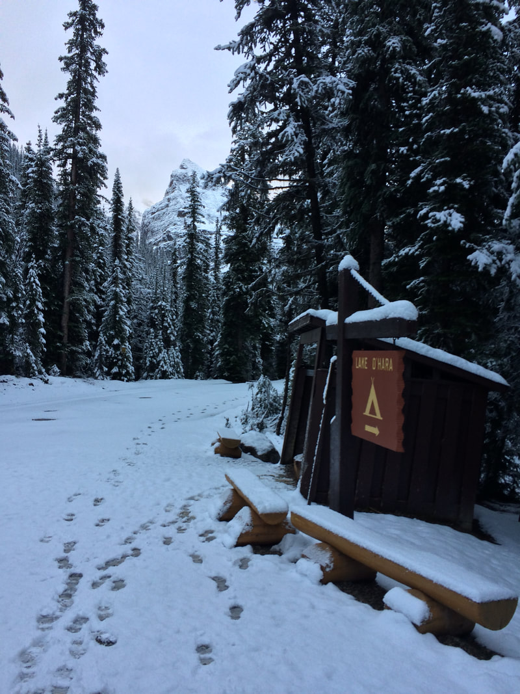
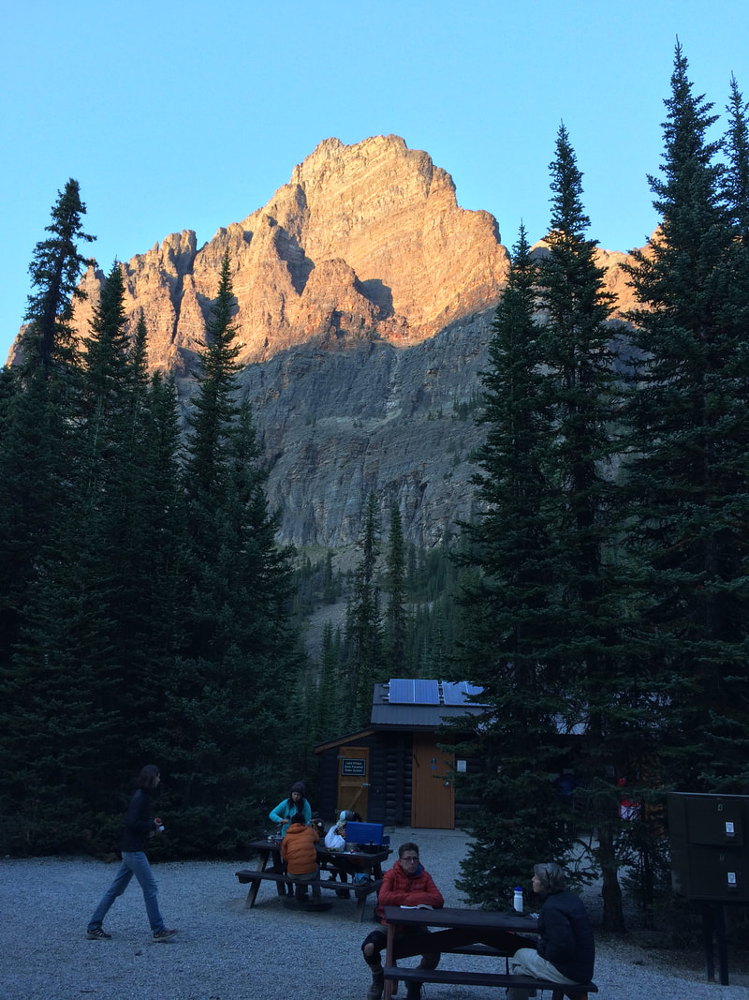
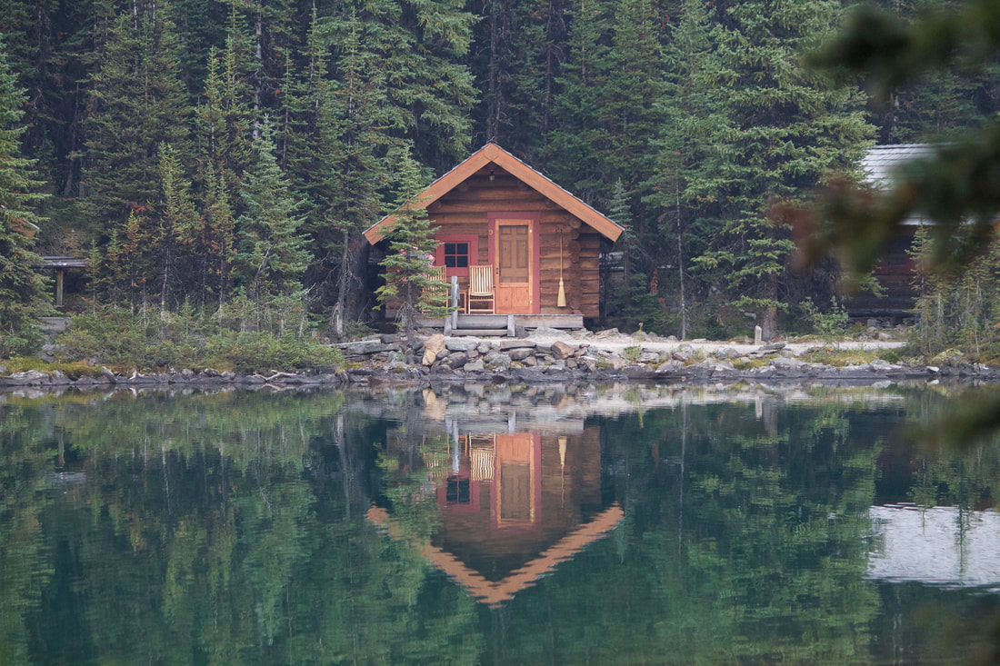
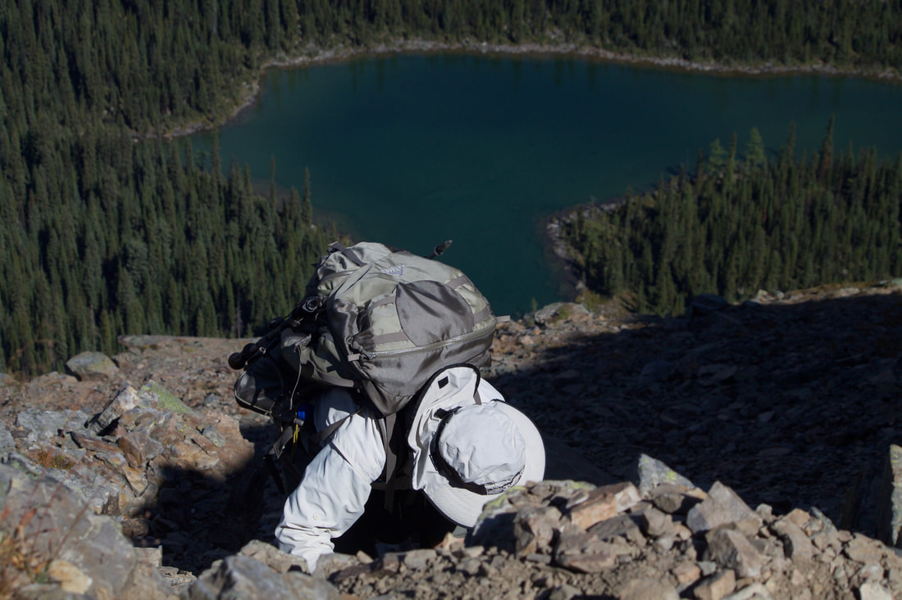
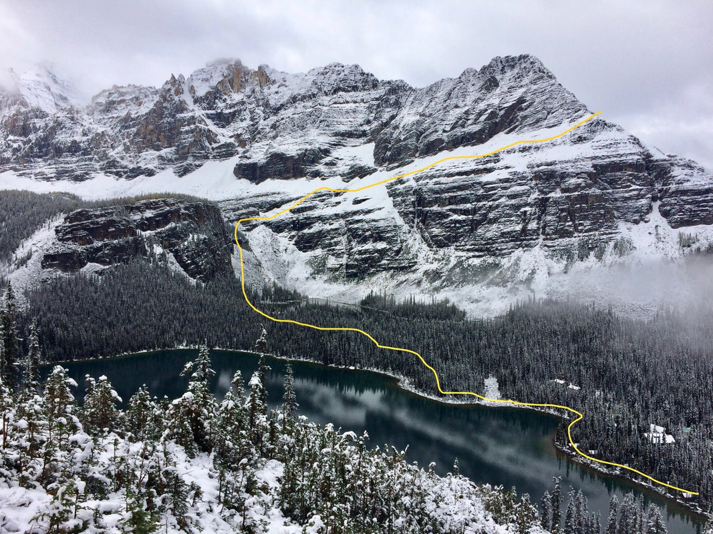
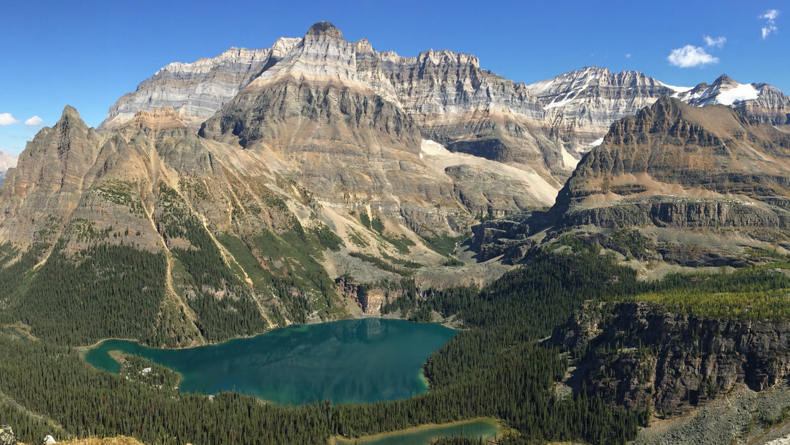
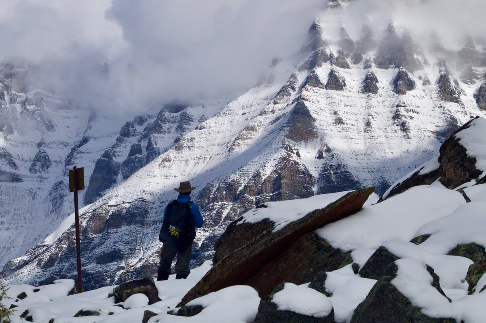
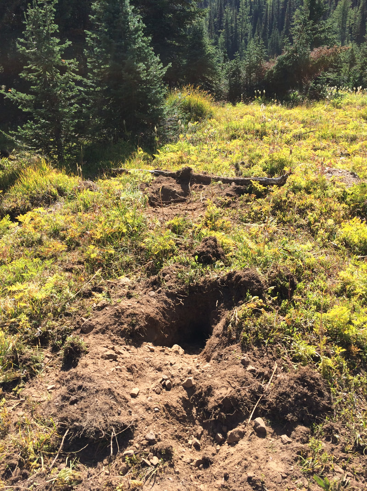

---
tags:
- Lakes
- Easy
stats:
- label: Event Type
  icon: hiking
  value: Bus into the campground and do world class day hikes from there
- label: Distance
  icon: map-marker-distance
  value: 1.75 miles
- label: Elevation
  icon: terrain
  value: Minor ups and downs
- label: Difficulty
  icon: speedometer
  value: Easy
- label: Maps
  icon: map
  value: Lake O'Hara Trail Map - Yoho National Parks, Canada
- label: GPS
  icon: crosshairs-gps
  value: 51°21'23.7"n 116°20'03.0"w
---

# Lake Ohara

*Lake o'hara 6,939'*

## Description

The Lake O'Hara basin is remarkable in many ways. It is surrounded by glacier carved peaks and several hanging valleys each with yet another remarkable alpine lake. It is so popular that in an effort to conserve the area and keep the user experience peaceful they have a permit system to limit 42 people in the basin per night and they do not allow you to drive into the basin. You must take a bus into and out of the campground.

The campground is the best you could ask for in a tent camp. The sleeping area is away from the eating area. Each site has a generous tent pad for one tent. There is a bear proof food locker for each site some of which are larger than others. There are several picnic tables and a fire ring along with two warming huts with pot belly stoves if it is cold or raining outside. There are wash basins outside of the pit toilets which are some of the cleanest and least smelly of all outhouses. Somehow they keep the water running even in below freezing temperatures. They provide a wood pile along with a gear storage room.

The bus ride and the campground fee is $11.50 per night. This is a pretty good deal considering the lake is a five minute walk up the road and the historic Lake O'Hara lodge is at it’s outlet. The rooms there run $400 dollars a night. I'll take my tent. I will say if you can afford it I would not hesitate to take the opportunity to stay there though. It is pretty darn nice. The cabins are on a peninsula and most have an incredible view of the lake and surrounding peaks. They offer afternoon tea at the lodge and non-lodge guests are welcome. It is a really nice spread especially after a big hike. They offer beer, wine and tea also.

Leaving the campground you can walk up the trail on either side of the outlet stream to the lake or you can take the road to the Lodge. There is a well maintained trail circumnavigating the lake that takes about an hour to walk and it is dead flat. There are several spur trails that lead up off of that path up to the alpine circuit which is a route along a series of ledges that loops around two hanging valleys on the back side of Lake O'Hara about a 1,000 feet up. The hiking at Lake O'Hara is world class. It is nice to wake up in a comfortable camp at the base of several different alpine routes that can be done in a day and you can be back at camp around the five in time for dinner. I do trail work and I admire the trail work in this basin. I have not seen a single piece of debris in the trails nor have I had to climb over a fallen tree. The trails are wide and well signed at each intersection. The trails are sometimes a bit exposed but because of that you get incredible views all day long with little effort.

## Directions

Take Highway 95 north across the border to Radium Hot Springs, named because they actually are radio active, and turn east onto Highway 93. Soon you enter the National Park system. The views start here and do not end. I've been as far north as Jasper and everything between here and there is amazing. First you enter Yoho National Park which has always been my favorite. It is a classic "U" shaped glacier carved valley on a huge scale. At Castel Junction take Highway 1 west and go past Jasper a few kilometers. Veer left and stay on Highway 1 toward Kicking Horse pass and the town of Field. Do not go north to Jasper. Not far west of the pass and before you get to Kicking Horse campground on the south side of the highway is the road to Lake O'Hara. The parking lot is just off the highway. There are toilets. The bus stop is up the road just past the entrance to the parking area.

## Trail Map (Click below to download a pdf of the trail system)

"

| | |
|---|---|
| File Size | 357 kb |
| File Type | pdf |

[Download File]( "Download file: Lake O'Hara Trail Map")

---

---

## Option #1

Wiwaxy Gap Alpine Route

## Option #2

Yukness Ledges Alpine Route

## Option #3

All Souls' Alpine Route

---

## Cool things close by

Abbot Pass and Hut (ACC), Elizabeth Parker Hut (ACC), Sentinel Pass

## Hazards

A child could do the Alpine Circuit but there are sections that you do not want to fall off of the trail.

## R & P

Afternoon Tea at the Lake O'Hara Lodge. Deer Lodge for smoked ham and eggs.

---

## Plan your trip

Click for Current NOAA Weather Conditions

## Photo gallery

---

"

## The bus stop and wood shed at the campground

---

## Dinner time at the camp

---

*Picture (Image missing)*

## Tent pad

---

*Picture (Image missing)*

## Lake o’hara

---

## Lake o’hara log cabin rentals

---

*Picture (Image missing)*

## Standing on all souls' prospect looking across at wiwaxy gap

---

## Climbing down from all souls' prospect

---

## All souls’ prospect route

---

## Looking up the lake oesa basin just right of center

---

*Picture (Image missing)*

## From yukness ledges over looking lake o'hara

---

*Picture (Image missing)*

## The wiwaxy gap alpine route

---

*Picture (Image missing)*

## Narrow ledge along wiwaxy gap route

---

## Mount schaffer coming back from lake mcarthur

---

## Grizzly bear digs at schaffer lake
