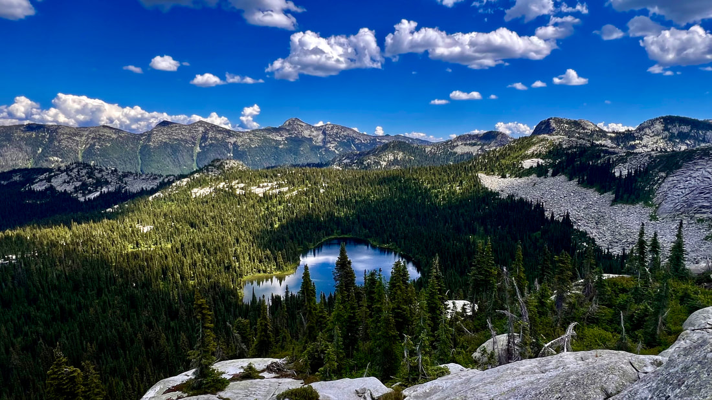

# Lakes

---

## Lakes

---

## Click on the images to enlarge

- 

- 

- 

- 

- 

- 

- 

- 

- 

- 

- 

- 

- 

- 

- 

- 

- 

- 

- 

- 

- 

- 

- 

- 

- 

- 

- 

- 

- 

- 

- 

- 

- 

- 

- 

- 

- 

- 

- 

- 

- 

- 

- 

- 

- 

- 

- 

- 

- 

- 

- 

- 

- 

- 

- 

- 

- 

- 

- 

- 

- 

- 

- 

- 

- 

- 

- 

- 

- 

- 

- 

- 

- 

- 

- 

- 

- 

- 

- 

- 

- 

- 

- 

- 

- 

- 

- 

- 

- 

- 

- 

- 

- 

- , WILLOW RIDGE (M), LOWER & UPPER STEVENS
  LAKES")

<!--  -->

- 

<!-- Missing Image -->

<!-- Missing Image: [*(Image missing)*](missing-image.jpg "ONE OF THE MORE BEAUTIFUL LAKES IN OUR

REGION..UNNAMED DOUBLE

LAKE") -->
