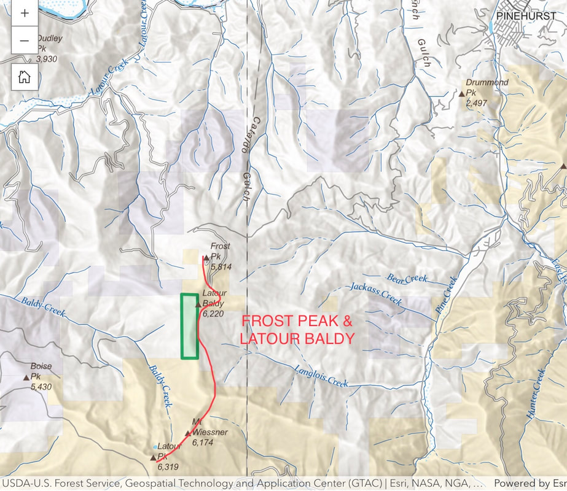
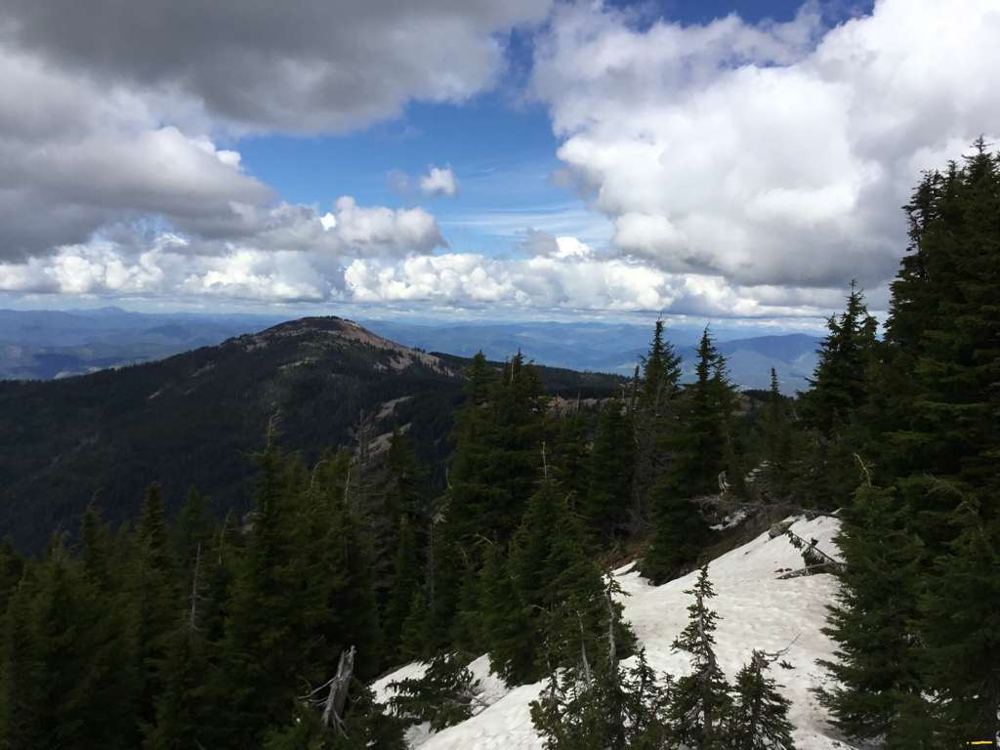
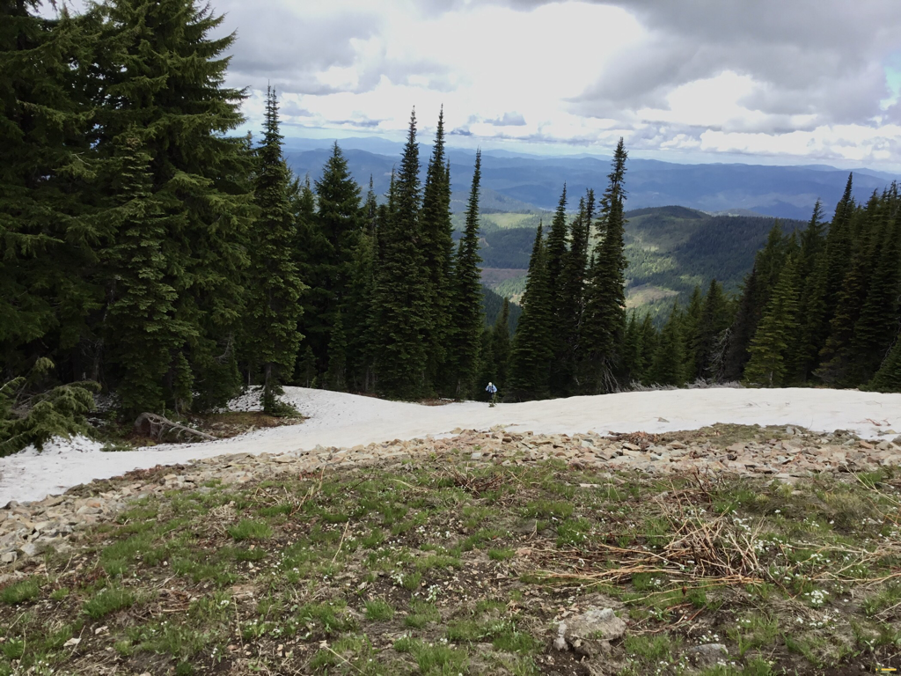
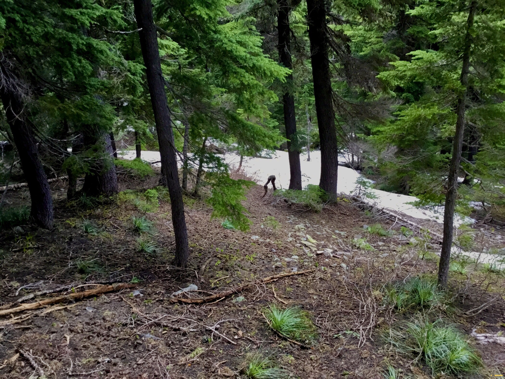
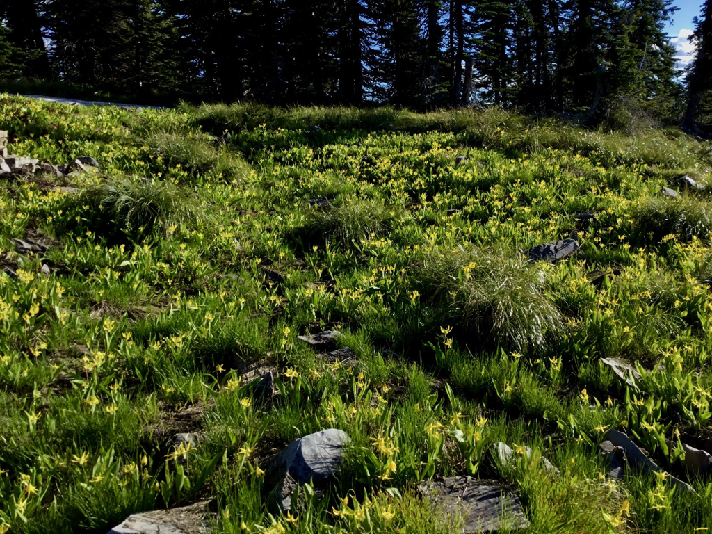
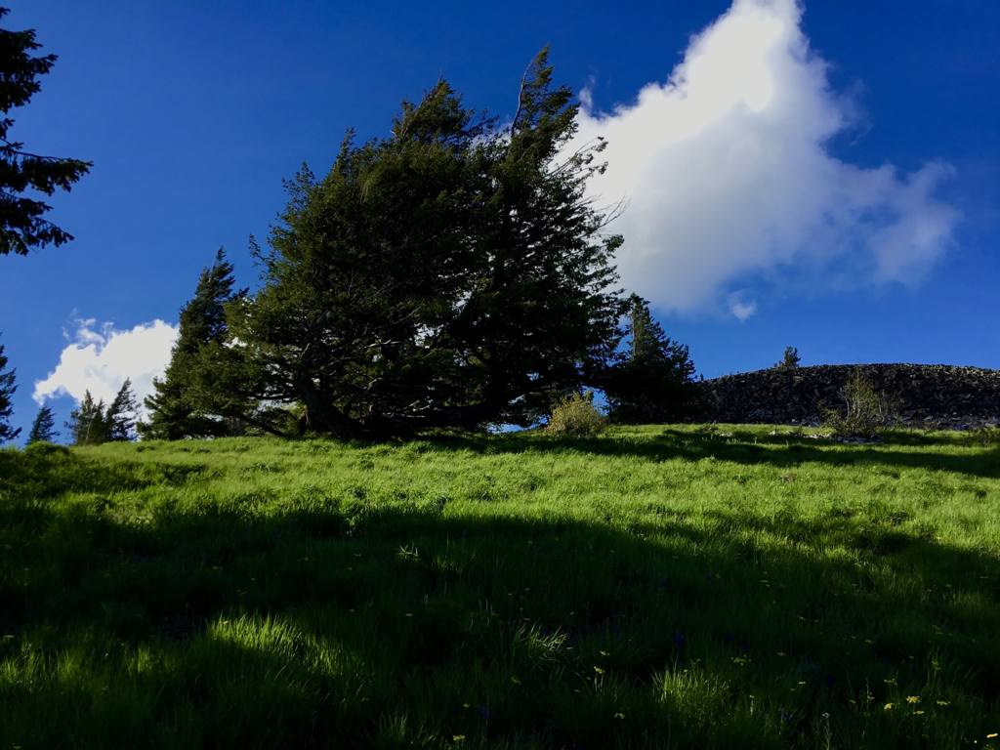
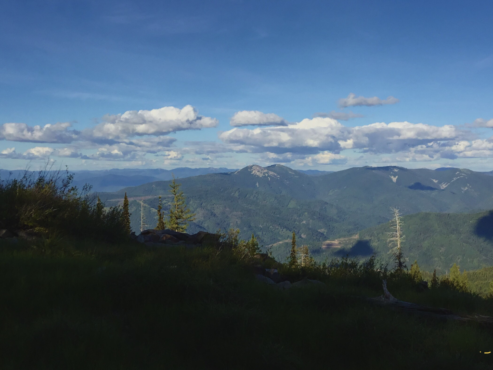
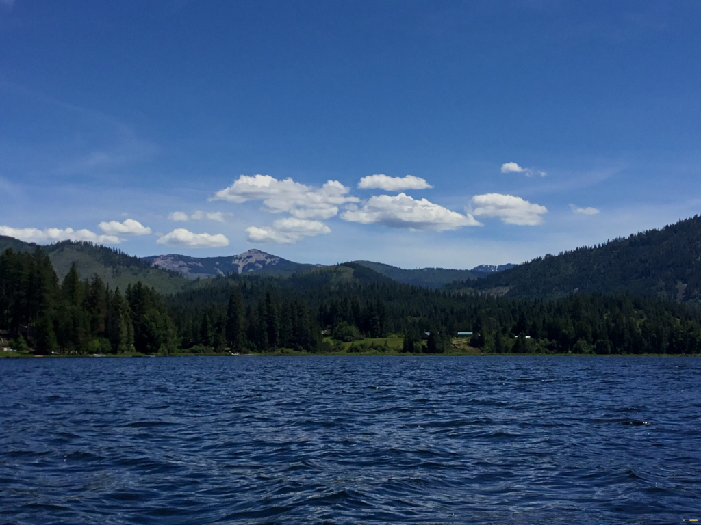

---
tags:

- Peaks & Mountains

- Moderately Easy

- Day Hike

- Backpacking

- Astronomy

- Backcountry Skiing

stats:

- label: Event Type
  icon: hiking
  value: Day Hike, backpacking, astronomy and backcountry skiing

- label: Distance
  icon: map-marker-distance
  value: 1.6 miles, to 10 miles RT.

- label: Elevation
  icon: terrain
  value: from Frosty you drop 105 verts, then gain 528 verts to Latour Baldy

- label: Difficulty
  icon: speedometer
  value: Moderately Easy

- label: Maps
  icon: map
  value: IPNF, Latour Baldy topo

- label: GPS
  icon: crosshairs-gps
  value: Frosty Peak 47°28’48" N 116°20’36" W

- label: Ranger District
  icon: pine-tree
  value: CDA River R.D. 208.769.3000

- label: Shoshone County Sheriff
  icon: shield-account
  value: CALL 911 FIRST or 208.556.1114
notes:

- Latour Baldy 47°28’12" N 116°20’49" W

- Idaho panhandle national forest/alerts

- <https://www.fs.usda.gov/alerts/ipnf/alerts-notices>
---

# Latour Frosty Peaks

*Latour baldy 6232’ & frosty peak*

## Description

We have added the areas sheriff’s emergency phone numbers for each trip write up under the ranger district info. if an emergency ocurrs, evaluate your circumstances and call only if needed.
Frost Peak used to be an old fire lookout on it’s north rim. From the concrete platform, hike due south towards Latour Baldy.
There is an ORV Trail on the right side as you leave Frosty, but it soon ends and turns into a poor trail.
On the left side, heading south, look for a trail up thru the woods and rocks.
The trail drops slightly (105’) before starting the ascent to Latour Baldy in 528’.

## Option #1

From Latour Baldy, hike the obvious ridge line south towards Latour Peak, Twin Crags, and Mirror Lake. The ridge undulates a few times, so aim for Latour Peak.
As you walk any ridge line, stay on top of the ridge where possible. Don’t allow yourself to drop off either side.
In 3.7 miles the walk is along a glacial cirque above Twin Crags and Mirror Lake.
This route out to Latour Peak is 10 miles RT, and  undulates over three lesser peak along the way.
Because there are only game trails on the ridge, expect lots of downfall, and plan on 8+ hours to do this route.

## Option #2

From Latour Peak there is a partial ORV trail, then lightly use hiking trail that in 6 miles goes to Crystal Lake.

## Directions

Drive I-90 east to Kingston, and right (south) to the Silver Valley Rd. Turn right (west) for about one block, and turn left (south). In a little over 1.5 miles the road forks. Bear right for a little over .75 of a mile and bear right again. In about 1.5 miles bear right onto F.R. #453 for about 8 miles to Frost Peak.

## Hazards

This is a multi use area.
From Frosty to Latour the route is mostly all on scree
From Latour Baldy to Twin Crags and beyond is also all on scree

## Cool things close by

Silver Mountain Resort, Stevens Peak & Lakes, Upper & Lower Glidden Lake, Graham Mountain, and the CDA River.

## R & P

Radio Brewing in Kellogg. The Snake Pit north of Kingston

## Photo gallery

---

## Latour baldy 6232’

*Picture (Image missing)*

## The descent south of latour baldy, with latour peak left center in clouds

---

*Picture (Image missing)*

## Mountain kittentale. a rare wildflower find

---

## David coming up from the "trail" to the ridge crest

---

## Latour peak 6408’ with mirror lake below

---

## The wildlife here is odd. this set of legs ran across our route

## Glacier lilies along the ridge line

## I wonder how long this tree has been alive on this windy ridge

## The breasts (aka, wardner & kellogg peaks)

## latour baldy👆       frost peak 👆  latour peak👆from rose lake

## Latour peak time-lapse looking south
