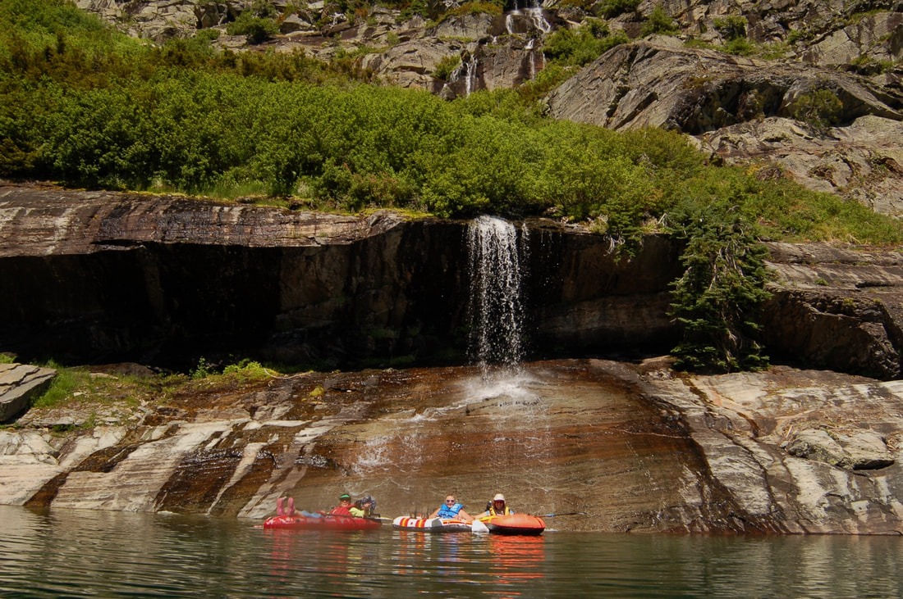
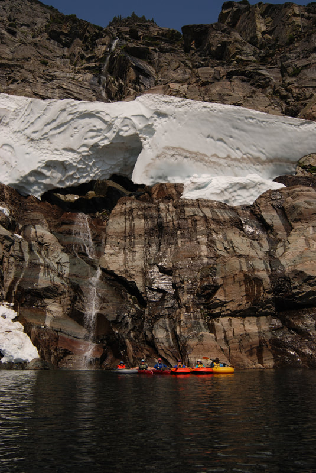
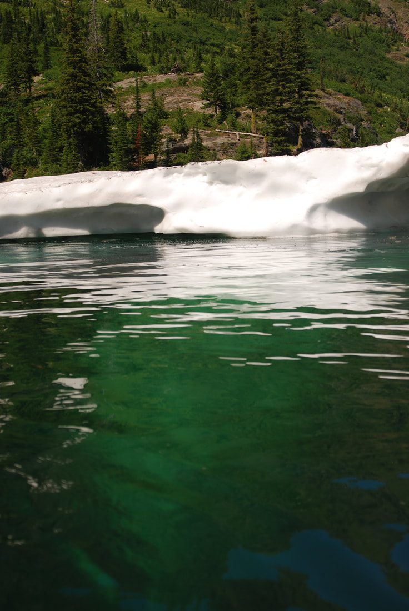
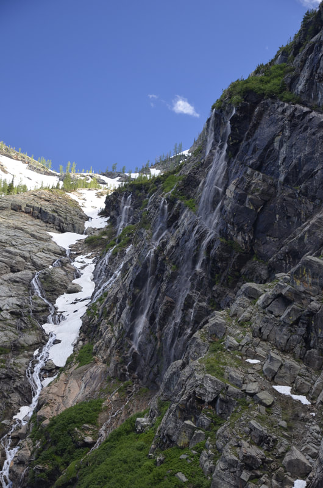

---
tags:
- Lakes
stats:
- label: Waterfall
  icon: waterfall
  value: Leigh Lake, Cabinet Mountain Wilderness, Montana
- label: Drop
  icon: arrow-collapse-down
  value: So many of all types
- label: Waterfall Type
  icon: hiking
  value: Every kind except Plunge Pool
- label: Distance Car to Falls
  icon: map-marker-distance
  value: 1.52 miles and gains 1104 verts
- label: Maps
  icon: map
  value: Kootenai National Forest, Libby Ranger District, 406.293.7773, Snowshoe Peak
    topo
- label: GPS
  icon: crosshairs-gps
  value: 48°13’27" n 115°??39’?39" w
---

# Leigh Lake Falls Upper

*Leigh lake falls upper the ultimate waterfall hike/paddle*

## Description

Leigh Lake is a gem in Montana. Its only 1.52 mile in, but it gains 1104 '. In the last 6 years, there has
been two avalanches of rock from up very high. These avalanches have necessitated a rebuild of the trail
this last early summer. As you leave the trailhead, please fill out the trail registration info. These cards
show the USFS, the use of the trails, and eventually are used to fund projects on the trails. They can also
be used in case of an over due hikers and climbers. At about .3 miles, notice a K.N.F., C.M.W. boundary sign
above you in a tree. For the first .75 miles, the trail is in the woods and climbs semi steeply until it
breaks out along side Leigh Creek. From here the views become exceptional, and the hiking is easier. The
middle section of the trail is on boulders that do not necessarily need to be scrambled. There are a few
switchbacks before you reach Leigh Creek Falls. See next waterfall subcategory. During the rebuild of the
trail, the USFS has opened the trail to the old and original campsite. I have not been there since the
rebuild, but will include the changes on this site after I visit the lake. Leigh Creek Falls is an excellent
place to shed the pack, splash real cold water on your face and enjoy the most beautiful waterfall in the
C.M.W. From Leigh Creek Falls, the trail climbs very steeply for less than 200 verts. Even tho the trail is
steep, its easily doable. I've seen 6 year old girls in flip-flops do this section without difficulty. Once
above this section, you will have incredible views and sounds of Leigh Creek Falls, below the trail. The
walk to the lake climbs a little, before it drops to the lake. In the spring, Glacier Lilies cover the area
the trail wonders thru. As you near the lake, the outlet creek is filled with weathered logs that have
fallen down from up high. A Little further, and you come to the rocks at the NE end of the lake.

The USFS and the Libby Ranger District requires no camping on this side of the lake, lower then 300' from
the lake.

## Option #1

From the first contact of the lake by the rocks, follow a user created trail on your right (N) side. In a
litle over .2 miles, is a rocky beach to visit. In the early spring, there's a creek coming down from
Bockman Peak that creates a snow cave to explore. Keep in mind, i'ts cold and wet inside.

## Option #2

On the trail to Leigh Lake is a new trail that leads you to the old campsite on the southwest side of the
lake. Beware, the USFS closed this campsite years ago because people were cutting trees for firewood, and
leaving garbage all around. Please be respectful of the land and people who come after you. And PLEASE
CARRRY OUT ALL TRASH. ALUMINUM AND GLASS DO NOT BURN. And besides, if you can carry it in full, you
certainly can carry it out empty.

## Directions

From Libby, drive south on Highway 2 towards Glacier National Park for about 8 miles to the Bear Creek Road
#278. Turn
right (west) for three miles to FR#867. Turn right (west) for about 5 miles to FR #4786. Drive up 4786 for
about 2 miles to the trailhead. Notice along this last stretch of road, that there is pull off to the left
to a very primitive campsite. If it’s occupied, you can camp at the parking area.

---

## Cool things close by

Snowshoe Peak 8738', A Peak, Granite Lake, L.& U. Geiger Lakes with Lost Buck Pass & the Cabinet Divide
Trail with views of Wanless Lake. The Proposed Scotchman Peaks Wilderness, the Bull River and Lake, and the
Clark Fork River.

## Hazards

All waterfalls are a hazard, due to their slippery nature. always be extra careful near any waterfall.
Please keep a close eye on your children when climbing the vertical section above the Leigh Creek Falls.

## R & P

Henry's Restaurant, The Shed in Libby.

---

## Plan your trip

Click for Current NOAA Weather Conditions

## Photo gallery

*Picture (Image missing)*

## After climbing the steep section, mountain goats come out to greet you

*Picture (Image missing)*

## As you walk out to the in the early spring, glacier lilies are all around

## This is the first big falls along the north shoreline

*Picture (Image missing)*

## The paddling crew poses below a snow terminus with a 1,000' cascade

*Picture (Image missing)*

## Although this cascade is only 600' tall, it is spectacular to paddle by

## A snow terminus, towers above paddlers. the center ridge line above is over 1500'

*Picture (Image missing)*

Icebergs float on leigh lake. all the vertical groves in the background, have cascades in early spring

*Picture (Image missing)*

## A single cascade above the snow terminus is left in mid summer

*Picture (Image missing)*

## Along the west wall, is a 600' cascade folding many waterfalls

*Picture (Image missing)*

## Snow levels are about 30+ feet pre year. jane poses for an image before the terminus

They say, the majority of a berg is below the berg this berg's lower section shows 60' below the surface

*Picture (Image missing)*

## Each snow terminus or snow field up high produces gigantic amounts of snow Photo by deb pierce

## Along the west wall dozens of falls drop to the lake

*Picture (Image missing)*

in the dead of winter, snow accumulates to a depth of well over 30' This snow fuels the waterfalls all
around

the lake,

up high and on trail #132
