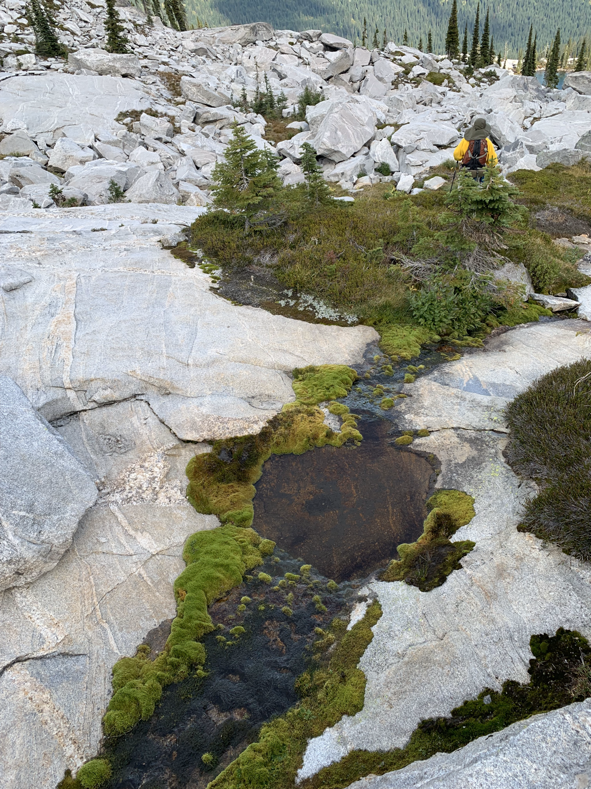
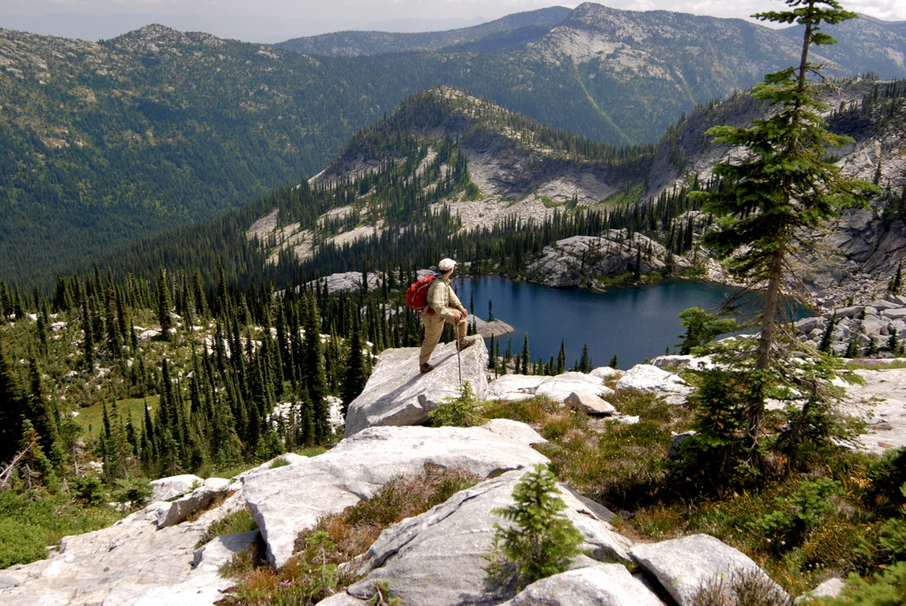
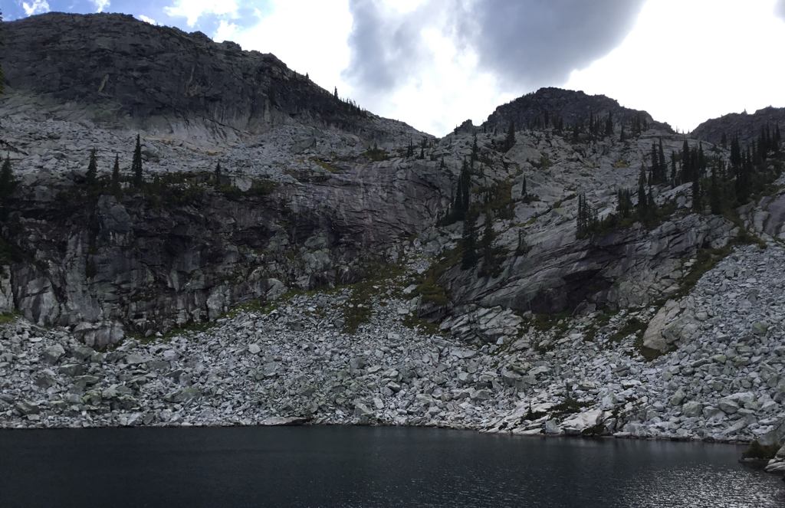
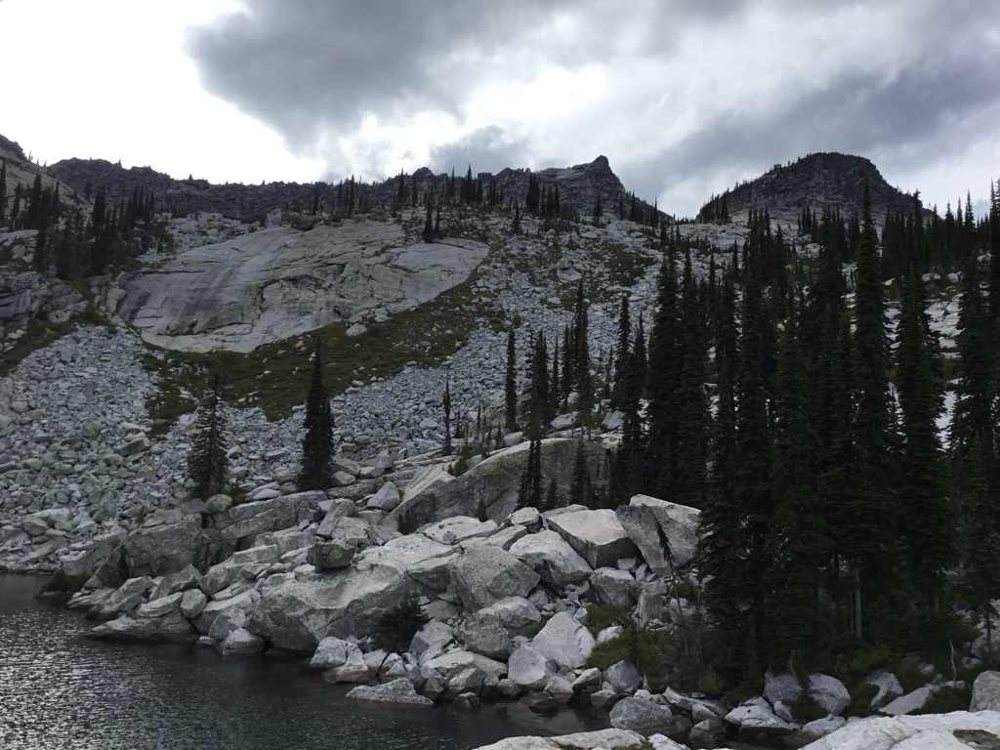
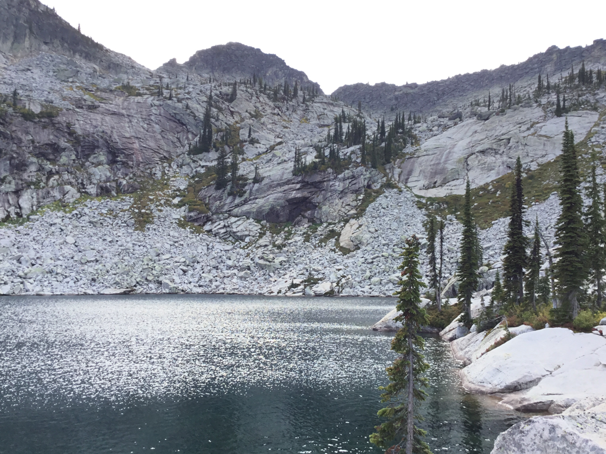
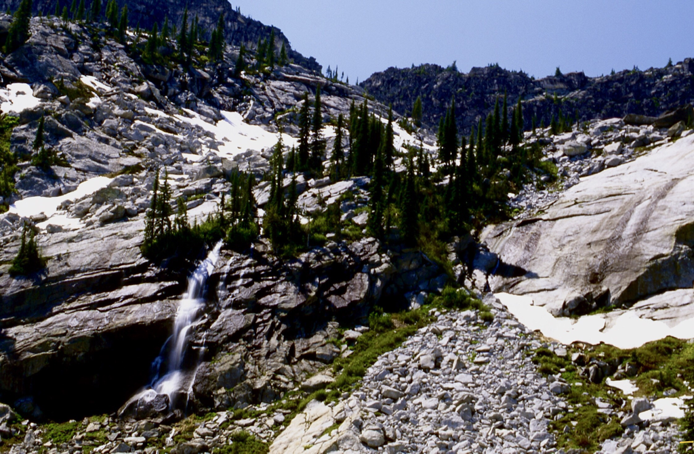
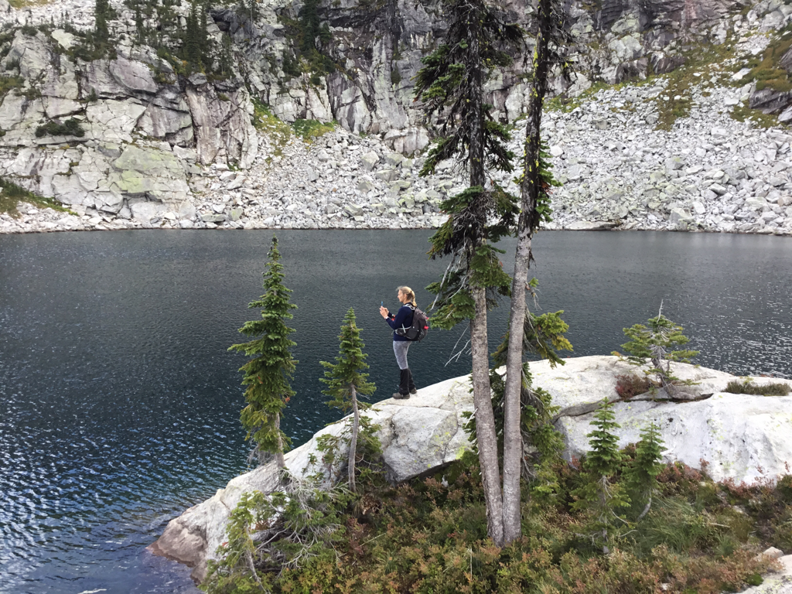
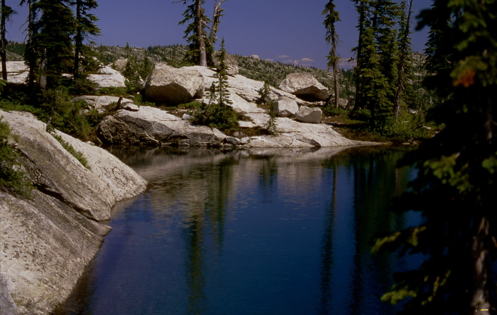
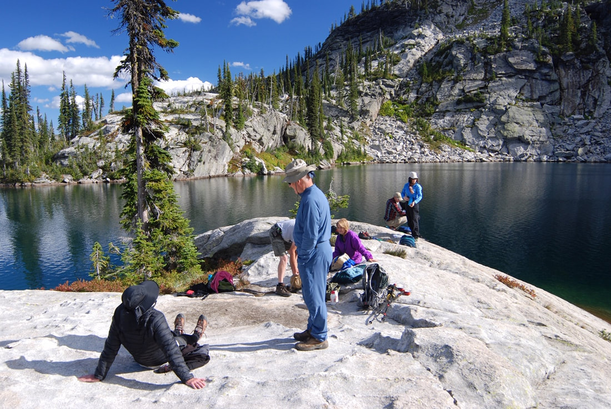

---
tags:
  - Lakes
  - Hiking
  - Backpacking
  - Scrambling
stats:
  - label: Event Type
    icon: hiking
    value: Hiking, backpacking & scrambling
  - label: Distance
    icon: map-marker-distance
    value: About 9.2 miles RT
  - label: Elevation Gain
    icon: elevation-rise
    value: To Beehive L 2041’ + 264’ to ridge between. Drop 475’ to L.H.L.
  - label: Acres
    icon: vector-square
    value: '2.6'
  - label: Difficulty
    icon: speedometer
    value: Moderate to Beehive Lake, Difficult to Little Harrison Lake
  - label: Maps
    icon: map
    value: IPNF-Kaniksu N.F., The Wigwams
  - label: GPS
    icon: crosshairs-gps
    value: 48°39’41"n 116°39’18"w
  - label: Ranger District
    icon: pine-tree
    value: Sandpoint R.D. 208.263.5111
  - label: Bonner County Sheriff
    icon: shield-account
    value: 911 or 208.263.8417
notes:
  - label: "Idaho Panhandle National Forest Alerts"
    url: "https://www.fs.usda.gov/alerts/ipnf/alerts-notices"
---

# Little Harrison Lake (6,271') & Peak 7292

## Description

We have added the area's sheriff emergency phone numbers for each trip write-up under the ranger district info. If an emergency occurs, evaluate your circumstances and call only if needed.

### South Route

To get to Little Harrison Lake, you must first hike to Beehive Lake on Trail #279 for 4.5 miles. Take a moment to enjoy Beehive Lake before climbing the ridge to the right (N). There is a faint trail on the NE end of the lake that heads north up and over the ridge. Carefully descend the ridge to the right (east) end of Little Harrison Lake.

There is a trail around the lake to the flat granite slabs. Above the lake is a nice waterfall that feeds the lake and offers great sound effects in the spring. Above the falls is the location of a plane crash that 4 people walked away from. The background to the west is the famous American Selkirk Crest and most of the Seven Sisters, including the Twins. To the north is a high meadow that leads to Harrison Lake and Peak. Retrace your steps back up the ridge and over to Beehive Lake and trail.

### North Route

From Harrison Lake, scramble the back wall to the crest, and turn left (south). Peak 7171' is the first peak along the crest. Continue south on the Selkirk Crest for up to 4 summits. The fourth summit is impossible to descend without ropes, so come back to a saddle and work your way down to the high meadows. Spend some time in the meadows as you walk over to Little Harrison Lake. It's a magical meadow.

Once at the lake, spend some time before scrambling the ridge to Beehive Lake, or retrace your steps back to Harrison Lake. If you choose to go over the ridge to Beehive Lake, it's 4.5 miles to the trailhead, and about a mile to the Harrison Lake trailhead.

## Directions

From Sandpoint drive north on US-95 to Samuel. Turn left (west) onto Pack River Road #231 for 19 miles to Beehive Lake trailhead, or 20 miles to the Harrison Lake trailhead.

## Hazards

- **South Route:** From Beehive Lake the scrambling is serious but doable.
- **North Route:** From Harrison Lake the scramble up to the Crest and over to Little Harrison Lake requires care and endurance.

This traverse will become a lifetime memory.

## Cool Things Close By

Fault Lake, Kootenai National Wildlife Refuge, Purcell Trench, Sandpoint, and Lake Pend Oreille.

## Restaurants & Pubs

Jalapeños, Mr. Sub, Eichardt’s in Sandpoint.

## Photo Gallery

_An island of green amongst the grey of Selkirk granite_

_Super trail hero Rich Landers posing above Little Harrison Lake_

_The descent route, top right to bottom middle_

_The west, or back shoreline of Little Harrison Lake_

_The North Twin and Little Harrison Lake north shoreline_

_A spring waterfall above Little Harrison Lake_

_Amy taking an image of Little Harrison Lake_

_The S.E. shore of Little Harrison Lake_

_The North East shoreline of Little Harrison Lake_

!!! quote "Route Finding Wisdom"
    Good route finding comes from experience. Experience comes from bad route finding. — Chic, 2012
