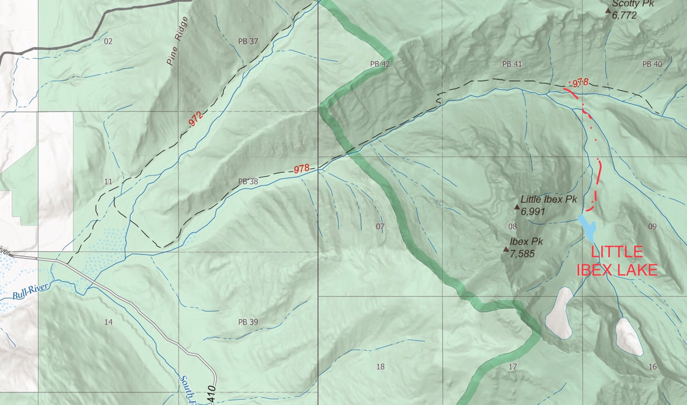
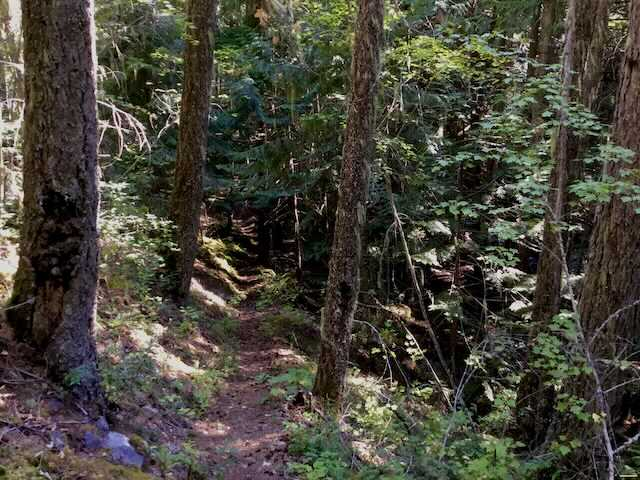
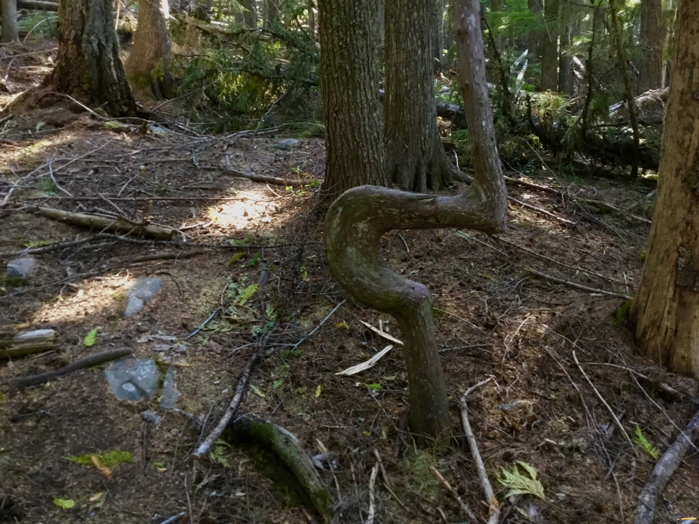
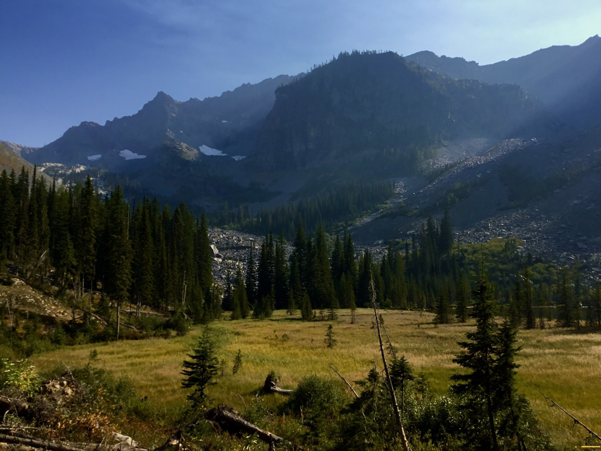
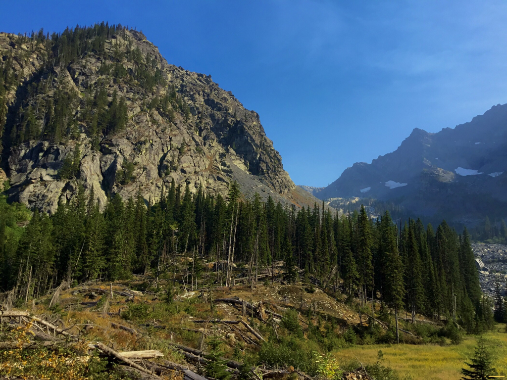
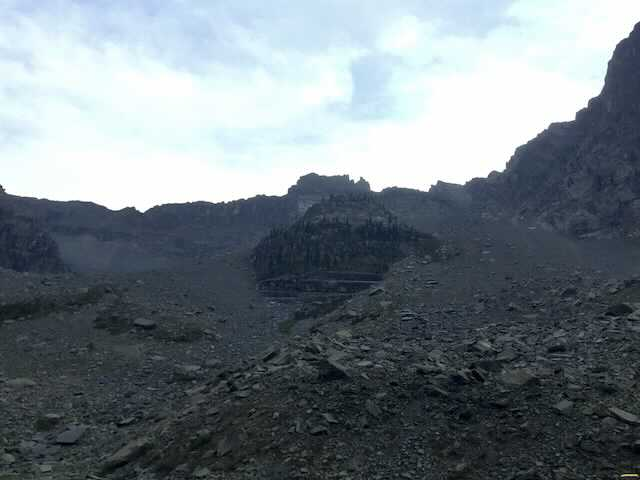
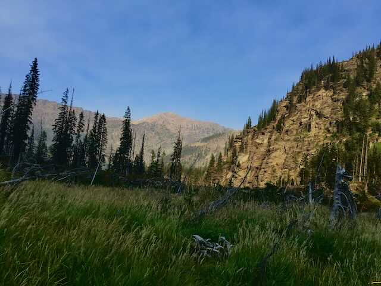
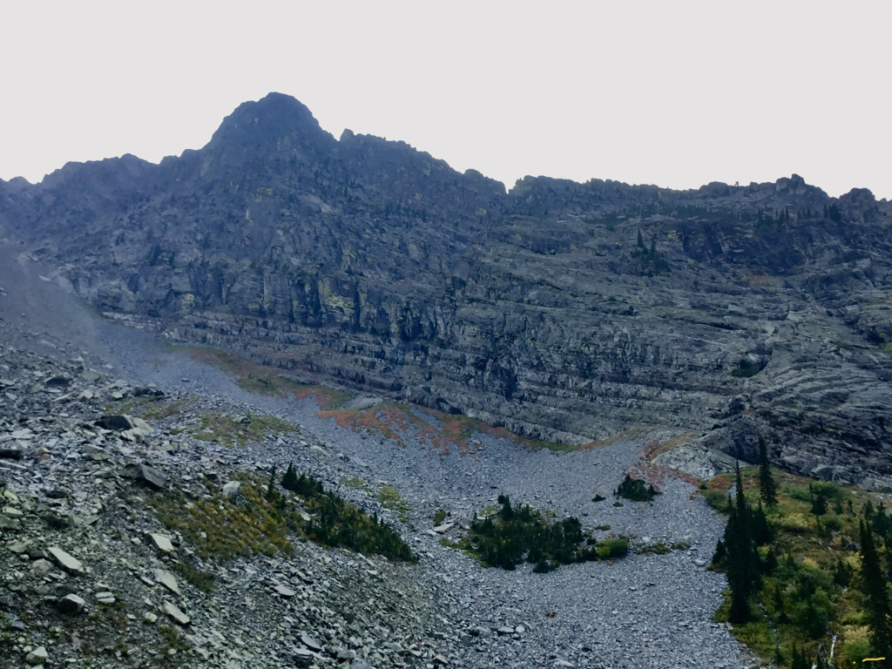
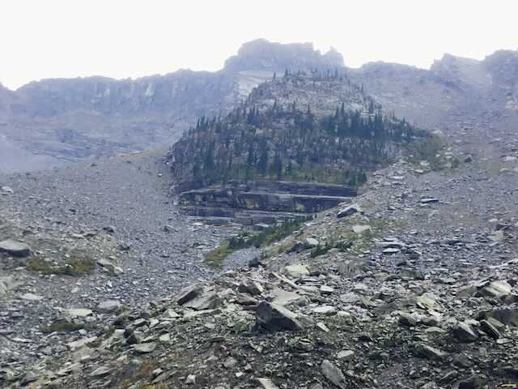

---
tags:

- Lakes

- Strenous

- Day Hiking

- Backpacking

- Scrambling

- Climbing

stats:

- label: Event Type
  icon: hiking
  value: Day hiking, backpacking, scrambling & climbing

- label: Distance
  icon: map-marker-distance
  value: 11.4 miles RT

- label: Elevation Gain
  icon: elevation-rise
  value: 2982’ verts

- label: Difficulty
  icon: speedometer
  value: Strenous

- label: Maps
  icon: map
  value: Kootenai N.F., Ibex Peak & Snowshoe Peaktopo

- label: GPS
  icon: crosshairs-gps
  value: 48°12’02" n 115°44’29" w

- label: Libby Ranger District
  icon: pine-tree
  value: 406.293.7333

- label: Lincoln County Sheriff
  icon: shield-account
  value: CALL 911 FIRST or 406.293.4112
notes:

- Kootenai national forest/alerts<https://www.fs.usda.gov/alerts/kootenai/alerts-notices>
---

# Little Ibex Lake

*Little ibex lake, trails # 978 & 980*

## Description

We have added the areas sheriff’s emergency phone numbers for each trip write up under the ranger district info. if an emergency ocurrs, evaluate your circumstances and call only if needed.
Before I describe the hike to Little Ibex Lake, let me tell you about the whereabouts of the Trailhead. A bunch of years ago, the Middle Fork of the Bull River washed out Forest Road #2272 (FR #2272) that originally led to Little Ibex Lake’s parking area. Now, the trailhead is the same as Trail #980. Look for an unmarked trail about 30’ from the bridge, opposite from the parking area. This trailhead is about 3 miles from Hwy 56, and just past the bridge over the Middle Fork Bull River, Where there is a small parking area for about 4-5 cars.

This hike starts out heading up Trail #972 that eventually leads to Snowshoe Lake. In a short distance, Trail #978 turns right and starts it’s relentless climb along side of Middle Fork Bull River. Look for a brown trail stake with hard to read numbers. At about 4 miles, look for a cairn and Trail #978 that drops down steeply to the Middle Fork Bull River.

From this junction to Little Ibex Lake is about 1 miles. But be aware, this 1 miles is under the big skies of Montana. As a crow flies, it really is about a miles, but since the trail is user made, it will feel like way more. At the junction you will have climbed 1509 verts, leaving 1473 verts to the lake.
A word of caution here is needed. Trail #978 has not been maintained by the USFS for many years. Hence, the downfall of trees and logs is nearly overwhelming. Just go slow and be extra careful stepping over the downfall.

Soon you will be walking out to Little Ibex Lake. Walk down to the shore line in the late summer and fall, to have lunch with a view. I would imagine the grassy meadows to the lake, will be under water any earlier.
One consolation about heading down the trail out, is its easier walking over the downfall. Just be absolutely sure you are back on Trail #978 by dark. Above is simply too dangerous, even by headlight.

Getting back to Little Ibex Lake...the views of the mountains circling the lake are very unique. Ibex Peak is a massive collection of up turned sedimentary rock. A bit further SE is a mass of rock that with a little imagination, could look like an evil dictators high mountain fortress, in a James Bond movie. To the west is Snowshoe Peak. To the north as you walk the trail down, Scotty Peak dominates the far side of the canyon.
There are three major creek crossings in the spring and early summer that you will have to surmount. Water sandals and hiking poles will be wise to have.

## Option #1

There is a climbers trail to Ibex Peak, but I haven’t been up it in over 40 years.

## Directions

On Hwy 56, look for milepost 16. Turn right (east) up the South Fork Bull River Road #410 for about 3 miles, where the road crosses the Middle Fork Bull River. The parking area is the same as for Trails #972, 978 & 980, just past the bridge. On the opposite side of the parking area, is the trail, about 30’~ from the bridge

## Hazards

This hike is a true backcountry adventure, please use caution on all aspects of this hike, especially up Trail #980 to the lake.

Trail #980 has what felt like hundreds of downfall to climb over. And it’s steep.

## Cool things close by

A Peak, Snowshoe Peak, Vimy Ridge, Bull River, Snowshoe Lake, Ibex Peak , Ross Creek Cedars, and the Proposed Scotchman Peaks Wilderness.

## R & p

Henry’s, Pizza Hut, The Shed, and Rosaeurs in Libby, Clark Fork Pantry & Squeeze Inn in Clark Fork. Eicharts, Mr Sub, Burger Express,  & Jalapeños in Sandpoint

## Photo gallery

Because there isn’t a marked trail from 978 to l. ibex l., i roughly marked the route in yellow dots on this map only

---

## On the trail to little ibex lake

---

*Picture (Image missing)*

At about 4 miles in, you will come to this trail junction. turn right, down hill to the middle fork bull river

---

As you come to the middle fork bull river, look for surveyor tape across the river, showing your way up to little ibex lake. along the way. this tree caught our interest

---

## Once up thru the downfall, the trail breaks out with the view above

---

## An unnamed mountain next to the little ibex lake

---

As we walked out to the lake thru the meadows, i noticed something familiar about the rocks. can you spot a rock formation similar to one in the american selkirks? see answer at the end of this write up

*Picture (Image missing)*

## One of the views from our lunch spot

*Picture (Image missing)*

## As we ate lunch, i noticed the two different types of rock that makes up this mountain

## Snowshoe peak 8738’, is off to the ne

What i notced about this area, was the very unusual rocks and rock formations. can you spot the day hiker in this image

When i first saw this rock structure, i had imagined it being a camouflage fortress in a james bond movie

*Picture (Image missing)*

## This is ibex peak from a peak, c.m.w. image by chris h

The answer to the questions above is... A mini chimney rock and mount roothaan, with its se ridge

The second questions answer is... Expand your screen along the high ridge to the right in image #10
