---
tags:
- Lakes
- Moderately Difficult
- Hiking
- Backpacking
- Fishing
- Backcountry Skiing
stats:
- label: Event Type
  icon: hiking
  value: Hiking, backpacking, fishing, backcountry skiing and the awe inspiring "Upper
    Sanctuary."
- label: Distance
  icon: map-marker-distance
  value: Lone Lake 4 miles RT, Upper Sanctuary about 6+ miles RT
- label: Elevation
  icon: terrain
  value: Lone Lake 1637 gain. Upper Sanctuary About another 250' gain
- label: Acres
  icon: vector-square
  value: '15.2'
- label: Difficulty
  icon: speedometer
  value: Moderately difficult
- label: Maps
  icon: map
  value: IPNF, LOLO N.F. Mullan topo
- label: GPS
  icon: crosshairs-gps
  value: 47°43’38" n -115°77’44" w
- label: Ranger District
  icon: pine-tree
  value: CDA River R.D. 208.769.3000
- label: Shoshone County Sheriff
  icon: shield-account
  value: CALL 911 FIRST or 208.556.1114
notes:
- Idaho panhandle national forest/alerts
- <https://www.fs.usda.gov/alerts/ipnf/alerts-notices>
---

# Lone Long Lake Lakes

## Description

We have added the areas sheriff’s emergency phone numbers for each trip write up under the ranger district info. if an emergency ocurrs, evaluate your circumstances and call only if needed.
The Trail is located on the west (right) side of Willow Creek near two huge boulder the size of a delivery truck. Head south (up hill) on the old mining road for about .4 of a mile to a wide spot by a hard right turn up hill. Look for a sign on a tree to the south as the trail heads up hill (south) along the creek. It's a decommissioned logging road bed that has been trampled down by years of hikers. Keep in mind that the road/trail runs due south and steps off the road near a gigantic fallen tree section on the right. As you climb the open area, notice another trail sign at the start of the woods, high in a tree on the left (SE).. The trail skirts West Fork Willow Creek up thru a dense forest until it breaks out into an open area. In front of you is the headwall below Lone Lake. In about .3 of a mile, the trail heads right near a waterfall. It switchbacks a few times, crossing small intermittent creeks. At one switchback, the views of the valley you are ascending, offers great views and photo ops. Notice the 500' cascading waterfall from the base of the lake. Continue along a straight section of the trail, and it will enter the woods for about .3 of a mile until, all of a sudden the lake lies below you with the massive Stevens Peak towering above. There are two camp sites, one on each side of the creek. Along the west shore are two more primitive camp sites, but not in the spring.
Notice the small waterfall in the back right of the Lone Lake.

## Option #1

From Lone Lake, hike to your right (west) around the lake. In the spring this area is swampy and wet. Look for a "trail" that skirts the shore line that eventually comes back to the lake. There are two rocky sections that you must overcome here but they are doable.

After hiking up to the sanctuary on 11.21.21, i would like to revise the route above the waterfall.
On the left (E) of the falls, you will notice a well worn trail heading up into the woods. Once you are above the falls, turn right onto a lesser used path.
This path will take you over to the stream. Even tho this path can be wet, its much easier to follow and hike, then the other way.
This path braids a bit, but eventually leads you to the north end of Long Lake. ( on current maps, its not named)
When you head back down from the Sanctuary, walk the Long Lake's shoreline to its north end. The path follows the stream back to the waterfall.
This route may not be as easy in the early spring, due to high water flow.

Once at the waterfall, cross over the stream and look for a faint trail that head south up thru the woods. As it breaks out of the woods, wonder along the upper "Long Lake" and head up to one of the two humps into what I call the "Upper Sanctuary" in about .5 of a mile. The hump on the right (west) has the best views and a spot for lunch. Before you, looking left (east), is the Willow Peak and Ridge.
To the south and SE is the back ridge with 6838' Stevens Peak dominating your view.
In the SANCTUARY to your left (east) is the ridge between Lone Lake and Stevens Lakes, called Willow Ridge. Look carefully for a large rock band running diagonally from the bottom right to the top left. This rock band ends up high near a dominate  Willow Peak 6449’. The "climbers trail' heads up just under this rock band to the ridge.

## Hazards

As you round Lone Lake, and get near the waterfall, the path is steep over a rocky area. Use caution going down this 15' slope. Use the trees on your right to hand belay yourself down. Going up is easy on your return.
From the lake to the Upper Sanctuary, the trail is faint and rugged.

## Directions

Drive east on I-90 to exit #69, and turn left (north) over the freeway to the stop. Turn right (east) past Lucky Friday Mine on SH 10 for about .75 miles and bear right at the "Y" until the road crosses over the freeway. Continue up Willow Creek Road for about a mile to the trailhead.

You can park at the area parking lot, or drive the road by the large boulder up about a half a mile to where, by an opening, the road takes a sharp right turn. Park here. DO NOT DRIVE OR WALK UP THE DOMINANT ROAD.
You will see a trail sign in a tree due south. Not up the sharp turn.

## Hazards

The trail below the headwall is very rocky and slick when wet. From the lake to the Upper Sanctuary,  the trail is faint, rugged and braided.

## Cool things close by

Upper & Lower Stevens Lakes, Stevens Peak, St. Regis Lakes, Boulder Creek, Shoshone Park, historic Mullan, Silver Mountain, historic Pulaski Tunnel Trail, Trail of the CDA’S, and the Route of the Hiawatha.

## R & P

Pizza Factory, 1313 Club, Brooks Hotel & Restaurant, City Limits Brew Pub, Fainting Goat, Smoke House BBQ & Saloon,Wallace Brewing Co., and Muchacho’s Tacos in Wallace. Radio Brewing in Kellogg, the Snake Pit north of Kingston, and Moon Time in CDA.

*Picture (Image missing)*

## Photo gallery

*Picture (Image missing)*

## The lone lake drainage from the glidden lakes ridge

I tried a new technic and below are the results. by doing this, i can take time to examine the lay of the land in more detail

*Picture (Image missing)*

*Picture (Image missing)*

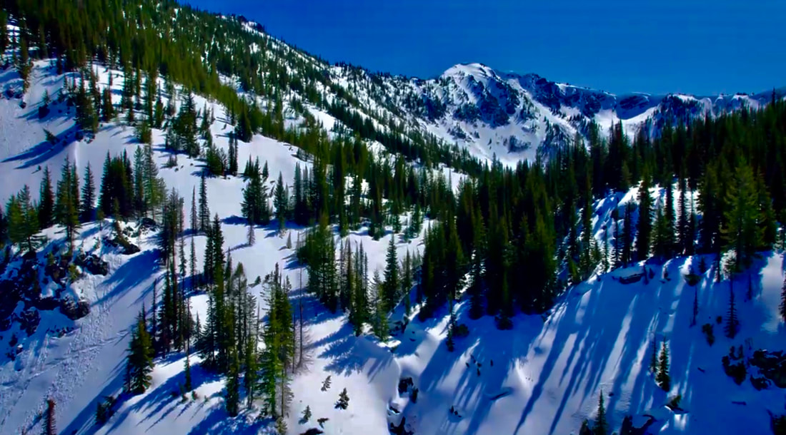

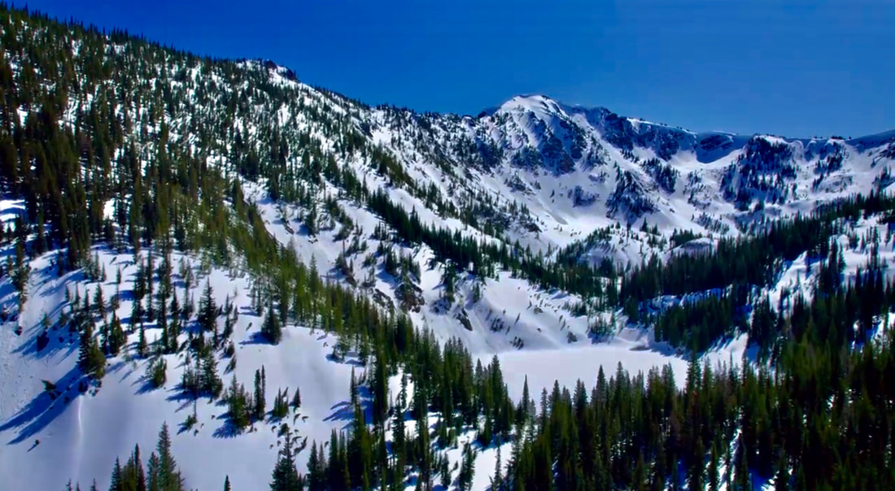

*Picture (Image missing)*

*Picture (Image missing)*

## The nw face of stevens peak above lone lake

---

*Picture (Image missing)*

## West fork willow creek waterfalls

---

## These three cascades are from the 500+’ west fork willow creek cascading waterfall

*Picture (Image missing)*

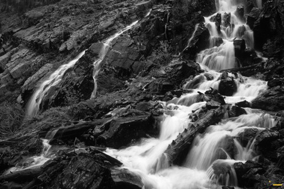

---

---

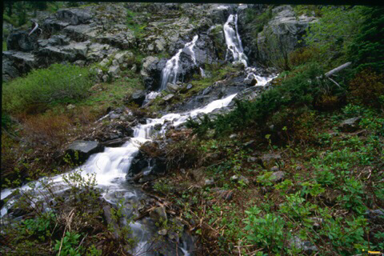

---

## The below 5 images are from the spokane mountaineers fall 2019 trail work party and clean up

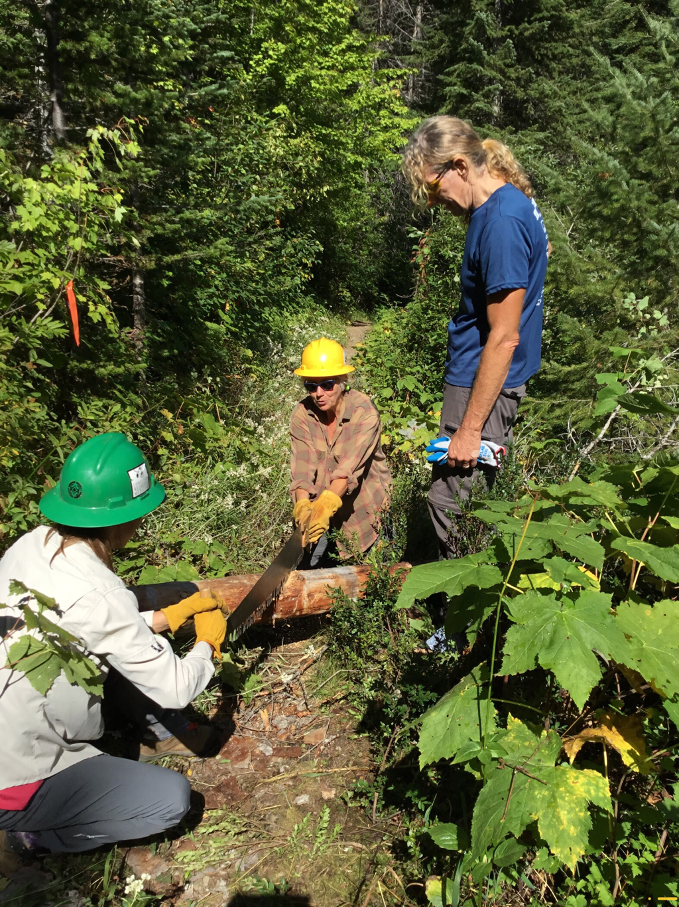

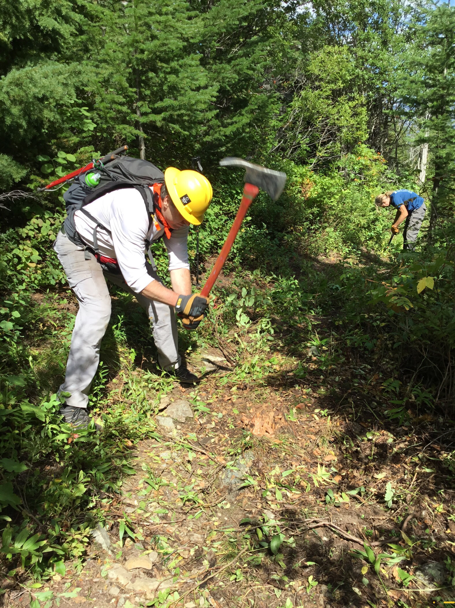

## Chopping out a stump in the trail

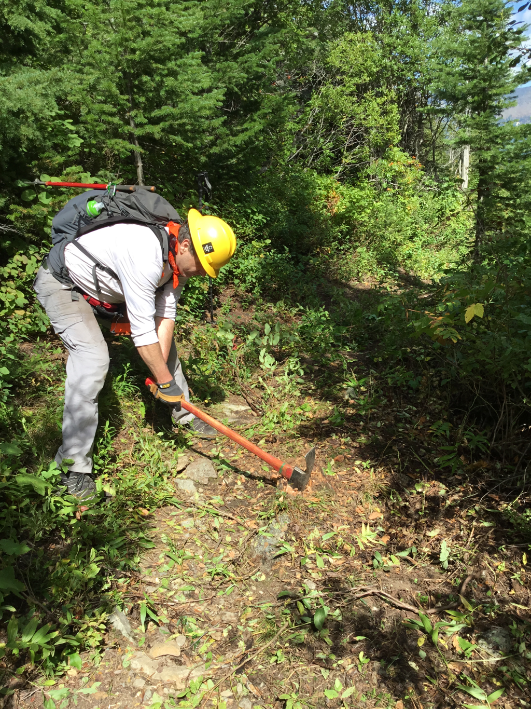

## Chopping out a stump along the lone lake trail

---

*Picture (Image missing)*

## Fall colors on the trail to lone lake are some of the best

*Picture (Image missing)*

## An intermittent waterfall on the trail above the middle valley

*Picture (Image missing)*

## The smi 2019 trail crew with lone lake & stevens peak in background

---

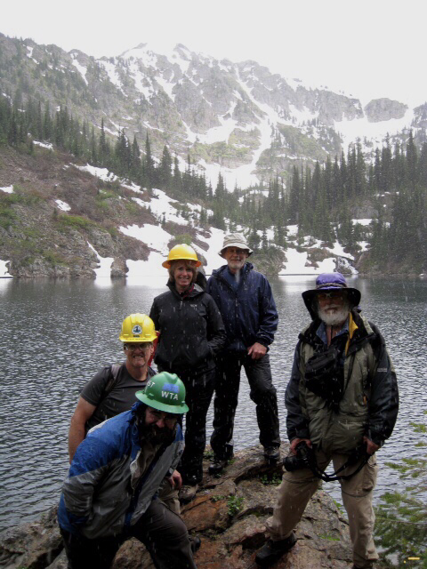

## The smi 2018 fall trails crew

---

*Picture (Image missing)*

## Super trail hero/boss lynn smith after a successful clean up

---

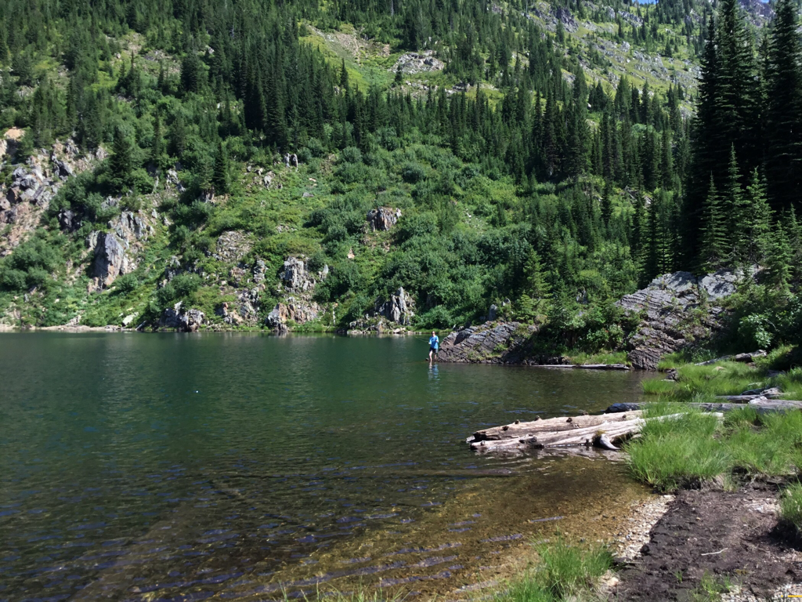

## A hiker fly fishing on lone lake

---

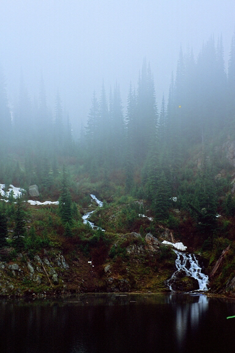

## Hiking in the fog, often produces great images

---

*Picture (Image missing)*

## Late fall freeze below the waterfalls

---

## Below are images from what i call "the upper sanctuary"

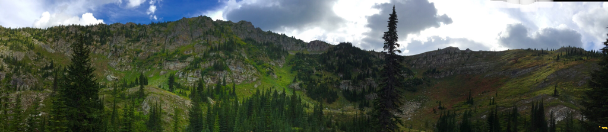

## A pano from the upper sanctuary

---

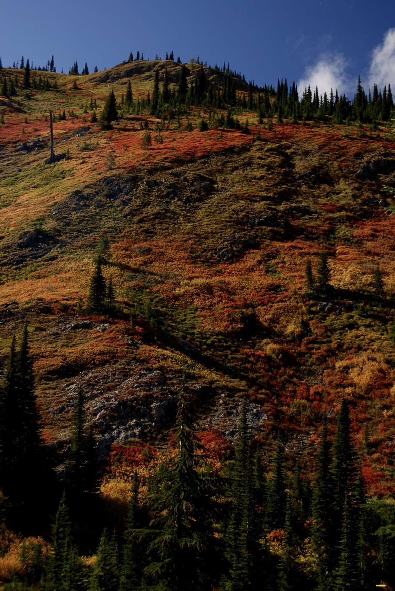

## fall 2019 in the sanctuary

---

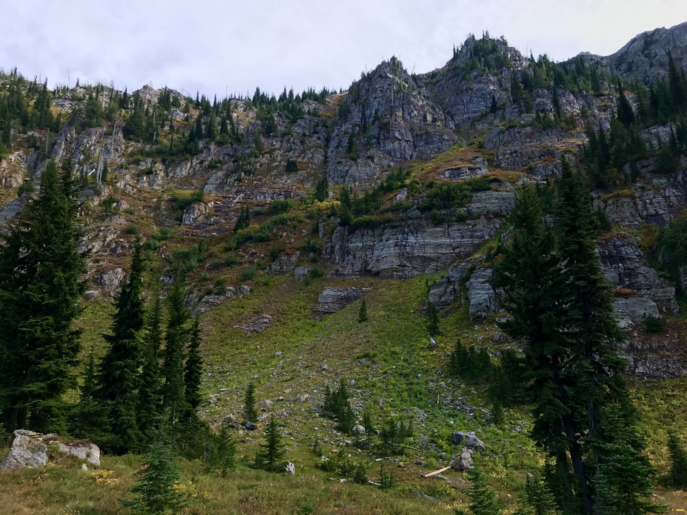

## The ridge line north of stevens peak, called willow ridge

---

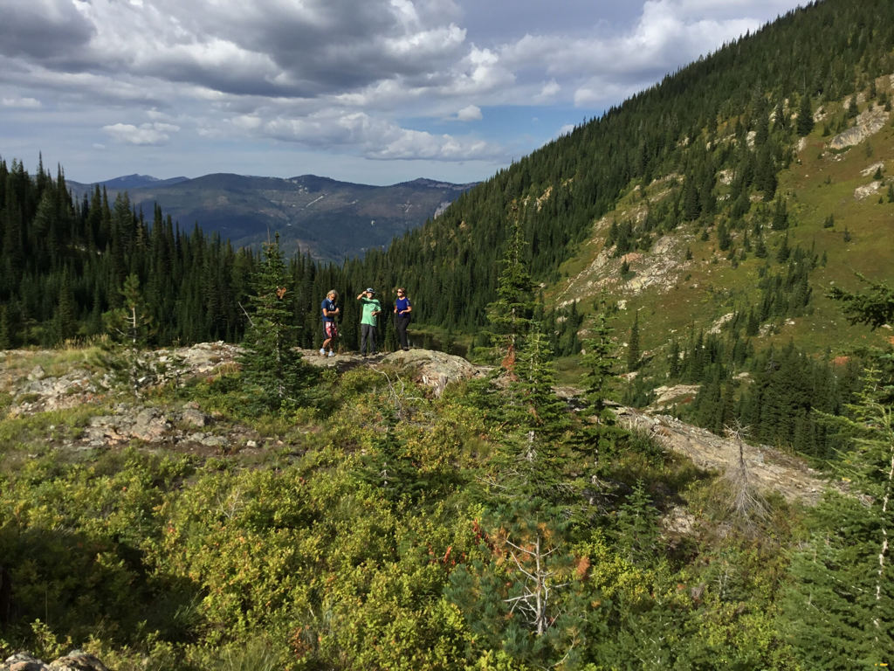

## Super trail hero/boss, lynn smith  points out features on the nw face of stevens peak

---

*Picture (Image missing)*

## High winds above the east wall ( willow ridge),of the upper sanctuary

---

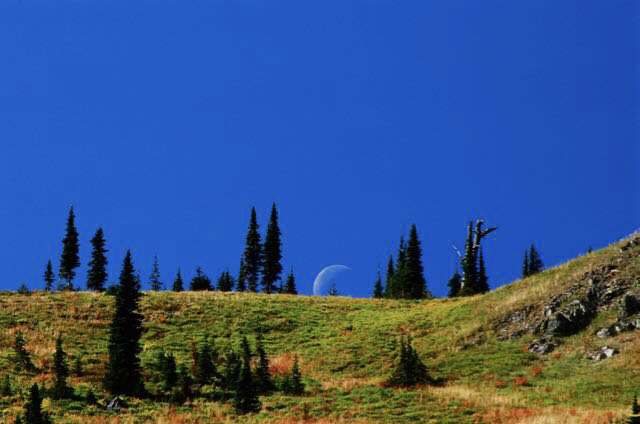

## A waxing moon from the sanctuary

---

*Picture (Image missing)*

## Unusual folded rocks east of "long lake"

*Picture (Image missing)*

## Newly weds at lone lake on 11.1.2020

There is a sound in Nature, that draws even the tiredest  of us all. It’s the roar of the forest’s streams, and winds, and Nature, herself. All those sounds are calling each of us, to put on our backs and enjoy Natures sounds.    chic        1.30.2025
