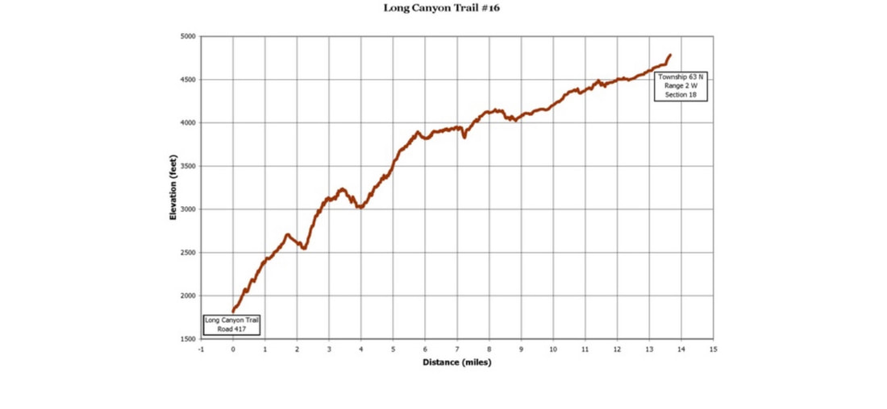
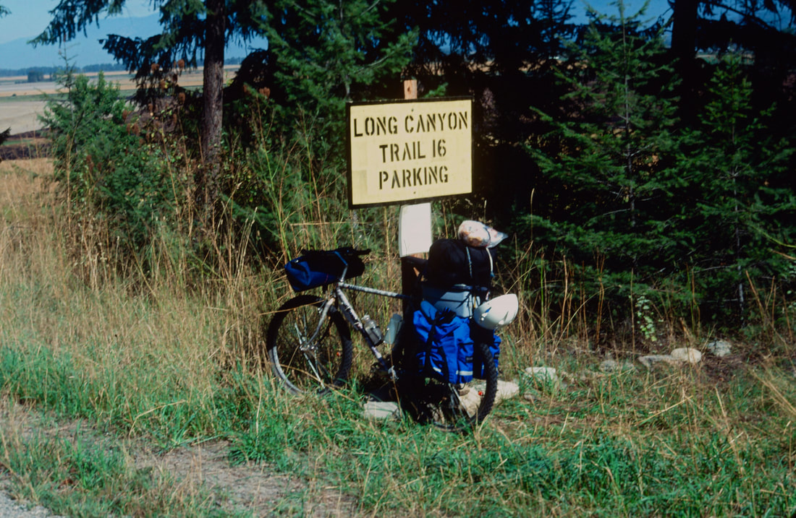

---
tags:
- Trails & Scrambles
- Difficult+
- Hike
- Backpack
- Mountain Bike
stats:
- label: Event Type
  icon: hiking
  value: Hike, Backpack and Mountain Bike
- label: Distance
  icon: map-marker-distance
  value: 19 miles one way (seems like A LOT MORE). (Pyramid Pass 2.7 miles and 1300
    vents
- label: Elevation
  icon: terrain
  value: 4750'+ gain or loss
- label: Difficulty
  icon: speedometer
  value: Difficult+
- label: Maps
  icon: map
  value: 'IPNF-Kaniksu N. F., USGS: Smith Peak, Pyramid Peak, Shorty Peak'
- label: GPS
  icon: crosshairs-gps
  value: n48° 57’ 20.7" w116° 32’ 43.3"
- label: Ranger District
  icon: pine-tree
  value: Bonners Ferry R.D. 2-8.267.5561
- label: Boundary County Sheriff
  icon: shield-account
  value: CALL 911 FIRST or 208.267.3151
notes:
- Idaho panhandle national forest/alerts
- <https://www.fs.usda.gov/alerts/ipnf/alerts-notices>
---

# Long Canyon Trail 16

## Description

We have added the areas sheriff’s emergency phone numbers for each trip write up under the ranger district info. if an emergency ocurrs, evaluate your circumstances and call only if needed.
***North East Route***
The trail starts at the West Side Road just east of Smith Creek Road. The climb up Long Canyon is arduous and crosses Long Canyon Creek several times. Because of elevation changes, the trees and vegetation vary widely all along the route. At about 9 miles Canyon Lake sits high on the west bank. Unfortunately there isn't a trial to the lake. At about 11 miles you will be in a Cedar Forest for some time. From the junction with Trail #7 there are 52 switchbacks to Pyramid Pass. The Pyramid Trailhead is about 3.25 miles below the pass.

***South Route***
From the Pyramid-Ball Lakes trailhead, head up Trail #13 for 1/2 a mile and bear right (north) onto Trail #7 to another junction 3/4 of a mile and turn left (west) still on Trail #7 for about 2 miles to Pyramid Pass. Stop here for a snack, then head steeply down hill.

***Mountain Biking***
Start at the Pyramid-Ball Lakes trailhead and ride/push/carry your bike to Pyramid Pass.

Have a snack here, because there are 52 switchbacks to tackle before the trail "levels" out.

## Directions

***North East Route***
Drive past Bonners Ferry for 15 miles on 95 to the junction with SH #1. Turn left (west) on SH #1 thru Copeland and cross the Kootenai River. Turn right (NW) onto West Side Road and drive about 4 miles to the Canyon Creek Trail #16.

***South Route***
From the Kootenai National Wildlife Refuge, drive about 10 miles to FR #634 Trout Creek. Follow Trout Creek west for 9 miles to the trailhead.

## Hazards

Long hard ups below Pyramid Pass, and then a long hard up above the pass. There are few water sources on Parker Ridge, so pack all the water you will need.

---

## Cool things close by

Pyramid Peak & Lake, Parker Ridge, Long Mountain Lake & Peak, Kootenai National Wildlife Refuge, the Purcell Trench, and Bonners Ferry.

## R & P

Jalapeños, Mr. Sub, Burger Express, Eicharts in Sandpoint

## Photo gallery

---

## Mountain biking the long canyon trail can be a long ordeal

## No images at this time. if you’de like to contribute, contact chic

## Wisdom s the knowledge, we find in hindsight.         chic   2012
