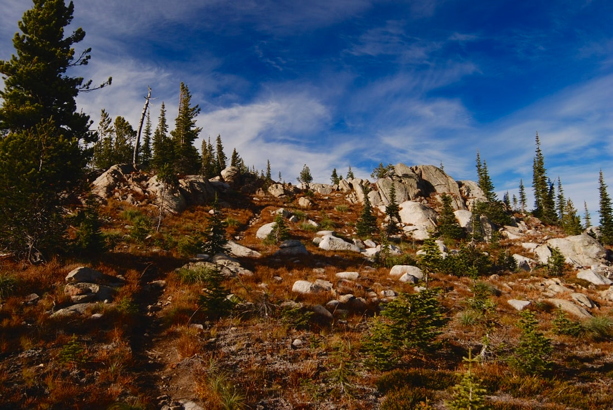
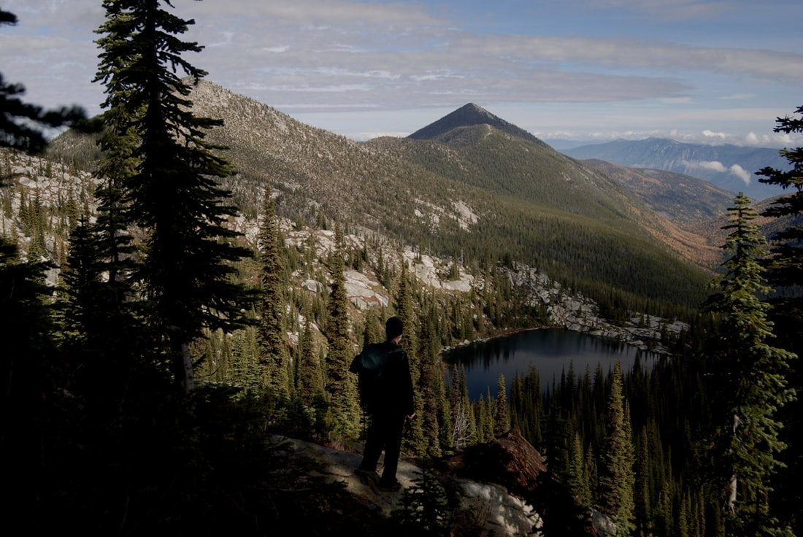
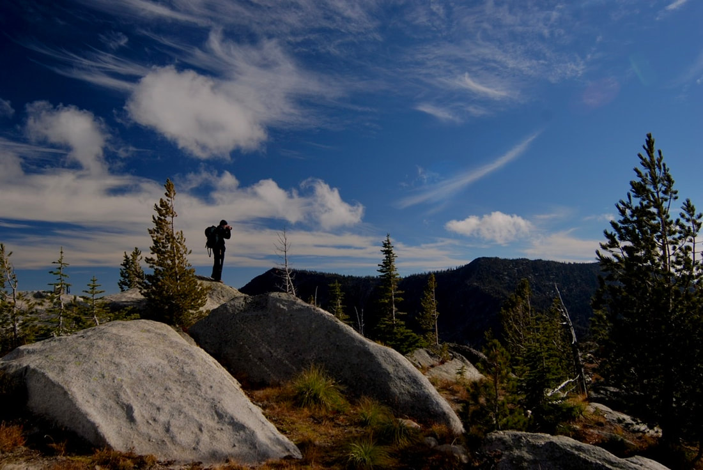
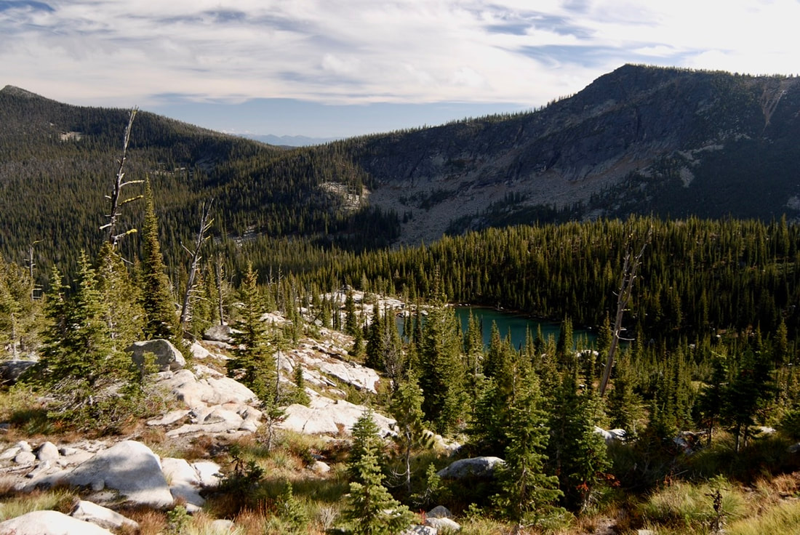
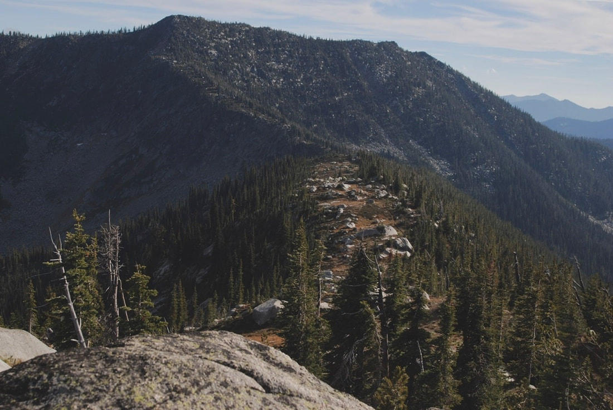
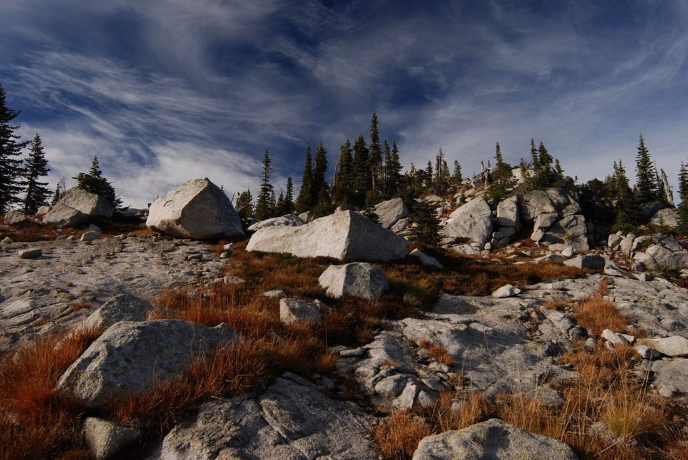
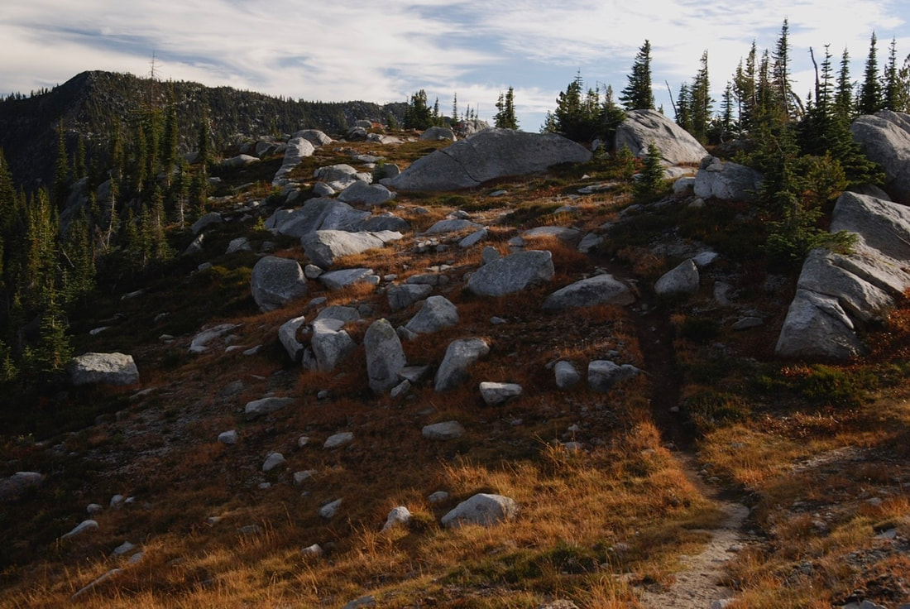

---
tags:
- Lakes
- Moderate
- Day Hiking
- Backpacking
- Mountain Biking
stats:
- label: Event Type
  icon: hiking
  value: Hike, backpack and Mountain Bike
- label: Distance
  icon: map-marker-distance
  value: About 8 miles RT (Pyramid Pass 2.7 miles and 1,300' gain)
- label: Elevation Gain
  icon: elevation-rise
  value: About 340' loss and 375' gain
- label: Acres
  icon: vector-square
  value: '2.6'
- label: Difficulty
  icon: speedometer
  value: Moderately easy
- label: Maps
  icon: map
  value: IPNF-Kaniksu N. F., USGS Pyramid Peak
- label: GPS
  icon: crosshairs-gps
  value: 48° 48’ 15.6" N 116° 36’ 02.0" W
- label: Ranger District
  icon: pine-tree
  value: Bonners Ferry R.D. 208.267.5561
- label: Boundary County Sheriff
  icon: shield-account
  value: 911 or 208.267.3151
notes:
- label: Idaho Panhandle National Forests Alerts
  url: https://www.fs.usda.gov/alerts/ipnf/alerts-notices
---

# Long Mountain Peak 7,265' & Lake

## Description

We have added the area's sheriff emergency phone numbers for each trip write-up under the ranger district
info. If an emergency occurs, evaluate your circumstances and call only if needed.

From the Pyramid Lakes trailhead, hike Trail #13 SW for 0.5 miles to the junction with Trail #43 (Pyramid
Lake Trail). Bear right at the sign and trail register, remaining on Trail #13 to Pyramid Pass.

After a snack at the pass, drop down Trail #7 to a junction with Long Mountain Lake. Turn right onto Trail
#221 and climb the 540 feet to a saddle above Long Mountain Lake. It's about 0.5 miles and a 235' loss down
to the lake.

There are campsites at the lake for lunch, or you can climb a short distance to the north ridge above the
lake for lunch with a view. Instead of returning on the trail you came in on, continue up the ridge you had
lunch on to the summit of Long Mountain (7,265'). At the summit you can walk the ridge line SE back to Trail
#221 and out.

This secluded lake, surrounded by white granite rocks and vibrant fall colors, is amazing.

## Option 1: High Ridge Scramble

From Pyramid Pass, you can scramble NE up a steep ridge to an even higher ridge. Once on top, hike NW to a
prominence and look for a descent route to the ridge line leading down to Long Mountain Lake.

## Directions

From the Kootenai Wildlife Refuge, drive about 10 miles north on FR 417 (West Side Road) to FR #634 (Trout
Creek). Follow Trout Creek west for 9 miles to the trailhead.

## Hazards

- None of note on Trail #221.
- However, if you choose the high ridge line, take care on the ridge and during the descent to Long
  Mountain’s ridge line.

## Cool Things Close By

Pyramid Pass & Lakes, Parker Peak, Long Canyon, Trout Lake, Kootenai National Wildlife Refuge, Myrtle Falls,
Snow Creek Falls, and Purcell Trench.

## Restaurants & Pubs

Jalapeños, Eichardt's, Burger Express, Mr. Sub in Sandpoint.

## Photo Gallery

_A beautiful trail to Long Mountain Lake & Peak_

_Chris enjoying the view of Long Mountain Lake with Parker Peak_

_Chris photographing the surrounding area above Long Mountain Lake_

_Ridge line leading up to Long Mountain from Long Mountain Lake_

_Hiking the ridge back toward Pyramid Pass for the views_

_A beautiful main trail leading away from Long Mountain Lake_

_A beautiful trail makes any hike special_

!!! quote "Environmental Wisdom"
    We should treat our environment as if our lives depend on it. — Chic, 2012
