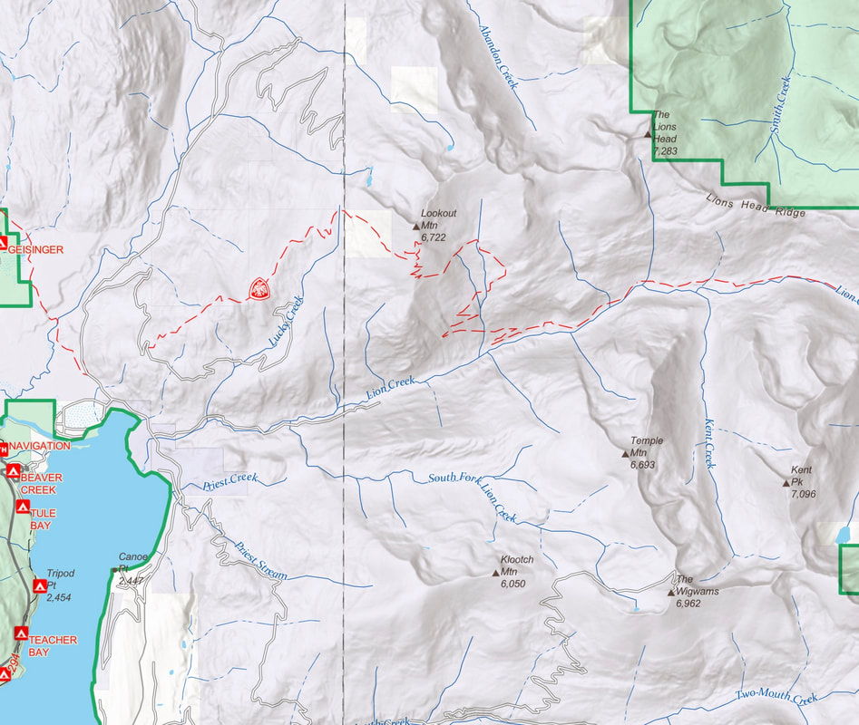
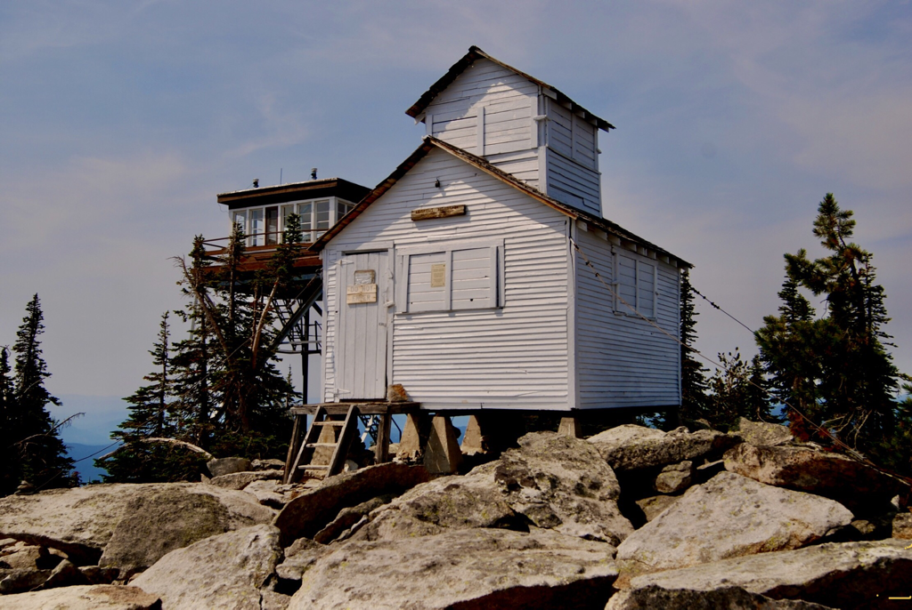
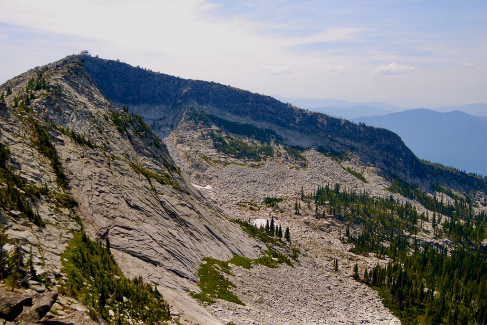
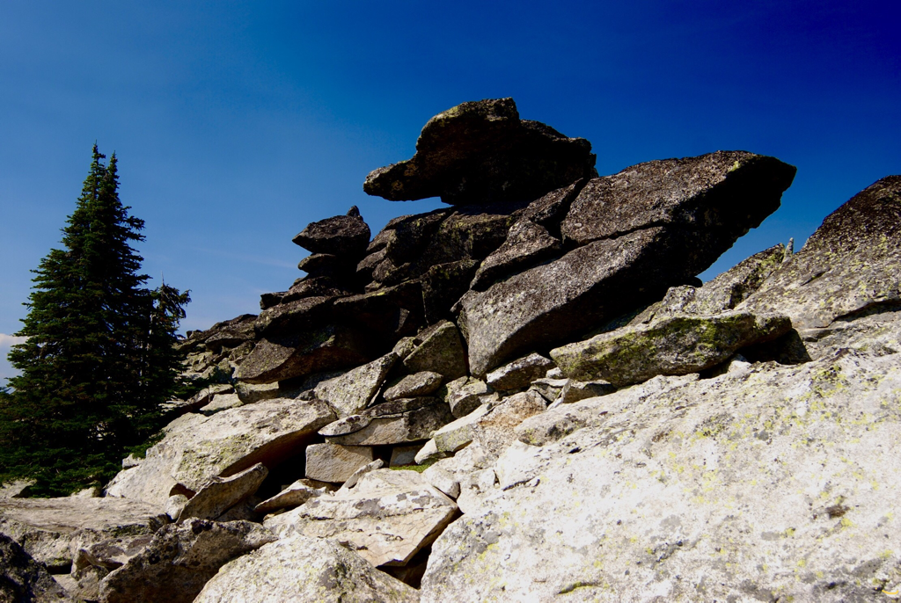
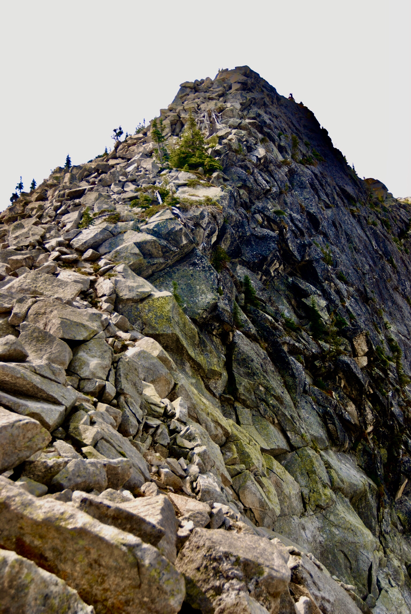
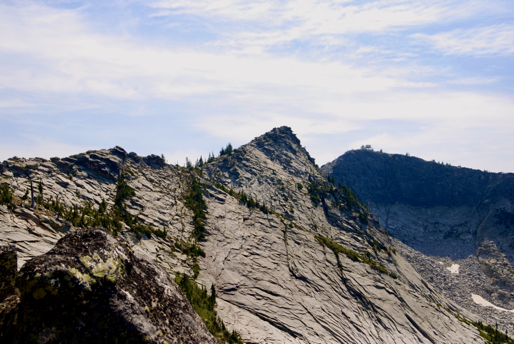
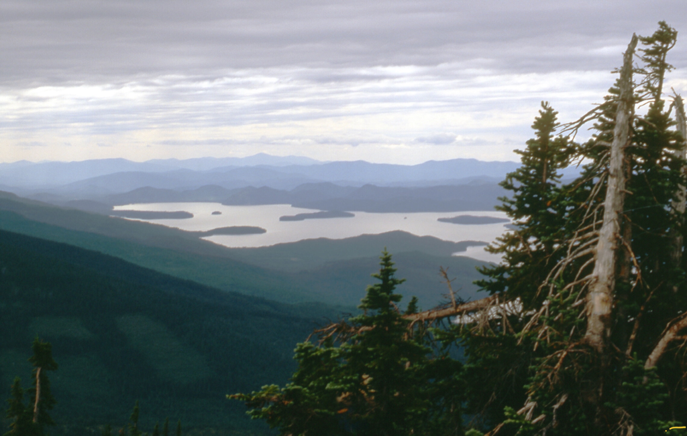

---
tags:
- Lakes
- Easy
- Day Hiking
- Backpacking
- Scrambling
- Scenery
stats:
- label: Event Type
  icon: hiking
  value: Day hiking, backpacking, scrambling & Scenery
- label: Distance
  icon: map-marker-distance
  value: 5 mile RT
- label: Elevation Gain
  icon: elevation-rise
  value: 1523’
- label: Difficulty
  icon: speedometer
  value: easy
- label: Maps
  icon: map
  value: IPNF, Kootenai National Forest, Caribou Creek
- label: GPS
  icon: crosshairs-gps
  value: 48°47’17"n 116° 47’ 41"w
- label: Ranger District
  icon: pine-tree
  value: Idaho Dept. of Lands, Priest River. 208.448.2302
- label: Boundary County Sheriff
  icon: shield-account
  value: CALL 911 FIRST or 208.267.3151
notes:
- Idaho panhandle national forest/alerts
- <https://www.fs.usda.gov/alerts/ipnf/alerts-notices>
---

# Lookout Lake  Mountain 7627

*Lookout lake, mountain 6727’ & two lookout towers*

## Description

We have added the areas sheriff’s emergency phone numbers for each trip write up under the ranger district info. if an emergency ocurrs, evaluate your circumstances and call only if needed.
Lookout Mountain stands tall on the west side of the Selkirk Range, above Upper Priest Lake. One cool thing about this hike, is how easy it is.
From the trailhead, hike Trail #36 for about a mile to Lookout Lake. After enjoying the lake, continue on Trail #36, and watch for a "trail," Trail #37 off to the left (East) that leads you to the summit and it’s two lookout towers. Wonder the summit plateau, and enjoy the magnificent views.

Please do not disturb the fire lookout person, unless they invite you up.
The old lookout has been restored, but survived a fire in 2001.
The old lookout cabin was built in 1909, and restoration started in 1983.
In 1909 the mountain was called Lookout Point.
The first lookout tower was built in 1929, by the Idaho Dept. of Lands.
The current, and in use tower was built in 1977.
Follow the same route back down.

## Option #1

After enjoying the lake, walk Trail #36 a very short distance

and look for the rocky ridge coming down from the lookout towers.
It’s the cliff edge that you see from the lake. This route is
not on any map, but offers the best views and rock scrambling
to the summit.
Very scenic ascent.
Always stay more than 10 feet from the edge.

## Option #2

This option allows scramblers to get away from trails and see the land to the north.
When you are on the summit, notice the rocky ridge heading north, then elbows left (west). My suggestion, is to hike back up these two ridges to the lookout before heading back to the lake. Years ago, we tried to do a loop, that cost us time and a whole lot of energy.. The western point of this ridge is a dead end, with difficult chicwackin’
By walking back up the ridge line,you get the best views of the peak with its two lookout towers. And a whole lot of fun scrambling.

---

## Directions

You might consider getting a current map from the Idaho Dept. of Lands in Priest River.
From Priest River, drive 22 miles north on Hwy 57, and turn right on Dickensheet Road towards Coolin.
At the Lion Head CG, continue on East Shore Road for 4.5 miles, or .5 miles past Milepost 23.
Turn right onto S.F.R.#44.

In 2.4 miles turn right onto S.F.R. #43.

After .5 miles turn sharply onto S.F.R. #432.

Continue 3.2 miles to a parking area before the gate.

## Hazards

The last 6 miles or so are rough and requires a high clearance vehicle.
OPTION #1..this route is for experienced off trail hikers only. Do not take kids or dogs on this route.

---

## Cool things close by

Upper Priest Lake, The Mollies, Lion Head Peak, and Lion Creek Rock slides.

## R & P

Burger Express in Priest River.

---

## Photo gallery

<!-- Missing Image: <!-- Missing Image: [*Picture (Image missing)*](assets/images/p253.png) --> -->

## Lookout lake,  mountain & towers

---

## The restored 1927 lookout tower, & new (1977) active tower

---

## The north ridge line to the towers, is my favorite ascent route

---

## Along the north ridge line, i spotted a rock dog

---

## Tall prominence along the north ridge

---

## The north ridge

---

## Lower priest lake from summit

To wander….. is to set your mind free. To be free…..  all that follows  is wondering.           chic    2012
