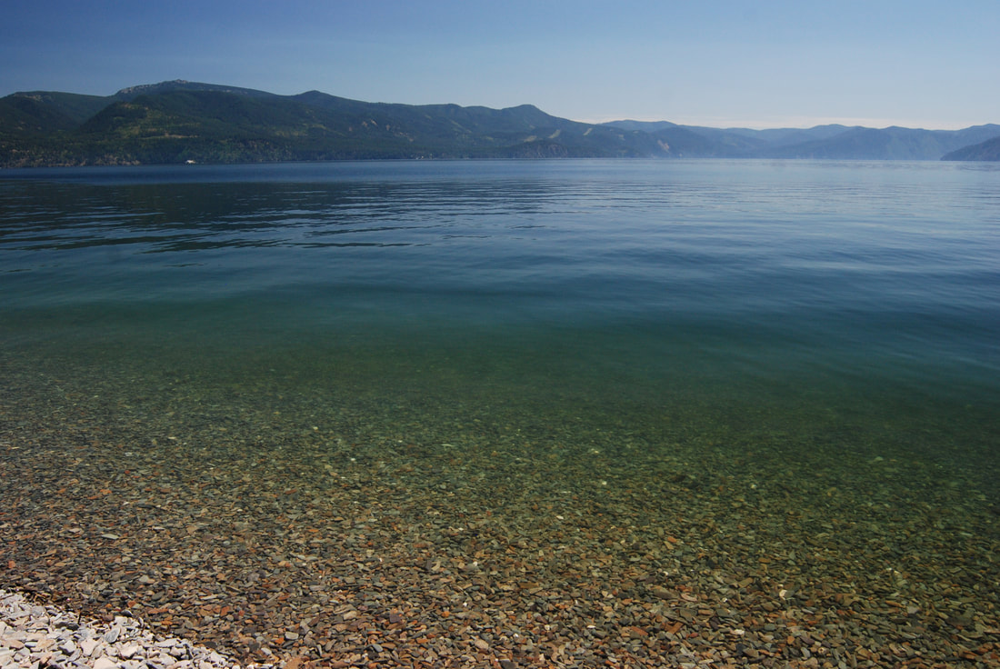
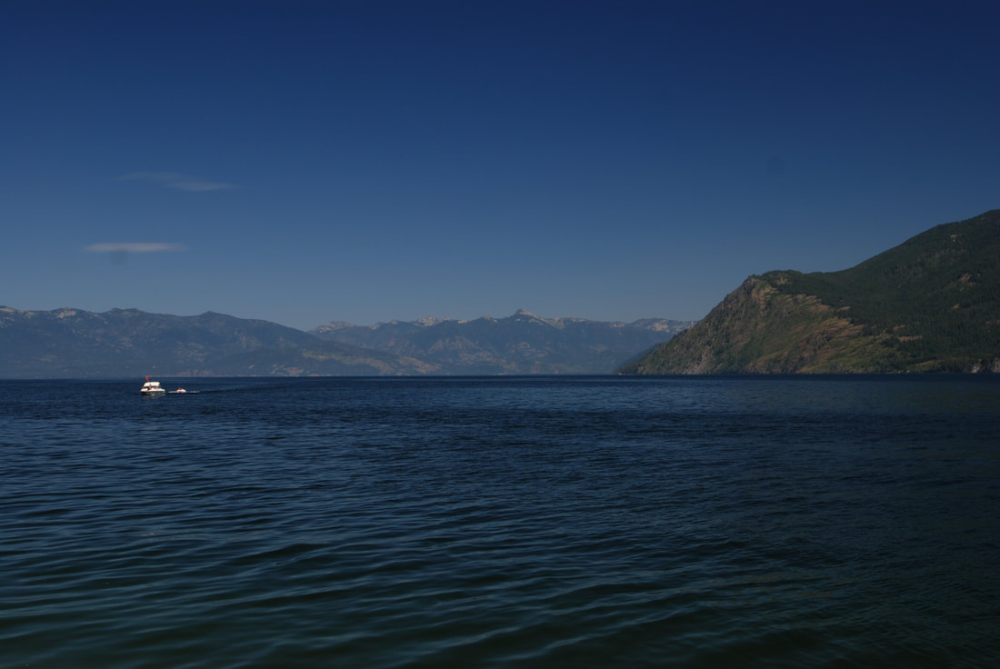
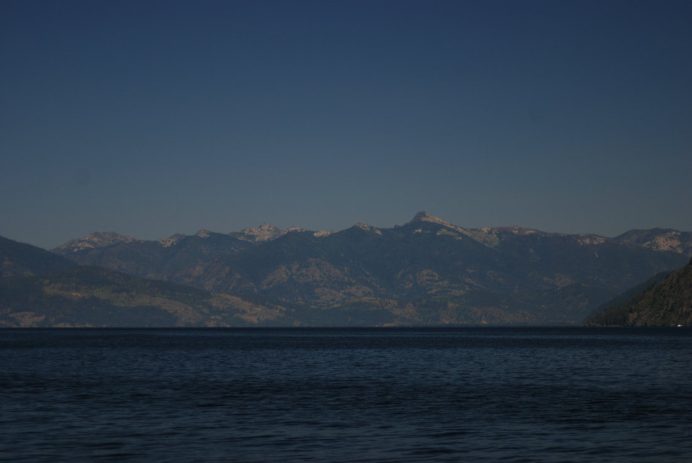

---
tags:

- Trails & Scrambles

- Moderate

- Day Hiking

- Beach Camping

- Swimming

- Diving

stats:

- label: Event Type
  icon: hiking
  value: Day hiking, beach camping, swimming, diving

- label: Distance
  icon: map-marker-distance
  value: 4 miles RT

- label: Elevation Loss
  icon: arrow-down-bold
  value: 1107’

- label: Difficulty
  icon: speedometer
  value: moderate

- label: Maps
  icon: map
  value: IPNF, Kaniksu N.F., Mt. Pend Orielle topo

- label: GPS
  icon: crosshairs-gps
  value: 48°07’00" n 116°32’29" w

- label: Ranger District
  icon: pine-tree
  value: Sandpoint R.D. 208.263.5111

- label: Bonner County Sheriff
  icon: shield-account
  value: 911 or 208.263.8517
notes:

- Idaho panhandle national forest/alerts<https://www.fs.usda.gov/alerts/ipnf/alerts-notices>
---

# Maiden Rock Trail

*Maiden rock trail #321*

## Description

We have added the areas sheriff’s emergency phone numbers for each trip write up under the ranger district info. if an emergency ocurrs, evaluate your circumstances and call only if needed.
The Maiden Rock Trail drops 1107 verts on a steep trail down to Pend Orielle Lake’s Maiden Rock Boat Camp. About half way down, it passes thru a young Cedar forest. Even on a hot day, it’s cooler in this forest. Maiden Creek skirts the trail on your right going down.
Once at the beach, you will notice that it is much like most the beaches on Pend Orielle Lake. Instead of sand, the beach is made up of flat, polished rocks of various sizes. But don’t worry, it very comfortable to lay on. And even more importantly, most the rocks are incredibly good skipping rocks.
Off to the north side of the beach, is Maiden Rock Point. You can dive off the rocks, climb them, or snorkel around the point. Years ago, a friend took his scuba gear with him when we paddled to Maiden Rock. He said he dove down about 100 feet, then dropped a weighted line on a spool. It was a 500’ line. It never touched the bottom. In fact it came over 200’ short of touching.
A word of CAUTION. Up against the cliff above the waterline is a lot of Poison Ivy. Do not touch it. Don’t even get near it. And if you do, DO NOT TOUCH YOURSELF ANYWHERE. YOU WILL REGRET IT FOR A LONG TIME.
Also included on this beach are picnic tables, tent sites, and a pit toilet. Bring your own TP just in case.
Please, please carry out all your trash. do not leave anything behind.
Near the lake end of the trail, in early spring thru early summer, the creek has a small waterfall to enjoy.
Because this is a public boat camp, you most likely won’t be alone.
Its really cool to camp there when the storms are up on the lake. Just be prepared.

## Option #1

From the same trailhead, there is a Trail #117, that climbs about 1750’ to near the top of the Maiden Rock formation. The views are about 200°, with views of Scotchman’s Peak, and Snowshoe Peak to the north.

---

## Directions

From CDA, drive north on 95 to the south end of Lake Cocolalla. From the first Blacktail road on the right, drive .8 of a mile to the second Blacktail Road to the right. It is a sharp right turn. Continue on Blacktail Road for a short distance, to where it turns left onto Butler Road. Stay on Butler Road to the trailhead.

## Cool things close by

Talache Landing, Cocolalla Lake, the Three Sister, Bayview, Farragut S.P., and Evan’s Landing.

## Hazards

POISON IVY, relatively steep trail, and people

## R & P

Moon Time, Franklins Hoagies, the Mexican Food Factory, and the Trails End Brewery.

## Photo gallery

---

*Picture (Image missing)*

## Maiden rock beach & point

*Picture (Image missing)*

## Swimming at maiden rock

## Maiden rock shoreline

Looking north. granite point is on the right. The proposed scotchmans peak wilderness, and scotchmans peak is mid image

## A telephoto of scotchmans peak right of center
