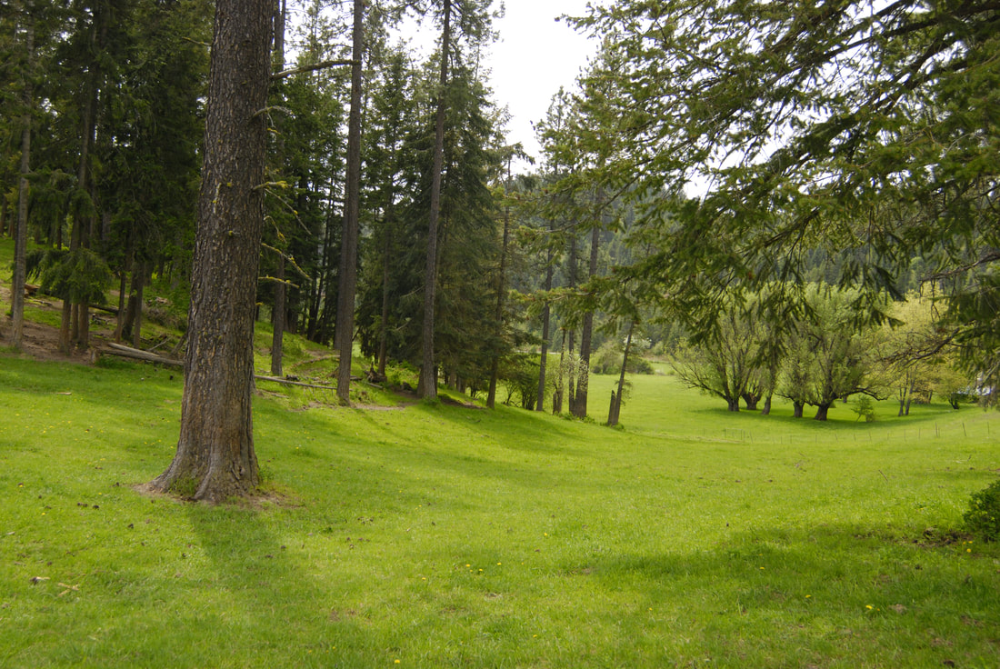
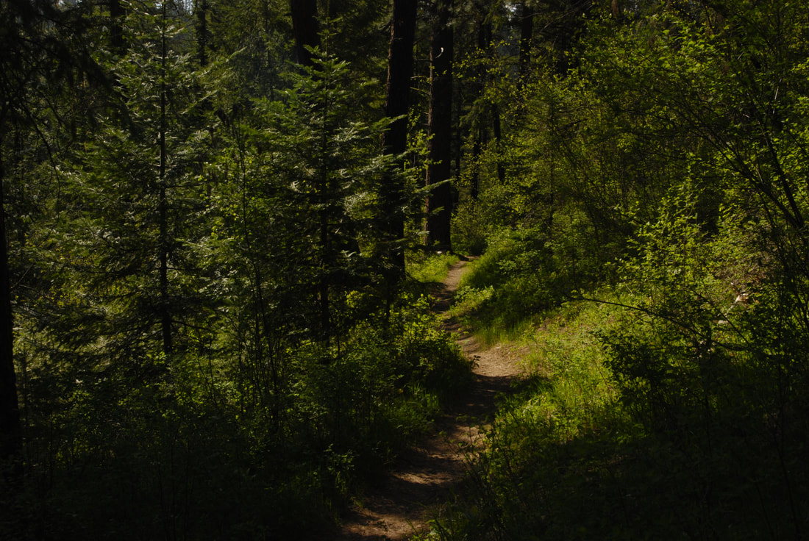
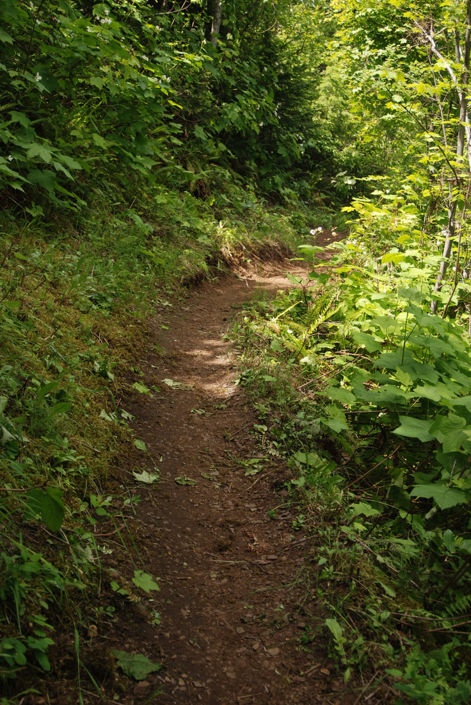
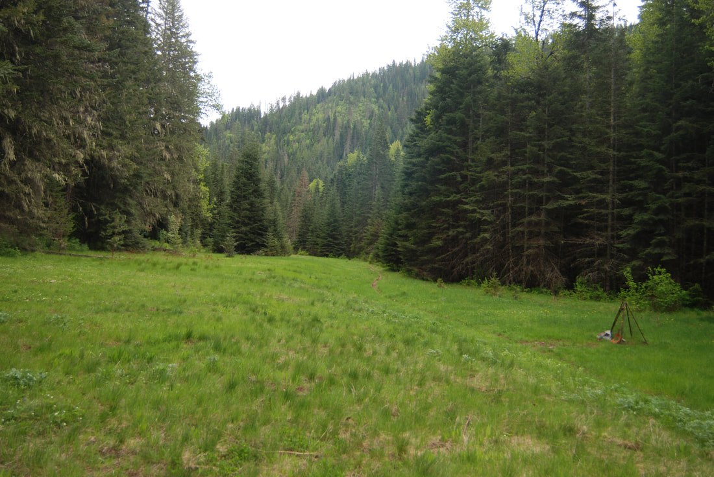
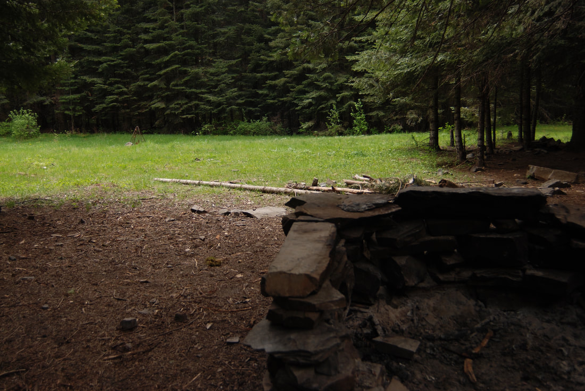
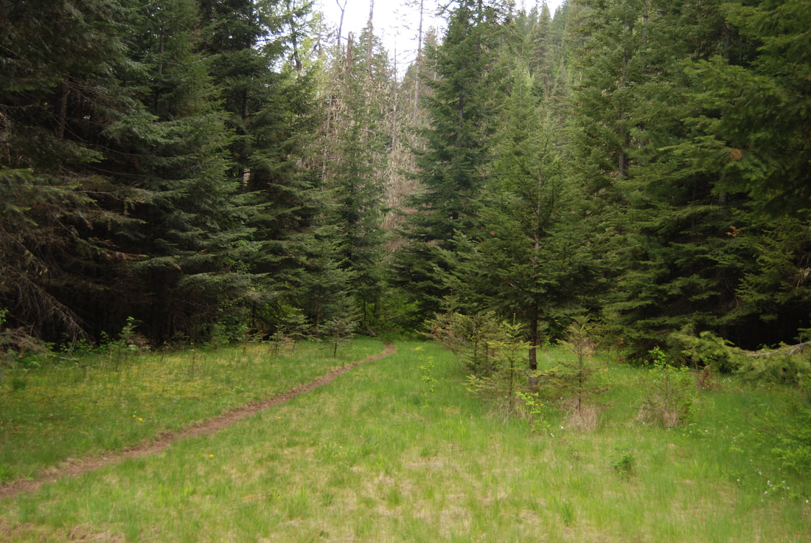

---
tags:
- Trails & Scrambles
- Day Hiking
- Backpacking
- Equestrian
stats:
- label: Event Type
  icon: hiking
  value: Day hiking, backpacking, and equestrian
- label: Distance
  icon: map-marker-distance
  value: up to 7 miles RT, 14 mile loop
- label: Elevation
  icon: terrain
  value: About 300 verts verts, about 700 verts to do the loop.
- label: Difficulty
  icon: speedometer
  value: along the creek it’s easy. Beyond the creek it’s moderate
- label: Maps
  icon: map
  value: ipnf,
- label: GPS
  icon: crosshairs-gps
  value: 47°40’37" n 116°35’08" w
- label: Ranger District
  icon: pine-tree
  value: CDA River R.D. 208.769.3000
- label: Kootenai County Sheriff
  icon: shield-account
  value: 911 or 208.446.1300
notes:
- Idaho panhandle national forest/alerts<https://www.fs.usda.gov/alerts/ipnf/alerts-notices>
---

# Marie Creek

*Marie creek trail #241*

## Description

We have added the areas sheriff’s emergency phone numbers for each trip write up under the ranger district
info. if an
emergency ocurrs, evaluate your circumstances and call only if needed.
The Marie Creek trailhead starts in a large clearing that is shared with the equestrian folks. At the far NE
end of the
parking lot, the trail immediately crosses Marie Creek. It continues thru the woods, not gaining much
elevation until
about 1.5 miles in. It then climbs up over and into a few side creek drainages, then drops down along a Marie
Creek.
After a short time, the trail breaks out in a long clearing. Off to your left is some stone work made into
fire pits
with seating. Once back on the trail, the forest isn’t so dense, and nears Marie Creek which you may have to
cross a few
times, until it comes to a wide washed out area. This is where you turn around for a short hike. If you
continue over
the wash out, it eventually comes to Skitwish Creek, where you turn up hill along Skitwish Creek.. You will
come to an
old logging road that you follow back towards the trailhead. The road will drop down to the trailhead
eventually.

## Option #1

For a nice easy walk on an over grown grassy green road, continue up F.R. #202 for about 3 miles past the
regular
parking lot. The road will climb and do a slow left handed turn. Off to the right, is a gated road that drops
down hill.
Park here, and walk this road for about 3 miles, to a rocky point, and your turn around. Most of this trail is
covered
with foot tall very green grasses. It’s a peaceful trail with no traffic.

## Directions

From CDA, drive east on I-90 to the Harrison and Hwy 97 exit at the north end of Wolf Lodge Bay. At the stop
sign, turn
left over the freeway.
Turn right (East)at the dumpsters onto E. Frontage Road, and drive to S. Wolf Lodge Creek Road. Drive up S.
Wolf Lodge
Creek Road to a ‘Y" and bear left up past a bunch of houses to a right turn onto E. Marie Creek Road. You will
pass a
large home with a blue roof, that has a tepee in the yard.
Continue for about .5 Mike’s to a road that angles off to the right. The parking area is a short distance
further.

## Cool things close by

Mineral Ridge, Wallace L. Forest Conservation Area, Blue Bay Landing, Beauty Bay, Trail #257, and Trail #79.

## Hazards

At about 3.5 miles up the Marie Creek Trail is a washed out area, use caution if you cross it.

## R & P

Moon Time, Franklins Hoagies, the Mexican Food Factory, and the Trails End Brewery.

## Photo gallery

## On the yellowstone trail road to the trailhead is a beautiful pasture

## The start of the marie creek trail #241

## Part of the marie creek trail that the spokane mountaineers rebuilt

*Picture (Image missing)*

## A bridge over marie creek

*Picture (Image missing)*

## Not only is trail work fun, its a lot of work

*Picture (Image missing)*

## A section of the trail we worked on a years ago this section is just before the meadows

The meadows. A ways further in, the creek washed out badly, and is hard to cross. On the left of the meadows
are places
to camp

---

## Along the north side of the meadows is a place to camp and cool cliffs

## Trail #241 nearing the skitwich creek

*Picture (Image missing)*

## High winds above marie creek

I walked thou an ancient Ponderosa forest today. Some of these huge trees stretched to the sky. They stand so
proud and
beautiful. The Marie Creek trail passes by several such beauties.                The peace and tranquility
amongst such
giants  soothes the soul.
chic.
9.19.11
