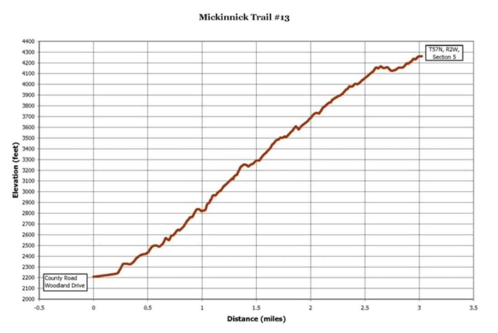
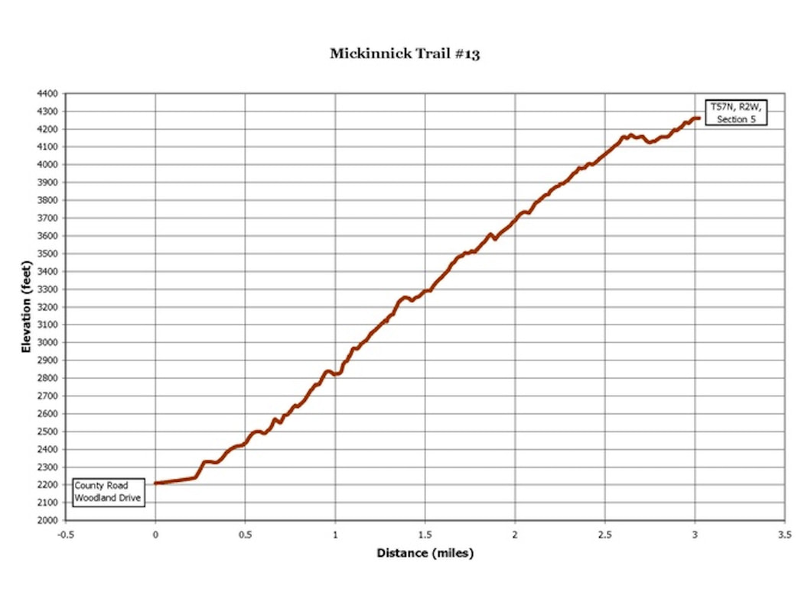
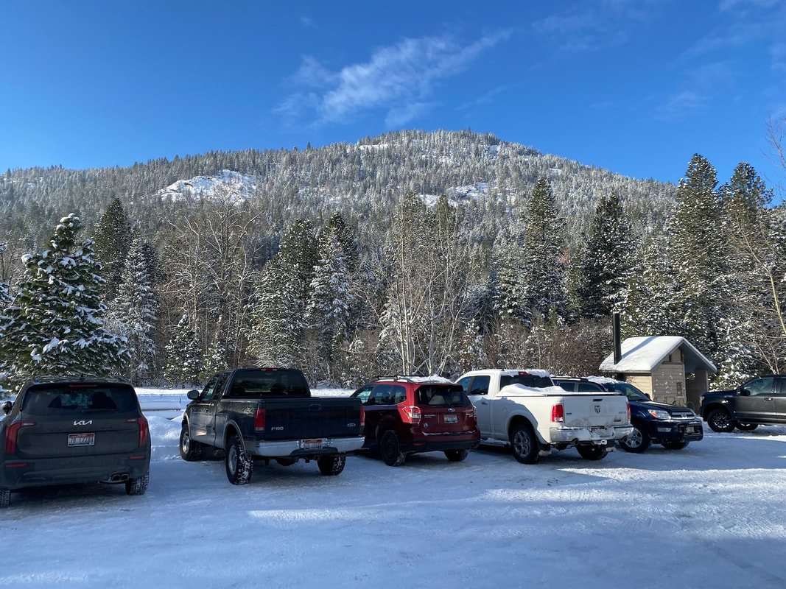
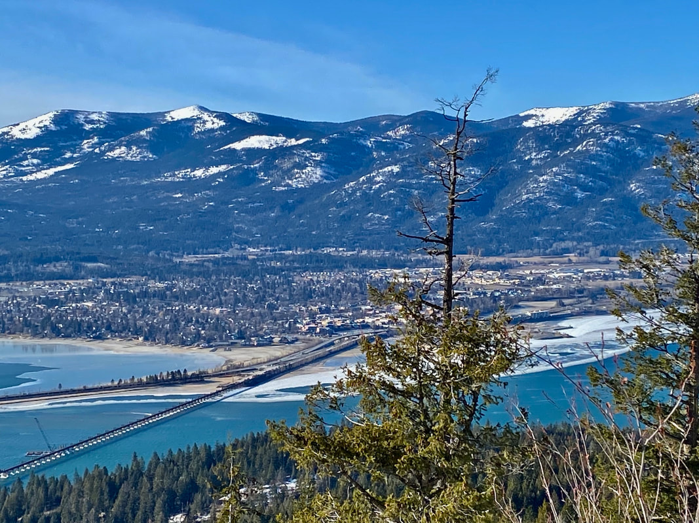
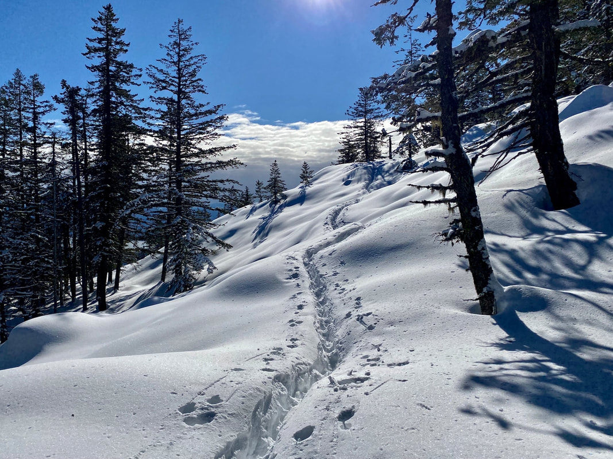
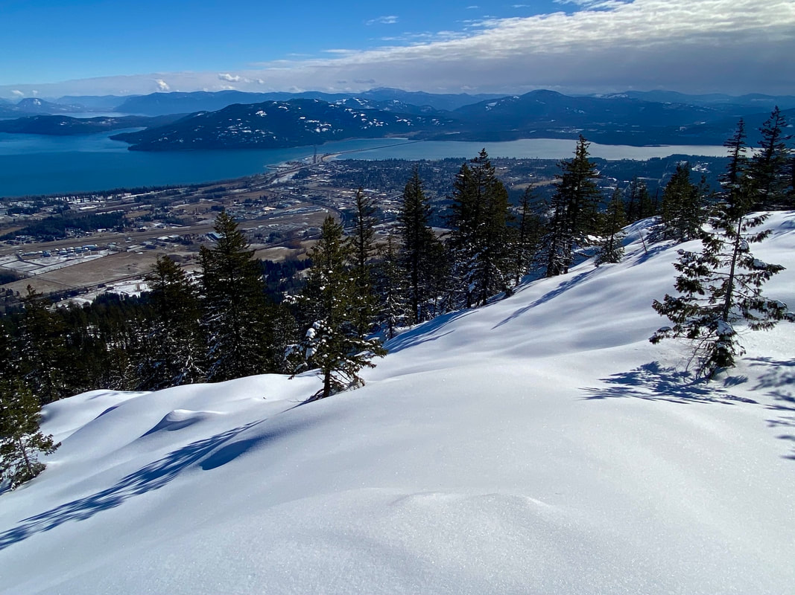

---
tags:
- Trails & Scrambles
- Easy +
- Day Hiking
stats:
- label: Event Type
  icon: hiking
  value: day hiking
- label: Distance
  icon: map-marker-distance
  value: 7 miles RT
- label: Elevation Gain
  icon: elevation-rise
  value: 2150 verts
- label: Difficulty
  icon: speedometer
  value: Easy +
- label: Maps
  icon: map
  value: ipnf, kaniksu n. f.
- label: GPS
  icon: crosshairs-gps
  value: 48°18’39 n 116°34’05" w
- label: Ranger District
  icon: pine-tree
  value: Sandpoint R.D. 208.263.5111
- label: Bonner County Sheriff
  icon: shield-account
  value: 911 or 208.263.8417
notes:
- Idaho panhandle national forest/alerts<https://www.fs.usda.gov/alerts/ipnf/alerts-notices>
---

# Mickinnick Trail

*Mickinnick trail #13*

## Description

We have added the areas sheriff’s emergency phone numbers for each trip write up under the ranger district
info. if an emergency ocurrs, evaluate your circumstances and call only if needed. In 2005, the Mickinnick
Trail was opened. Nicky Pleass donated 160 acres of land to be a park and trail in memory of her late
husband Mick, in 1997. Involved in making this trail come true thru grants and partnerships were Idaho
Panhandle Resource Advisory Committee, the city of Sandpoint, Bonner County, the BLM, the USFS, and the
Friends of the Mickinnick Trail. The trail climbs the SE flank of Bald Mountain, thru Rocky outcropping,
grassy and wet meadows, and old growth forests. The trail has about 25 switchbacks as it climbs 2150’ to the
high meadows over looking Sandpoint, and the Pend Orielle Lake.

## Directions

From Sandpoint, take Hwy 95 north for 1.3 miles to the Schweitzer Mountain Road, and turn left (west)for .5
miles and turn right (north) for .8 miles, then turn left at the Schweitzer Resort sign. Drive .5 miles to
Woodland drive and turn left for .7 miles to the trailhead on the right side of the road.

## Cool things close by

Schweitzer Resort, the American Selkirks, Pend Orielle Lake, Pend Orielle Bay Trail, Priest River, Pack
River, and the Proposed Scotchman Peaks Wilderness.

## Hazards

I counted 25 switchbacks, some rocky trail sections, and 2150’ in 3.5 miles

## R & P

Jalapeños, Burger Express, Eichardt’s, Mr. Sub

## Photo gallery

---

*Picture (Image missing)*

## The trailhead to the mickinnick trail image by rick nolting

*Picture (Image missing)*

## The mickinnik hike from gold hill Image by rick nolting

## The mickinnick hike from gold hill Image by rick nolting

*Picture (Image missing)*

## The mickinnick hike from gold hill Image by rick nolting

## Snowshoeing near the summit of the mickinnick trail image by rick nolting

## Sandpoint from the summit of the mickinnick trail Image by rick nolting
