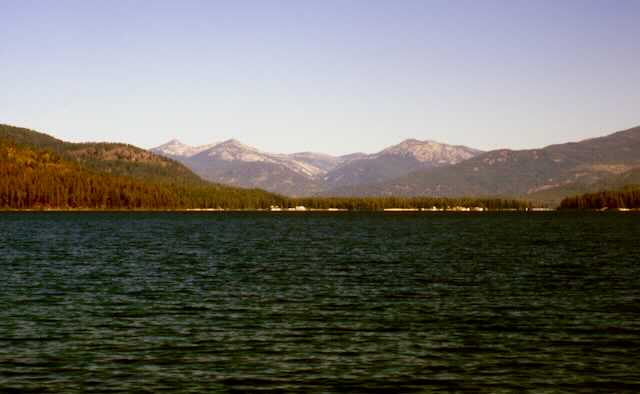
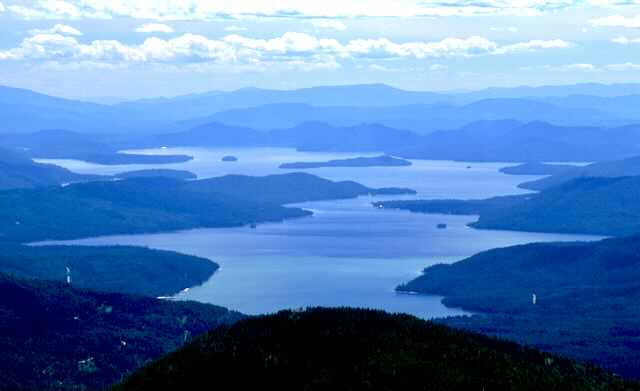
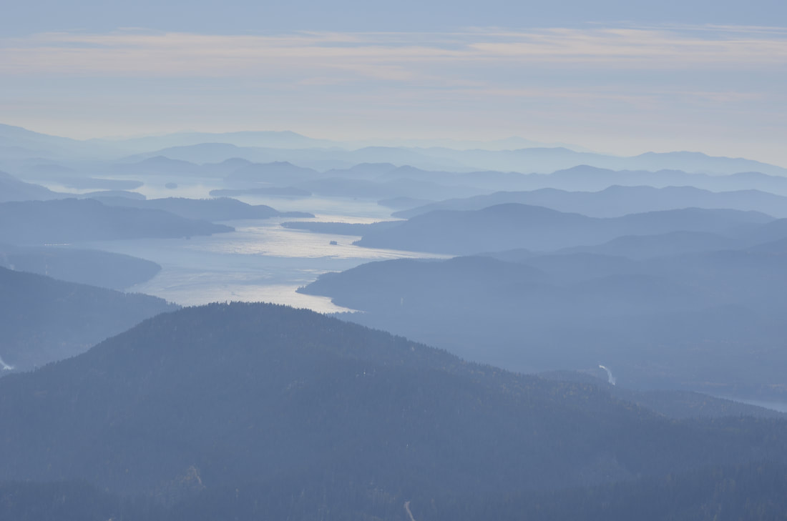
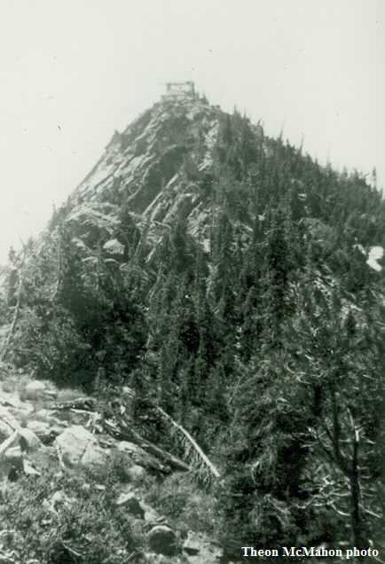

---
tags:
- Trails & Scrambles
- Moderate to the Mollies
- Day Hiking
- Backpacking
- Scrambling
stats:
- label: Event Type
  icon: hiking
  value: Day hiking, backpacking, scrambling
- label: Distance
  icon: map-marker-distance
  value: 3 miles RT to The Mollies Lake. 5 miles RT to The Mollies summit
- label: Elevation Gain
  icon: elevation-rise
  value: 1651 verts to The Mollies. To Pheobe’s Tip is NA
- label: Difficulty
  icon: speedometer
  value: moderate to The Mollies
- label: Maps
  icon: map
  value: Kaniksu N.F., Caribou Creek & Grass Mountain topos
- label: GPS
  icon: crosshairs-gps
  value: 48°50’43" n 116°50’19" w
- label: Ranger District
  icon: pine-tree
  value: Priest River R.D. 208.443.2512
- label: Boundary County Sheriff
  icon: shield-account
  value: CALL 911 FIRST or 208.267.3151
notes:
- Idaho panhandle national forest/alerts
- url: https://www.fs.usda.gov/alerts/ipnf/alerts-notices
---

# Mollies  Phoebes Tip

## The mollies 6512’ and phoebes tip 6658’

## Description

We have added the areas sheriff’s emergency phone numbers for each trip write up under the ranger district
info. if an emergency ocurrs, evaluate your circumstances and call only if needed. This hike is due north of
Priest Lake and offers great views of Priest Lake, the American Selkirks, Washington, and Canada. The trail
heads up thru a forested area that doesn't offer many views, until you break out into open areas next to the
lake and above to the summit. Once on top the views are to die for. From the high peaks above Hughes Meadows
to the west, to the American Selkirks to the east, and the peaks of Canada to the north, this summit shows
the grandeur of North Idaho. Be aware that the trail is sketchy as you approach the lake. The summit block
sits on a 1500' wall on the east. The meadows below the wall looks like its from a fairytale. Off to the NW,
Pheobe's Tip stands out along the skyline. Its about 1.2 miles from the Mollies summit and offers a great
extended hike to an even taller peak.

## Option #1

Pheobe’s Tip is located NW of The Mollies at about 1.2 mile. It’s along a nice ridge, so views are great.
It’s a bit arduous, but the rewards are worth the effort.

## Directions

Drive to Priest River and head north up SH #57 about 27 miles and turn right (east) towards Coolin for
another 5.5 miles to Coolin. At Coolin turn right (east) on the Cavanaugh Bay Road. In another 3.3 miles to
East Shore Road. Drive north for 29 miles past Lions Head Campground as it leaves the lake and heads up
Caribou Creek. Look for FR 46 on a small sign, and go 1.7 miles to a prominent saddle up a 4 wheel drive
road. As the road levels out, look to the right (east) for a short road to the trailhead. You can park at
the trailhead or on the road along the saddle.

## Cool things close by

Priest Lake, Lions Head Campground (swimming), Lions Head water slide, Hunt Creek Falls. Drive about 4 miles
past Coolin to FR 23, then up to the left for about 1/4 a mile and park. Walk about 300' to the falls.

## Hazards

None on the hike to the Mollies

## R & P

Burger Express

## Photo gallery

---

Phoebes tip is on the left, while the mollies is next to phoebes tip, First to the right. west fork mt is
right of center

### Picture (Image missing)

Below the summit of the mollies, is the mollies lake. Off in the distance is the american selkirks. Lion
head

is right

of center on the horizon

---

### Picture (Image missing) Details

## Steep cliffs above bugle creek

## The views of lower priest lake, make the effort to get there, worth it

---

## Priest lake from the summit of the mollies in clearing fog

### Picture (Image missing) Details (2)

In this turn of the century image, this was the camp, for fire lookout people. image by ernest grambo

---

---

### Picture (Image missing) Details (3)

## Early fire lookout camps were very primitive. image by ernest grambo

---

---

## The mollies lookout cabin near the turn of the century. PHOTO BY THEON McMAHON

### Picture (Image missing) Details (4)

## The old lookout tower

## When you have a choice of paths… always choose the fun one. chic    2012
