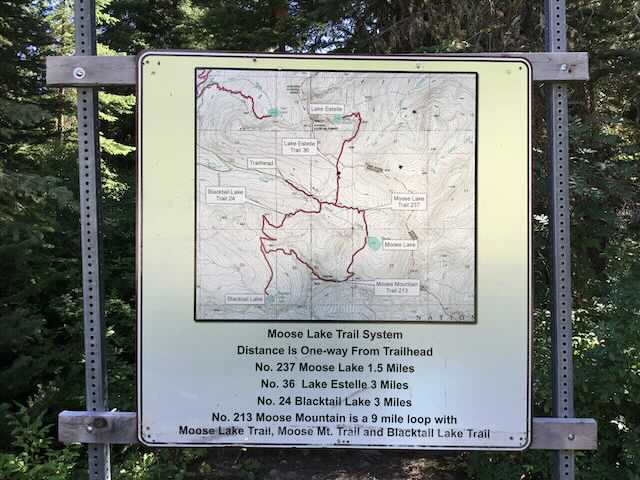
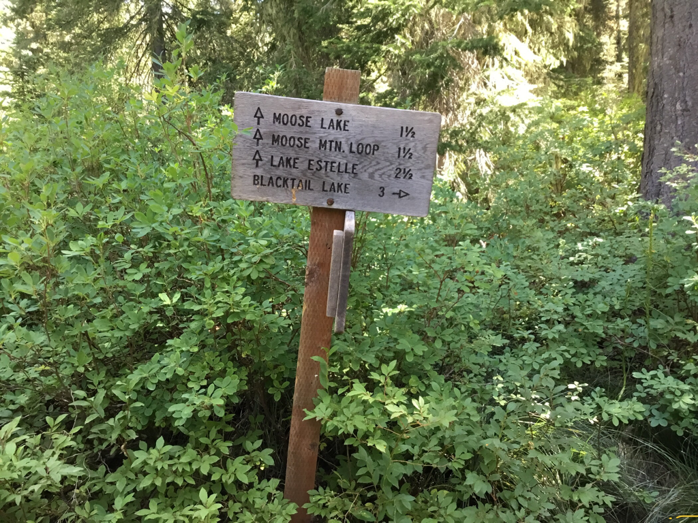
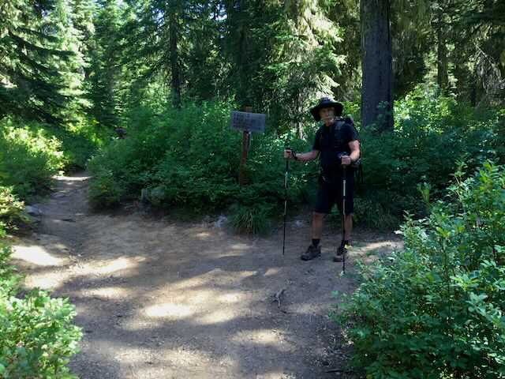
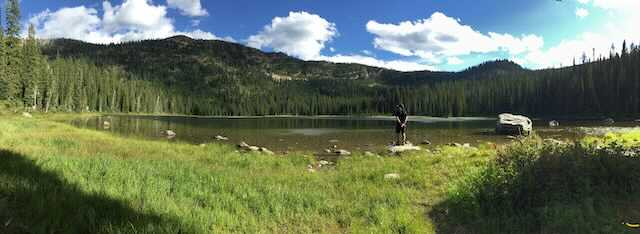
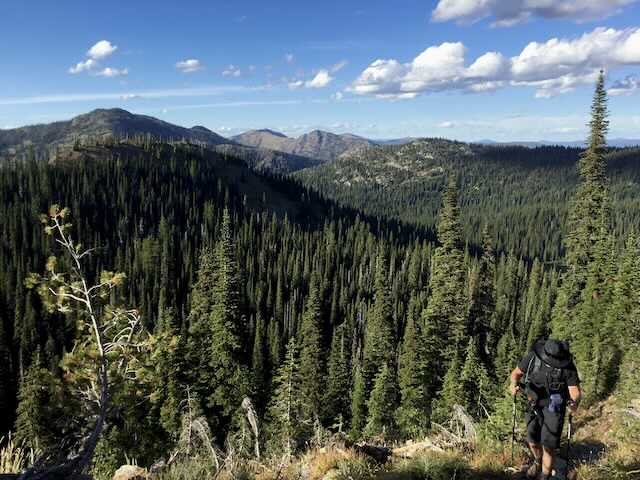
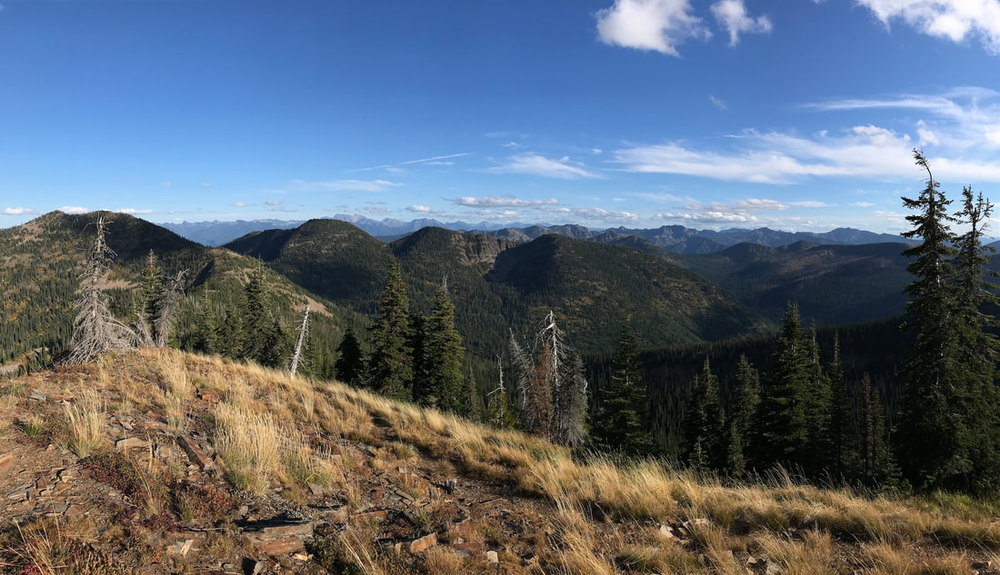
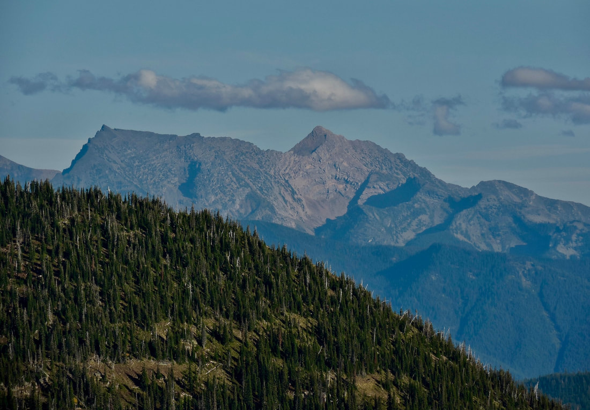
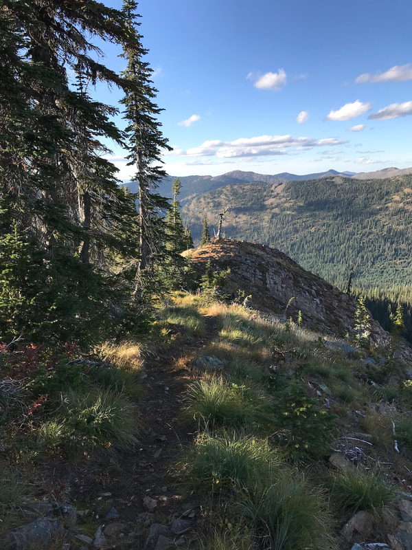
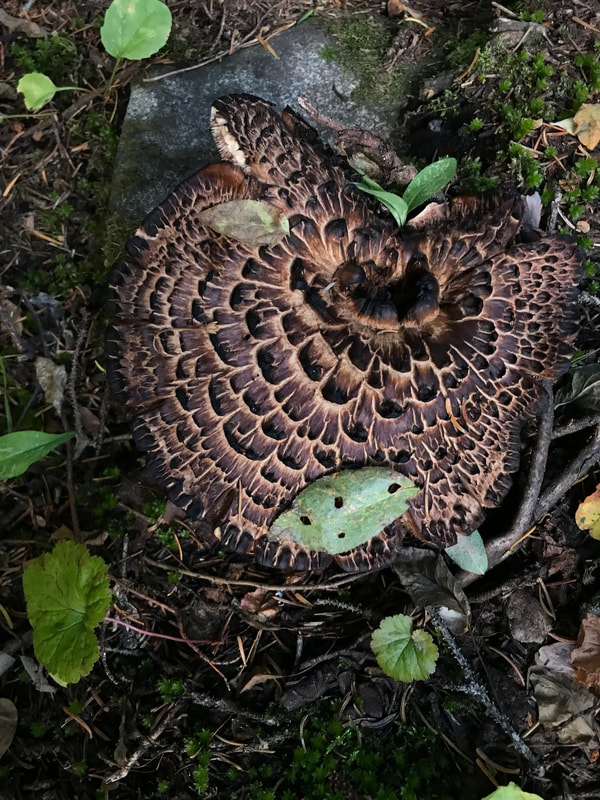

---
tags:
- Peaks & Mountains
- Moderate
- Day Hiking
- Backpacking
stats:
- label: Event Type
  icon: hiking
  value: Day hiking & backpacking
- label: Distance
  icon: map-marker-distance
  value: 9 mile loop
- label: Elevation Gain
  icon: elevation-rise
  value: 1635’
- label: Acres
  icon: vector-square
  value: '16.5'
- label: Difficulty
  icon: speedometer
  value: moderate
- label: Maps
  icon: map
  value: I.P.N.F., Kaniksu National Forest, Mount Pend Orielle, Smith Mountain, Benning
    Mountain, and Trestle Peak topos
- label: GPS
  icon: crosshairs-gps
  value: Moose Lake 48°21’16" N 116°06’33" W
- label: Bonner County Sheriff
  icon: shield-account
  value: 911 or 208.263.8417
notes:
- Moose Mountain. 48°20’46" N 116°07’22" W
- RANGER DISTRICT. Sandpoint R.D. 208.263.5111
- Idaho panhandle national forest/alerts
- '[https://www.fs.usda.gov/alerts/ipnf/alerts-notices](https://www.fs.usda.gov/alerts/ipnf/alerts-notices)'
---

# Moose Mountain Loop Hike

*Moose mountain 6543' loop hike*

## Description

Not only is this hike relatively close by, but it is a spectacular area with a HUGE surprise when you reach
the summit of Moose Mountain. This whole area is called the Moose Lake Trail System, and has an outhouse at
the trailhead. At the trailhead is a map showing the areas attractions and routes. To me, the instructions
don’t make much sense, so take an image of the map to refer to on your walk. For the first .5 mile the trail
climbs gently to the first junction. Turn left and in a short distance is a turn off to Lake Estelle Trail
#36. See OPTION #1 below for info on this spur trail.

In 1.5 miles is Moose Lake. I guarantee you, there will always be a place to pitch a tent. And your tent
will be on soft grasses. Moose Lake sits in a cirque with magnificent views of its rocky terrain. To the SW
is a mountain that you may think is Moose Mountain, but it’s not. As you continue along the west side of the
lake, the trail climbs at a steady and moderate rate until after several false saddles, the trail pops out
on the cirques back wall. Don’t be discouraged, the best part lies ahead. Turn right (west) up the ridge for
less then .6 miles to the summit. Once on the summit, drop your pack and grab your camera. From Moose
Mountains 6543’ summit, the views east of the Proposed Scotchman Peak Wilderness, and the Cabinet Mountain
Wilderness are stretched out for 30+ miles in front of you. The west face of these peaks are very rugged and

drop off

precipitously.

Then the fun starts. Start up north and identify the peaks of both areas all the way to Hwy 200 to the
south. Take along a P.S.P.W. Map and a C.M.W. map to aid your identification. Or download the free app...
PEAK FINDER. The view of the peaks to the east from Moose Mountain blew me away. Then to make it even more
spectacular, when we summited the next peak (very close), you can see most all the American Selkirks to the
west. Chimney Rock sticks up like a....pinnacle. After you have lunch on the summit, continue westish on the
trail as it descends a very beautiful ridge line back towards the parking area. The trail drops off the
ridge and does a few switchbacks until you reach the trail you started on. Then it’s only .5 miles to the
cars. Start this loop early, so you can enjoy the views from Moose Mountain summit.

## Option #1

As you walk into this area from the parking lot, are the Lake Estelle Trail #36 for two miles to a beautiful
cirque lake nestled below towering mountains.

The last .5 miles of the trail, skirts several cliffs, but offers great views of N. Idaho and Montana’s Big
Sky Country. There are a few campsites scattered along the east shore line.

## Option #2

Because the distances are short to these lakes, you can visit three lakes and one peak by following the
parking area map.

## Option #3

To further your hiking in this area, there is a hike from Lake Estelle to Gem Lake, or visa versa, to the
west, at about 2.5 miles of hiking. You can make it a loop, but there is about a two mile road back to the
trailhead.

---

## Directions

Head north to Sandpoint and take the Hwy 200 exit and head east to the Pack River and Pend Orielle Lake
confluences. At 3.4 miles from the Pack River, turn left (East) for 12 miles to a junction with the
Lightning Creek Road #275. Turn left (north) up Lightning Creek for less then a mile, and turn right (S).
Onto FR #1022 to the trailhead.

## Hazards

Altho this trail does climb a bit to the Moose Mountain, it has 2 or 3 steep sections along the way. And be
aware... there are three point where you think you are about to summit the ridge. Eventually you will get to
the top.

---

## Cool things close by

Lake Estelle, Gem Lake, Pend Orielle Lake, Lunch Peak Fire Lookout & Mount Pend Orielle Peak, Char Falls,
and Scotchman’s Peak.

## Hazards

The trail to Moose Lake is easy, but refer to your trail map picture of the route if needed. The walk up to
Moose Mountain isn moderate on a nice trail. After spending some time on top looking at the the magnificent
west faces of then Proposed Scotchman Peaks Wilderness and the Cabinet Mountain Wilderness, continue NW on
Trail #213 and turn right (NNW) on Trail #24, to the main junction and left tom the trailhead.

## R & P

Squeeze Inn and the Clark Fork Pantry on Clark Fork. Jalapeños, Mr. Sub, Burger Express, and Eichardt’s in
Sandpoint.

*Picture (Image missing)*

## Photo gallery

---

At the parking area is this sign showing the many options. be sure to snap an image of this sign for
reference further along the trails

## Trail directions at the first junction

---

## The beginning of the moose mountain loop hike

---

## Moose lake

Trail #213 near moose mountain summit. the peaks top center, is where lake estelle sits, on the other side

As you reach the summit of moose mountain, you get the first glimpse of the proposed scotchman peaks
wilderness (middle range), and the cabinet mountain wilderness in the back ground

## A telephoto image of A peak & snowshoe peak from moose mountain

## Trail #213 as it heads down to the cars

*Picture (Image missing)*

Way off to the west is the american selkirks. can you spot chimney rock? this ridge line is your descent
route

from

moose mountain

---

## A shingled hedgehog along the trail to moose mountain aka hawks wing mushroom

##

Nature is my life. Every time I go out, I know what to expect, but am amazed at what I experience. Nature

brings me

purpose. chic 12.27.2024
