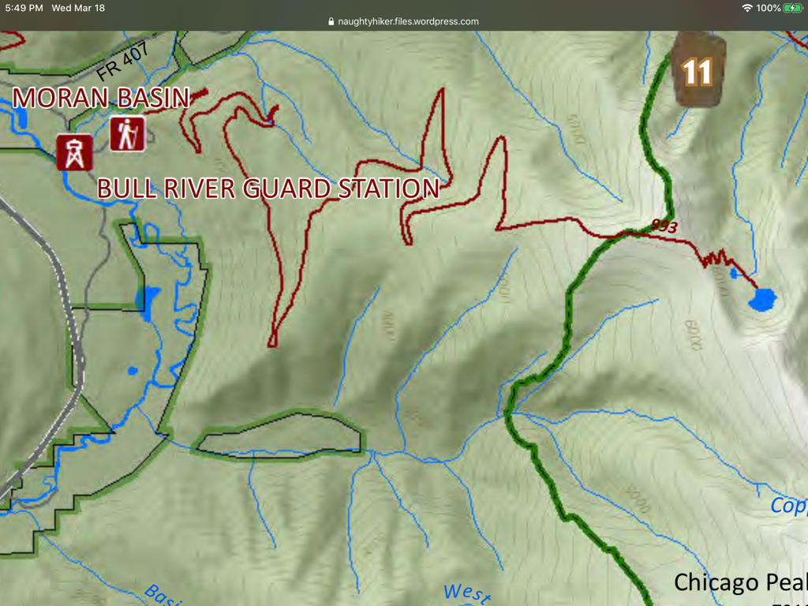

---
tags:
- Trails & Scrambles
- Difficult
- Day Hiking
- Backpacking
- Mt. Biking Approach
stats:
- label: Event Type
  icon: hiking
  value: Day hiking, backpacking, Mt. Biking approach
- label: Distance
  icon: map-marker-distance
  value: 26 miles RT
- label: Elevation
  icon: terrain
  value: 3800’
- label: Difficulty
  icon: speedometer
  value: Difficult
- label: Maps
  icon: map
  value: Kaniksu N.F., Elephant Peak topo.
- label: GPS
  icon: crosshairs-gps
  value: 48°5’49" n 115°41’40" w
- label: Ranger District
  icon: pine-tree
  value: Cabinet Ranger District. 406.827.3533
- label: Lincoln County Sheriff
  icon: shield-account
  value: CALL 911 FIRST or 406.293.4112
notes:
- Kootenai national forest/alerts<https://www.fs.usda.gov/alerts/kootenai/alerts-notices>
---

# Moran Basin

*Moran basin trail #993*

## Description

Because most of the first 6 miles is on Lost Girl Road #2278, approaching via a mt bike will make for an easy descent back to the cars.

The first section, about 6 miles is on an old road, but is still used on occasions. The next section, about 5 miles is on the same old road, but has not been used as a road lately. After a gazillion long switchbacks, the over grown road become as trail. From here the trail ascends to the ridge, then drops to the two lakes.

## Option #1

The Trail/Road #993, can be mountain biked for about 6 miles. The remaining 5 miles to the CMW  boundary, was the old road, but is now a poorly maintained trail to the Basin.

## Directions

Drive north on Hwy 56, look for milepost 8. Turn right (east) on F.R. #407. and drive past The St. Paul Lake turn off. Continue about .4 of a mile, on F.R. 2278 and pass the Historic Ranger Station. Just a ways past the Ranger  Station, turn left (NE) to the gate.

## Hazards

Many long switchbacks. A descent into the Moran Basin.

## Cool things close by

A Peak, Snowshoe Peak, Vimy Ridge, Bull River, Ross Creek Cedars, and the Proposed Scotchman Peaks Wilderness.

## R & p

Henry’s, Pizza Hut, Clark Fork Pantry & Squeeze Inn in Clark Fork. Eicharts, Burger Express, Mr Sub & Jalapeños in Sandpoint

## Plan your trip

Click for Current NOAA Weather Conditions

## Photo gallery

---

## No images available. if you would like to contribute contact chic

---

---

---

---

---

---
