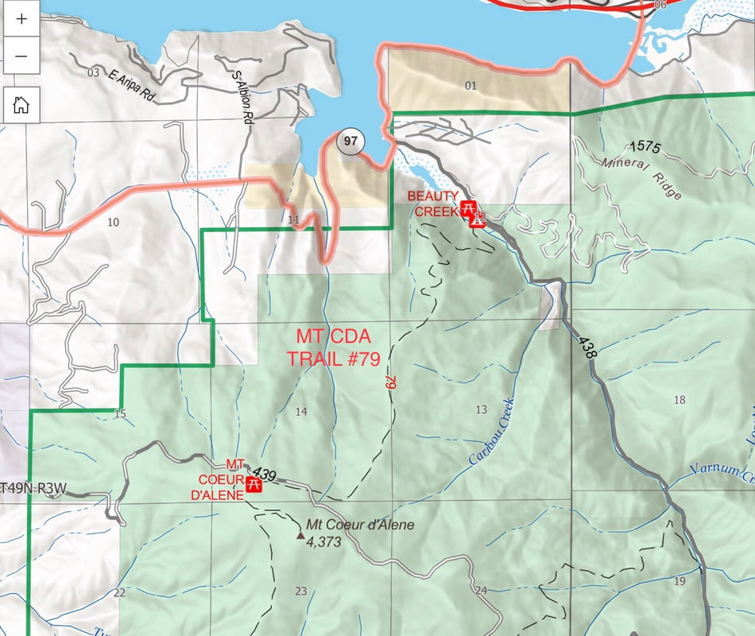
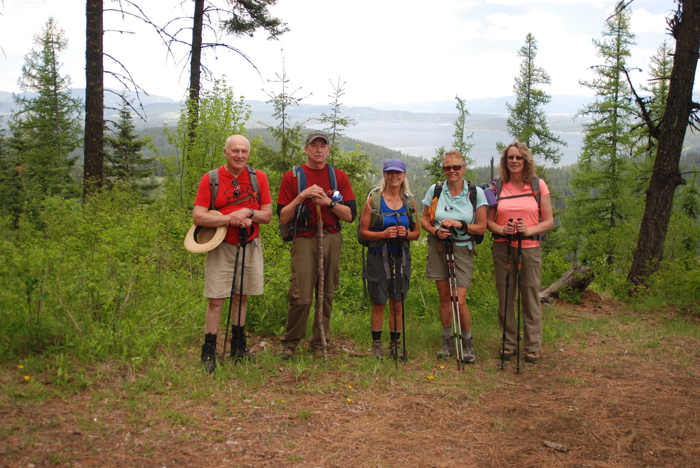
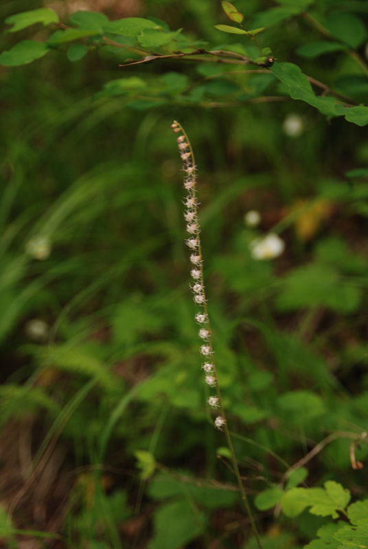
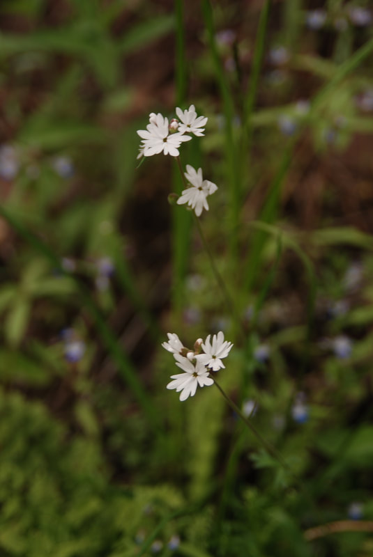

---
tags:
- Peaks & Mountains
- Difficult
- Day Hiking
- Backpacking
- Mt. Biking
- Equestrian
stats:
- label: Event Type
  icon: hiking
  value: Day hiking, backpacking, mt. biking, and equestrian.
- label: Distance
  icon: map-marker-distance
  value: '10.6 miles RT. About a 14 mile loop with Trail #257'
- label: Elevation
  icon: terrain
  value: 2112’
- label: Difficulty
  icon: speedometer
  value: difficult
- label: Maps
  icon: map
  value: IPNF, CDA River Ranger District, Mount CDA Topo
- label: GPS
  icon: crosshairs-gps
  value: Beauty Bay CG. 47°36’27" N 116°40’ 08" W.
- label: Ranger District
  icon: pine-tree
  value: CDA River R.D. 208.769.3000
- label: Kootenai County Sheriff
  icon: shield-account
  value: CALL 911 FIRST or 208.446.1300
notes:
- Idaho panhandle national forest/alerts
- <https://www.fs.usda.gov/alerts/ipnf/alerts-notices>
---

# Mount Cda Trail 79 Caribou Ridge

*Mount cda trail n.r.t.#79 caribou ridge*

## Description

We have added the areas sheriff’s emergency phone numbers for each trip write up under the ranger district info. if an emergency ocurrs, evaluate your circumstances and call only if needed.
The trailhead for Trail # 79, starts at a parking area at the Beauty Creek Campground. Hike due south across Beauty Creek and up the trail. After 15 switchbacks, you will come to a road that you turn right onto to the Mount CDA viewpoint and campgrounds

Some of the switchbacks are very technical for hikers, and scary for mt. bikers, so be careful.

## Option #1

You can extend your hike/bike by continuing up Trail #227 to the summit of Mount CDA for about 2 miles.

## Option #2

Mt. Bike up trail #257 to FR #439, turn right to the Mount CDA Overlook and Campground. Look for Trail #79 that drops down to the Beauty Bay Campground.

## Directions

From the Mineral Ridge parking area, drive about .2 miles and turn left up the Beauty Creek Road #438. In about .6 miles notice the campground and parking area on the right.

## Cool things close by

Trail #257, Mineral Ridge, Mount CDA, Beauty Creek, and Wolf Lodge Bay.

## Hazards

Some of the switchbacks are pretty difficult, so please be careful.

## R & P

Franklins Hoagies, Mexican Food Factory, Moontime, and the Trails End Brewery.

## Photo gallery

---

## Spokane mountaineers hiking trail #79 led by chris b

## ONE SIDED MITRE WORT FOUND ALONG trail #79 IN MAY

*Picture (Image missing)*

## Trail #79 from beauty bay to mount cda

*Picture (Image missing)*

## Jeffery shooting stars along trail #79

---

## Alpine stars, one of my favorite. from along trail #79
