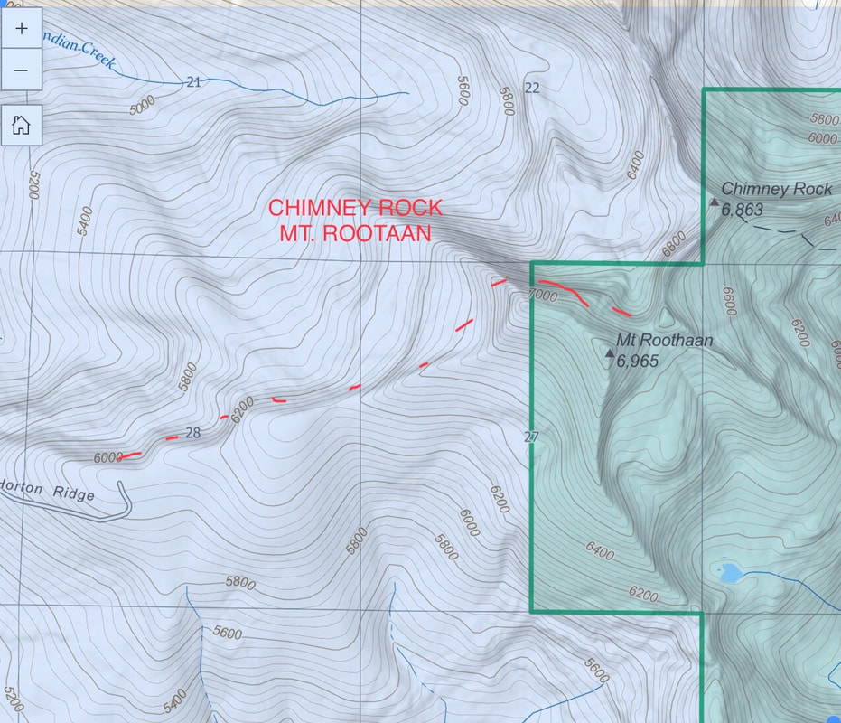
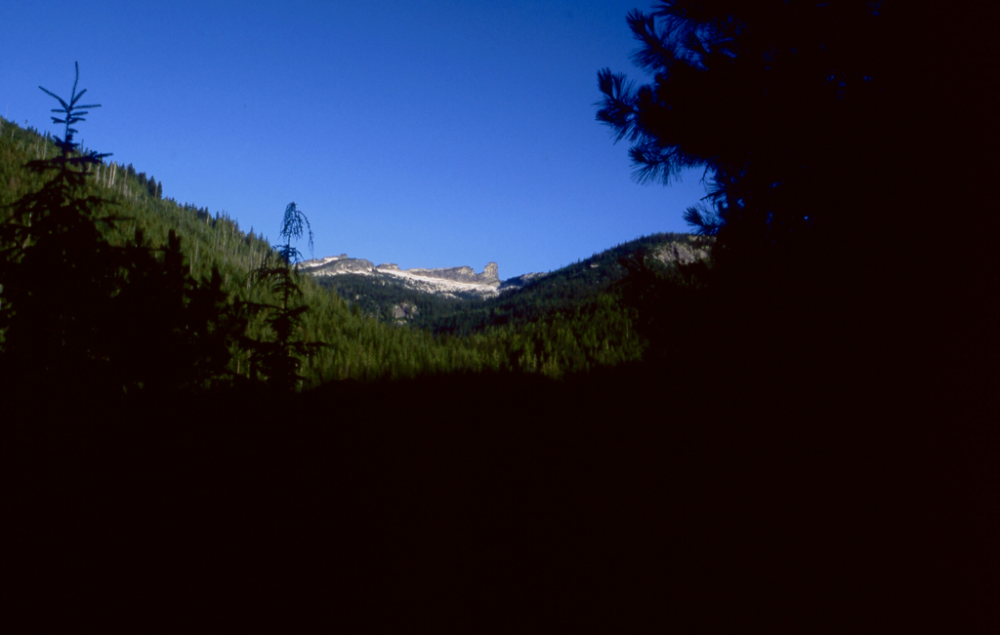
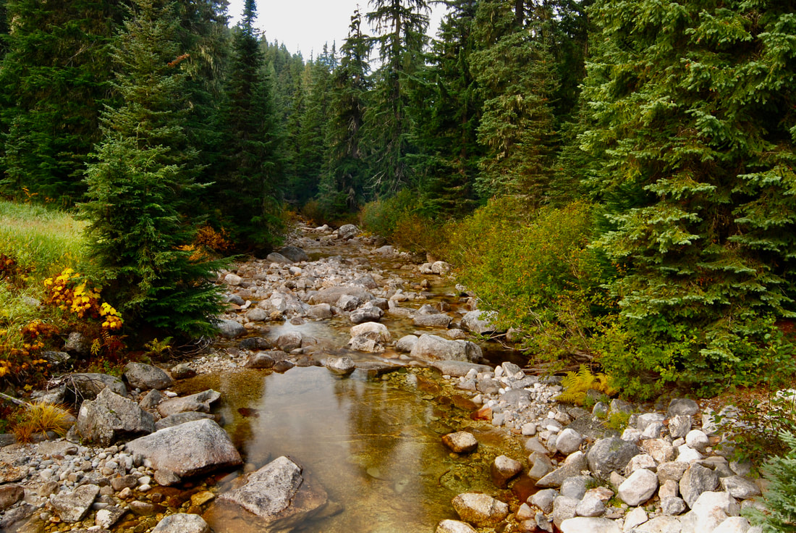
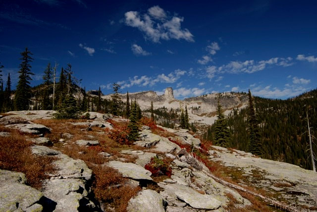
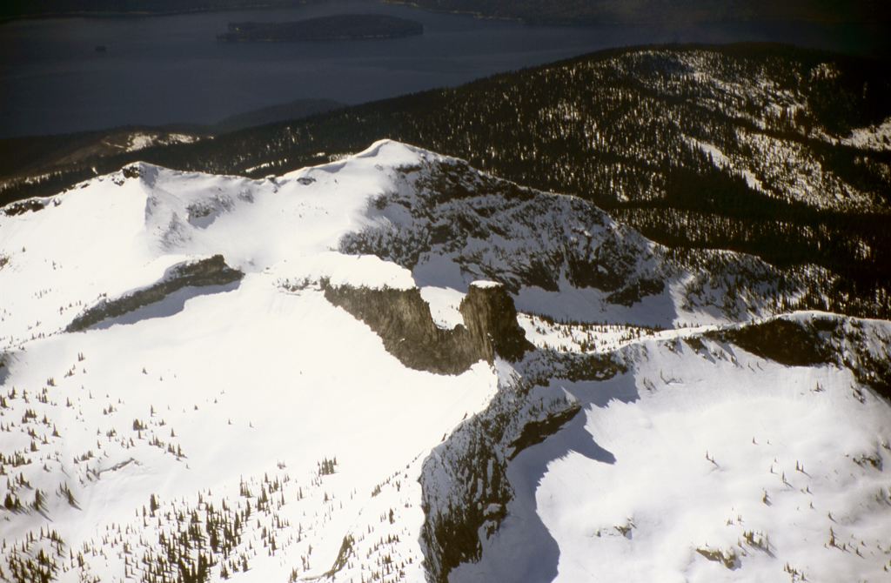
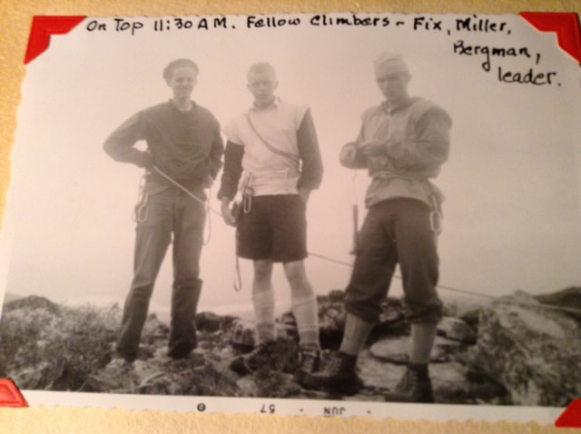
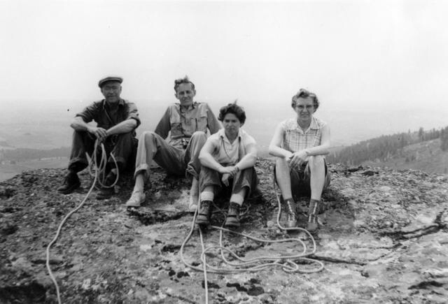
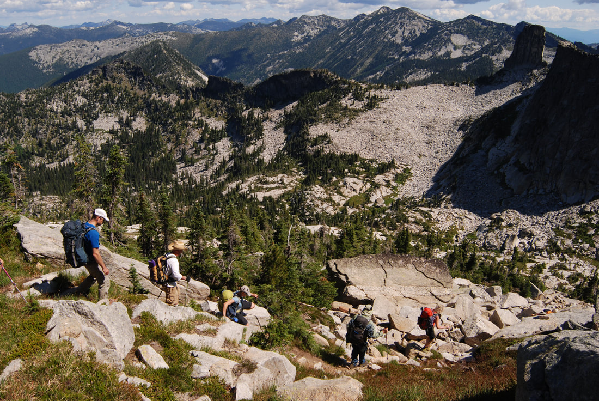
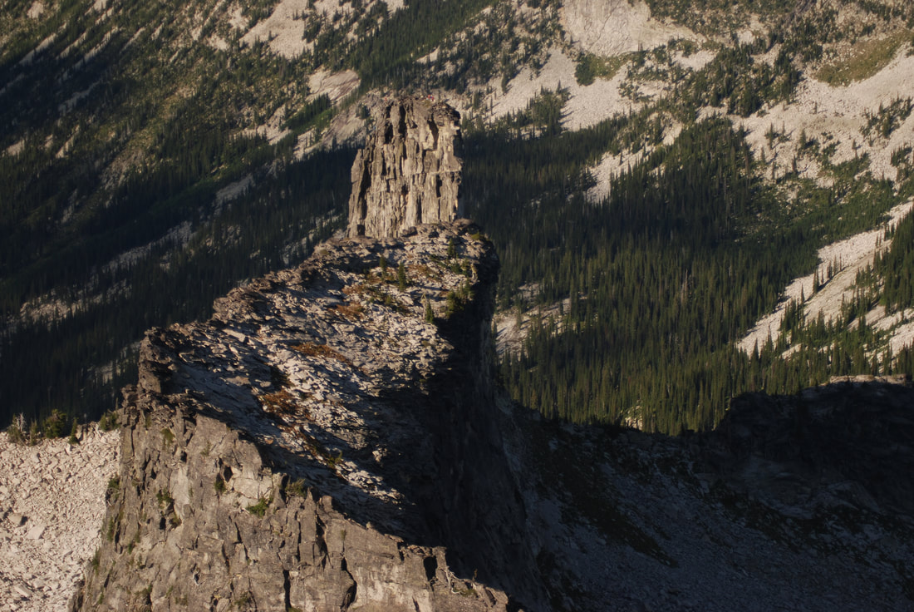
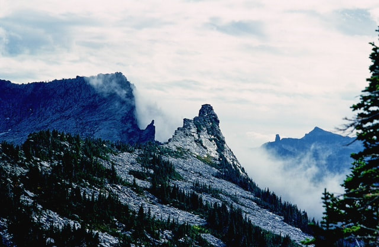

---
tags:
- Trails & Scrambles
- Moderately Easy
- Hiking
- Backpacking
- Climbing
stats:
- label: Event Type
  icon: hiking
  value: Hiking, backpacking, and Climbing
- label: Distance
  icon: map-marker-distance
  value: 5+ miles RT Easy, to Roothaan Saddle moderate, SE Face Chimney Rock challenging
- label: Elevation Gain
  icon: elevation-rise
  value: 1235' gain
- label: Difficulty
  icon: speedometer
  value: Moderately Easy
- label: Maps
  icon: map
  value: IPNF - Kaniksu N.F., USGS - Mt. Roothaan
- label: GPS
  icon: crosshairs-gps
  value: 48° 36’ 27.5"n 116° 44’ 08.7"w
- label: Ranger District
  icon: pine-tree
  value: Sandpoint R. D. 208.263.5111
- label: Bonner County Sheriff
  icon: shield-account
  value: CALL 911 FIRST or 208.263.8417
notes:
- Idaho panhandle national forest/alerts
- h[ttps://www.fs.usda.gov/alerts/ipnf/alerts-notices](https://www.fs.usda.gov/alerts/ipnf/alerts-notices)
---

# Mount Roothaan 7326 And Chimney Rock 7124 Trail 256

*Mt. roothaan 7326' and chimney rock 7124' trail #256*

## Description

We have added the areas sheriff’s emergency phone numbers for each trip write up under the ranger district
info. if an
emergency ocurrs, evaluate your circumstances and call only if needed.
***West route to Mt. Roothaan***
The trail starts on Horton Ridge and climbs slightly into the forest where it gets a little steeper until it

breaks out

of the forest and skirts the ridge to Mt. Roothaan's Saddle. From the saddle turn right (NE) and scramble up
to the high
rocky peak for .4 miles in 376 verts.

From the top of Mount Roothaan, the views in all directions are worth the drive and walk. Chimney Rock sits
about a mile
to the NNE. Gunsight Peak continue the Selkirk Crest to the north. To the west there is a knoll along the
ridge that
offers good views of Priest Lake.

***West route to Chimney Rock***
From the Roothaan Saddle walk the north edge until a trail appears and drops to the north.

From here to Chimney Rock the trail is sparse and very rough over boulders to the base of the rock.
To continue the hike, go to the north base of the rock and look for a narrow path around the rock. When the
trail
emerges from around the rock, set your compass to Mt. Roothaan. Along the east side of the rock, notice the
upper top
left of the face and the lighter colored rock. A few years ago a huge slab of the monolith broke off and
crashed to the
basin below.

As you make your way towards Mount Roothaan, the high meadows offer opportunities for wildflower and small
cascades.
Near Mount Roothaan, the scramble up to the top is moderately easy. To get to the saddle, follow a well used
trail down
the west side.

***East route to Chimney Rock***
The trail starts on the Pack River and climbs steadily up thru the forest until it breaks out on the granite

slabs.

Look for cairns to get you to the Chimney. Be sure to look back to see where the trail enters the woods. This
trail is
11 miles round trip with 2250 verts.. If your goal is to get to the rock, rock hop the rest of the way. For
great views
of the rock, find a soft place to have lunch and kick back. Retrace your steps down and pay attention to where
the trail
enters the woods.
On this route, there are 9 switchbacks after you have walked the 1.8 mile long nearly straight stretch.
Also be aware, there are 9 creek crossing of note ( not related to the 9 switchbacks). Five will be difficult
in the
spring and early summer.

## Option #1

No matter which trail you come in on, there is a cool circumnavigation around Chimney Rock, that includes the
summit of
Mount Roothaan.
East route:
As you get close to Chimney Rock, walk right (north) to the north face of Chimney Rock. Carefully examine the
route that
circles around the north face. This route requires each hiker to pay close attention to their footings and
hand holds.
There are enough trees and shrubs to use for support and protection as you walk around the face. In no time,
you will be
on the west face, and the walking becomes easier for a while. Now the chore is to find a faint "trail" that
leads you up
to the saddle on the west side. Once at the saddle, look for another faint trail that leads you up to Mount
Roothaan.
Enjoy the views from Mount  Roothaan. Your next route off of Mount Roothaan leads you south, then east around
the base
of  Mount Roothaan. From here you can hike cross country down towards the Pack River, keeping an eye out for
the many
trail cairns you came up on.

## Option #2

West route:
As you summit the ridge line trail from Horton Ridge, you will be on a saddle with Mount Roothaan on your
right (east).
Look for a faint trail heading down to the NW face to Chimney Rock. This trail fades as you enter several
boulder fields
on your way to the rock. Once at the rock, continue north to the edge. Look carefully for a small trail that
eventually
leads you around the NNE face of the rock. After circling the NNE face, start your ascent up towards Mount
Roothaan.
Once on top of Mount Roothaan, stop and enjoy a view of the American Selkirks laid out to the north. From the
summit of
Mount Roothaan, head NW down to the saddle you started your descent on Trail #256 heads west back to the
trailhead.

## Directions

***West route***
From Priest River head to the East Side Road and drive 4.5 miles to Hunt Creek Road #24 just across Hunt Creek

bridge.

Go 4.5 miles to a junction with FR #2, bear left and go 1.6 miles to FR #25. Stay straight for about a mile to
a fork
and bear right for .3 miles to another fork and bear left. About 2 miles up 25, the road is very rough. Don't
try to get
a car up it.

***East route***
Drive 10.5 miles past Sandpoint to Samuel. There is a sign and a gas mart on the west side of 95. Turn left

(west) up

the Pack River Road #231 for 17 miles and turn left (west) onto FR #2653 to the trailhead.

The USFS has not replaced the trailhead signs on the Pack River road yet, so consult a Forest Service map.

## Hazards

West Route
West road from Horton Ridge, to Mount Roothaan’s Saddle to the base of the Chimney Rock, is a serious scree
field.
East Route
More serious scree field East and south of Chimney Rock.

Mount Roothaan
Lots of rock hopping, then more serious to summit.

Circumnavigation
On any of the routes around Chimney Rock, use extreme caution while walking, scrambling, and especially
circling the
north face.
I would advise against taking small children around the rock. It requires a great deal of concentration and
effort. If
you do take children on this route, make 100% sure YOU are paying attention to their every move, as well as
your own
footing.
Have them walk in front of you to monitor their walk.

## Cool things close by

Fault Lake, Hunt Peak, Gunsight Peak, Harrison Lake & Peak, The Selkirk High Traverse, and Beehive Lake &
Dome.
Priest Lakes and Priest River, Hunt Creek Falls, Lion Head water slide, and of course, the Pack River itself.

## R & P

Jalapeños, Mr. Sub, Burger Express, Eichardt’s in Sandpoint

---

## Photo gallery

## A glimpse of mount roothaan & chimney rock from the pack river road

## Pack river from the trailhead bridge

*Picture (Image missing)*

## Along the west trail to mount roothaan

## Chimney rock from the eastern pack river trail

*Picture (Image missing)*

## Fall colors below the rock, are spectacular

## An aerial view of mount roothaan & chimney rock Flown by pilot galen

*Picture (Image missing)*

## Gunsight peak, mt.roothaan, chimney rock & Silver dollar peak from roman nose peak

---

*Picture (Image missing)*

## The american selkirks with mt roothan and chimney rock Image is from the wigs trail

## A 1957 summit of chimney rock by spokane mountaineers

*Picture (Image missing)*

## The east face of chimney rock, after the huge rock slab fell

## Spokane mountaineers, frank hefferlin, bill fix, na, helen stowell in 6.1958

## A spokane mountaineers climbing party heading towards chimney rock

## Chimney rock from mount roothaan

*Picture (Image missing)*

## A spokane mountaineers climbing party heading to the summit

## From along the selkirk crest high traverse, chimney rock & mt. roothaan in back

Whether you go into Nature for serenity or peace a walk amongst Nature will show you more than you can
imagine. It is a
fact that a walk in Nature soothes our souls, allows us to become centered. And as we returns to life, we are
changed.
chic    7.27.2924
