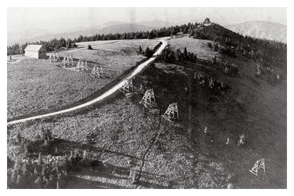
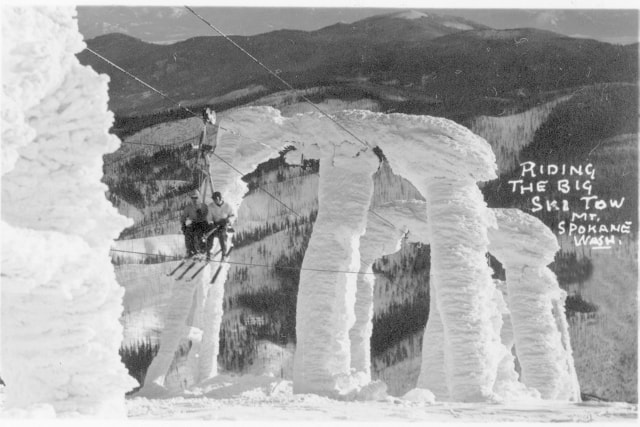
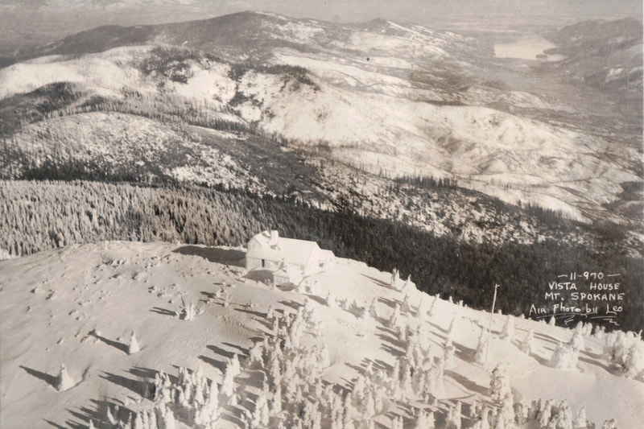
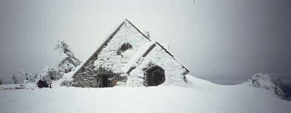
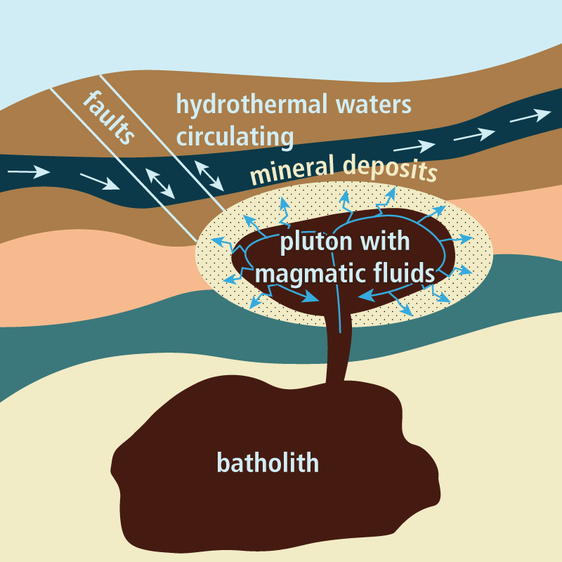

---
tags:
- Winter & Skiing
stats:
- label: Phone
  icon: phone
  value: 509.238.2220
- label: Acres
  icon: vector-square
  value: '1704'
- label: Average Snow Fall
  icon: weather-snowy-heavy
  value: 200"
- label: Summit Elevation
  icon: terrain
  value: 5889'
- label: Base Elevation
  icon: terrain
  value: 4400'
- label: Verts
  icon: arrow-expand-vertical
  value: 1689'
---

# Mount Spokane Ski  Snowboard Park

!!! warning "Before you go"

    Mount spokane ski & snowboard park Mountspokane.com

    *Spokane, wa*

## of named runs: 52

## of lifts: 6

Miles from spokane: 35 miles Other amenities: xc skiing & night sking

---

## Description

To contribute images, contact chic via this website

---

## Photo gallery

---

## The world's first double chairlift, built by riblet company, sppokane

## The chairlift was an ore hauler in a mine in wallace

*Picture (Image missing)*

## The author skiing in 1956

## An aerial image of the vista house

## The vista house in deep snow

*Picture (Image missing)*

## Mount spokane from the selkirk lodge

*Picture (Image missing)*

## A temperature inversion near the selkirk lodge

##

Mount spokane state park

scq'wulsm

Known as scq’wulsm to the Spokane Tribe, Mount Spokane has been important to local residents for 10.000
years.By
[Tracy L. Rebstock](https://spokanehistorical.org/items/browse?search=&advanced[0][element_id]=39&advanced[0][type]=is+exactly&advanced[0][terms]=Tracy%20L.%20Rebstock)While
Mount Spokane was never officially a Spokane Park, the Spokane Parks department helped take care of it and
was concerned with its future. Previously known as Mount Baldy and Mount Carlton, Mount Spokane got its name
in 1912. Spokane resident and businessman Francis H. Cook, also of Manito Park fame, purchased the summit of
the mountain and started a road to the top in 1909. It fell short of the summit by three miles but was
completed in 1912. The Cook family continued to use a small cabin on the mountain until 1926. The dedication
of Mount Spokane was attended by Governor Marion E. Hay, the first Miss Spokane (Marguerite Motie), Aubrey
L. White, and the Cook family in 1912. Frank W. Guilbert and the Inland Automobile Association felt the
mountain was important to Spokane as it brought tourists to the area. Other businessmen helped hold the land
including hotel owner, Louis M. Davenport and newspaper owner William H. Cowles. Mount Spokane State Park
was officially dedicated in 1927 with a total of 1500 acres. This was the first state park east of the
Cascades. In the 1930s the Spokane Ski Club, the Selkirk Ski Club, and the Spokane Mountaineers purchased
over 500 acres to use for the construction of lodges, rope-tows, and ski jump hills. The first double chair
lift was built in 1947. Today the Mount Spokane area includes 13,919 acres and the view from the top of the
mountain on a clear day includes surrounding states and Canada. People enjoy climbing, skiing, snow shoeing,
mountain biking, snowmobiling, horseback riding, and hiking.

##

Mount Spokane. What is it and why visit? The summit of Mount Spokane provides visitors with grand views of
eastern Washington. Sharp eyes can even glimpse mountains in the Cascades and Canada. The 5,883 foot-high
peak rises above the surrounding valley and can be seen for miles around. It is a popular weekend and winter
getaway for residents of nearby Spokane, located just an hour’s drive from the city. The summit features the
scenic Vista House, an old stone cabin built in 1933 using blocks of the mountain’s native granite. Enjoy
these gorgeous vistas while gaining an understanding of the broader geologic structures that shape the
landscape of the Okanogan.

The piles of granite boulders... are known as a ‘felsenmeer’ (a sea of rock) Mount Spokane is a piece of
Washington’s ancient geologic past, much older than the Cascade Mountains. Mount Spokane is part of the
Spokane Dome, a [metamorphic core complex](https://wa100.dnr.wa.gov/okanogan/washingtons-ancient-core) that
formed when pieces of the continent were stretched and pulled apart from each other. This movement allowed a
giant mass of granite known as a pluton to protrude upward and be exposed at the surface. A pluton forms
when magma solidifies underground rather than erupting onto Earth’s surface. Large-scale tectonic movement
and erosion is needed to reveal these hidden masses of rock. The Mount Spokane granite pluton was originally
created by two injections of magma. The first injection occurred during the mid-Cretaceous, about 100
million years ago, and the second injection occurred about 50 million years ago. These two injections formed
a large pool of magma, estimated at 25 miles long and 10 miles wide. The cooled mass of magma forms the core
of Mount Spokane and is the reason for the mountain’s rounded top. The pluton is clearly exposed on the
upper slopes of the mountain, which are covered in a blanket of granite boulders. The rocks at the summit
feature large crystals of minerals like quartz, mica, and feldspar. One type of granitic rock exposed on
Mount Spokane is known as ‘alaskite’. It is bright white due to the abundance of light-colored minerals in
its structure.

The piles of granite boulders found at the summit are known as a ‘felsenmeer’ (a sea of rock). Such piles
form when seasonal cycles of freezing and thawing break larger boulders into smaller, angular pieces. These
cycles were most numerous during the last ice age, prying apart the broad granite fields seen on Mount
Spokane today.

*Picture (Image missing)*

## Felsenmeer on the summit of mount spokane photo by dan coe, wgs/dnr

To learn more about the geological core of ancient washington Click on the following
<https://wa100.dnr.wa.gov/okanogan/washingtons-ancient-core>For a more in detail information on the way the
area was formed, from mount spokane to over 160 miles into canada, log onto....
<https://www.inlandnwroutes.com/american-selkirks.html>
