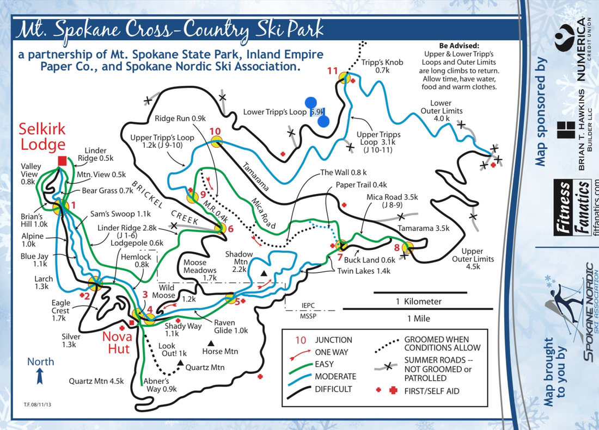
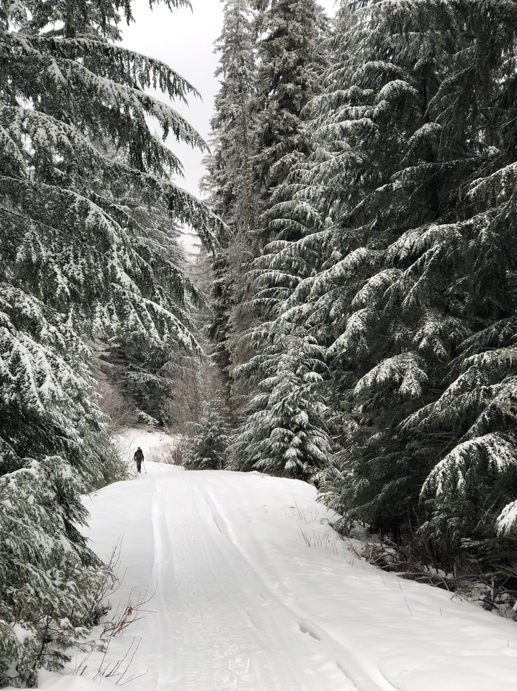
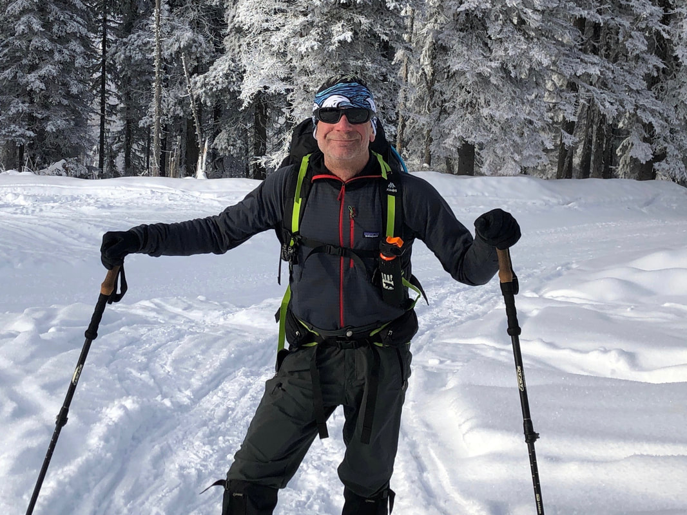
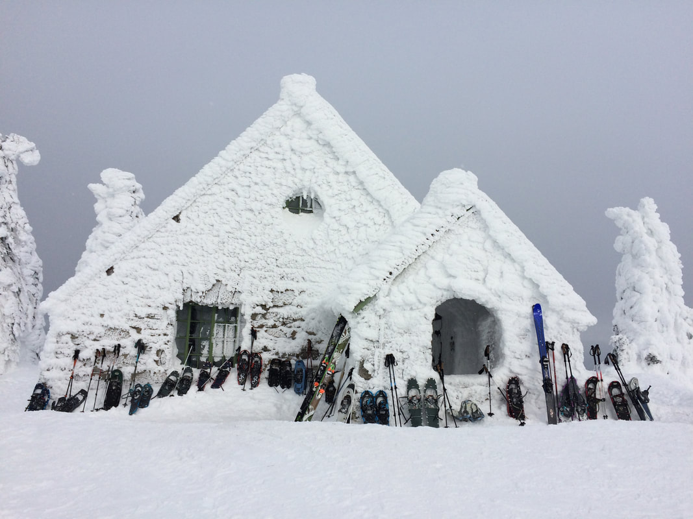

---
tags:
- Winter & Skiing
- Moderat
- Snowshoe
- Ski
- Mt Bike
stats:
- label: Event Type
  icon: ski
  value: Snowshoe, Ski, Mt Bike
- label: Distance
  icon: map-marker-distance
  value: 10.5 Miles
- label: Elevation
  icon: terrain
  value: 1,686 feet Ascent/Descent
- label: Difficulty
  icon: speedometer
  value: Moderat
- label: Maps
  icon: map
  value: '[Mount Spokane State Park Map](https://parks.state.wa.us/DocumentCenter/View/1912/Mount-Spokane-State-Park-PDF)'
- label: GPS
  icon: crosshairs-gps
  value: 47°54'17.0"n 117°06'07.6"w
---

# Mount Spokane Snowshoenordic Skibc Ski

*MOUNT SPOKANE 5,883’ Trail 130*

## Description

It is really kinda nice to have one of the southern most Selkirk Mountains in your back yard.

Trail 130 curcumnavigates the mountain with a low point of 3,693 feet and a high point of 5,183 feet (if you don't bag the peak). We did this route counter clockwise on snowshoes. That is probably the hardest way to do it. There is a road on the backside of the mountain that slopes down from Day Mount Spokane five miles down to Chair 4. If you are on skies going clockwise you could coast down most of it. It was painful to trudge up it.

One advantage of going counter clockwise is that you have shelter at about mile eight at the CCC Cabin to warm up and eat lunch before heading back down two miles to the trucks. Going clockwise the Cabin would be too early in the hike to have any benefit.

There really is not a good way to get across the ski area to properly complete the loop. We shuttled on the road verses waking it.

## Directions

RED TAPE: Starting December first the park becomes a snow park. Prior to December first you need a Discover pass after the first you need a sno-park pass. You need one or the other depending on the time of year. You do not need both. If you plan to use the groomed Nordic trails you need a Groomed Trail pass too. You do not need either to go to the ski resort. You can buy both on line here for $40 dollars each: <https://epermits.parks.wa.gov/Store/SNO/SnoChoice.aspx>

Take Highway 206 Mount Spokane Park Drive about 30 miles to the snowmobile parking lot. From there start hiking up trail 131 on up to 130 or take the Summit road up. It is a pretty straight forward hike around the backside of the mountain. Progress is measured by signs at each of the stream crossing simply labeling them by number descending down to Chair 4.

## Option #1

Hike up to the Bald Knob Campground and then follow the fall line straight up staying to the right out of the trees until you peak out and then eat lunch in the Vista House.

## Option #2

Nordic or skate ski the 36 miles of trails in this amazing park. Park up at the Selkerk Lodge. It has many tables and a pot belly stove. There are a couple more warming huts out on the trails. The trails range from easy to difficult so you can choose to take the hard way from point A to B or the easy way.

---

*Picture (Image missing)*

---

---

## Cool things close by

Side country skiing

## Hazards

It is not a short hike around the mountain. Bring food, water and warm clothes.

## R & P

Foggy Bottom Lounge, Big Barn Brewery

---

## Plan your trip

[Click for Current NOAA Weather Conditions](https://www.nws.noaa.gov/wtf/udaf/MapClick.php?lel=3500&uel=6000&polygon=47.944%2C-117.089%2C47.944%2C-117.131%2C47.919%2C-117.158%2C47.894%2C-117.104%2C&area=7)

## Photo gallery

---

---

## Co-author david crafton snowshoeing on mount spokane

---

*Picture (Image missing)*

## David chuggin' along on mount spokane

---

## The vista house on mount spokane's summit, on a busy day

---

---

---
