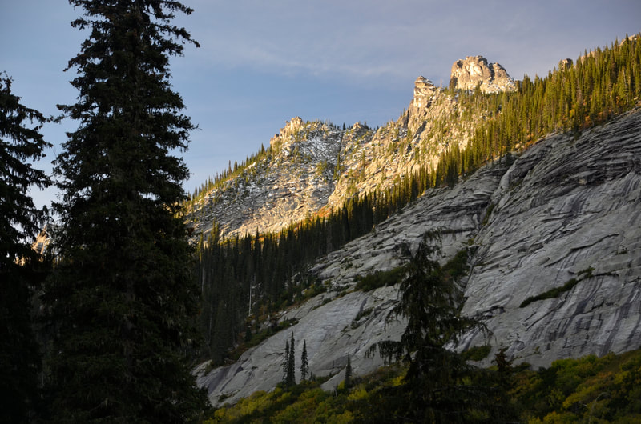

# Regional Mountains Photo Gallery

Explore high-resolution photography showcasing the rugged mountain ranges across North Idaho, Northwest Montana, Washington, and surrounding alpine regions. Click any image to view in high resolution via GLightbox.

---

## Featured Mountain Ranges Overview

| Mountain Range / Region | High Point / Peak Highlights | Primary Guides |
| :--- | :--- | :--- |
| **American Selkirks** | Parker Peak (7,670'), Chimney Rock (7,124') | [Selkirks Guide](../american-selkirks.md) |
| **Cabinet Mountains Wilderness** | Snowshoe Peak (8,736'), A Peak (8,634') | [Cabinet Wilderness Guide](../blog/posts/34-cabinet-mountain-wilderness.md) |
| **Proposed Scotchman Peaks** | Scotchman Peak (7,709') | [Scotchman Guide](../blog/posts/blog-58-proposed-scotchman-peak-wilderness.md) |
| **Bitterroots & State Line** | Stevens Peak (6,838'), Ward Peak (7,312') | [Silver Valley Guide](../silver-valley-area.md) |
| **Cascades & Canadian Rockies** | Fisher Peak (9,336'), Mount Hood (11,249') | [Regional Routes](../index.md) |

---

## American Selkirks Range

The American Selkirks stretch north from Coeur d'Alene into the Panhandle of Idaho, featuring iconic granite spires, alpine lakes, and rugged crests.

- 
  _Harrison Peak (7,292') - American Selkirks_

- 
  _Chimney Rock (7,124') & Mount Roothaan (7,326')_

- 
  _The American Selkirks from Shorty Peak (6,515')_

- 
  _Southern Part of American Selkirks, ID_

- 
  _American Selkirks from Blacktail Mountain_

- 
  _American Selkirks & Priest Lake from Blacktail Mountain_

- 
  _Selkirk Crest & SMI Hikers_

- 
  _American Selkirks from Bottleneck Ridge_

- 
  _Lookout Mountain (6,727') - American Selkirks_

- 
  _Upper Ball Lake & American Selkirk Crest_

- 
  _North Twin Peak above Beehive Lake - American Selkirks_

- 
  _Parker Peak (7,670') - American Selkirks_

- 
  _Abandon Peak (7,022') - American Selkirks_

- 
  _The Lion Head (7,288') - American Selkirks_

- 
  _West Fork Peak (6,416') Lookout Tower - American Selkirks_

- 
  _Lookout Mountain (6,727') Lookout Towers - American Selkirks_

- 
  _Smith Peak (7,653') from near Lion Head Peak - American Selkirks_

- 
  _South Twin Peak to Gunsight Peak (7,352') - American Selkirks_

- 
  _Abandon Mountain & Trail Guide - American Selkirks_

- 
  _The Lion Head from West Fork Lookout - American Selkirks_

- 
  _Selkirk Crest from Little Harrison Lake - American Selkirks_

- 
  _The Lion Head (7,288') - American Selkirks_

- 
  _Peak 7,171' & Harrison Peak (7,292') - American Selkirks_

- 
  _Aerial View of Chimney Rock (7,124') & Mount Roothaan (7,326')_

- 
  _Lookout Mountain (6,727') Towers - American Selkirks_

- 
  _Selkirk Crest - American Selkirks_

- 
  _Route to Parker Peak (7,670') - American Selkirks_

- 
  _Harrison Lake & Harrison Peak (7,292') - American Selkirks_

- 
  _Southern Selkirk Crest from Harrison Peak_

- 
  _Lion Head Peak (7,288') from West Side - American Selkirks_

- 
  _North Twin (7,599') & Hiker above Little Beehive Lake_

- 
  _Cirque of Spires Ridge on Climber's Trail to Lion Head_

- 
  _North End of Selkirks with Little Harrison Lake Below_

- 
  _Abandon Peak (7,022') & Trail Guide - American Selkirks_

- 
  _Burton Peak (6,844') above Kootenai National Wildlife Refuge_

- 
  _Phoebe's Tip, The Mollies, and Joe Peak from Priest Lake_

- 
  _The Lion Head Group - American Selkirks_

- 
  _Hooknose Mountain (7,210') above Pend Oreille River_

- 
  _East Face of Ridge between Chimney Rock & Mount Roothaan_

- 
  _Chimney Rock from East Pack River_

---

## Cabinet Mountains Wilderness

Located in Northwest Montana, the Cabinet Mountains Wilderness contains some of the highest, most glaciated peaks in the region, including Snowshoe Peak and A Peak.

- 
  _Unnamed Mountain near Lower Ibex Lake - Cabinet Mountains Wilderness_

- 
  _Chicago Peak (7,018') - Cabinet Mountains Wilderness_

- 
  _St. Paul Peak (7,714') from Cliff Lake Trail - Cabinet Mountains Wilderness_

- 
  _East Face of A Peak (8,634') - Cabinet Mountains Wilderness, MT_

- 
  _Ibex Peak (7,146') - Cabinet Mountains Wilderness_

- 
  _Leigh Lake & Scrambling Bockman Peak (8,174') - Cabinet Mountains Wilderness_

- 
  _Chicago Peak (7,018') & Cliff Lake - Cabinet Mountains Wilderness_

- 
  _Lenz Peak (7,298'), Alaska Peak (7,006'), and Dad Peak (6,790') - Cabinet Mountains Wilderness_

- 
  _Ibex Peak (7,676') - Cabinet Mountains Wilderness_

- 
  _Engle Peak (7,583') - Cabinet Mountains Wilderness_

- 
  _Ibex Peak (7,676') - Cabinet Mountains Wilderness_

- 
  _Chicago Peak (7,018') - Cabinet Mountains Wilderness_

- 
  _A Peak (8,634') & Snowshoe Peak (8,736') - Cabinet Mountains Wilderness_

- 
  _A Peak (8,634') & Snowshoe Peak (8,736') - Cabinet Mountains Wilderness_

- 
  _A Peak (8,634') - Cabinet Mountains Wilderness_

- 
  _A Peak (8,634') from Blackwell Glacier - Cabinet Mountains Wilderness_

- 
  _Leigh Lake from Summit of Snowshoe Peak (8,638')_

- 
  _Unnamed Mountain West of Rock Peak, Cliff Lake Area - Cabinet Mountains Wilderness_

- 
  _Scrambling South Face of Bockman Peak (8,174') above Leigh Lake_

- 
  _Lower Geiger Lake - Cabinet Mountains Wilderness_

- 
  _SE Face of Chicago Peak (7,018') above Cliff Lake - Cabinet Mountains Wilderness_

- 
  _Elephant Peak (7,938') from St. Paul Lake - Cabinet Mountains Wilderness_

- 
  _Chicago Peak (7,018') - Cabinet Mountains Wilderness_

- 
  _Leigh Lake, Snowshoe Peak (8,736'), & A Peak (8,634') - Cabinet Mountains Wilderness_

- 
  _Cedar Lake & Dome Mountain (7,560') - Cabinet Mountains Wilderness_

---

## Proposed Scotchman Peaks Wilderness

Straddling the Idaho-Montana border near Clark Fork, the Scotchman Peaks feature steep vertical drops above Lake Pend Oreille and rugged alpine ridges.

- 
  _Sawtooth Mountain - Proposed Scotchman Peaks Wilderness_

- 
  _Sawtooth Mountain (6,763') - Proposed Scotchman Peaks Wilderness, MT_

- 
  _Scotchman Peak (7,709') - Proposed Scotchman Peaks Wilderness, MT_

- 
  _Scotchman Peak (7,709') from Sawtooth Mountain_

- 
  _Middle Mountain in Proposed Scotchman Peaks Wilderness from Sawtooth Mountain_

- 
  _Scotchman Peaks & Cabinet Mountains from The Mollies_

- 
  _Cabinet Mountains Wilderness & HWY 56 from Pillick Ridge_

- 
  _Billiard Table Mountain (6,622') - Proposed Scotchman Peaks Wilderness_

- 
  _North Face of Sawtooth Peak - South Fork Ross Creek Drainage_

---

## Bitterroot Mountains & State Line Peaks

Spanning the Coeur d'Alene and St. Joe river drainages along the Idaho-Montana border, the Bitterroot Mountains feature dramatic cirques, historic trail systems, and high elevation passes.

- 
  _Stevens Peak & West Willow Ridge_

- 
  _Stevens Lake & Stevens Peak (6,838')_

- 
  _Mineral Ridge & Silver Tip Overlook_

- 
  _Stevens Peak (6,838') from Upper Stevens Lake_

- 
  _Family Hiking to Stevens Peak from Gold Hill Trail, Idaho_

- 
  _Stevens Peak (6,838') from Upper Stevens Lake_

- 
  _Pear Lake near Blossom Lakes, ID/MT Border_

- 
  _Stevens Peak (6,838') & Avalanche Paths_

- 
  _Stevens Lake & Peak from State Line Ridge_

- 
  _Ward Peak (7,312') - Idaho/Montana Border_

---

## Cascades, Canadian Rockies & Further Afield

Highlights from neighboring ranges including the Canadian Rockies, the Cascades, the Bugaboos, and international expeditions.

- 
  _Mount Hood from White Salmon, WA_

- 
  _Fisher Peak (9,336') - BC, Canada_

- 
  _Canadian Rockies & Nicol Lake from Fisher Peak (9,336')_

- 
  _Fisher Peak (9,336') - BC, Canada_

- 
  _Snowpatch Spire in the Canadian Bugaboos_

- 
  _Fitz Roy Massif - Patagonia, Argentina_

