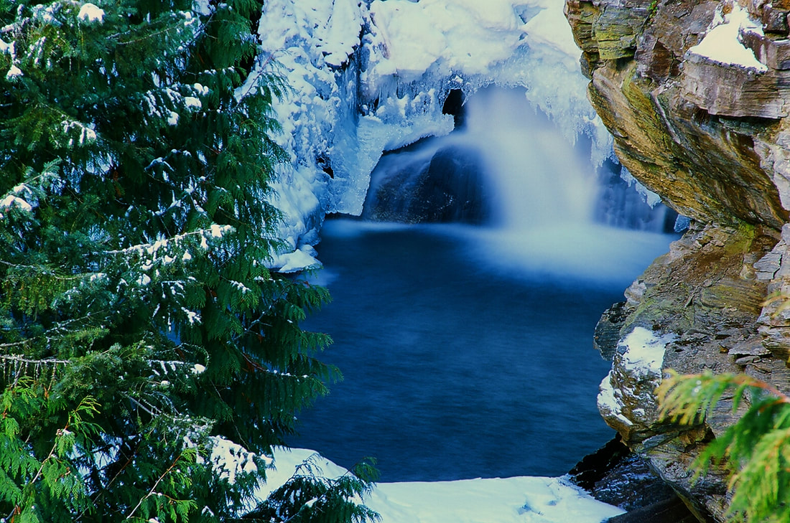
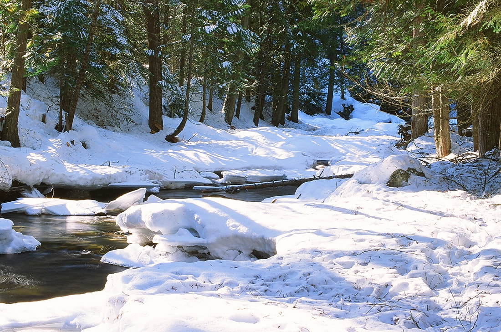
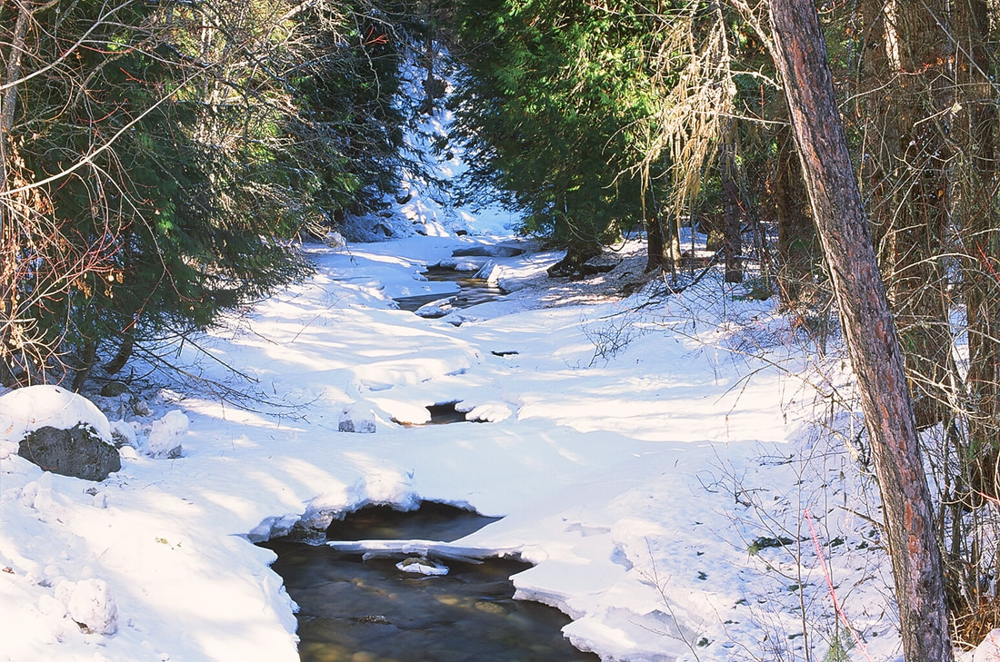
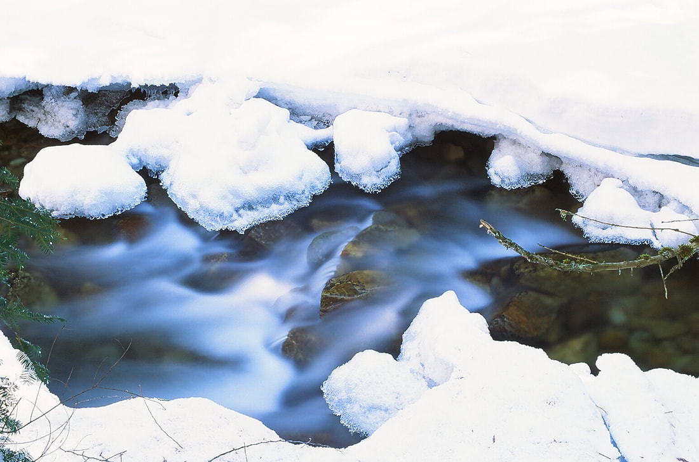

---
tags:
- Waterfalls
stats:
- label: Waterfall
  icon: waterfall
  value: Myrtle Creek Falls
- label: Drop
  icon: arrow-collapse-down
  value: 100' in two drops
- label: Waterfall Type
  icon: waterfall
  value: Tiered
- label: Distance Car to Falls
  icon: map-marker-distance
  value: .2 miles
- label: Maps
  icon: map
  value: I.P.N.F., KOOTENAI National Wildlife Refuge, Moravia topo
- label: GPS
  icon: crosshairs-gps
  value: 48°’42"23" n 116°25’09" w
---

# Myrtle Creek Falls

## Description

Myrtle Falls and Creek are located within the Kootenai National Wildlife Refuge, and are easy to get to.

However, the overlook can be very dangerous. stay behind the cable. and watch your children very carefully.

From the Refuge office and restrooms, walk across the street to the parking area. The trail heads west and
soon crosses
a bridge built to last any water surges. Continue up a short distance up to the overlook.
You will notice the waterfalls slices thru the rock cliffs. Near the bottom, is a tier that splashes water out
towards
the overlook. but the water never reaches the overlook.

## Option #1

Once done at the overlook, walk back towards the bridge. IN LOW WATER, you can drop down the creek and walk
the very
scenic creek for about .1miles to where Myrtle Creek crosses the road.
In the Winter, this falls and creek are exceptionally photogenic.

## Directions

As you drive thru Bonners Ferry, you will come the the Kootenai River.
Before crossing the river, turn left (W) onto Riverside Street. Be sure to drive no faster then the posted
speed. I've
been pulled over here at 28 mph.
Anyway, continue west on Riverside Street along the Kootenai River where it will turn left (W) over Deep
Creek.
Staying on Riverside to where it meets up with the West Side Road #18. On older maps this was F.R.418.

The road bears right, and in a short distance you will see the Myrtle Falls parking area. There is a restroom
across the
street with parking.
See Kootenai National Wildlife Refuge under HIKE...Idaho...K.N.W.R.

---

## Cool things close by

U.& L, Snow Falls, Roman Nose Lakes & Peak, Cooks Lake, Trout & Big Fisher Lakes, Burton Peak, Myrtle Lake &
Peak,
Pyramid-Ball Lakes, Fisher Peak, Long Mountain Lake, Parker Peak, and West Fork Lake, Peak and Lookout.

## Hazards

All waterfalls are a hazard, due to their slippery nature. always be extra careful near any waterfall.

Please watch your children at the overlook. stay behind the cable.

## R & P

Burger Express, Wok-a-Mole, and the Pizza actory

---

## Plan your trip

Click for Current NOAA Weather Conditions

## Photo gallery

*Picture (Image missing)*

## Myrtle creek falls at the kootenai national wildlife reguge

*Picture (Image missing)*

## Lower section of myrtle falls

## Below the lower section pictured above

## Myrtle creek down creek from  the bridge

## Myrtle creek

*Picture (Image missing)*

*Picture (Image missing)*
