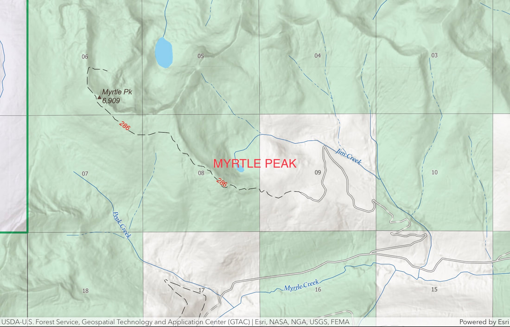

---
tags:
  - Lakes
  - Moderately Difficult
  - Hike
  - Backpack
  - Mt Biking
stats:
  - label: Event Type
    icon: hiking
    value: Hike, backpack, mt biking
  - label: Distance
    icon: map-marker-distance
    value: 6 miles RT to the peak and 9.6 miles RT to the lake
  - label: Elevation Gain
    icon: elevation-rise
    value: 1682' gain to the peak 1172' loss to the lake
  - label: Acres
    icon: vector-square
    value: '19.8'
  - label: Difficulty
    icon: speedometer
    value: Moderately difficult
  - label: Maps
    icon: map
    value: IPNF-Kaniksu N. F., USGS-Roman Nose, The Wigwams, Smith Peak
  - label: GPS
    icon: crosshairs-gps
    value: n48° 44’ 12.4" w116° 36’ 19.0"
  - label: Ranger District
    icon: pine-tree
    value: Bonners Ferry R.D. 208.267.5561
  - label: Boundary County Sheriff
    icon: shield-account
    value: CALL 911 FIRST or 208.267.3151
notes:
  - label: Idaho Panhandle National Forest Alerts
    url: https://www.fs.usda.gov/alerts/ipnf/alerts-notices
---

# Myrtle Lake 5950 & Myrtle Peak 7122 Trail 286

## Description

We have added the area's sheriff emergency phone numbers for each trip write-up under the ranger district info. If an emergency occurs, evaluate your circumstances and call only if needed.

Trail #286 begins on private timberland that has been heavily logged, but soon enters the forest and climbs steadily for 3 miles to the summit of Myrtle Peak Trail. Because this section of the trail is on a southern aspect, in summer it's very hot for most of the 3 miles. As you approach the corner, the trail circles the summit on the SW side. From the summit, the views all around of the American Selkirks are outstanding. Kent Peak (7243') and especially Kent Lake are rarely seen in all their glory.

To get to Myrtle Lake, drop down the north side of the peak as the trail drops 1172' to the lake. Myrtle Lake is one of the largest in the American Selkirks, and directly above the lake is a memorable pyramid-shaped peak.

## Directions

From the Kootenai Wildlife Refuge, drive 1.3 miles to the Myrtle Creek Road #633. Turn left (west) onto FR 633 for 10 miles to FR 2406 and turn right (NW) for 3 miles to the end of the road. Along the road to the trailhead, there are two tight switchbacks. Stop here and take in the views of the Kootenai National Wildlife Refuge and the spectacular Purcell Trench.

## Hazards

A 1172' drop to the lake. The trail from the start is relentless. Then add the sun. Please take extra caution and water, as it’s hot in the summer.

## Cool Things Close By

Burton Peak, Myrtle Creek Game Preserve, Two Mouth Lakes, Cooks Peak & Lake, Kootenai National Wildlife Refuge, and the northern trail to Harrison Lake.

## R & P

Jalapeños, Mr. Sub, Burger Express, Eichardt’s in Sandpoint.

## Photo Gallery

_Myrtle Lake Trail._

_Additional images coming soon._
