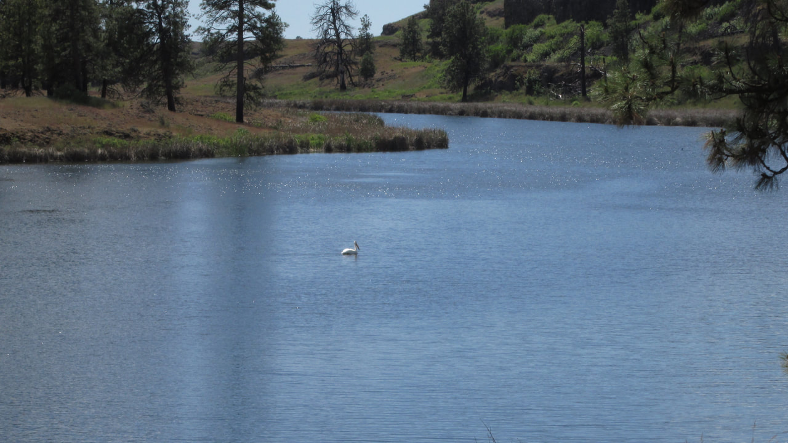
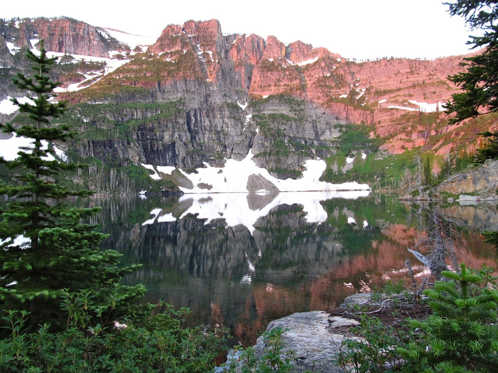
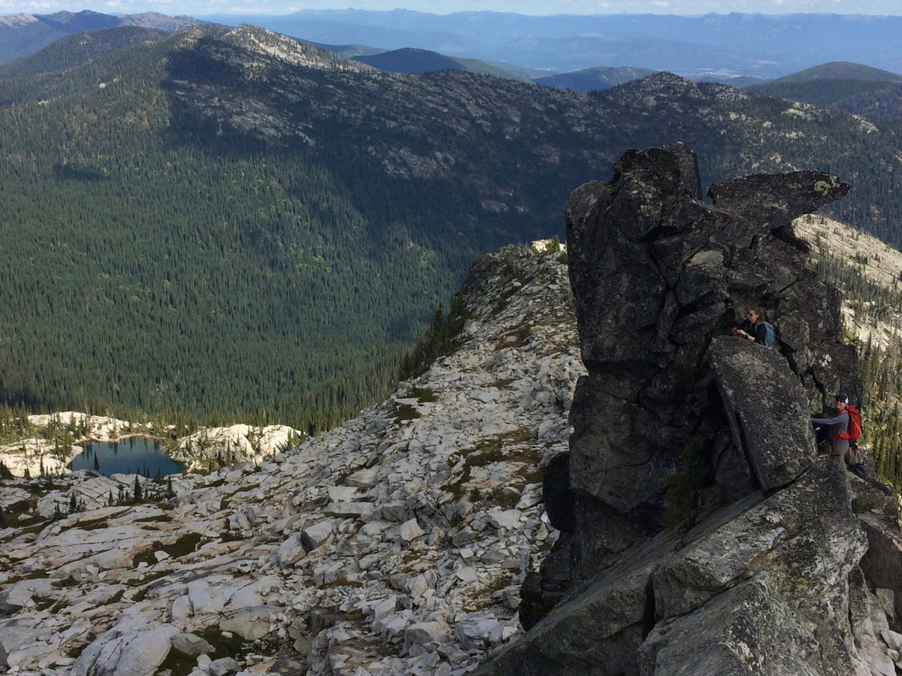

# Newsletter And Website Updates

## Register to get route updates

\* Indicates required field

Email \*

I agree to receiving marketing and promotional materials

\*

Subscribe to Newsletter

---

## 24-november-2020 newsletter issue #1

### Picture (Image missing)

Nature Enthusiasts,

First and foremost, thank you for using our website. It’s a privilege for us, to provide up to date hiking
and other outdoor activities for you.

Two years ago, after a Spokane Mountaineers Clean Up and Trail Maintenance at Stevens Lake, fellow member
David Crafton and I discussed the website he was building. I had always wanted to design a coffee table
photo guide of our region’s great places to play. But the cost was prohibitive. So when I got home, I looked
up David’s website. A spark went off in my imagination. A week later, I proposed a cooperation between us to
build the website you see today.

As David as the IT guy, and me writing and using our images, we agreed on the creation of the website. I
spent over a year, researching and writing the text for each hike, while David created the website and
template we are using. Today, you see our efforts in that cooperation.

During the writing and building of the website, I came up with all the things I’d like to see on our
website.

One main goal, was to appeal to all levels of ability in the mountains.

Hence, we added to the template, the "OPTIONS" section to each hike.

It’s one thing to hike, for instance, to the upper Roman Nose Lakes, but by adding "OPTIONS" to each hike
for those who likes to explore, we appeal to even the most adventurous hikers. The "OPTIONS" we list are for
those capable of off trail hiking. Or as the Spokane Mountaineers call it, chicwackin’. Yes, they are more
difficult, and often require better navigational skills, but they take you to the most beautiful places
around each listed hike. I would like to state, that these "OPTIONS" aren’t for everyone. But for those who
wish to explore, they are outstanding.

One of the things I like most about going to these places, is to see from up high, where else we can go
play.

Seeing Roman Nose Peak from Beehive Lake, Harrison Peak, or Katka Peak, puts the whole area into
perspective. The more you see from different vantage points, the more you will understand the perspective of
an area.

When you look at our website, you will notice the top section that explains the particulars of the hike.
Please be aware, that any two or three GPS units on the same hike, will give you sometimes vastly different
readings. For that reason, I use a format that we all can use in unison. All of my general distance
measurements and GPS coordinates are from Goggle Earth.

The actual hiking distances are from the local USFS maps and data and a collection of guidebooks. But the
distance from this lake to that ridge, is from Goggle Earths measuring devise. I don’t give an estimate of
hiking times, because, being a geezer, I hike slower, then a person half my age. Not all hikes are
successful. There may be washouts, road construction, and a number of other reasons you can’t get to the
trailhead. For that reason, we list "COOL PLACES CLOSE BY". They are like hikes, close by, just in case you
can’t make it to your original destination. ALWAYS take with you to the trailhead, and on your hike, a USFS
Forest regional map. If you can’t get to the trailhead, your Forest map, and our suggestions, may save the
outing. Topo maps or copies on your phone, will give you enough info to proceed to a different location.

Also, on our landing page, is an "ALERT" notice. This last year, the Boundary County Roads and Bridges
Department, replaced a bridge 600’ south the road to a major trailhead. Drivers had to do an hour drive via
Hwy 95 and State Hwy 1 up near the Canadian border, just to get to the desired trailhead. We hope this type
of info can save us all, some aggravation.

Lastly, in the description for a hike, there is important info on where to eat after a hike. These
Restaurants and Pubs are places I’ve been to, and can recommend. I would like your input, not only on my
suggestions, but we encourage you to let us know of places you’ve visited that offer great food and drink.

Other features in the drop down menu, are geographic, geologic, and/or other historical data. Click on, for
instance, American Selkirks twice. This will bring up data on the area. And in the case of the American
Selkirks, I guarantee you will be amazed. But take with you, your imagination. I’m still blown away at what
I discovered. The section on the Washington Scablands, explains why our region, to the west is so
spectacular. I’ll bet you never knew that we live in an area that was once, Earth’s greatest catastrophe.

In the drop down selection, I’ve included "THE 13 ESSENTIALS". Please read this section. I have a 13
essential pouch in every one of my packs, wether in hiking or paddling or whatever. They are things that
very well could save your life. And PLEASE, PLEASE, if you hike with a spouse, make sure they have their own
pack with the 13 essentials, warm clothing, AND FOOD. Stuff happens in the mountains. If you are carrying
all the food and essentials, and your spouse gets separated from you, what is your spouse going to eat or
survive on, or start a fire with?

And PLEASE, if you see anything that is not correct, let us know so we can make the necessary changes,
deletions, or corrections.

You can contact us thru the website about particulars on hikes or paddles. But be aware. We are out playing
a lot, doing research for the site, etc.

Hahaha! Please plan ahead.

David Crafton and Chic Burge
[InlandNWRoutes.com](http://click.promote.weebly.com/ls/click?upn=BFext720ecjbG8SoLEWOvwPvA8MAiQ3Iij-2FpZqBfqkW0yFa0-2FxkvNUhmmKmzlrZmsYgksxyCKmtLbtUoy0nGTg-3D-3DuYej_sB1sIsV6cNR1Kurj82phwakimyCrMEm9SZLntnfN5X2vnDvHl40SsSNAte9wgtzdKu8EcFe5OoShkVYCUIG85YD0oBBiLEtnJmAkIfgVKCt-2BCdFaJsvHSO0SAsqGSI9zSt3lhfbgEnBvljvVvTRp9LXzYcCUTtYdKS0zRHKn5l2KyQgcmt-2BvEkKeos-2B2hK1371Eisu1Ts5sOE-2BReMC5Qw1w9jnb8NkrYSJ2HqU6vlU1uChfteZT9Z9-2BBQoRsuDYb9ClqnGcUFNGIFLvX5Ygpar35yu3vZNroiix1y996SKnubXGHzrDLvv5KuARd5TH-2Bd7jGmAEvtYJfGBTeyPL57yTgeH0bIU5KHh3jRD8v5SZGLvAroDciX7CxHwpajFsgDrTKKQtEmsQ70K-2FnzIdfVD5IALi6sSc8h-2F5q1Ab1CGrT035x2d2lxAeY4Wyn-2F-2FPjA-2FYBkZPrgDx50dJ1RELzyOYEmNpeDvylQpg-2FyQ5vMxQ-3D)

---

## 01-september-2020

[Idaho Trails Map - Zoom in and find your trail! <https://trails.idaho.gov>](https://trails.idaho.gov)

---

## 20-june-2020

We started working on the [Paddle Routes](mountains/index.md) section. Check back over the next couple weeks as
we update the routes.

[*Picture (Image missing)*](mountains/index.md)

---

## 05-june-2020

[Added Saltese Flats Wetland Trail](hike/washington/spokane-county-parks/saltese-flats-wetland-trail.md)

[*Picture (Image missing)*](hike/washington/spokane-county-parks/saltese-flats-wetland-trail.md)

---

## 30-may-2020

[Added Stevens Peak via West Willow Ridge](hike/idaho/silver-valley-area/stevens-peak-via-west-willow-ridge-6838.md)

[*Picture (Image missing)*](hike/idaho/silver-valley-area/stevens-peak-via-west-willow-ridge-6838.md)

---

## 25-may-2020

[Added Fishtrap Lake Paddle](paddle/washington/scablands/fishtrap-lake-wa.md)

---

## 16-may-2020

[Added a table of the land managers and phone numbers](managing-agencies.md)

---

---

## 20-april-2020

[Added Cedar Lake in the Cabinet Mountain Wilderness](hike/montana/cabinet-mountains-wilderness/cedar-lake-5914.md)

---

## 3-april-2020

[Added Burton Peak in the Selkirks](hike/idaho/american-selkirks/burton-peak-6844-trail-9.md)

[*Picture (Image missing)*](hike/idaho/american-selkirks/burton-peak-6844-trail-9.md)

---

## 25-mar-2020

Updated many routes including: [Little Harrison Lake 6271'](hike/idaho/american-selkirks/little-harrison-lake-6271--peak-7292.md)
Selkirks [Harrison Lake & Peak 7292'](hike/idaho/american-selkirks/harrison-lake--peak-7292-trial--217.md). Selkirks
[Mount Roothaan and Chimney Rock 7124'](hike/idaho/american-selkirks/mount-roothaan-7326-and-chimney-rock-7124-trail-256.md) Selkirks
Rock Lake, C.M.W. Granite Lake CMW Lower & Upper Geiger Lakes & Lost Buck Pass CMW Cliff Lake, Chicago Peak,
St. Paul Peak CMW Ward & Eagle Peaks Bitterroots Lower & Upper Blossom Lakes. Bitterroots & Silver Valley
Area Red Top. Selkirks Little Harrison Lake. CMW Beehive Lakes. CMW Long Mountain Lake & Peak. Selkirks Hunt
Lake. Selkirks Selkirk Crest High Traverse. Selkirks Mount Roothaan & Chimney Rock. Selkirks Pyramid-Ball
Lakes. Selkirks Harrison Lake. Selkirks Leigh Lake, CMW Roman Nose Lakes & Peak. Selkirks Cabinet Divide
Trail

## 360. CMW

Cliff Lake, Chicago Peak, St. Paul Peak

---

## 22-jan-2020

[Added Deer Creek Nordic Sno-Park](ski/backcountry/deer-creek-nordic-sno-park.md)

[*Picture (Image missing)*](ski/backcountry/deer-creek-nordic-sno-park.md)
