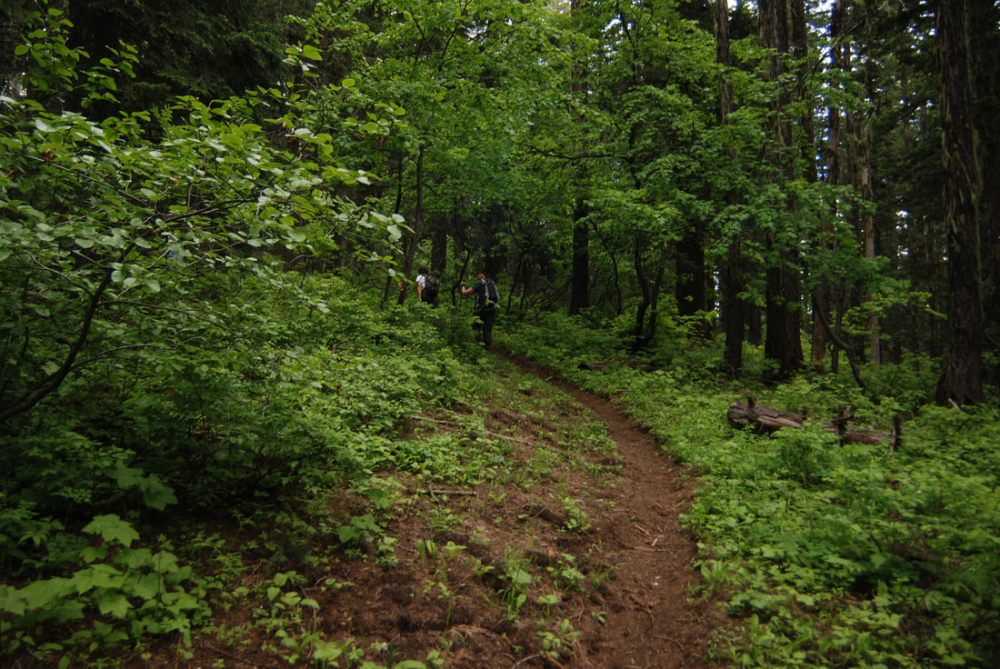
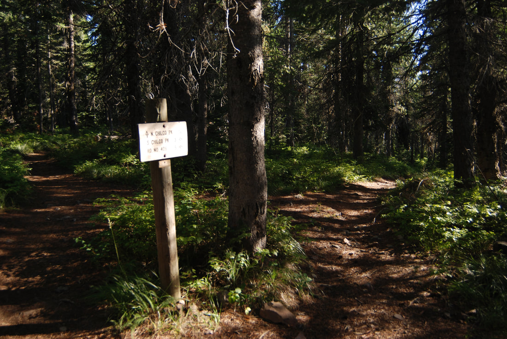
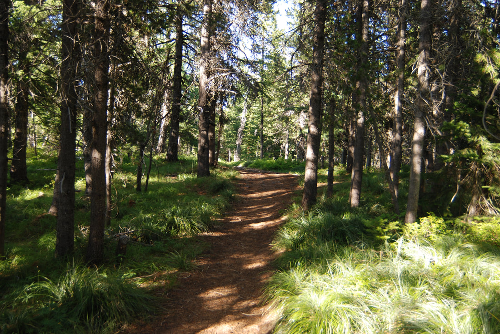
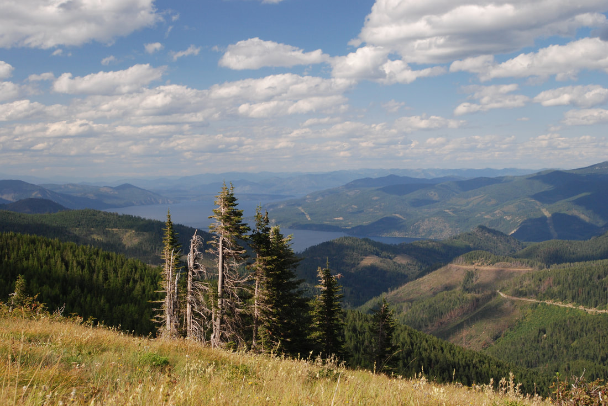
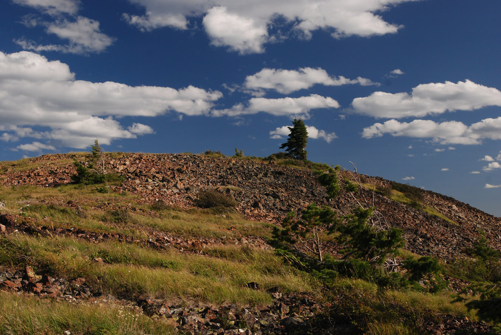
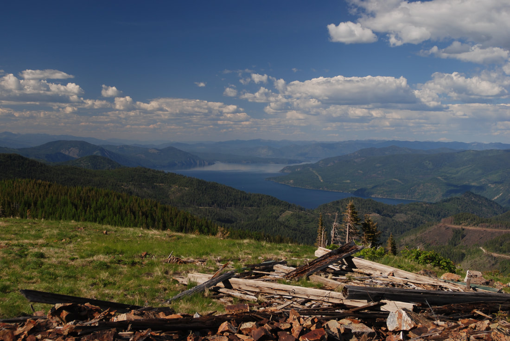
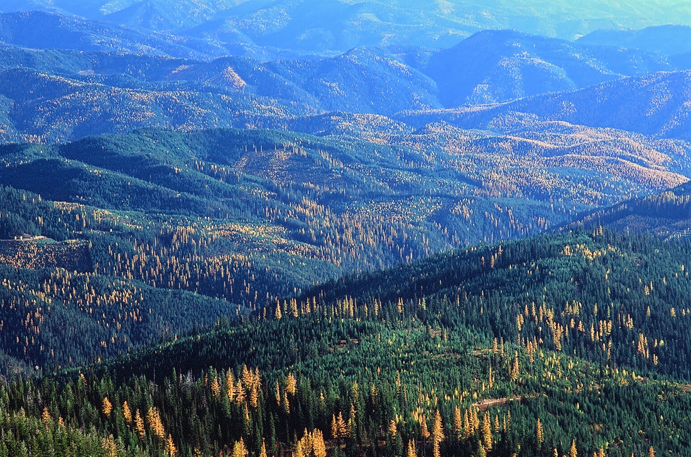
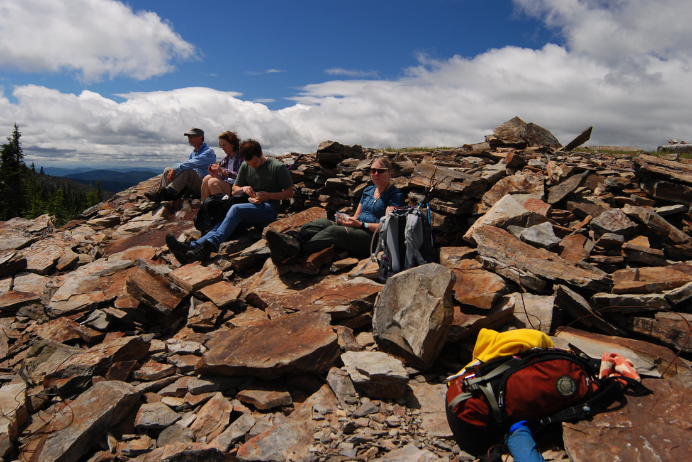
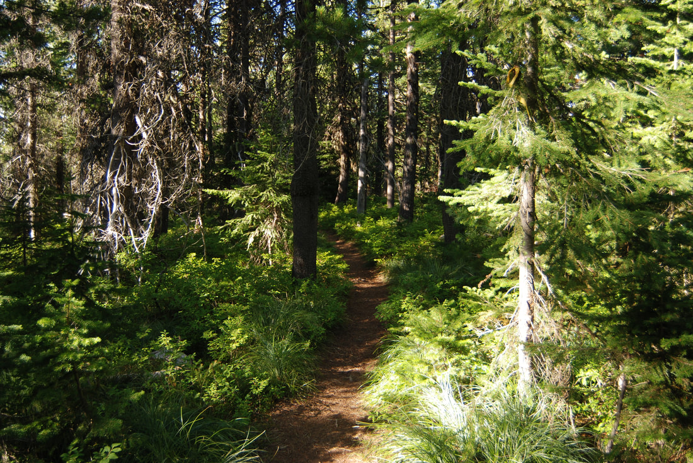
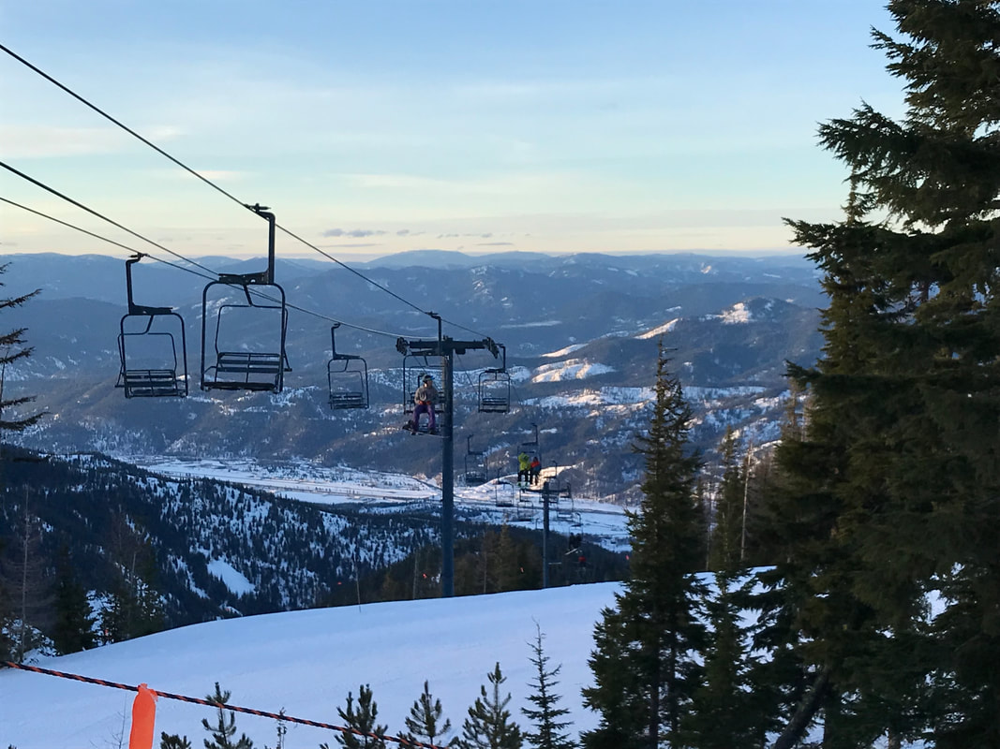

---
tags:
- Peaks & Mountains
- Moderately Easy
- Day Hiking
- Backpacking
stats:
- label: Event Type
  icon: hiking
  value: Day hiking, backpacking,
- label: Distance
  icon: map-marker-distance
  value: N. Route 3.2 miles RT to N. Chilco. And 9.6 miles to S. Chilco.
- label: Elevation Gain
  icon: elevation-rise
  value: 1455’ to N Chilco. Then drops about 865’ to the saddle. Then rises 901’ to
    S. Chilco
- label: Difficulty
  icon: speedometer
  value: moderately easy
- label: Maps
  icon: map
  value: IPNF, Bayview, Spades Mountain topos
- label: GPS
  icon: crosshairs-gps
  value: South Chilco 47°51'59" N 116°33'15" W.
- label: Ranger District
  icon: pine-tree
  value: CDA River R.D 208.769.3000
- label: Kootenai County Sheriff
  icon: shield-account
  value: CALL 911 FIRST or 208.446.1300
notes:
- North Chilco 47°53'30" N 116°31;47" W
- Idaho panhandle national forest/alerts [https://www.fs.usda.gov/alerts/ipnf/alerts-notices](https://www.fs.usda.gov/alerts/ipnf/alerts-notices)
---

# North And South Chilco Peak

!!! warning "Before you go"

    Fyi.....the bunco road to north chilco is closed to all visitors until roctober 9, 2025. a logging
    operation is scheduled, but can be rescinded early. Check out the usfs alerts below for additional
    info. this closure does not affect south chilco via forest road #406

    *north and south chilco peak national recreation trail #14*

## Description

We have added the areas sheriff’s emergency phone numbers for each trip write up under the ranger district
info. if an emergency ocurrs, evaluate your circumstances and call only if needed. No matter which route you
choose, in the fall when the Larch are turning bright yellow, don’t miss the golden views from either
summit.

North Trail The trail heads SW from the intersection of FR 332 & FR 385, hike the switchbacks for about 1.8
miles to along the ridge north of the summit. Bear left and take in the views to the west. Once back on the
trail you will come to a sign indicating the south trail to the right. Stay left to the summit of N. Chilco.
On top is the remains of an old fire lookout from late 40's to the late 50's. From here if you wish to
extend your hike over to South Chilco, head due south from N. Chilco summit and look for a faint trail that
eventually meets up with Trail 14 on the Chilco Saddle. From here, Trail #14 meanders along the saddle thru
a nice forest before climbing to South Chilco 5661'.

On the main trail to South Chilco bear right at the sign before the N. Chilco spur trail. It is about
another 3.6 miles to S. Chilco.

South Trail From the trailhead on FR #406, hike north about 1.5 miles to S. Chilco. You can extend your hike
to N. Chilco by staying on trail 14 for about 3.6 miles

## Option #1

As you leave the summit of N. Chilco heading north back to your car, stay on the west side of the trail
along the ridge. It will afford you views to the west for about .25 miles. As the ridge starts to drop, take
a right off the ridge and chicwack down to Trail #14, back to the cars.

## Directions

North Drive north on 95 to the Silverwood exit and go right (east) on Bunco Road. From 95 drive for
about 2.3 miles to a sharp left (north) turn for 1 mile. The road turns right (east) for about 3.5 miles to the
ORV parking area. (There is an outhouse here) FR 332 heads east for about 7.5 miles to the junction with
FR 385. The trailhead S on the SW corner of this junction. The trail has a concrete barrier a short way up the
trail.

South From I-90 drive north on 95 for 10 miles to Ohio Match Road. Turn right (east) and drive 3 miles and
bear left at the junction with Tree Farm Lane and continue on FR #206. In 4 miles turn left ( north) at a
"T" onto FR #437 next to East Fork Hayden Creek. In 7 more miles look for FR #406 near a transmitting tower.
Turn left onto 406 for about 1 mile to the trailhead.

---

## Cool things close by

Farragut State Park, Pend Orville Lake, Packsaddle Mountain, Hayden Lake, and Canfield Butte

## Hazards

Non of note

## R & P

Franklin’s Hoagies, Moontime, and Mexican Food Factory.

*Picture (Image missing)*

## Photo gallery

## Hiker heading to the north chilco summit

## Once up on the ridge, the trail splits. left is n. chilco, right is s. chilco

## North chilco trail

## Pend oreille lake from n. chilco

## Approaching the summit of n. chilco

## Pend oreille lake from n. chilco with lookout debris

*Picture (Image missing)*

The south chilco lookout was built in 1915 and abandoned in 1935, when the north chilco mountain lookout was

built

*Picture (Image missing)*

## A spokane mountaineers hike on the summit of south chilco

## From the summit of south chilco, the larch stand out bright

## Spokane mountaineers at lunch on top of s. chilco

*Picture (Image missing)*

## Hikers heading back to the trailhead, n. chilco peak

*Picture (Image missing)*

The summit cabin fire lookout that was on north chilco. it was built in 1938, and was destroyed in 1959 This

image is

from the spokane mountaineers archive

*Picture (Image missing)*

Consider walking the ridge north of n. chilco. its trail skirts the west side of the ridge for about .5
miles.

silverwood sit near the water tower left of center

## The trail north of n. chilco

*Picture (Image missing)*

## The trail diminishes as you head further north from n. chilco

---

From chair 5 at silver mt., the chilco's are directly above the lift tower on the horizon. I never realized
that south chilco was so massive

Wondering the mountains takes us on a path thru our soul. While a path thru our soul takes us to new
heights. New heights expand our love of wandering. chic. 7.29.11
