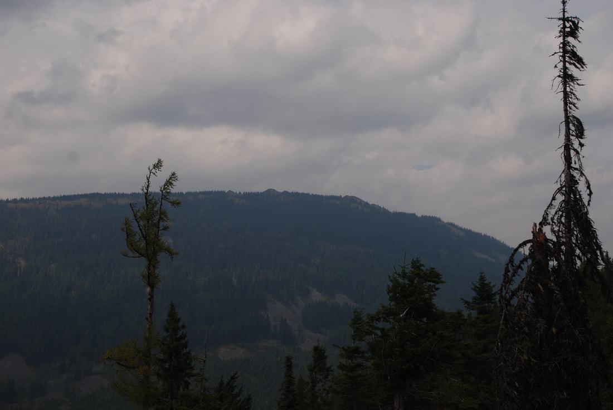

---
tags:
- Peaks & Mountains
- Moderate
- Day Hiking
- Backpacking
- Equestrian
- Mountain Biking
stats:
- label: Event Type
  icon: hiking
  value: day hiking, backpacking, equestrian, and mt biking
- label: Distance
  icon: map-marker-distance
  value: about 2 miles
- label: Elevation
  icon: terrain
  value: 1838’
- label: Difficulty
  icon: speedometer
  value: moderate
- label: Maps
  icon: map
  value: IPNF, CDA River Ranger District, Packsaddle Mt. Topo
- label: GPS
  icon: crosshairs-gps
  value: trailhead. 48°00’58" N 116°20’ 43" W Summit 48°05’ 51" N 116°21’ 22" W
- label: Ranger District
  icon: pine-tree
  value: Sandpoint R.D. 208.263.5111
- label: Bonner County Sheriff
  icon: shield-account
  value: CALL 911 FIRST or 208.263.8417
notes:
- label: Idaho Panhandle National Forests Alerts
  url: https://www.fs.usda.gov/alerts/ipnf/alerts-notices
---

# Packsaddle Mountain

## Description

We have added the areas sheriff’s emergency phone numbers for each trip write up under the ranger district
info. if an emergency ocurrs, evaluate your circumstances and call only if needed.Trail # 76 starts SE of
the summit. The

trail

meanders thru a nice high country forest before it breaks out onto its massive rock summit block.

There are two springs close to the trail along the way, but do not rely on them. Once up on the summit
block, walk up to its highest point for lunch. Because Packsaddle is the highest mountain in the area, the
views cover Idaho, Washington, Canada and Montana. Pend Orielle Lake is visible to the west.

## Directions

Head north from CDA on 95 to the Bunco Road turnoff opposite from Silverwood Theme Park. In about 2.2 miles
turn left (north) for 1 mile and turn right (east) past Bunco Corners to the ORV parking area. Continue on
FR 332 for about 25 miles. Look for Trail #452 to Powder Mountain. About 2 miles past 452,look for a side
road FR #1073 that will take you to the trailhead near the North Gold Creek.

## Cool things close by

Chilco Mountains, Farragut S.P., Pend Orielle Lake, Silverwood and the Green Monarchs.

## Hazards

F.R. 322 is long and dusty road. Be careful. The tops summit block is loose scree, take care walking to the
top.

## R & P

Franklin’s Hoagies, Moontime, Mexican Food Factory, and the Trails End Brewery.

---

## Plan your trip

Click for Current NOAA Weather Conditions

## Photo gallery

---

##

## The summit of packsaddle peeks out above the hike in

---

---

---

---

---

---
