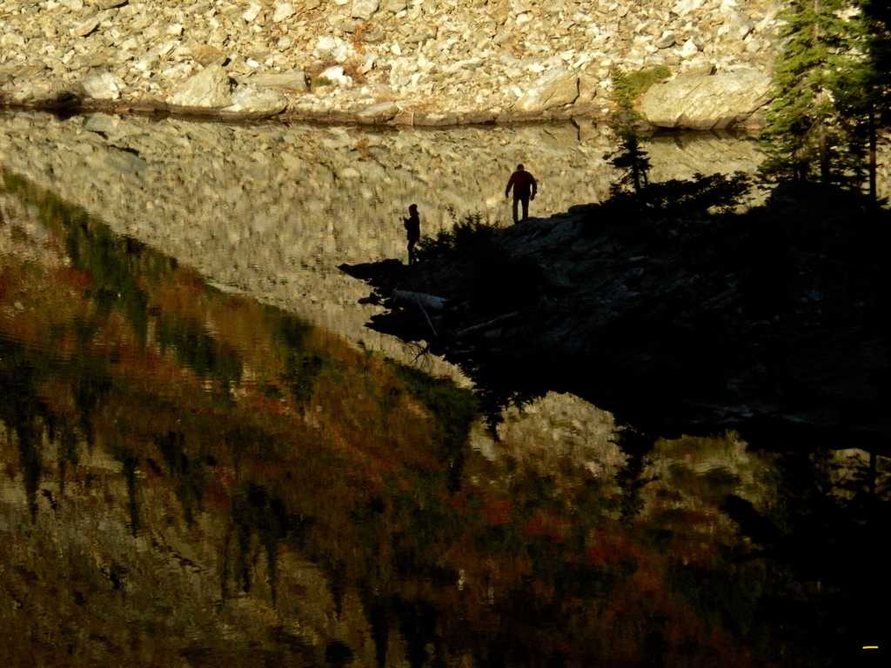
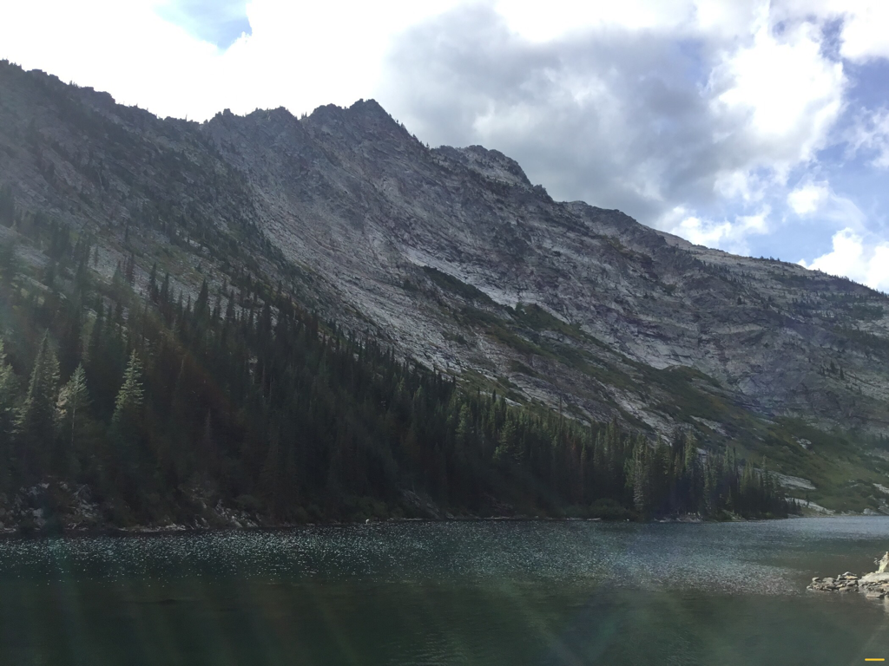
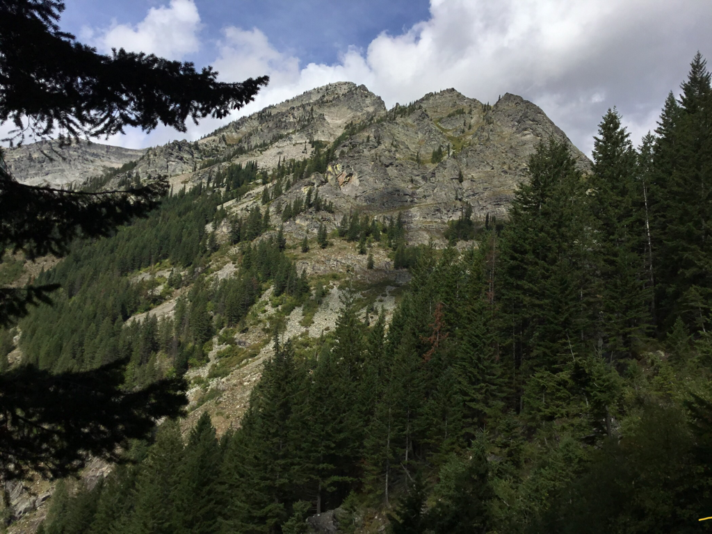

---
tags:
- Paddling & Rivers
- Easy
- Flat Water Paddling
stats:
- label: Event Type
  icon: kayaking
  value: Flat Water Paddling
- label: Distance
  icon: map-marker-distance
  value: 5 miles RT
- label: Elevation
  icon: terrain
  value: 2,067'
- label: Difficulty
  icon: speedometer
  value: Easy
- label: GPS
  icon: crosshairs-gps
  value: n??° ??’ ??.?" w???° ??’ ??.?"
---

# Paddle Rev

*Echo Bay, Lake Pend Orielle, Idaho*

## Paddling instructions

## Items of interest

## Directions

## Hazards

---

## R & P

---

## Plan your trip

[Click for Current NOAA Weather Conditions](https://www.nws.noaa.gov/wtf/udaf/MapClick.php?lel=4000&uel=9000&polygon=49.016%2C-114.180%2C48.994%2C-114.381%2C48.890%2C-114.341%2C48.924%2C-114.151%2C&area=63)

## Photo gallery

---

## Merganser diving duck

---

## Legacy aircraft meets drone

---

## Dark sky and shooting star

