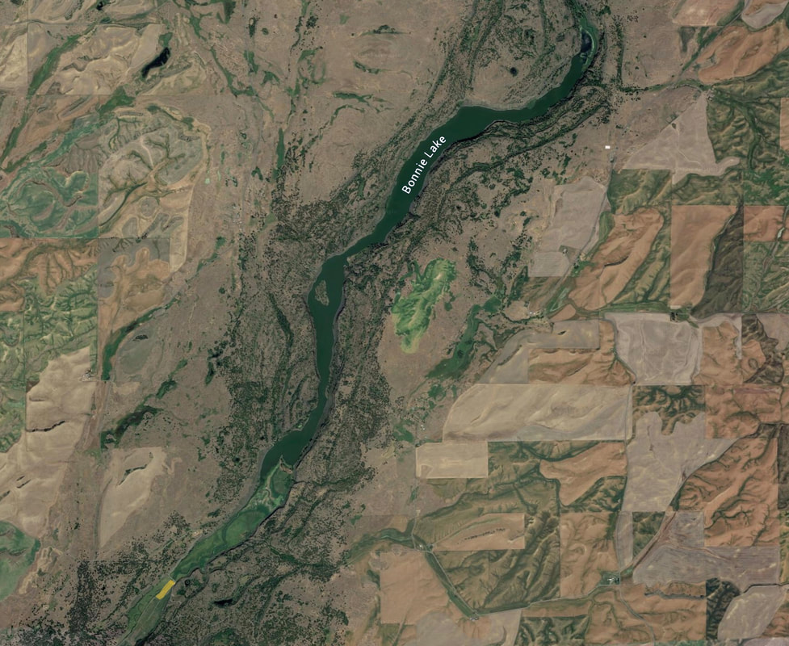
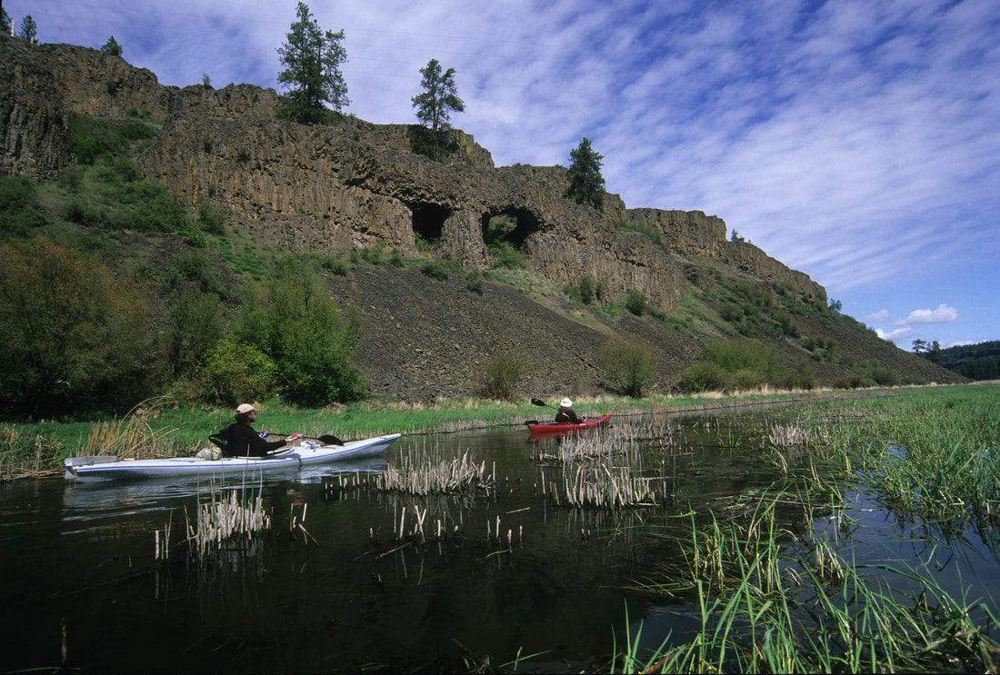

---
tags:
- Lakes
- Paddling
stats:
- label: Paddle Distance
  icon: map-marker-distance
  value: 5.4 miles (includes Rock Creek paddle)
- label: Elevation
  icon: terrain
  value: "1798\u2019"
- label: Length and Acreage
  icon: vector-square
  value: 5.4 miles long, 327 acres
- label: Maps
  icon: map
  value: Chapman Lake, Pine City, Rock Lake topos, Spokane & Whitman County Maps
- label: Launch GPS
  icon: crosshairs-gps
  value: "47\xB014\u201922\" N 117\xB035\u201945\" W"
notes:
- label: 'Spokane County Sheriff: 911 or 509.477.2240'
  url: tel:509.477.2240
---

# Bonnie Lake Landing

!!! warning "Before You Go"
    
    _Private Property Notice._

## Description

We have added the area's sheriff’s emergency phone numbers for each trip write up under the ranger district
info. If an emergency occurs, evaluate your circumstances and call only if needed.

Bonnie Lake is a long lake with an island about 2/3rds the paddle distance. This island has a campground and
is the only area that is publicly accessible, except for a one square mile section surrounding the island.
Please be aware, all other land around the lake is privately owned. Do not trespass.

## Attractions

As you paddle up Rock Creek from the put-in at the bridge, look for a natural arch almost to the lake. You
will notice some of Bonnie Lake's shorelines have 600 to 800 foot walls. As you paddle the lake, look for
Turkey Vultures early in the morning sunning and warming themselves up on the rocks. When they start to fly,
you will notice that Turkey Vultures are incredible flyers. Take a moment and observe these ugly but very
graceful birds in flight.

## Plan Your Trip

[Click for Current NOAA Weather Conditions](https://www.nws.noaa.gov/wtf/udaf/MapClick.php?lel=4000&uel=9000&polygon=49.016%2C-114.180%2C48.994%2C-114.381%2C48.890%2C-114.341%2C48.924%2C-114.151%2C&area=63)

## Directions

From the south end of Cheney, Washington, turn onto Cheney-Plaza Road. After about 15 miles, the road splits
into Rock Lake Road going forward and Cheney-Plaza Road going left. Continue on Rock Lake Road and turn left
on Belsby Road. Continue on Belsby Road for about four miles. The road drops down into the canyon and the
creek can be seen at the bottom.

The put-in is at the far end of the bridge on the right side. The landowner asked that people park on the
wide turn at the bottom of the hill before the bridge because they have big trucks that pull out of the
fields, and parked cars have blocked them in at times. Unload your gear at the bridge and park at the turn.

## Cool Things Close By

Rock Lake, Turnbull National Wildlife Refuge, Sprague Lake; in Sprague, drive downtown and look at Dave's
Antique Truck Museum.

## Rest & Provisions

Lenny’s in Cheney.

## Photo Gallery

_As you approach the lake, on your left are two caves formed by lava flowing around gigantic trees._
