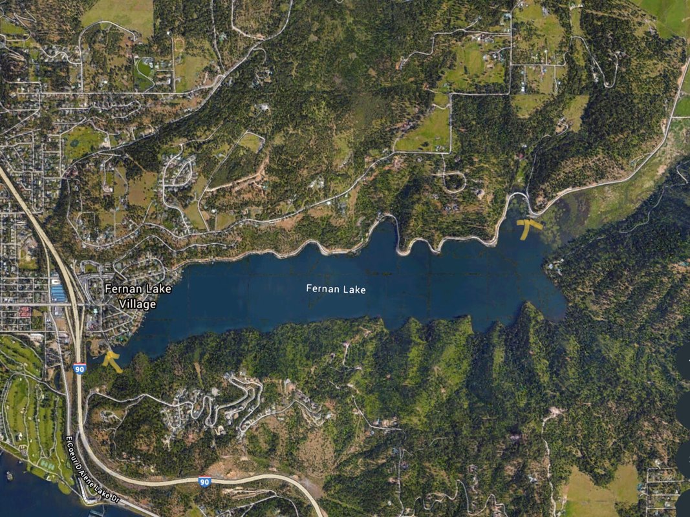

---
tags:
  - Lakes
stats:
  - label: Paddle Distance
    icon: map-marker-distance
    value: 7 mile loop
  - label: Elevation
    icon: terrain
    value: 2133’
  - label: Length and Acreage
    icon: vector-square
    value: 2 miles long & 423 acres
  - label: Maps
    icon: map
    value: IPNF, Fernan topo
  - label: Launch GPS
    icon: crosshairs-gps
    value: 47°40’13" n 116°44’52" w
  - label: Kootenai County Sheriff
    icon: shield-account
    value: 208.446.1300
---

# Fernan Lake Park West

_Fernan Lake Park West_

## Description

!!! warning
    THERE IS A CAUTION AGAINST GETTING WET AT FERNAN ON JULY 22nd. Algae blooms can make you or your pet
    sick.

    The best time to paddle FERNAN is after the ice thaws, and as the temps get colder. The south (right)
    side has no houses, but is privately owned. I’ve seen Eagles, Osprey, beavers, and Great Blue
    Herons. At one time, just as you head East, there are three dead trees about 100’ off the water.
    They are dead because of the dozens and dozens of heron, roosting in the trees years ago. Further
    east along the shore line are 5 bays to explore or get out of the sun. After the second bay, watch
    for a variety of wildlife all away to the east launch. From the west launch, paddle along the north
    (left) shore past several waterfront houses. Soon the houses end, and the E. Fernan Road continues
    to the East Fernan Lake Launch. Stay for shore as you paddle the north shore. There usually are
    dozens of fishermen & women. When you get to the east end, you will be in water lilies.

## Attractions

Wildlife, peaceful paddle, and trying to keep up with the college racing shells rowers. I guarantee you
can’t keep up with them.

## Directions

From downtown CDA, drive East on Sherman Avenue, passing under the freeway. To get to the west launch, you
will pass the Fernan Ranger Station. The next street, Theis Drive. Turn right (south) and continue to the
launch.

## Cool things close by

CDA Lake, Hayden Lake, the Idaho Panhandle National Forest, Fernan Saddle, and the old Spades Lookout.

## R & P

Michael D’s for breakfast, the Moon Time, Franklins Hoagies, Mexican Food Factory, and the Trails End
Brewery.

## Plan your trip

[Click for Current NOAA Weather Conditions](https://www.nws.noaa.gov/wtf/udaf/MapClick.php?lel=4000&uel=9000&polygon=49.016%2C-114.180%2C48.994%2C-114.381%2C48.890%2C-114.341%2C48.924%2C-114.151%2C&area=63)

## Photo gallery

Images coming soon
