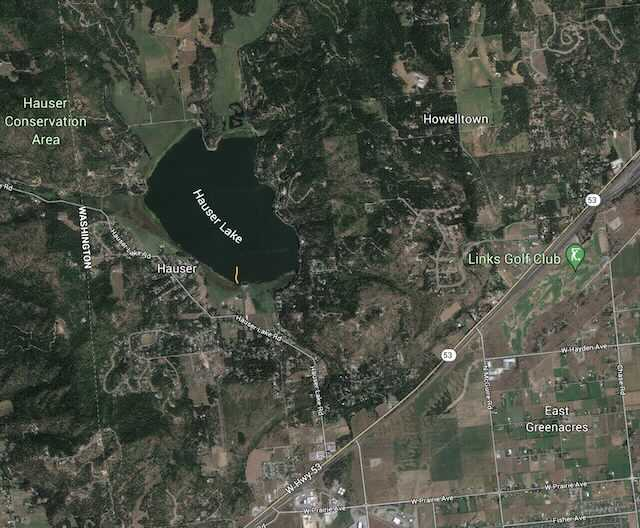

---
tags:
  - Lakes
stats:
  - label: Paddle Distance
    icon: map-marker-distance
    value: about 3.8 miles shoreline paddle
  - label: Elevation
    icon: terrain
    value: 2186’
  - label: Length and Acreage
    icon: vector-square
    value: 1.2 miles and 539 acres
  - label: Maps
    icon: map
    value: Newman Lake & Mount Spokane topos
  - label: Launch GPS
    icon: crosshairs-gps
    value: 47°46’13" N 117°01’04" W
  - label: Kootenai County Sheriff
    icon: shield-account
    value: 208.446.1300
---

# Hauser Lake Park Launch

_Hauser Lake Park Launch_

## Description

The Hauser Lake Launch is modern with all the amenities including a dock for swimming, pit toilets, and
adequate parking. Hauser Lake is relatively small but a nice getaway from the crowds.

## Attractions

Easy access from Hwy 53, several places to get out and swim.

## Directions

From Spokane, drive East on Trent to the Washington-Idaho state line where Hwy 290 becomes Hwy 53 to
Rathdrum. From the state line, drive 1.9 miles to Hauser Lake Road. Turn left (north) for 1.3 miles to the
launch site on your right.

## Cool Things Close By

Hayden Lake, Twin Lakes, Spirit Lake, Hauser Conservation Area, and Newman Lake with the McKenzie
Conservation Area.

## R & P

Rustler’s Roost for breakfast, the American Food Factory, Franklins Hoagies, and Trails End Brewery.

## Plan Your Trip

[Click for Current NOAA Weather Conditions](https://www.nws.noaa.gov/wtf/udaf/MapClick.php?lel=4000&uel=9000&polygon=49.016%2C-114.180%2C48.994%2C-114.381%2C48.890%2C-114.341%2C48.924%2C-114.151%2C&area=63)

## Photo Gallery

Images coming soon. To contribute, contact chic.
