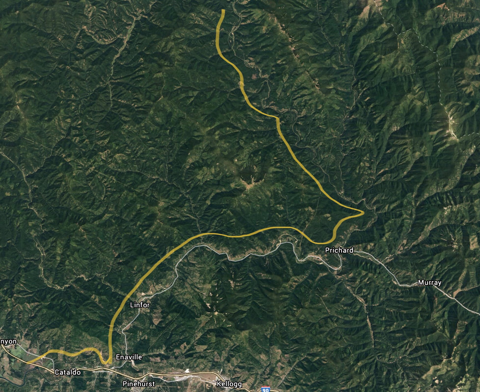

---
tags:
- Paddling & Rivers
stats:
- label: Paddle Distance
  icon: map-marker-distance
  value: varies
- label: Elevation
  icon: terrain
  value: 2182'
- label: Length and Acreage
  icon: vector-square
  value: varies
- label: Maps
  icon: map
  value: varies
- label: Launch GPS
  icon: crosshairs-gps
  value: varies
- label: Shoshone County Sheriff
  icon: shield-account
  value: 208-556-1114
---

# Upper CDA River Landing

_Upper CDA River Landing_

## Description

CDA River -- see map below for landing locations. These locations are in sequence according to the I.P.N.F
brochure called "Floating the Upper Coeur d'Alene River." The hour(s) after the landing are how long it takes
to get to the next access point, while paddling. At the end of each landing are notes on parking & the
approximate drive miles between landings.

| # | Access Point | Time to Next | Parking | Drive Distance |
| :--- | :--- | :--- | :--- | :--- |
| 1 | Stone Creek-Swift Creek Bridge | 1-1.5 hours | Unimproved roadside parking | 3.5 miles |
| 2 | Big Hank Bridge | 1 hour | Big Hank C.G. | 3.3 miles |
| 3 | Long Pool Bridge | 1 hour | Undeveloped camping and parking | 7.3 miles |
| 4 | Juniper Creek Landing | 2 hours | Undeveloped parking | 5.8 miles |
| 5 | Avery Creek Picnic Area | 2 hours | Developed picnic area & parking | 4.4 miles |
| 6 | Pritchard Bridge | 1-1.5 hours | Undeveloped parking | 1.2 miles |
| 7 | Bridge at Road 9 & 530 Junction | 4 hours | Undeveloped roadside parking | about 6.9 miles |
| 8 | Graham Meadows | 1.5 hours | Undeveloped roadside parking | about 4.8 miles |
| 9 | Spring Creek Access Point | 2 hours | Parking unknown | about 4.8 miles |
| 10 | Bumblebee Bridge Access Point | 5 hours | Undeveloped parking area | about 8.6 miles |
| 11 | Cataldo Access Point | 5 hours | Undeveloped roadside parking (unidentified, unofficial access point) | -- |
| 12 | Cataldo Mission Launch | unknown | Developed launch | -- |

## Attractions

Rustic river float, swift but calmish waters. Solitude.

## Directions

From Kingston, turn left over the freeway and up the CDA River Road to several put-ins. Contact CDA River
Ranger District in CDA or Smelterville.

## Cool Things Close By

Shadow, Fern, and Centennial Falls, Little Guard Lookout Rental, Bloom Peak on the Idaho-Montana border.

## R & P

Radio Brewery and Noah's at Silver Mountain in Kellogg.

## Plan Your Trip

[Click for Current NOAA Weather Conditions](https://www.nws.noaa.gov/wtf/udaf/MapClick.php?lel=4000&uel=9000&polygon=49.016%2C-114.180%2C48.994%2C-114.381%2C48.890%2C-114.341%2C48.924%2C-114.151%2C&area=63)

## Please Everyone... Heed This Health Alert

_Please everyone heed this health alert_

## Photo Gallery

_To contribute, contact Chic._
